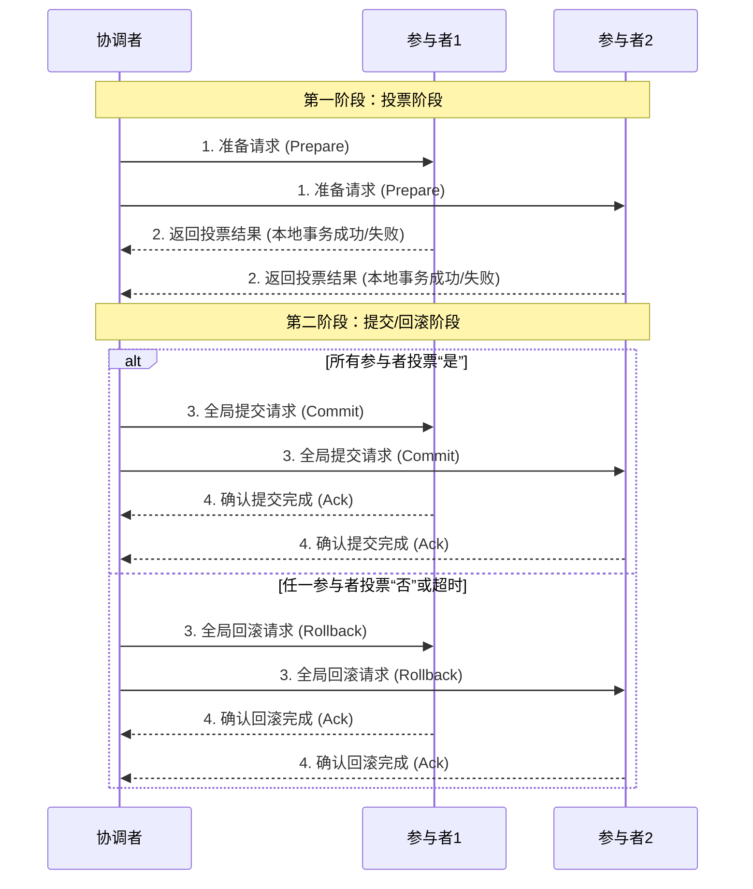

好的，遵照您的要求，为您生成一份关于2PC协调者单点与阻塞问题的技术文档。

---

# **2PC（两阶段提交）协议深度解析：协调者单点与阻塞问题**

## **文档摘要**

本文档旨在深入剖析经典分布式事务协议——两阶段提交的核心工作原理，并重点探讨其在实际应用中无法回避的两个关键缺陷：**协调者单点故障问题** 与 **参与者阻塞问题**。文档将阐述这些问题产生的原因、带来的影响，并系统地介绍业界为解决这些问题所提出的主流改进方案与替代思路。

---

## **1. 概述**

在分布式系统中，为了确保跨多个独立节点（参与者）的数据操作具有原子性（即全部成功或全部失败），需要引入分布式事务协调机制。2PC是最经典、最广为人知的分布式事务协议之一，它通过引入一个中心化的**协调者**角色，将事务的提交过程分为两个阶段，以达成一致性目标。

## **2. 2PC 工作原理详解**

2PC协议包含一个协调者和若干参与者。其工作流程如下图所示（以成功提交为例）：

### **第一阶段：投票阶段**
1.  协调者向所有参与者发送 `Prepare` 请求，询问是否可以执行事务提交。
2.  参与者执行本地事务的所有操作（写入redo/undo日志），但**不真正提交**。
3.  参与者根据本地执行情况，向协调者反馈 `Yes`（已就绪）或 `No`（失败）。

### **第二阶段：提交/回滚阶段**
1.  **情况A：所有参与者反馈 `Yes`**
    *   协调者向所有参与者发送 `Commit` 请求。
    *   参与者收到 `Commit` 后，正式提交本地事务，释放资源，并向协调者发送 `Ack`。
    *   协调者收到所有 `Ack` 后，完成事务。
2.  **情况B：任一参与者反馈 `No` 或协调者等待超时**
    *   协调者向所有参与者发送 `Rollback` 请求。
    *   参与者收到 `Rollback` 后，利用undo日志回滚本地事务，释放资源，并向协调者发送 `Ack`。
    *   协调者收到所有 `Ack` 后，完成事务中断。

## **3. 核心问题剖析**

尽管2PC设计直观，但它存在两个严重影响其可用性和性能的固有缺陷。

### **3.1 协调者单点故障问题**

**问题描述**：
在整个2PC流程中，协调者处于绝对核心地位。事务的最终决策（提交或回滚）完全由协调者做出。如果协调者所在节点在协议执行过程中发生宕机、网络隔离等故障，系统将陷入瘫痪。

**具体场景与影响**：
1.  **在发送 `Prepare` 请求前宕机**：参与者未收到任何请求，事务相当于未开始，可安全中止。影响较小。
2.  **在发送 `Prepare` 请求后，收到所有投票前宕机**：
    *   参与者已锁定资源并处于“等待指令”的中间状态。
    *   由于协调者消失，参与者无法得知最终决定，事务被**永久阻塞**。
3.  **在做出决策后，发送 `Commit`/`Rollback` 请求前宕机**：
    *   协调者已做出决策（写入本地日志），但未通知参与者。
    *   参与者同样处于“等待指令”的阻塞状态。
4.  **在发送部分 `Commit`/`Rollback` 请求后宕机**：
    *   部分参与者完成了操作，部分参与者仍在等待。系统状态**不一致**。

**根本原因**：协议设计高度依赖唯一的、中心化的协调者节点。没有协调者，协议就无法推进到下一阶段。

### **3.2 参与者阻塞问题**

**问题描述**：
在2PC协议中，一旦参与者投票 `Yes`，它就进入一个**不确定的等待状态**，必须一直持有事务相关资源（如数据库锁），直到收到协调者的最终指令（`Commit` 或 `Rollback`）。这个等待期可能非常长。

**具体场景与影响**：
1.  **协调者单点故障**：如上所述，这是导致长期阻塞的主要原因。
2.  **网络分区**：即使协调者正常运行，但协调者与某个参与者之间的网络中断，该参与者也会被阻塞。
3.  **协调者负载过高**：协调者处理缓慢，导致指令延迟下发，所有参与者都将延长阻塞时间。

**后果**：
*   **资源长期占用**：数据库连接、锁等关键资源无法释放，严重影响系统吞吐量和并发性能。
*   **死锁风险增加**：被阻塞的事务持有的锁可能阻碍其他事务，更容易引发分布式死锁。
*   **系统可用性降低**：只要有一个关键事务阻塞，相关的业务功能就可能无法进行。

## **4. 解决方案与演进**

为了解决上述问题，业界提出了多种方案，主要分为三大方向：

### **4.1 对原生2PC的修补方案**

1.  **超时与中断机制**：
    *   为参与者引入超时。当等待协调者指令超时后，参与者可以主动查询协调者状态，或与其他参与者通信来协商决定事务的最终状态。这需要额外的状态查询和通信协议，实现复杂。
2.  **协调者日志与备机**：
    *   协调者将事务状态（阶段、决策结果）持久化到高可用存储（如共享磁盘、复制日志）。
    *   部署协调者备机。当主机故障时，备机接管工作，从日志中恢复故障点状态，继续推进协议。这是解决单点问题最直接的方法，例如基于ZooKeeper/etcd选举主协调者。

### **4.2 引入第三方协调服务与标准**

1.  **XA规范**：
    *   X/Open组织提出的分布式事务处理标准。数据库、应用服务器（如Java EE容器）作为参与者，事务管理器（TM）作为协调者。
    *   **优点**：标准化，被主流数据库支持。
    *   **缺点**：TM本身可能成为单点（虽可通过集群缓解），且阻塞问题依然存在。性能开销大，不适合高并发微服务场景。

2.  **独立的协调服务**：
    *   将协调者功能抽离为独立的、高可用的服务（如Seata的TC、Narayana）。
    *   该服务自身通过集群（如Raft/Paxos协议）保证高可用，负责维护全局事务状态。应用作为参与者与其交互。这本质上是将单点问题转移到一个更专业、更可靠的基础设施上解决。

### **4.3 采用新协议或最终一致性模式**

这是当前分布式系统架构中更主流的思路，即**规避**2PC的强一致性和阻塞问题。

1.  **三阶段提交**：
    *   在2PC的“投票”和“提交”之间插入一个 `PreCommit` 阶段。协调者在收到所有 `Yes` 后，先发送 `PreCommit` 让参与者预提交（此时已确保所有参与者愿意提交），然后再发送 `Commit`。
    *   **优点**：在协调者故障且所有参与者收到 `PreCommit` 的情况下，新协调者可以安全地决定提交，**减少了阻塞范围**。
    *   **缺点**：增加了一轮网络开销，且在 `PreCommit` 前故障，阻塞问题依旧。并未根本解决所有阻塞场景。

2.  **基于消息队列的最终一致性**：
    *   利用可靠消息队列（如RocketMQ事务消息）来保证本地操作与消息发送的原子性。下游消费者根据消息异步执行操作，通过重试机制保证最终完成。
    *   **优点**：解耦、异步、高吞吐，避免了资源长期锁定。
    *   **缺点**：业务逻辑从“强一致”变为“最终一致”，需要业务层面能够接受短暂的不一致。

3.  **TCC模式**：
    *   将业务操作分为三个步骤：**Try**（预留资源）、**Confirm**（确认提交）、**Cancel**（取消释放）。
    *   由事务管理器协调。Try阶段锁定资源，Confirm/Cancel阶段幂等地完成最终操作。
    *   **优点**：资源锁定时间大大缩短（仅在Try阶段），性能好。可自定义回滚逻辑，灵活性高。
    *   **缺点**：对业务侵入性强，需要为每个操作实现三个接口，开发复杂度高。

## **5. 总结与建议**

| 特性/方案 | 原生2PC | 2PC+协调者高可用 | XA | 3PC | 消息队列最终一致 | TCC |
| :--- | :--- | :--- | :--- | :--- | :--- | :--- |
| **一致性** | **强一致** | **强一致** | **强一致** | **强一致** | **最终一致** | **最终一致** |
| **单点问题** | 严重存在 | **已解决** | 依赖TM实现 | 存在 | 无中心单点 | 无中心单点 |
| **阻塞问题** | 严重存在 | **依然存在** | **依然存在** | **部分缓解** | **无阻塞** | **基本无阻塞** |
| **性能** | 差 | 较差 | 差 | 更差 | **高** | **高** |
| **业务侵入** | 低 | 低 | 低 | 低 | 中 | **高** |
| **适用场景** | 传统数据库、遗留系统 | 对强一致有要求，且能接受一定阻塞 | 基于传统中间件（如J2EE）的封闭系统 | 理论研究，实际少用 | **高并发、可接受延迟的互联网业务** | **对一致性要求高、且性能敏感的业务** |

**结论与选型建议**：

1.  **原生2PC** 因其严重的单点和阻塞问题，**不适合**作为现代大规模、高可用分布式系统的首选事务方案。
2.  如果业务**必须**要求强一致性，且可以容忍一定的性能损失和复杂性，应选择 **“2PC/3PC + 高可用协调者集群”** 的方案（如Seata AT/XA模式）。
3.  对于绝大多数互联网应用，**推荐采用最终一致性方案**。优先考虑 **基于可靠消息队列** 的异步化解耦模式，如果业务逻辑复杂，再考虑 **TCC** 模式。
4.  架构设计的核心是在 **一致性（C）**、**可用性（A）** 和 **分区容忍性（P）** 之间做出权衡。2PC本质上是选择了CP，而现代分布式架构往往更倾向于AP基础之上的最终一致性。

--- 
**文档修订记录**
*   Version 1.0 | 创建日期：2023-10-27 | 创建人：AI Assistant
*   内容说明：本文档系统性地阐述了2PC协议的原理、核心问题及解决方案，适用于架构师和高级开发者进行技术选型和方案设计时参考。