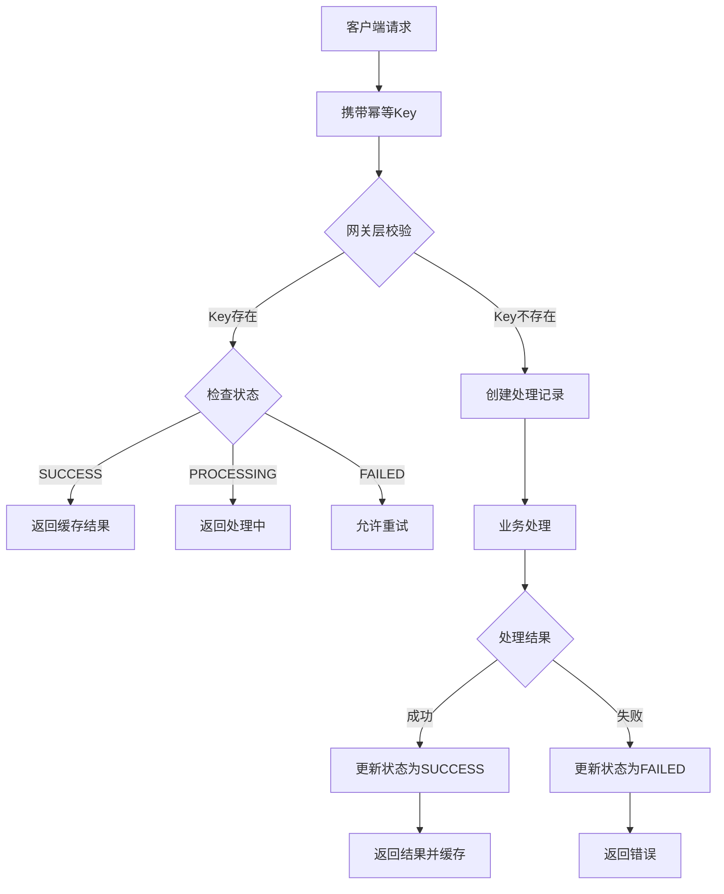

# API幂等性设计技术文档：幂等Key与去重表方案

## 1. 引言

### 1.1 问题背景
在分布式系统和微服务架构中，网络不稳定、客户端重试、消息队列重复投递等因素可能导致API被重复调用。如果不加处理，重复请求可能引发数据不一致、资金损失等严重问题。

### 1.2 幂等性定义
幂等性（Idempotency）是指一个操作无论执行一次还是多次，所产生的系统结果都是一致的。对于HTTP API而言：
- GET、PUT、DELETE方法天然具有幂等性
- POST方法默认非幂等，需要特殊设计

### 1.3 文档目标
本文档详细介绍基于"幂等Key + 去重表"的API幂等性设计方案，为开发人员提供可落地的技术实现指南。

## 2. 核心概念

### 2.1 幂等Key（Idempotency Key）
**定义**：客户端生成的唯一标识符，用于标识一个业务请求
**特性**：
- 全局唯一性
- 由客户端生成并传递
- 与业务内容解耦
- 建议格式：`{prefix}_{timestamp}_{random}_{clientId}`

### 2.2 去重表（Deduplication Table）
**定义**：服务端存储幂等Key与处理结果的映射表
**作用**：
- 记录已处理的请求
- 缓存处理结果
- 防止重复处理

## 3. 设计方案

### 3.1 系统架构
```
客户端 → 网关层 → 业务服务层 → 数据库层
        ↑           ↑           ↑
   幂等校验     幂等处理     去重表存储
```

### 3.2 幂等Key设计规范

#### 3.2.1 生成规则
```javascript
// 示例：幂等Key生成算法
function generateIdempotencyKey(clientId, businessType) {
  const timestamp = Date.now();
  const random = Math.random().toString(36).substr(2, 9);
  return `idemp_${businessType}_${timestamp}_${random}_${clientId}`;
}
```

#### 3.2.2 传输方式
- HTTP Header：`X-Idempotency-Key: your_key_here`
- 适用场景：RESTful API
- 优势：不污染业务参数

### 3.3 去重表设计

#### 3.3.1 数据库表结构
```sql
CREATE TABLE idempotency_records (
    id BIGINT PRIMARY KEY AUTO_INCREMENT,
    idempotency_key VARCHAR(128) NOT NULL COMMENT '幂等Key',
    business_type VARCHAR(50) NOT NULL COMMENT '业务类型',
    request_hash VARCHAR(64) COMMENT '请求内容哈希',
    request_params TEXT COMMENT '请求参数快照',
    response_body TEXT COMMENT '响应结果',
    status VARCHAR(20) NOT NULL COMMENT '状态: PROCESSING/SUCCESS/FAILED',
    client_id VARCHAR(50) NOT NULL COMMENT '客户端标识',
    created_at TIMESTAMP DEFAULT CURRENT_TIMESTAMP,
    updated_at TIMESTAMP DEFAULT CURRENT_TIMESTAMP ON UPDATE CURRENT_TIMESTAMP,
    expired_at TIMESTAMP NOT NULL COMMENT '过期时间',
    UNIQUE KEY uk_key (idempotency_key),
    KEY idx_client (client_id),
    KEY idx_expire (expired_at)
) ENGINE=InnoDB DEFAULT CHARSET=utf8mb4 COMMENT='幂等性去重表';
```

#### 3.3.2 状态设计
- **PROCESSING**：请求正在处理中
- **SUCCESS**：请求已成功处理
- **FAILED**：请求处理失败（可重试）

### 3.4 缓存层设计
为提高性能，引入Redis作为一级缓存：
```
Key格式: idemp:{idempotency_key}
Value结构: {
    "status": "SUCCESS",
    "response": "{cached_response}",
    "expire_at": 1630000000
}
过期时间: 根据业务需求设置（通常24小时）
```

## 4. 实现流程

### 4.1 整体处理流程


### 4.2 详细步骤

#### 步骤1：请求拦截
```java
@Component
public class IdempotencyInterceptor implements HandlerInterceptor {
    
    @Override
    public boolean preHandle(HttpServletRequest request, 
                           HttpServletResponse response, 
                           Object handler) {
        // 提取幂等Key
        String idempotencyKey = request.getHeader("X-Idempotency-Key");
        
        if (StringUtils.isEmpty(idempotencyKey)) {
            // 非幂等接口直接放行
            return true;
        }
        
        // 检查并处理幂等性
        return idempotencyService.processRequest(idempotencyKey, request);
    }
}
```

#### 步骤2：幂等性检查
```java
@Service
public class IdempotencyServiceImpl implements IdempotencyService {
    
    @Autowired
    private RedisTemplate<String, String> redisTemplate;
    
    @Autowired
    private IdempotencyRecordMapper recordMapper;
    
    public boolean processRequest(String idempotencyKey, HttpServletRequest request) {
        // 1. 检查Redis缓存
        String cacheKey = "idemp:" + idempotencyKey;
        IdempotencyCache cache = getFromCache(cacheKey);
        
        if (cache != null) {
            return handleCachedResult(cache, response);
        }
        
        // 2. 检查数据库记录
        IdempotencyRecord record = recordMapper.selectByKey(idempotencyKey);
        
        if (record != null) {
            return handleExistingRecord(record, response);
        }
        
        // 3. 创建新记录（原子操作）
        return createNewRecord(idempotencyKey, request);
    }
    
    private boolean createNewRecord(String idempotencyKey, 
                                   HttpServletRequest request) {
        // 使用数据库唯一约束防止并发创建
        try {
            IdempotencyRecord record = new IdempotencyRecord();
            record.setIdempotencyKey(idempotencyKey);
            record.setStatus("PROCESSING");
            record.setClientId(getClientId(request));
            record.setExpiredAt(calculateExpireTime());
            
            recordMapper.insert(record);
            
            // 设置分布式锁，防止并发
            setProcessingLock(idempotencyKey);
            
            return true;
        } catch (DuplicateKeyException e) {
            // 并发情况下，稍后重试
            throw new ConcurrentRequestException("请求正在处理中");
        }
    }
}
```

#### 步骤3：业务处理包装
```java
@Aspect
@Component
public class IdempotencyAspect {
    
    @Around("@annotation(idempotent)")
    public Object aroundProcess(ProceedingJoinPoint joinPoint, 
                               Idempotent idempotent) throws Throwable {
        // 获取幂等Key
        String idempotencyKey = getIdempotencyKey();
        
        try {
            // 执行业务逻辑
            Object result = joinPoint.proceed();
            
            // 更新为成功状态
            idempotencyService.markSuccess(idempotencyKey, result);
            
            return result;
        } catch (Exception e) {
            // 更新为失败状态
            idempotencyService.markFailed(idempotencyKey, e.getMessage());
            throw e;
        }
    }
}
```

## 5. 关键问题与解决方案

### 5.1 并发控制
**问题**：多个相同请求同时到达
**解决方案**：
1. 数据库唯一索引
2. Redis分布式锁
3. 乐观锁机制

```java
// 使用Redis分布式锁
public boolean tryLock(String key, long expireSeconds) {
    String value = UUID.randomUUID().toString();
    Boolean success = redisTemplate.opsForValue()
        .setIfAbsent("lock:" + key, value, expireSeconds, TimeUnit.SECONDS);
    return Boolean.TRUE.equals(success);
}
```

### 5.2 状态一致性
**问题**：业务处理成功但状态更新失败
**解决方案**：本地事务 + 补偿机制

```java
@Transactional(rollbackFor = Exception.class)
public void completeRequest(String idempotencyKey, Object result) {
    // 1. 更新业务数据
    businessService.process(result);
    
    // 2. 更新幂等记录
    idempotencyRecordService.updateStatus(idempotencyKey, "SUCCESS", result);
    
    // 3. 更新缓存
    idempotencyCacheService.cacheResult(idempotencyKey, result);
}
```

### 5.3 存储优化
**问题**：去重表数据量过大
**解决方案**：
1. 定期清理过期数据
2. 历史数据归档
3. 分库分表策略

```sql
-- 定期清理任务
DELETE FROM idempotency_records 
WHERE expired_at < NOW() - INTERVAL 7 DAY
LIMIT 1000;
```

### 5.4 不同业务场景适配

#### 场景1：支付订单
```yaml
配置项:
  过期时间: 24小时
  重试策略: 不允许自动重试
  结果缓存: 需要详细结果
```

#### 场景2：发送消息
```yaml
配置项:
  过期时间: 1小时
  重试策略: 允许有限重试
  结果缓存: 仅需成功状态
```

## 6. 最佳实践

### 6.1 客户端实践
1. **幂等Key生成责任**：客户端负责生成并保证唯一性
2. **重试策略**：配合退避算法（exponential backoff）
3. **超时处理**：设置合理的请求超时时间

### 6.2 服务端实践
1. **接口设计**：
   - 明确文档说明幂等接口
   - 提供幂等性失效后的处理方案
   
2. **监控告警**：
   - 监控重复请求率
   - 设置去重表容量告警
   - 跟踪幂等性处理耗时

### 6.3 测试策略
1. **单元测试**：验证幂等逻辑正确性
2. **集成测试**：测试完整请求流程
3. **压力测试**：验证高并发下的幂等性保证

```java
@Test
public void testIdempotencyUnderConcurrency() {
    // 模拟并发请求
    List<CompletableFuture<Response>> futures = new ArrayList<>();
    
    for (int i = 0; i < 100; i++) {
        futures.add(CompletableFuture.supplyAsync(() -> {
            return httpClient.post("/api/order", request);
        }));
    }
    
    // 验证所有返回结果一致
    CompletableFuture.allOf(futures.toArray(new CompletableFuture[0]))
        .thenAccept(v -> {
            Set<Response> distinctResults = futures.stream()
                .map(CompletableFuture::join)
                .collect(Collectors.toSet());
            assertEquals(1, distinctResults.size());
        });
}
```

## 7. 扩展考虑

### 7.1 跨服务幂等性
在微服务架构中，需要实现分布式幂等性：
1. 全局幂等Key传递链
2. 分布式事务协调
3. Saga模式下的幂等补偿

### 7.2 与消息队列集成
```java
// 消费者幂等处理
@KafkaListener(topics = "order-topic")
public void consume(ConsumerRecord<String, String> record) {
    String idempotencyKey = record.headers()
        .lastHeader("idempotency-key")
        .value();
    
    if (idempotencyService.isProcessed(idempotencyKey)) {
        return; // 已处理，直接跳过
    }
    
    // 处理消息
    processMessage(record.value());
}
```

### 7.3 性能优化策略
1. **缓存分级**：L1 Redis缓存 + L2 数据库存储
2. **异步落盘**：先更新缓存，异步持久化到数据库
3. **批量处理**：支持批量请求的幂等性

## 8. 总结

本文介绍的"幂等Key + 去重表"方案是经过验证的API幂等性设计模式，具有以下优势：

1. **通用性强**：适用于各种业务场景
2. **实现简单**：架构清晰，易于理解和维护
3. **可靠性高**：通过多级存储保证数据一致性
4. **扩展性好**：支持分布式部署和水平扩展

在实际应用中，建议根据具体业务需求调整以下方面：
- 幂等Key的生成规则和携带方式
- 去重数据的存储周期和清理策略
- 缓存策略和过期时间设置
- 监控指标和告警阈值

通过合理的幂等性设计，可以显著提升系统的稳定性和数据一致性，为用户提供更可靠的API服务。

---

**附录A：常见问题解答**

Q: 幂等Key泄露会有什么风险？
A: 可能导致重放攻击，建议结合签名、时效性验证等措施。

Q: 如何处理历史数据的幂等性？
A: 对于存量系统，可采用渐进式改造，新接口使用新方案，老接口逐步迁移。

Q: 幂等性保证的粒度如何选择？
A: 根据业务重要性决定，关键业务需要强幂等性，非关键业务可采用弱幂等性。