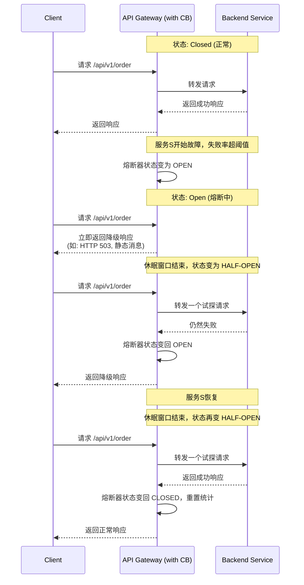

好的，遵照您的要求，为您生成一份关于“API网关熔断降级 (Circuit Breaker模式)”的技术文档。

---

# **API网关熔断降级技术文档 (Circuit Breaker模式)**

**文档版本：** V1.0
**修订日期：** 2023-10-27
**关键词：** API网关、熔断器、降级、Circuit Breaker、弹性、微服务

---

## **1. 文档概述**

### **1.1 目的**
本文档旨在阐述在API网关中实现“熔断降级”(Circuit Breaker)模式的背景、原理、核心流程、配置项及最佳实践。通过实施此模式，保障分布式系统的稳定性，防止因个别后端服务的故障或延迟导致整个系统雪崩。

### **1.2 适用范围**
适用于使用API网关作为流量入口，后端存在多个微服务或依赖服务的所有系统架构设计、开发及运维人员。

### **1.3 背景与问题**
在微服务架构中，服务间调用关系复杂。当一个后端服务（`Service A`）因高负载、故障或网络问题导致响应缓慢或不可用时，调用它的上游服务（如`API Gateway`）的线程/连接可能会被大量占用并等待，进而耗尽自身资源（如线程池、数据库连接），导致自身也发生故障。这种故障会像雪崩一样向上蔓延，最终导致整个应用系统不可用。


## **2. 熔断器模式核心概念**

熔断器模式灵感来源于电路保险丝。其核心思想是：**持续监控对特定服务的调用，当失败率（如超时、异常）达到预设阈值时，熔断器将“跳闸”(Trip)。在跳闸期间，所有对该服务的请求将快速失败（即“熔断”），直接执行预设的降级逻辑，而不再真正发起调用。经过一段配置的时间后，熔断器进入“半开”状态，试探性地放行少量请求，以探测后端服务是否已恢复。**

### **2.1 三种状态**
熔断器内部维护一个状态机，包含三种状态：

1.  **关闭 (Closed)**
    *   **默认状态**。
    *   请求正常通过，调用后端服务。
    *   熔断器持续**监控失败次数/比率**。在滑动时间窗口内，若失败次数超过阈值，则触发熔断，状态转为 **`打开 (Open)`**。

2.  **打开 (Open)**
    *   **熔断状态**。
    *   所有请求**快速失败**，直接执行**降级逻辑**（如返回预设的静态响应、错误码、缓存数据等），不再调用后端服务。
    *   此状态持续一个预设的 **`休眠时间窗口 (Sleep Window)`**。窗口结束后，状态转为 **`半开 (Half-Open)`**。

3.  **半开 (Half-Open)**
    *   **探测恢复状态**。
    *   允许**有限数量**（通常为1个或少量）的试探请求通过，去调用真实的后端服务。
    *   根据这些试探请求的结果决定下一步：
        *   **成功**：认为服务已恢复，熔断器状态转回 **`关闭 (Closed)`**，并重置统计。
        *   **失败**：认为服务仍未就绪，熔断器状态转回 **`打开 (Open)`**，并开启一个新的休眠时间窗口。


## **3. 在API网关中的实现流程**

API网关作为所有外部请求的统一入口，是实施熔断降级的绝佳位置。网关可以针对**每个API路由**或**每个后端服务主机**配置独立的熔断器。

### **3.1 流程时序图**


### **3.2 关键配置参数**
在API网关（如Spring Cloud Gateway, Zuul, Kong, Nginx+Lua等）中配置熔断器通常涉及以下参数：

| 参数名 | 说明 | 示例值 |
| :--- | :--- | :--- |
| **`failureThreshold`** | 触发熔断的失败请求数量阈值（在时间窗口内）。 | `5` |
| **`failureRatio`** | 触发熔断的失败请求比例阈值（如50%）。 | `0.5` |
| **`slidingWindowSize`** | 统计失败次数的滑动时间窗口大小。 | `10s` |
| **`slidingWindowType`** | 滑动窗口类型：基于请求数(`COUNT`)或基于时间(`TIME`)。 | `COUNT` |
| **`slowCallDurationThreshold`** | 将慢调用视为“失败”的延迟阈值（毫秒）。 | `2000ms` |
| **`permittedNumberOfCallsInHalfOpenState`** | 半开状态下允许的试探请求数。 | `2` |
| **`waitDurationInOpenState`** | 在打开状态下的休眠时间，之后自动转为半开。 | `5s` |
| **`fallbackUri` / `fallbackResponse`** | 降级逻辑，如返回静态JSON、重定向到其他服务等。 | `/fallback/order` |

## **4. 降级策略 (Fallback Strategy)**

当熔断器处于`打开`状态或请求在`半开/关闭`状态下仍然失败时，执行降级逻辑。常见的降级策略包括：

*   **返回静态值/默认值**：如返回一个空的商品列表、固定的提示信息。
*   **返回缓存数据**：返回旧版本的缓存数据，牺牲一定时效性保证可用性。
*   **调用备用服务**：路由到一个功能简化的备用服务或静态页面。
*   **返回友好错误码**：返回如 `HTTP 503 (Service Unavailable)` 并携带清晰的错误信息。
*   **记录日志并告警**：触发监控告警，通知运维人员。

## **5. 与限流、隔离的关系**

熔断降级是系统弹性设计的一部分，常与以下模式结合使用：

*   **限流 (Rate Limiting)**：在入口控制请求的速率，防止突发流量压垮系统。**限流是预防，熔断是故障发生后的保护**。
*   **舱壁隔离 (Bulkhead Isolation)**：为不同服务或接口分配独立的资源池（如线程池、连接池）。这样，一个服务的故障只会耗尽自己的资源池，而不会影响其他服务。**隔离为熔断提供了更细粒度的控制范围**。
*   **重试 (Retry)**：对临时性故障进行重试。**需谨慎使用**，与熔断结合时，重试策略应快速失败，避免在熔断边缘加重后端负担。

## **6. 最佳实践与注意事项**

1.  **分级配置**：针对不同重要性的API，设置不同的熔断阈值。核心交易API的阈值应更宽松，非核心查询API可以更严格。
2.  **监控与可视化**：必须将熔断器的状态（打开/关闭/半开）、请求量、失败率等作为关键指标接入监控系统（如Prometheus + Grafana），并设置醒目告警。
3.  **避免过度熔断**：阈值配置需要结合压测和线上实际情况调整，避免因正常业务波动引发不必要的熔断。
4.  **降级体验**：降级响应应尽可能对用户友好，例如提示“服务繁忙，请稍后重试”，而不是晦涩的技术错误。
5.  **半开状态试探**：`permittedNumberOfCallsInHalfOpenState` 不宜过大，通常1-3个即可，避免恢复中的服务被瞬间打垮。
6.  **结合超时设置**：必须为网关到后端服务的调用设置合理的超时时间，超时应被视为失败，计入熔断统计。
7.  **文档化**：在API文档中明确说明哪些接口具备熔断降级能力，以及降级后的可能行为。

## **7. 示例配置 (以Spring Cloud Gateway为例)**

```yaml
spring:
  cloud:
    gateway:
      routes:
        - id: order-service
          uri: lb://order-service
          predicates:
            - Path=/api/v1/order/**
          filters:
            - name: CircuitBreaker
              args:
                name: orderServiceCB # 熔断器名称
                fallbackUri: forward:/fallback/order # 降级URI
                # Resilience4j 熔断器配置
                circuitBreaker:
                  register-health-indicator: true
                  sliding-window-type: COUNT_BASED
                  sliding-window-size: 10
                  minimum-number-of-calls: 5
                  failure-rate-threshold: 50
                  wait-duration-in-open-state: 5s
                  permitted-number-of-calls-in-half-open-state: 2
                  automatic-transition-from-open-to-half-open-enabled: true
            # 通常还需要配置重试和超时
            - name: Retry
              args:
                retries: 2
                statuses: BAD_GATEWAY, SERVICE_UNAVAILABLE
                methods: GET,POST
            - name: SetResponseTimeout
              args:
                connect-timeout: 500
                response-timeout: 2s
```

## **8. 常见问题 (FAQ)**

**Q1: 熔断器打开后，如何手动强制关闭？**
A1: 成熟的熔断器实现（如Resilience4j, Hystrix）通常会提供管理端点（如`/actuator/circuitbreakers`）。在生产环境中，应通过监控判断服务确已恢复后，再通过此类端点进行状态重置。**不建议频繁手动操作**。

**Q2: 熔断和限流有何区别？**
A2: **目标不同**：限流是控制**健康系统**的流量，防止过载；熔断是在**下游服务不健康**时，快速失败并提供回退。**触发条件不同**：限流看自身流量指标；熔断看对下游调用的失败率。

**Q3: 网关层的熔断能替代服务间的熔断吗？**
A3: **不能完全替代**。网关熔断保护的是外部入口到整个后端集群的路径。在复杂的服务调用链内部（如A->B->C），B调用C时依然可能需要自己的熔断器来保护。两者是互补的，构成多层防护体系。

---
**文档修订记录**

| 版本 | 日期 | 修订内容 | 修订人 |
| :--- | :--- | :--- | :--- |
| V1.0 | 2023-10-27 | 初始版本创建。 | [您的姓名/团队] |

---