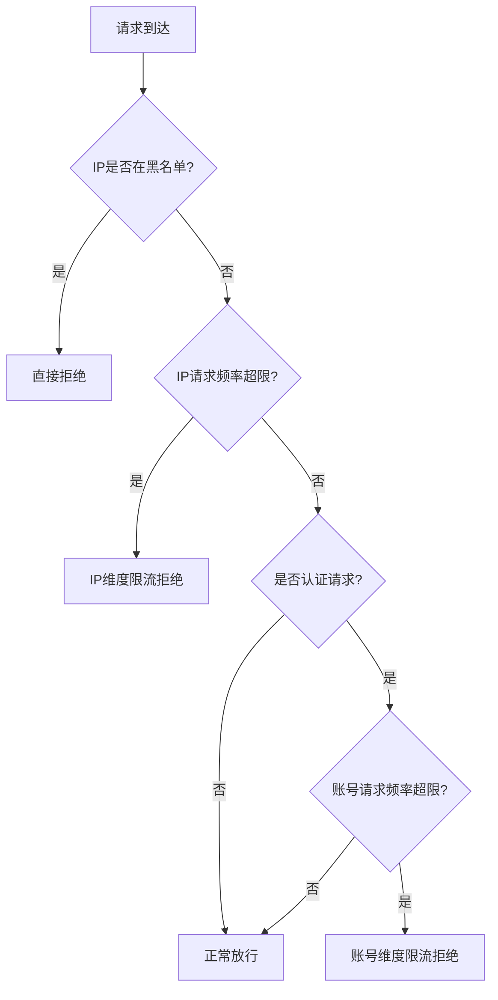

# API限流防暴力破解技术方案  
## ——基于IP维度与账号维度的双重限流机制  

---

## 1. 背景与目标  
### 1.1 问题背景  
在开放API接口服务中，恶意用户可能通过以下方式进行攻击：  
- **暴力破解**：针对登录、验证码、密码找回等接口高频调用  
- **数据爬取**：恶意爬虫高频访问数据查询接口  
- **资源耗尽攻击**：通过高频请求消耗服务器资源  

### 1.2 防护目标  
- **精准识别恶意请求**：区分正常用户流量与攻击流量  
- **双重防护机制**：同时基于IP地址和用户账号进行限流  
- **最小化误伤**：避免正常用户因共享IP等因素被误拦截  
- **实时响应与弹性恢复**：支持动态调整限流策略，攻击停止后自动恢复  

---

## 2. 限流策略设计  

### 2.1 IP维度限流  
#### 规则配置：  
```yaml
ip_limit:
  time_window: 60          # 时间窗口（秒）
  max_requests: 300        # 窗口内最大请求数
  block_duration: 900      # 违规后封禁时长（秒）
  whitelist:               # IP白名单
    - "10.0.0.0/8"
    - "192.168.1.0/24"
  blacklist:               # 永久黑名单（手动维护）
    - "58.215.20.13"
```

#### 算法选择：  
- **滑动窗口计数器**：实时性高，内存占用可控  
- **令牌桶算法**：支持突发流量，适用于需要弹性限流的场景  

### 2.2 账号维度限流  
#### 规则配置：  
```yaml
account_limit:
  time_window: 300         # 时间窗口（秒）
  max_requests: 50         # 窗口内最大请求数（针对敏感接口）
  lock_duration: 1800      # 账号锁定时长（秒）
  sensitive_paths:         # 敏感接口列表
    - "/api/v1/login"
    - "/api/v1/password/reset"
    - "/api/v1/captcha/verify"
```

### 2.3 双重限流逻辑关系  


---

## 3. 技术实现方案  

### 3.1 架构设计  
```
客户端请求 → API网关 → 限流中间件 → 业务服务
                     ↓
              Redis集群（存储计数）
                     ↓
              监控告警系统
```

### 3.2 核心实现（以Spring Boot + Redis为例）  

#### 3.2.1 IP限流组件  
```java
@Component
public class IPRateLimiter {
    
    @Autowired
    private RedisTemplate<String, String> redisTemplate;
    
    public boolean allowRequest(String ip, String apiPath) {
        String key = "limit:ip:" + ip + ":" + apiPath;
        long current = System.currentTimeMillis();
        long window = 60000; // 60秒窗口
        
        // 使用Redis滑动窗口
        Long count = redisTemplate.opsForZSet()
            .count(key, current - window, current);
            
        if (count != null && count >= getIpThreshold(apiPath)) {
            // 触发IP限流
            recordAbnormalIp(ip, apiPath);
            return false;
        }
        
        // 记录本次请求
        redisTemplate.opsForZSet().add(key, 
            String.valueOf(current), current);
        // 清理过期数据
        redisTemplate.opsForZSet().removeRangeByScore(key, 0, current - window);
        return true;
    }
}
```

#### 3.2.2 账号限流组件  
```java
@Component
public class AccountRateLimiter {
    
    public boolean allowRequest(String accountId, String apiPath) {
        String key = "limit:account:" + accountId + ":" + apiPath;
        int maxAttempts = getMaxAttempts(apiPath);
        long lockDuration = getLockDuration(apiPath);
        
        // 检查是否已被锁定
        String lockKey = "lock:account:" + accountId;
        if (Boolean.TRUE.equals(redisTemplate.hasKey(lockKey))) {
            return false;
        }
        
        // 令牌桶算法实现
        String bucketKey = "bucket:account:" + accountId;
        long now = System.currentTimeMillis();
        
        // 获取当前令牌数
        Map<Object, Object> bucket = redisTemplate.opsForHash()
            .entries(bucketKey);
        
        long tokens = Long.parseLong(bucket.get("tokens").toString());
        long lastRefill = Long.parseLong(bucket.get("last_refill").toString());
        
        // 计算补充令牌
        long refillTime = now - lastRefill;
        long tokensToAdd = refillTime * getRefillRate() / 1000;
        
        tokens = Math.min(getCapacity(), tokens + tokensToAdd);
        
        if (tokens <= 0) {
            // 令牌不足，触发账号锁定
            redisTemplate.opsForValue()
                .set(lockKey, "1", lockDuration, TimeUnit.SECONDS);
            return false;
        }
        
        // 消耗令牌
        tokens--;
        redisTemplate.opsForHash().putAll(bucketKey, Map.of(
            "tokens", String.valueOf(tokens),
            "last_refill", String.valueOf(now)
        ));
        return true;
    }
}
```

### 3.3 网关层配置示例（Nginx + Lua）  
```nginx
http {
    lua_shared_dict ip_limit 100m;
    lua_shared_dict account_limit 50m;
    
    server {
        location /api/ {
            access_by_lua_block {
                local ip = ngx.var.remote_addr
                local token = ngx.req.get_headers()["Authorization"]
                
                -- IP限流检查
                local limiter = require "resty.limit.req"
                local lim_ip = limiter.new("ip_limit", 300, 60) -- 300 req/min
                
                local delay, err = lim_ip:incoming(ip, true)
                if not delay then
                    if err == "rejected" then
                        ngx.header["X-RateLimit-Limit"] = "ip"
                        return ngx.exit(429)
                    end
                    ngx.log(ngx.ERR, "failed to limit ip: ", err)
                end
                
                -- 账号限流检查（如果有token）
                if token then
                    local account_id = extract_account_id(token)
                    local lim_account = limiter.new("account_limit", 50, 300) -- 50 req/5min
                    
                    local delay2, err2 = lim_account:incoming(account_id, true)
                    if not delay2 and err2 == "rejected" then
                        ngx.header["X-RateLimit-Limit"] = "account"
                        return ngx.exit(429)
                    end
                end
            }
            
            proxy_pass http://backend_service;
        }
    }
}
```

---

## 4. 监控与告警  

### 4.1 关键监控指标  
| 指标名称 | 采集方式 | 告警阈值 | 
|---------|---------|---------|
| IP限流触发QPS | Redis计数器 | > 100次/分钟 |
| 账号锁定量 | Redis SCARD | 连续增长超过10% |
| 敏感接口访问频次 | 日志分析 | 超过基线200% |
| 误拦率统计 | 业务日志标记 | > 0.1% |

### 4.2 告警规则示例（Prometheus + Alertmanager）  
```yaml
groups:
  - name: api_security
    rules:
      - alert: HighIPBlockRate
        expr: rate(ip_block_total[5m]) > 50
        for: 2m
        annotations:
          description: "IP限流触发频率过高，可能存在网络攻击"
          
      - alert: AccountLockSpike
        expr: increase(account_lock_total[10m]) > 100
        for: 3m
        annotations:
          description: "账号锁定数量激增，可能遭受暴力破解攻击"
```

### 4.3 可视化仪表板（Grafana）  
- **实时限流状态**：展示当前被限流的IP/账号数量  
- **攻击趋势分析**：按时间维度展示限流触发趋势  
- **热点攻击目标**：显示被攻击最多的接口TOP10  
- **误拦分析**：展示白名单用户被误拦情况  

---

## 5. 运营与维护  

### 5.1 动态配置管理  
```java
@ConfigurationProperties(prefix = "ratelimit")
@RefreshScope
public class RateLimitConfig {
    private Map<String, Integer> ipLimits = new HashMap<>();
    private Map<String, Integer> accountLimits = new HashMap<>();
    private List<String> ipWhitelist = new ArrayList<>();
    private List<String> sensitiveApis = new ArrayList<>();
    
    // 支持通过配置中心热更新
    @Scheduled(fixedDelay = 30000)
    public void reloadConfig() {
        // 从配置中心拉取最新配置
    }
}
```

### 5.2 人工干预接口  
```restful
# 查询当前限流状态
GET /admin/ratelimit/status?type=ip&value=192.168.1.1

# 临时调整限流阈值
PUT /admin/ratelimit/config
{
    "type": "account",
    "api_path": "/login",
    "new_limit": 100,
    "ttl": 3600
}

# 手动解封账号
DELETE /admin/ratelimit/block/account/{accountId}
```

### 5.3 应急响应流程  
```
1. 监控告警触发
   ↓
2. 确认攻击类型（IP/账号/混合）
   ↓
3. 升级限流策略（临时降低阈值）
   ↓
4. 分析攻击特征，更新黑名单规则
   ↓
5. 业务影响评估与恢复
   ↓
6. 事后分析与策略优化
```

---

## 6. 注意事项与优化建议  

### 6.1 注意事项  
1. **NAT网关场景**：同一出口IP可能对应多个真实用户，IP限流需谨慎设置阈值  
2. **分布式环境**：确保Redis集群时间同步，避免限流时间窗口错位  
3. **缓存穿透**：对不存在的账号/IP的查询进行空值缓存，避免恶意伪造ID攻击  
4. **性能影响**：限流检查应轻量化，避免复杂计算影响API响应时间  

### 6.2 优化建议  
1. **智能识别**：结合机器学习识别异常流量模式，动态调整限流阈值  
2. **分级限流**：根据用户等级（VIP/普通用户）设置差异化限流策略  
3. **区域化配置**：针对不同地域的访问特征设置不同的限流参数  
4. **冷启动保护**：新注册账号初始阶段采用更严格的限流策略  

---

## 附录  

### A. 性能测试建议  
- 基准测试：测量添加限流组件前后的API响应时间变化  
- 压力测试：模拟恶意攻击流量，验证限流组件稳定性  
- 持久性测试：长时间运行，检查Redis内存增长情况  

### B. 常见问题排查  
| 现象 | 可能原因 | 解决方案 |
|------|---------|---------|
| 正常用户被误拦 | IP共享或阈值过低 | 调整阈值，添加用户反馈渠道 |
| 限流不生效 | Redis连接失败 | 检查Redis健康状态，添加降级策略 |
| 内存持续增长 | 过期数据未清理 | 优化清理策略，设置合适TTL |

### C. 扩展功能建议  
1. **行为分析增强**：结合请求参数、访问时序进行复合判断  
2. **联合防御**：与WAF、DDoS防护系统联动  
3. **客户端反馈**：返回Retry-After头，引导客户端合理重试  

---

**文档版本**：V2.1  
**最后更新**：2024年1月  
**维护团队**：安全架构组 & 平台工程组