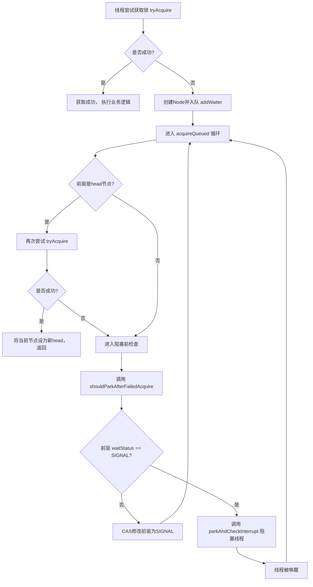

好的，遵照您的指示，以下是一份关于 **AQS（AbstractQueuedSynchronizer）中CLH队列原理** 的详细技术文档。

---

## **技术文档：AQS (AbstractQueuedSynchronizer) CLH队列原理**

| 版本 | 日期 | 作者 | 修订说明 |
| :--- | :--- | :--- | :--- |
| 1.0 | 2023-10-27 | AI Assistant | 初始版本创建 |

---

### **1. 文档概述**

本文档旨在深入剖析 Java 并发编程核心组件 **`AbstractQueuedSynchronizer`** 内部同步队列——一个基于 **CLH 锁队列变体** 的实现原理。本文将解释其设计动机、核心数据结构、入队/出队机制，以及如何管理线程的阻塞与唤醒，是理解 `ReentrantLock`, `Semaphore`, `CountDownLatch` 等 JUC 工具类底层运作机制的关键。

### **2. 核心目标与设计动机**

AQS 需要解决一个根本性问题：**当多个线程竞争一个共享资源（锁、信号量等）失败时，如何高效、公平地进行排队和调度？**

*   **高效**：在竞争不激烈或持有时间极短的情况下，尽量减少开销。
*   **公平性**：支持公平与非公平两种策略，公平策略需严格遵循 FIFO 顺序。
*   **可靠性**：正确管理线程的阻塞（`park`）与唤醒（`unpark`），避免丢失信号和无限期等待。
*   **可扩展性**：作为一个框架，需支持多种同步器（独占、共享）。

AQS 的解决方案是构建一个 **虚拟的 FIFO 双向队列**。所有未能立即获取到同步状态的线程会被封装成一个节点，加入此队列尾部进行等待。当持有同步状态的线程释放时，会按某种策略（公平/非公平）唤醒队列中的后继节点，使其重新尝试获取。

### **3. CLH 锁队列及其在 AQS 中的变体**

#### **3.1 经典 CLH 队列**
CLH 锁（Craig, Landin, and Hagersten）是一种基于 **隐式链表** 的自旋锁队列。
*   **节点结构**：每个等待线程对应一个节点，内含一个 `locked` 布尔字段。
*   **运作原理**：
    1.  尾部指针 `tail` 通过原子操作指向新加入的节点。
    2.  新节点通过 `myPred` 变量观察其前驱节点的 `locked` 状态。
    3.  当前驱节点的 `locked` 变为 `false` 时，表示轮到本节点运行。
    4.  这是一个 **自旋锁**，线程在前驱节点上忙等待。

#### **3.2 AQS 中的 CLH 变体**
AQS 借鉴了 CLH 的队列管理思想，但为适应 Java 的阻塞/唤醒模型和更丰富的功能，进行了关键改进：

| 特性 | 经典 CLH | **AQS 变体** |
| :--- | :--- | :--- |
| **数据结构** | 隐式链表（通过线程本地变量） | **显式双向链表**（节点包含前驱 `prev` 和后继 `next` 指针） |
| **等待方式** | 在前驱节点字段上 **自旋** | 使用 `LockSupport.park/unpark` **阻塞挂起** |
| **节点状态** | 简单的 `locked` 布尔值 | 丰富的 `waitStatus` 整型值 (`CANCELLED`, `SIGNAL`, `CONDITION`, `PROPAGATE`) |
| **用途** | 仅用于互斥锁 | 用于 **独占锁** 和 **共享锁** 模式，并支持 **条件队列** |

**关键改进理由：**
1.  **双向链表**：便于节点的删除。在超时或中断时，需要将中间节点从队列中安全移除。单向链表难以做到这点。
2.  **阻塞而非自旋**：在持有锁时间可能较长的场景下（如 I/O），自旋会浪费 CPU。阻塞能让出 CPU 资源。
3.  **丰富的状态**：用于实现复杂的同步语义（如条件等待、传播唤醒）。

### **4. AQS 同步队列核心结构**

#### **4.1 队列节点：`Node` 类**
这是构成队列的基本单元。

```java
static final class Node {
    // 节点模式：共享或独占
    static final Node SHARED = new Node();
    static final Node EXCLUSIVE = null;

    // waitStatus 的取值
    static final int CANCELLED =  1; // 线程已取消（超时/中断）
    static final int SIGNAL    = -1; // **后继节点需要被唤醒** (核心状态)
    static final int CONDITION = -2; // 节点在条件队列中
    static final int PROPAGATE = -3; // 共享模式下，唤醒需要向后传播

    volatile int waitStatus; // 节点状态
    volatile Node prev;      // 前驱指针
    volatile Node next;      // 后继指针
    volatile Thread thread;  // 节点关联的线程
    Node nextWaiter;         // 指向下一个在条件队列中等待的节点，或标识共享模式

    // ... 构造方法和其他工具方法
}
```

#### **4.2 队列骨架：`head` 与 `tail`**
AQS 本身维护着队列的头尾引用。
```java
public abstract class AbstractQueuedSynchronizer {
    private transient volatile Node head;
    private transient volatile Node tail;
    private volatile int state; // 同步状态，不同子类有不同语义
    // ...
}
```
*   `head`：指向队列的 **虚拟头节点（dummy node）**。头节点不关联任何线程，它的 `thread` 字段为 `null`。头节点的存在简化了边界条件的处理。**当前持有同步状态的线程，就是成功获取锁后，原头节点的后继节点对应的线程。**
*   `tail`：指向队列的最后一个节点。入队操作围绕 `tail` 进行。
*   `state`：同步状态，是AQS的核心，其含义由子类定义（如：`ReentrantLock` 中表示重入次数；`Semaphore` 中表示可用许可数）。

### **5. 核心运作流程剖析**

#### **5.1 入队（`addWaiter` 与 `enq`）**
当线程 `tryAcquire`（尝试获取锁）失败后，会调用 `addWaiter(Node.EXCLUSIVE)` 将自己加入等待队列。

1.  **快速尝试**：如果 `tail` 不为 null，尝试通过 CAS 操作将自己设置为新的 `tail`，并调整链表指针。
2.  **完整入队（`enq`）**：如果快速尝试失败（可能是并发竞争，也可能是队列未初始化），进入此方法。
    *   这是一个 **自旋（循环）** 过程。
    *   **初始化**：如果 `tail` 为 null，说明队列为空，通过 CAS 创建一个新的虚拟 `head` 节点，然后 `tail` 也指向它。
    *   **CAS 设置尾节点**：循环中不断尝试将当前节点 CAS 设置为新的 `tail`，直到成功。此操作保证了即使在超高并发下，每个节点也能被**顺序、安全**地添加到队列尾部，完美实现了 FIFO 的排队逻辑。

#### **5.2 线程阻塞与检查（`acquireQueued`）**
节点入队后，线程并不会立即阻塞。它会进入 `acquireQueued(final Node node, int arg)` 方法，进行 **最后的自旋尝试和阻塞管理**。

1.  **检查前驱**：在一个循环中，节点首先检查自己的前驱是否为 `head`。如果是，说明自己是队列中第一个等待的线程（“老二”），有资格再次尝试获取锁 (`tryAcquire`)。
2.  **获取成功**：如果尝试成功，则将当前节点设置为新的 `head`（原头节点出队），并清空其 `thread` 字段。
3.  **获取失败或非“老二”**：
    *   调用 `shouldParkAfterFailedAcquire(pred, node)` 方法。此方法的核心是**确保前驱节点的 `waitStatus` 为 `SIGNAL`**。
    *   如果前驱状态不是 `SIGNAL`，则将其 CAS 修改为 `SIGNAL`，然后返回 `false`，让外层循环再试一次。
    *   如果前驱状态已是 `SIGNAL`，则返回 `true`，表示“你可以安全地去阻塞了，因为你的前驱承诺会在释放时唤醒你”。
4.  **阻塞**：当 `shouldParkAfterFailedAcquire` 返回 `true` 后，调用 `parkAndCheckInterrupt()`，使用 `LockSupport.park(this)` 阻塞当前线程。



#### **5.3 出队与唤醒（`release` 与 `unparkSuccessor`）**
当持有锁的线程调用 `release` 方法释放同步状态后：

1.  `tryRelease` 成功，状态被清空或减少。
2.  检查当前 `head` 节点（虚拟节点）的 `waitStatus`。如果不为 0（通常为 `SIGNAL` 或 `PROPAGATE`），说明它有责任唤醒后继。
3.  调用 `unparkSuccessor(Node h)`：
    *   从 `tail` **向前遍历**，找到离 `head` 最近的一个 `waitStatus <= 0`（即非取消状态）的节点。**从后往前遍历是为了处理并发入队导致 `next` 指针暂时不一致的极端情况**。
    *   找到该节点后，调用 `LockSupport.unpark(node.thread)` 唤醒其关联的线程。
4.  被唤醒的线程会从 `parkAndCheckInterrupt()` 中返回，继续 `acquireQueued` 中的循环，再次尝试获取锁。此时它大概率会成为新的“老二”并成功获取，然后将自己设置为新的 `head`。

### **6. `waitStatus` 状态详解**

*   **`SIGNAL (-1)`**：**最重要的状态**。表示该节点的后继节点已被阻塞或即将被阻塞，因此**当前节点在释放锁或取消时，必须唤醒 (`unpark`) 它的后继节点**。节点在阻塞前，必须确保其前驱的状态为 `SIGNAL`。
*   **`CANCELLED (1)`**：节点因超时或中断而取消。它是唯一大于 0 的状态。取消的节点会从队列中剔除。
*   **`CONDITION (-2)`**：节点当前在某个 **条件队列**（`ConditionObject`）中等待。它不会出现在同步队列中，直到被 `signal` 转移到同步队列，其状态会重置为 0。
*   **`PROPAGATE (-3)`**：**仅用于共享模式**。表示下一次 `acquireShared` 操作应该无条件传播（即，可能还有剩余资源可供更多线程获取）。
*   **`0`**：初始状态。表示节点尚未进入需要管理的特定状态。

### **7. 总结与设计精髓**

AQS 的 CLH 变体队列是一个 **高效、健壮的线程排队管理机制**，其设计精髓在于：

1.  **FIFO 公平性保障**：通过原子 CAS 操作维护 `tail`，严格保证了请求的到达顺序。
2.  **“责任链”唤醒机制**：通过 `SIGNAL` 状态，每个节点都对其后继负责。释放锁的线程只需关心唤醒它的直接后继，唤醒逻辑被分摊到整个链表上，结构清晰。
3.  **检查-挂起协议**：线程在挂起前，必须确认其前驱已设置 `SIGNAL` 信号。这解决了 **“丢失唤醒”** 的经典并发问题。
4.  **适应性**：支持独占与共享两种模式，并完美集成了条件队列，使其成为一个通用的同步框架基础。

理解这个队列，是掌握 Java 并发包中几乎所有高级同步工具实现原理的基石。