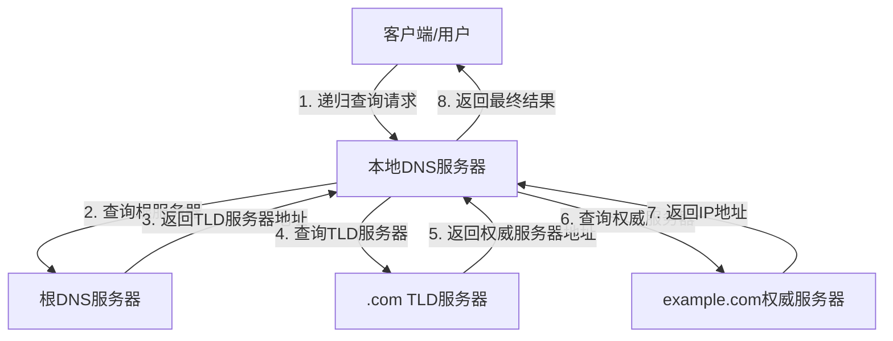
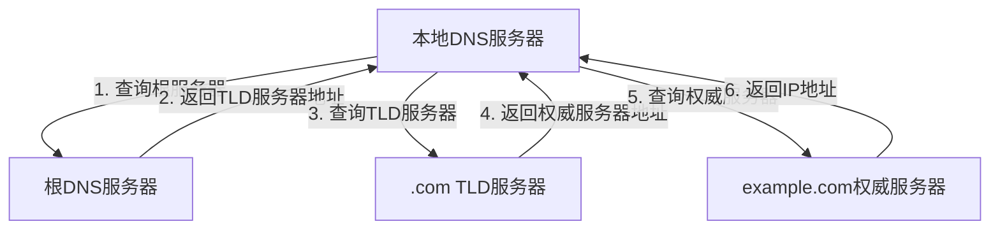
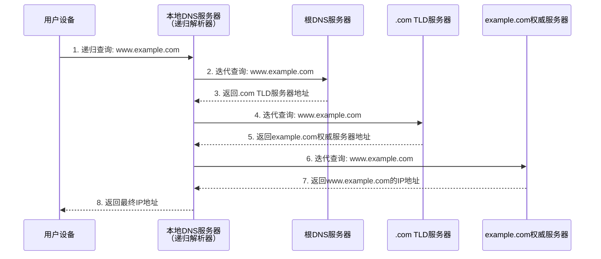

# DNS解析过程详解：递归查询与迭代查询

## 1. 概述

DNS（域名系统）是互联网的核心基础设施之一，负责将人类可读的域名（如www.example.com）转换为机器可识别的IP地址（如192.0.2.1）。DNS解析过程中主要使用两种查询方式：**递归查询**和**迭代查询**。

## 2. DNS基础架构

### 2.1 DNS层次结构
```
根域名服务器 (.)
├── 顶级域服务器 (.com, .org, .net等)
│   ├── 二级域服务器 (example.com)
│   │   └── 子域服务器 (www.example.com)
│   └── 其他域服务器
└── 其他顶级域
```

### 2.2 DNS服务器类型
- **根DNS服务器**：全球13组（逻辑组，实际数百台）
- **TLD服务器**：管理顶级域名（如.com、.org）
- **权威DNS服务器**：管理特定域名的官方记录
- **递归解析器**（本地DNS服务器）：为用户执行查询的中间服务器

## 3. 递归查询

### 3.1 定义
递归查询是指DNS客户端要求DNS服务器**必须返回最终结果**（IP地址或错误信息），服务器负责完成整个查询过程。

### 3.2 工作流程



### 3.3 特点
- **客户端负担轻**：只需发送一次请求
- **服务器负担重**：需要完成所有中间查询
- **结果缓存**：本地DNS服务器会缓存结果以提高后续查询速度
- **典型应用**：用户设备到本地DNS服务器的查询

## 4. 迭代查询

### 4.1 定义
迭代查询是指DNS服务器**返回最佳已知答案**，通常是下一级服务器的地址，由请求方继续查询。

### 4.2 工作流程



### 4.3 特点
- **客户端负担重**：需要处理多次查询响应
- **服务器负担轻**：只提供自己知道的最佳答案
- **典型应用**：DNS服务器之间的查询

## 5. 完整DNS解析流程示例

以用户访问`www.example.com`为例：

### 5.1 混合查询模式（实际场景）



### 5.2 详细步骤说明

1. **用户发起请求**
   - 用户在浏览器输入`www.example.com`
   - 系统向本地DNS服务器（如ISP提供的DNS）发送递归查询请求

2. **本地DNS服务器检查缓存**
   - 检查是否有`www.example.com`的缓存记录
   - 如有且未过期，直接返回结果（跳过后续步骤）

3. **查询根域名服务器**
   - 本地DNS服务器向根服务器发送迭代查询
   - 根服务器返回`.com`顶级域服务器的地址

4. **查询TLD服务器**
   - 本地DNS服务器向`.com` TLD服务器查询
   - TLD服务器返回`example.com`权威服务器的地址

5. **查询权威域名服务器**
   - 本地DNS服务器向`example.com`的权威服务器查询
   - 权威服务器返回`www.example.com`的IP地址

6. **结果返回与缓存**
   - 本地DNS服务器将IP地址返回给用户
   - 同时缓存结果（根据TTL设置）

## 6. DNS报文中的查询类型标识

### 6.1 DNS报文头格式
```
+--+--+--+--+--+--+--+--+
|          ID           |
+--+--+--+--+--+--+--+--+
|QR| Opcode |AA|TC|RD|RA|
+--+--+--+--+--+--+--+--+
|         QDCOUNT       |
+--+--+--+--+--+--+--+--+
```

### 6.2 关键标志位
- **RD（Recursion Desired）**：客户端设置，请求递归查询
- **RA（Recursion Available）**：服务器设置，表示支持递归查询
- **QR（Query/Response）**：0表示查询，1表示响应

## 7. 递归查询与迭代查询对比

| 特性 | 递归查询 | 迭代查询 |
|------|----------|----------|
| **发起方** | DNS客户端 | DNS服务器 |
| **响应要求** | 必须返回最终答案 | 返回最佳已知答案 |
| **查询链** | 服务器完成所有查询 | 请求方完成后续查询 |
| **网络流量** | 集中在服务器侧 | 分散在多个查询方 |
| **响应时间** | 对客户端较短 | 可能需多次往返 |
| **服务器负载** | 较重 | 较轻 |
| **典型场景** | 用户设备→本地DNS | DNS服务器之间 |

## 8. 实际应用与配置

### 8.1 递归查询配置
```bash
# BIND DNS服务器配置示例
options {
    directory "/var/named";
    recursion yes;  # 允许递归查询
    allow-recursion { localhost; 192.168.1.0/24; };
    forwarders { 8.8.8.8; 8.8.4.4; };  # 转发查询
};
```

### 8.2 使用dig工具查看查询过程
```bash
# 追踪完整解析过程
dig +trace www.example.com

# 显示查询详情
dig +norecurse @8.8.8.8 www.example.com
```

## 9. 性能优化与安全考虑

### 9.1 缓存策略
- **TTL管理**：合理设置资源记录的生存时间
- **分层缓存**：本地、ISP、公共DNS的多级缓存
- **负缓存**：缓存不存在的域名响应

### 9.2 安全考虑
- **递归查询滥用防护**：限制递归查询范围
- **DNS放大攻击防范**：关闭开放式递归解析
- **DNSSEC**：防止DNS缓存投毒

## 10. 总结

DNS解析过程中，递归查询和迭代查询各司其职：
- **递归查询**提供了用户友好的查询体验，隐藏了复杂的查询细节
- **迭代查询**实现了DNS系统的分布式架构，确保了系统的可扩展性

实际DNS解析通常采用混合模式：客户端到本地DNS使用递归查询，DNS服务器之间使用迭代查询。这种设计既保证了用户体验，又维持了DNS系统的高效和稳定。

理解这两种查询方式对于网络故障排查、DNS服务器配置和网络安全防护都具有重要意义。随着DNS over HTTPS（DoH）和DNS over TLS（DoT）等新技术的发展，DNS查询的基本原理仍然保持不变，但传输安全性和隐私保护得到了显著增强。