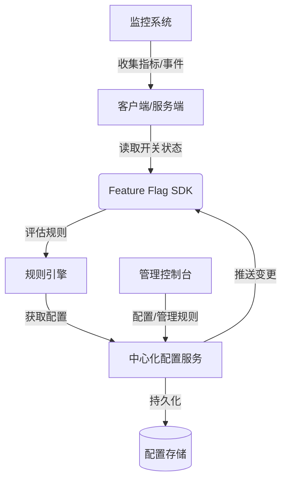

好的，遵照您的指示，以下是一份关于“Feature Flag 灰度发布控制”的技术文档。

---

# **技术文档：基于 Feature Flag 的灰度发布控制**

| 版本 | 修订日期 | 修订人 | 修订内容 |
| :--- | :--- | :--- | :--- |
| 1.0 | 2023-10-27 | 智能助手 | 初始版本创建 |

---

## **1. 文档概述**

### **1.1 目的**
本文档旨在阐述如何利用 **Feature Flag（功能开关）** 技术来实现安全、可控的**灰度发布**流程。通过将功能发布与代码部署解耦，使团队能够动态地管理新功能对特定用户群体的开放程度，从而降低发布风险，提升交付速度与系统稳定性。

### **1.2 目标受众**
- 软件开发工程师
- 测试工程师
- DevOps / SRE 工程师
- 技术负责人 / 产品经理

### **1.3 核心价值**
- **降低风险**：将问题的影响范围限制在特定灰度群体内。
- **加速反馈**：快速从目标用户获得真实使用反馈和数据。
- **灵活回滚**：无需重新部署或热修复，一键关闭问题功能。
- **解耦部署与发布**：实现“持续部署”但不“持续发布”。

---

## **2. 核心概念**

### **2.1 Feature Flag (功能开关)**
一种允许开发者在运行时动态启用或禁用特定功能的技术手段。它通常由一个**条件判断语句**和一个**中心化配置系统**组成。
```java
// 代码示例
if (featureFlagService.isEnabled("new_checkout_flow", user)) {
    return renderNewCheckout();
} else {
    return renderLegacyCheckout();
}
```

### **2.2 灰度发布**
一种渐进式的软件发布策略。将新功能逐步开放给从少量到更多的用户，在过程中持续监控、评估，确保稳定后再全面上线。

### **2.3 结合模式**
Feature Flag 是实现灰度发布的**理想载体**。通过精细化的规则配置，可以轻松定义哪些用户/请求属于“灰度群体”。

---

## **3. 灰度发布策略与 Feature Flag 实现**

我们可以通过多种维度来定义灰度规则，以下是常见的策略及实现方式：

| 灰度策略 | 描述 | Feature Flag 规则示例 (逻辑) | 适用场景 |
| :--- | :--- | :--- | :--- |
| **百分比发布** | 随机按一定比例流量放行 | `userId % 100 < targetPercentage` | 初始阶段，小流量验证 |
| **用户标识发布** | 针对特定用户ID、邮箱、组织等 | `user.email in ["test@company.com", ...]` | 内部员工、Beta测试用户 |
| **设备/平台发布** | 针对特定操作系统、浏览器、App版本 | `device.os == "iOS" && appVersion >= "4.2.0"` | 兼容性测试，分平台发布 |
| **地域发布** | 针对特定国家、地区、城市 | `user.geo.country == "US"` | 合规要求，区域化特性 |
| **自定义属性发布**| 基于用户画像、标签、行为等 | `user.tier == "premium" && user.usage > 1000` | 高价值用户优先体验 |

---

## **4. 系统架构与组件**

一个完整的 Feature Flag 灰度控制系统通常包含以下组件：



1.  **SDK (客户端/服务端)**：集成在应用代码中，负责评估开关状态。
2.  **规则引擎**：根据上下文（用户、设备、环境）和预定义规则计算开关是否启用。
3.  **中心化配置服务**：存储和管理所有 Feature Flag 的定义、规则和状态。
4.  **管理控制台 (UI)**：提供可视化界面，供非工程师（如产品经理）操作开关、调整灰度规则。
5.  **监控与数据分析**：跟踪开关的请求量、开启率、错误率及业务指标（如转化率），为决策提供数据支持。

---

## **5. 实施步骤**

### **5.1 阶段一：设计与集成**
1.  **选择方案**：评估第三方服务（如 LaunchDarkly， Statsig）或自研。
2.  **定义 Flag**：为需要灰度的功能创建具有描述性名称的 Flag（如 `new_search_algorithm`）。
3.  **代码集成**：在代码关键路径插入条件判断，并确保有**默认降级路径**。
4.  **设立 Kill Switch**：为每个新功能 Flag 预设“关闭”状态，并确保可紧急切换。

### **5.2 阶段二：灰度发布流程**
1.  **Dark Launch (暗启动)**：Flag 关闭，新代码对用户不可见，可进行内部测试或影子测试。
2.  **内部灰度**：对 1%-5% 的内部员工或测试用户开启，进行验收。
3.  **小流量生产灰度**：对 1%-5% 的真实生产流量开启，监控系统指标和错误日志。
4.  **逐步放量**：如无问题，逐步将百分比提升至 10%， 50%， 100%。
5.  **全面发布与清理**：当功能稳定并对 100% 用户开放后，移除代码中的 Feature Flag 逻辑，并下线该 Flag。

### **5.3 阶段三：监控与运维**
- **技术指标**：应用性能（延迟、错误率）、系统资源（CPU、内存）。
- **业务指标**：转化率、点击率、用户停留时间等。
- **警报机制**：当灰度组错误率明显高于对照组时，自动报警或自动关闭 Flag。

---

## **6. 示例代码 (Python Flask)**

```python
from flask import Flask, request, g
import feature_flag_client # 假设的FF SDK客户端

app = Flask(__name__)
ff_client = feature_flag_client.Client(env_key="YOUR_ENV_KEY")

def get_user_context():
    """构造用户上下文，用于规则评估"""
    user_id = getattr(g, 'user_id', 'anonymous')
    user_email = getattr(g, 'user_email', '')
    country = request.headers.get('X-Country-Code', 'US')
    return {
        "key": user_id,
        "email": user_email,
        "country": country,
        "custom": {
            "signup_days": 100  # 示例自定义属性
        }
    }

@app.route('/new-feature')
def new_feature_endpoint():
    user_context = get_user_context()
    
    # 核心：评估功能开关是否对当前用户/请求开启
    if ff_client.is_enabled("premium_dashboard_redesign", user_context):
        # 灰度逻辑：返回新功能
        return render_new_dashboard()
    else:
        # 默认逻辑：返回旧功能
        return render_legacy_dashboard()

if __name__ == '__main__':
    app.run()
```

---

## **7. 最佳实践与注意事项**

### **7.1 最佳实践**
- **命名规范**：采用清晰、一致的命名（如 `<team>.<feature>.v<版本>`）。
- **生命周期管理**：为每个 Flag 设置负责人和清理计划，避免“Flag 债务”。
- **默认安全**：新 Flag 的默认状态应为“关闭”。
- **记录变更**：所有 Flag 的状态变更应有审计日志。
- **组合测试**：注意多个独立 Flag 同时开启时可能产生的交互影响。

### **7.2 常见陷阱**
- **性能影响**：频繁的远程调用或复杂的规则计算可能影响性能。使用本地缓存。
- **技术债务**：长期不清理的 Flag 会使代码复杂难懂。必须定期清理已上线的 Flag。
- **标志爆炸**：过多的 Flag 会增加管理复杂度。需要良好的治理流程。
- **缓存一致性**：确保配置变更后，各应用节点能及时更新，避免长时间不一致。

---

## **8. 总结**

Feature Flag 驱动的灰度发布是现代软件工程中实现**安全、快速、数据驱动交付**的关键实践。它将发布权限从运维侧扩展到产品与业务侧，赋予了团队在复杂环境下进行精细化管理的能力。成功实施此方案不仅需要可靠的技术工具，更需要配套的流程规范、团队协作文化和持续清理的纪律。

通过本文档阐述的方法，团队可以系统性地降低发布风险，加速价值流动，并最终构建更具韧性的软件系统。

---