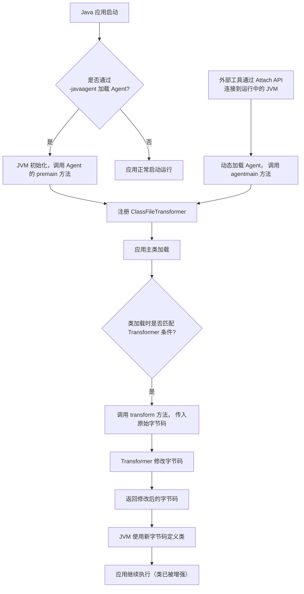

好的，这是一份关于 **Instrumentation API 字节码替换** 的技术文档，内容涵盖了其核心概念、工作原理、实现步骤、代码示例以及注意事项。

---

## **技术文档：基于 Java Instrumentation API 的字节码替换**

### **1. 概述**

Java Instrumentation API（`java.lang.instrument`）是 JVM 提供的一组强大工具，允许开发人员在 Java 程序**运行时**或**启动前**，动态地修改或增强类的字节码。其主要应用场景包括：
*   **应用性能监控（APM）**： 注入监控逻辑，如方法耗时、调用链追踪。
*   **热部署/热修复**： 在不重启 JVM 的情况下替换类定义。
*   **诊断工具**： 实现代码覆盖率、调试器、性能分析器。
*   **AOP（面向切面编程）**： 在特定方法前后插入通用逻辑（如日志、事务）。

本文档重点阐述如何利用 `ClassFileTransformer` 接口和 `Instrumentation` 对象，实现精准的运行时字节码替换。

### **2. 核心概念**

*   **`java.lang.instrument.Instrumentation`**： 核心接口。JVM 通过此接口提供修改类、查询类、添加 JAR 到类路径等服务。其实例由 JVM 通过 `premain` 或 `agentmain` 方法传入。
*   **`java.lang.instrument.ClassFileTransformer`**： 字节码转换器接口。开发者实现其 `transform` 方法，在其中对传入的字节码（`byte[]`）进行修改，并返回新的字节码数组。
*   **Java Agent**： 一个特殊的 JAR 包，其清单文件（`MANIFEST.MF`）中声明了 `Premain-Class` 或 `Agent-Class` 属性，用于启动 Instrumentation Agent。
    *   **静态加载（启动时）**： 通过 JVM 参数 `-javaagent:agent.jar` 指定，`premain` 方法被调用。
    *   **动态加载（运行时 Attach）**： 通过 `VirtualMachine.attach` API 动态加载到已运行的 JVM 进程中，`agentmain` 方法被调用。

### **3. 工作原理与流程**



### **4. 实现步骤与代码示例**

#### **4.1 创建 Java Agent**

首先，创建一个实现 `ClassFileTransformer` 的类。

**SimpleTransformer.java**
```java
import java.lang.instrument.ClassFileTransformer;
import java.lang.instrument.IllegalClassFormatException;
import java.security.ProtectionDomain;
import javassist.ClassPool;
import javassist.CtClass;
import javassist.CtMethod;

public class SimpleTransformer implements ClassFileTransformer {
    @Override
    public byte[] transform(ClassLoader loader,
                            String className,
                            Class<?> classBeingRedefined,
                            ProtectionDomain protectionDomain,
                            byte[] classfileBuffer) throws IllegalClassFormatException {
        // 1. 过滤目标类（这里以 "com/example/MyService" 为例）
        if (className != null && className.replace("/", ".").equals("com.example.MyService")) {
            try {
                // 2. 使用字节码操作库（如 Javassist, ASM）进行修改
                ClassPool cp = ClassPool.getDefault();
                CtClass ctClass = cp.makeClass(new java.io.ByteArrayInputStream(classfileBuffer));
                
                // 3. 找到目标方法（例如 "doBusiness"）
                CtMethod method = ctClass.getDeclaredMethod("doBusiness");
                
                // 4. 在方法开始处插入一行日志
                String logMsg = String.format("java.lang.System.out.println(\"[Instrumented] Method %s.%s executed at \" + java.time.LocalDateTime.now());",
                                              className.replace("/", "."), method.getName());
                method.insertBefore(logMsg);
                
                // 5. 返回修改后的字节码
                return ctClass.toBytecode();
            } catch (Exception e) {
                e.printStackTrace();
            }
        }
        // 6. 对于非目标类，返回 null 表示不进行转换
        return null;
    }
}
```

#### **4.2 创建 Agent 入口类**

定义包含 `premain` 和/或 `agentmain` 方法的类。

**MyInstrumentationAgent.java**
```java
import java.lang.instrument.Instrumentation;

public class MyInstrumentationAgent {
    // 静态加载（启动时）入口
    public static void premain(String agentArgs, Instrumentation inst) {
        System.out.println("[Agent] Premain method called with args: " + agentArgs);
        initializeAgent(inst);
    }
    
    // 动态加载（Attach）入口
    public static void agentmain(String agentArgs, Instrumentation inst) {
        System.out.println("[Agent] Agentmain method called with args: " + agentArgs);
        initializeAgent(inst);
    }
    
    private static void initializeAgent(Instrumentation inst) {
        // 创建并注册 Transformer
        SimpleTransformer transformer = new SimpleTransformer();
        inst.addTransformer(transformer, true); // 第二个参数 true 表示允许重转换（retransform）
        
        // 对于动态 Attach，可以尝试立即重转换已加载的类
        try {
            Class[] allClasses = inst.getAllLoadedClasses();
            for (Class clazz : allClasses) {
                if (clazz.getName().equals("com.example.MyService")) {
                    System.out.println("[Agent] Retransforming class: " + clazz.getName());
                    inst.retransformClasses(clazz); // 触发已加载类的重转换
                    break;
                }
            }
        } catch (Exception e) {
            e.printStackTrace();
        }
    }
}
```

#### **4.3 打包 Agent JAR**

创建 `MANIFEST.MF` 文件，并打包成 JAR。

**MANIFEST.MF**
```manifest
Manifest-Version: 1.0
Premain-Class: MyInstrumentationAgent
Agent-Class: MyInstrumentationAgent
Can-Retransform-Classes: true
Can-Redefine-Classes: true
```

使用 Maven 或命令行打包：
```bash
javac -cp .:javassist.jar *.java
jar cvfm myagent.jar MANIFEST.MF *.class
```

#### **4.4 使用 Agent**

**静态加载（启动应用时）**：
```bash
java -javaagent:myagent.jar -cp .:your_app.jar com.example.Main
```

**动态加载（Attach 到运行中的进程）**：
```java
// 使用 com.sun.tools.attach.VirtualMachine（位于 tools.jar）
import com.sun.tools.attach.VirtualMachine;
...
String pid = "12345"; // 目标 JVM 进程 ID
VirtualMachine vm = VirtualMachine.attach(pid);
try {
    vm.loadAgent("path/to/myagent.jar", "optional_arguments");
} finally {
    vm.detach();
}
```

### **5. 关键注意事项与限制**

1.  **类加载时机**： `transform` 方法在类**被定义之前**（即 `ClassLoader.defineClass` 调用时）调用。对于已加载的类，需显式调用 `Instrumentation.retransformClasses`。
2.  **字节码操作库选择**：
    *   **Javassist**： API 简单，适合初学者和快速原型。性能开销相对较高。
    *   **ASM**： 功能强大、性能最优，但 API 较底层，学习曲线陡峭。
    *   **Byte Buddy**： 现代、API 友好、功能丰富，推荐用于生产环境。
3.  **性能影响**： 字节码转换会增加类加载时间，并可能对方法执行性能产生微小影响。应确保转换逻辑高效，并避免转换不必要的类。
4.  **类加载器隔离**： 同一个类可能被不同的 `ClassLoader` 加载。`transform` 方法会为每个加载事件调用，需根据 `loader` 和 `className` 仔细区分。
5.  **不可修改的类**： 部分核心类（如 `java.lang.String`）由引导类加载器（Bootstrap ClassLoader）加载，默认不允许修改。`Instrumentation` 可以通过 `appendToBootstrapClassLoaderSearch` 添加 JAR，但仍有限制。
6.  **方法签名约束**： 修改字节码时，不能改变类的原有结构（如添加/删除方法、字段）的**签名**。重定义（`redefineClasses`）允许更大的改变，但限制更多，易导致 `UnsupportedOperationException`。
7.  **依赖管理**： Agent JAR 及其依赖（如 Javassist）需要被正确打包。通常使用“fat jar”或通过 `Instrumentation.appendToSystemClassLoaderSearch` 添加依赖。

### **6. 总结**

Java Instrumentation API 为 JVM 层的字节码操作提供了标准化的入口。通过实现 `ClassFileTransformer` 并借助字节码操作库，开发者能够以无侵入的方式实现对应用行为的深度监控、增强和诊断。掌握这一技术是构建高级 APM、调试和运维工具的基础。

**建议在生产环境使用前，进行充分的测试**，以确保字节码替换的稳定性和性能符合预期。

---