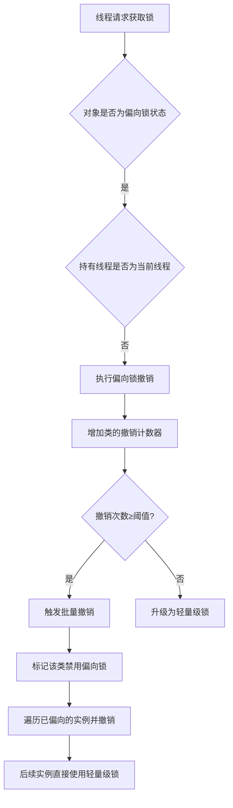

# JVM偏向锁撤销批量机制技术文档

## 1. 概述

### 1.1 文档目的
本文档详细阐述JVM中偏向锁的批量撤销机制，包括其设计原理、实现机制、触发条件和优化意义，为JVM性能调优和并发编程提供技术参考。

### 1.2 背景：偏向锁简介
偏向锁是JVM针对**单线程访问同步块**场景的优化机制，通过在对象头中记录偏向线程ID，避免后续同一线程进入同步块时的CAS操作，减少同步开销。

## 2. 偏向锁撤销机制

### 2.1 单个撤销
当多个线程竞争偏向锁时，JVM需要撤销偏向锁并升级为轻量级锁或重量级锁：
```java
// 伪代码示例：偏向锁撤销流程
if (对象处于偏向锁状态 && 持有线程 != 当前线程) {
    暂停持有线程；
    检查持有线程状态：
        if (持有线程已退出同步块) {
            恢复无锁状态；
        } else {
            升级为轻量级锁；
        }
    恢复持有线程；
}
```

### 2.2 批量撤销机制

#### 2.2.1 设计动机
- **问题**：频繁的偏向锁撤销操作会产生显著性能开销
- **场景**：某些类的实例在多线程环境下竞争激烈，继续使用偏向锁反而降低性能
- **解决方案**：当某个类的偏向锁撤销次数达到阈值后，JVM判定该类"不适合使用偏向锁"，后续该类的实例将**禁用偏向锁**

#### 2.2.2 核心参数
| 参数 | 默认值 | 说明 |
|------|--------|------|
| `BiasedLockingBulkRebiasThreshold` | 20 | 批量重偏向阈值 |
| `BiasedLockingBulkRevokeThreshold` | 40 | 批量撤销阈值 |
| `BiasedLockingDecayTime` | 25000ms | 衰减时间 |

## 3. 批量撤销实现机制

### 3.1 状态跟踪
JVM为每个类维护撤销计数器：
```c++
// HotSpot VM中的关键数据结构
class Klass {
    // 偏向锁撤销相关状态
    jlong _last_biased_lock_bulk_revocation_time;
    int   _biased_lock_revocation_count;
    
    // 类级别的偏向锁状态标记
    bool  _disable_biased_locking;
};
```

### 3.2 触发条件
批量撤销在以下条件满足时触发：
1. **撤销计数达到阈值**：`revocation_count >= BulkRevokeThreshold`
2. **时间衰减机制**：距离上次批量撤销操作超过衰减时间，计数器重置

### 3.3 执行流程


## 4. 相关机制：批量重偏向

### 4.1 概念区分
| 机制 | 目标 | 结果 |
|------|------|------|
| 批量撤销 | 完全禁用某类的偏向锁 | 该类的所有实例不再使用偏向锁 |
| 批量重偏向 | 将已偏向的锁重新偏向新线程 | 已偏向的实例重新偏向，新实例仍可偏向 |

### 4.2 重偏向条件
- 撤销次数达到`BulkRebiasThreshold`但未达到`BulkRevokeThreshold`
- 距离上次重偏向/撤销超过衰减时间

## 5. 性能影响与优化建议

### 5.1 性能影响分析
| 场景 | 偏向锁性能 | 无偏向锁性能 |
|------|-----------|-------------|
| 单线程重复访问 | +++ (最优) | + |
| 多线程轻度竞争 | + | ++ |
| 高并发竞争 | -- (最差) | + |

### 5.2 监控与诊断

#### 5.2.1 JVM参数
```bash
# 开启偏向锁相关诊断信息
-XX:+PrintBiasedLockingStatistics
-XX:BiasedLockingStartupDelay=0  # 关闭偏向锁延迟启用

# 调整阈值参数（谨慎使用）
-XX:BiasedLockingBulkRevokeThreshold=50
-XX:BiasedLockingBulkRebiasThreshold=25
```

#### 5.2.2 诊断工具
```java
// 使用jcmd查看偏向锁状态
jcmd <pid> VM.print_system_dictionary
jcmd <pid> GC.class_stats | grep -i bias
```

### 5.3 优化建议
1. **识别模式**：监控高并发类，识别批量撤销发生
2. **参数调优**：
   - 对于明确多线程访问的类，考虑提前禁用偏向锁
   - 调整阈值以适应特定应用模式
3. **代码优化**：
   ```java
   // 对于已知高并发场景，可考虑使用显式锁
   private final ReentrantLock lock = new ReentrantLock();
   
   public void highContentionMethod() {
       lock.lock();
       try {
           // 业务逻辑
       } finally {
           lock.unlock();
       }
   }
   ```

## 6. 实际案例分析

### 6.1 典型场景：线程池中的任务对象
```java
public class Task implements Runnable {
    private final Object lock = new Object();
    
    @Override
    public void run() {
        synchronized(lock) {
            // 每个Task对象被不同线程执行
            // 容易触发批量撤销
        }
    }
}

// 线程池执行
ExecutorService executor = Executors.newFixedThreadPool(10);
for (int i = 0; i < 1000; i++) {
    executor.execute(new Task());  // 每个Task实例可能被不同线程执行
}
```

### 6.2 解决方案
1. **使用ThreadLocal模式**：如果对象主要在创建线程中使用
2. **禁用偏向锁**：对于明确多线程访问的对象
3. **对象复用**：通过对象池减少新对象创建

## 7. 版本兼容性与演进

### 7.1 Java版本差异
- **Java 6-15**：偏向锁默认启用
- **Java 15+**：偏向锁默认禁用（JEP 374）
- **Java 18+**：偏向锁相关代码被标记为废弃

### 7.2 迁移建议
对于新项目：
- Java 15+：无需关注偏向锁调优
- Java 8-14：根据应用特性决定是否启用偏向锁

## 8. 总结

偏向锁批量撤销机制是JVM对锁竞争模式的自适应优化，通过识别"不适合偏向锁"的类，避免持续的偏向-撤销开销。虽然在高版本Java中偏向锁逐渐被废弃，但理解其机制对于：
1. 维护遗留Java应用
2. 深入理解JVM锁优化演进
3. 设计高性能并发系统

仍有重要价值。在实际开发中，应结合应用特性和Java版本，合理选择和配置锁机制。

## 附录

### A. 相关JVM源码位置
- `biasedLocking.cpp`：偏向锁主要实现
- `objectMonitor.cpp`：对象监视器实现
- `synchronizer.cpp`：同步器相关实现

### B. 参考资源
1. Oracle官方文档：JVM调优指南
2. HotSpot VM源码注释
3. 《深入理解Java虚拟机》第三版

---
*文档版本：1.1*
*最后更新：2024年*
*适用版本：Java 6-14（偏向锁启用版本）*