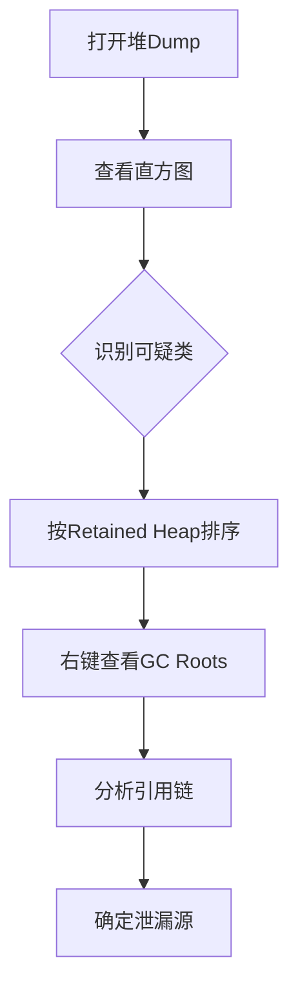

# JVM堆Dump分析内存泄漏技术文档

## 1. 概述

内存泄漏是Java应用程序中常见的问题，指应用程序在不再需要某些对象时未能释放其占用的内存，导致内存使用量持续增长，最终可能引发OutOfMemoryError。本技术文档将介绍如何使用MAT(Memory Analyzer Tool)和JProfiler分析JVM堆Dump文件，诊断内存泄漏问题。

## 2. 核心概念

### 2.1 JVM内存结构
- **堆(Heap)**：存储对象实例的主要区域
- **新生代(Young Generation)**：存放新创建的对象
- **老年代(Old Generation)**：存放长期存活的对象
- **永久代/元空间(PermGen/Metaspace)**：存储类元数据

### 2.2 堆Dump文件
堆Dump是JVM堆内存的完整快照，包含：
- 所有对象的类信息
- 对象实例数据
- 对象的引用关系

### 2.3 内存泄漏特征
1. 内存使用量随时间持续增长
2. Full GC频率增加但回收效果不佳
3. 老年代内存占用持续上升

## 3. 堆Dump生成方法

### 3.1 自动生成
```bash
# JVM启动参数添加
-XX:+HeapDumpOnOutOfMemoryError
-XX:HeapDumpPath=/path/to/dump.hprof
```

### 3.2 手动生成
```bash
# 使用jmap工具
jmap -dump:live,format=b,file=dump.hprof <pid>

# 使用JConsole或VisualVM
# 通过图形界面生成堆Dump
```

## 4. 使用MAT分析堆Dump

### 4.1 MAT安装与配置
1. 下载地址：https://www.eclipse.org/mat/
2. 安装并配置适当的堆大小
3. 导入堆Dump文件

### 4.2 核心分析功能

#### 4.2.1 概览视图
- **堆大小信息**：总体内存分布
- **直方图**：按类统计对象数量和内存占用
- **支配树**：显示对象引用关系

#### 4.2.2 泄漏检测功能
**自动泄漏分析步骤：**
1. 打开堆Dump文件
2. 点击"Leak Suspects Report"
3. 分析可疑问题点

**手动分析流程：**


### 4.3 关键分析技巧

#### 4.3.1 使用OQL查询
```sql
-- 查询特定类的实例
SELECT * FROM java.util.HashMap

-- 查询字符串内容
SELECT s.toString() FROM java.lang.String s 
WHERE s.toString() LIKE "%password%"

-- 查询大对象
SELECT * FROM INSTANCEOF java.lang.Object 
WHERE @retainedHeapSize > 1000000
```

#### 4.3.2 比较多个堆Dump
1. 打开基础堆Dump
2. 使用"Compare to Another Heap Dump"
3. 分析对象数量的增长

## 5. 使用JProfiler分析内存泄漏

### 5.1 实时监控模式

#### 5.1.1 配置监控
1. 连接到目标JVM
2. 选择"Memory Views"选项卡
3. 开始记录内存分配

#### 5.1.2 关键监控指标
- **所有对象**：按类分组显示对象数量和大小
- **记录的对象**：捕获对象分配栈跟踪
- **垃圾回收活动**：监控GC频率和效果

### 5.2 堆遍历器功能

#### 5.2.1 内存快照分析
1. 拍摄堆快照
2. 使用"Biggest Objects"视图
3. 分析对象引用关系

#### 5.2.2 引用链分析
- **传入引用**：谁引用了这个对象
- **传出引用**：这个对象引用了谁
- **最短路径到GC Root**：显示保留路径

### 5.3 内存分配调用树
1. 启用分配记录
2. 分析对象分配热点
3. 关联代码执行栈

## 6. 常见内存泄漏模式分析

### 6.1 静态集合类泄漏
```java
public class MemoryLeakExample {
    private static final List<Object> STATIC_LIST = new ArrayList<>();
    
    public void addToStaticList(Object obj) {
        STATIC_LIST.add(obj); // 对象永远不会被释放
    }
}
```

**分析方法：**
- 查找大型静态集合
- 检查集合中元素的生命周期

### 6.2 未关闭的资源
```java
public class ResourceLeak {
    public void process() {
        InputStream is = new FileInputStream("file.txt");
        // 忘记调用is.close()
    }
}
```

**分析方法：**
- 查找未关闭的I/O流
- 检查连接池使用情况

### 6.3 监听器未移除
```java
public class ListenerLeak {
    public void register() {
        someComponent.addListener(new MyListener());
        // 忘记移除监听器
    }
}
```

**分析方法：**
- 检查事件监听器引用
- 分析观察者模式实现

### 6.4 内部类引用外部类
```java
public class OuterClass {
    private byte[] largeData = new byte[1000000];
    
    public Runnable createTask() {
        return new Runnable() {
            @Override
            public void run() {
                // 隐式持有OuterClass引用
                System.out.println("Running");
            }
        };
    }
}
```

**分析方法：**
- 检查匿名内部类
- 分析非静态内部类引用

## 7. 诊断流程与最佳实践

### 7.1 系统化诊断流程


### 7.2 分析最佳实践

1. **多时间点采样**
   - 在内存增长的不同阶段获取堆Dump
   - 比较差异，识别增长模式

2. **结合多种工具**
   - 使用MAT进行深度静态分析
   - 使用JProfiler进行动态监控

3. **关注大对象和集合**
   - 优先分析占用内存最多的对象
   - 检查集合类的大小和元素

4. **验证修复效果**
   - 修复后运行压力测试
   - 监控内存使用趋势

## 8. 工具对比与选择建议

| 特性 | MAT | JProfiler |
|------|-----|-----------|
| 成本 | 免费开源 | 商业软件 |
| 分析深度 | 非常深入 | 深度足够 |
| 实时监控 | 不支持 | 支持良好 |
| 易用性 | 较复杂 | 用户友好 |
| 报告功能 | 强大 | 较好 |
| 堆大小限制 | 受本地内存限制 | 受许可限制 |

**选择建议：**
- 深度离线分析：首选MAT
- 实时监控和性能分析：选择JProfiler
- 复杂问题诊断：结合使用两种工具

## 9. 高级技巧与注意事项

### 9.1 处理超大堆Dump
1. 增加MAT的堆内存配置
2. 使用索引文件减少内存占用
3. 分段分析，关注特定区域

### 9.2 避免误判
1. 缓存和池化机制的合理使用
2. 正常的内存增长模式识别
3. 考虑JVM内部对象的影响

### 9.3 自动化分析
```bash
# 使用MAT命令行分析
./ParseHeapDump.sh dump.hprof org.eclipse.mat.api:suspects

# 生成HTML报告
./ParseHeapDump.sh dump.hprof org.eclipse.mat.api:overview
```

## 10. 总结

内存泄漏分析需要系统的方法和合适的工具。MAT提供了强大的离线分析能力，适合深度调查复杂的内存问题；JProfiler则擅长实时监控和性能分析，便于快速定位问题。掌握两种工具的使用，结合对Java内存模型的理解，能够有效诊断和解决大多数内存泄漏问题。

**关键成功因素：**
1. 及时捕获堆Dump
2. 选择合适的分析工具
3. 理解业务代码逻辑
4. 结合日志和监控数据
5. 持续验证修复效果

通过本指南的学习和实践，您将能够有效地诊断和解决JVM应用程序中的内存泄漏问题，提升应用程序的稳定性和性能。