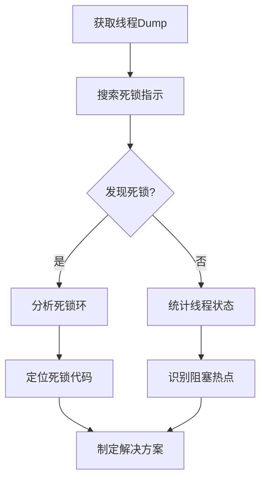

# JVM线程Dump分析死锁与阻塞（jstack）

## 1. 概述

线程Dump是JVM中所有线程活动状态的快照，它记录了每个线程的执行堆栈信息，是诊断Java应用程序性能问题、死锁和阻塞问题的关键工具。jstack是JDK自带的主要线程分析工具。

### 1.1 什么是线程Dump
- JVM中所有线程的瞬时状态记录
- 包含线程的调用堆栈、锁状态和线程状态
- 用于分析线程挂起、死锁、资源竞争等问题

### 1.2 jstack工具简介
```bash
# 基本语法
jstack [options] <pid>
jstack [options] <executable> <core>
jstack [options] [server_id@]<remote server IP or hostname>

# 常用选项
-l: 长列表，显示附加信息（如锁信息）
-F: 强制Dump，当jstack无响应时使用
-m: 混合模式，同时显示Java和本地堆栈
```

## 2. 获取线程Dump

### 2.1 命令行获取
```bash
# 1. 查找Java进程ID
jps -l

# 2. 生成线程Dump到文件
jstack -l <pid> > thread_dump.txt

# 3. 多次Dump用于分析变化
jstack -l <pid> > thread_dump_1.txt
sleep 10
jstack -l <pid> > thread_dump_2.txt
```

### 2.2 编程方式获取
```java
// 通过JMX获取线程Dump
import java.lang.management.ManagementFactory;
import java.lang.management.ThreadMXBean;
import java.lang.management.ThreadInfo;

public class ThreadDumpGenerator {
    public static String generateThreadDump() {
        StringBuilder dump = new StringBuilder();
        ThreadMXBean threadMXBean = ManagementFactory.getThreadMXBean();
        ThreadInfo[] threadInfos = threadMXBean.dumpAllThreads(true, true);
        
        for (ThreadInfo threadInfo : threadInfos) {
            dump.append(threadInfo.toString());
        }
        return dump.toString();
    }
}
```

### 2.3 在应用异常时自动Dump
```bash
# 添加JVM参数
-XX:+UnlockDiagnosticVMOptions 
-XX:+LogVMOutput 
-XX:LogFile=/path/to/jvm.log
-XX:+HeapDumpOnOutOfMemoryError
-XX:HeapDumpPath=/path/to/dumps
```

## 3. 线程状态解析

### 3.1 主要线程状态
```
RUNNABLE:     正在执行或准备执行
BLOCKED:      等待获取监视器锁（synchronized）
WAITING:      无限期等待（Object.wait()，LockSupport.park()）
TIMED_WAITING: 有限期等待（Thread.sleep()，Object.wait(timeout)）
TERMINATED:   线程已终止
```

### 3.2 状态转换示例
```
Thread1: synchronized(objA) {
    synchronized(objB) { ... }
}

Thread2: synchronized(objB) {
    synchronized(objA) { ... }
}

# 可能导致死锁的状态
"Thread-1" #12 prio=5 BLOCKED
  - waiting to lock <0x000000076b4a8c38> (objA)
  - locked <0x000000076b4a8c40> (objB)
```

## 4. 死锁检测与分析

### 4.1 死锁特征识别
```bash
# jstack输出中的死锁指示
Found one Java-level deadlock:
=============================

"Thread-1":
  waiting to lock monitor 0x00007f3f98006600 (object 0x000000076b4a8c38, a java.lang.Object),
  which is held by "Thread-2"

"Thread-2":
  waiting to lock monitor 0x00007f3f98006400 (object 0x000000076b4a8c40, a java.lang.Object),
  which is held by "Thread-1"
```

### 4.2 常见死锁模式

#### 4.2.1 顺序死锁
```java
// 线程1
synchronized(resourceA) {
    synchronized(resourceB) { ... }
}

// 线程2  
synchronized(resourceB) {
    synchronized(resourceA) { ... }
}
```

#### 4.2.2 动态死锁
```java
// 转账场景的死锁
public void transfer(Account from, Account to, int amount) {
    synchronized(from) {
        synchronized(to) {
            // 转账操作
        }
    }
}
// 线程1: transfer(accountA, accountB, 100)
// 线程2: transfer(accountB, accountA, 200)
```

### 4.3 死锁分析步骤
1. **识别死锁线程**: 查找"Found one Java-level deadlock"
2. **分析锁依赖**: 查看"waiting to lock"和"locked"信息
3. **追踪调用路径**: 分析线程堆栈，找出加锁位置
4. **定位代码位置**: 找到具体的类和方法

## 5. 阻塞问题分析

### 5.1 I/O阻塞
```
"http-nio-8080-exec-1" #31 daemon prio=5 RUNNABLE
  at java.net.SocketInputStream.socketRead0(Native Method)
  at java.net.SocketInputStream.socketRead(SocketInputStream.java:116)
  at java.net.SocketInputStream.read(SocketInputStream.java:171)
  - 等待网络I/O响应
```

### 5.2 同步阻塞
```
"WorkerThread-2" #22 prio=5 BLOCKED
  - waiting to lock <0x000000076bf8f0c0> 
  at com.example.Service.process(Service.java:42)
  - 等待获取synchronized锁
```

### 5.3 等待资源
```
"Timer-0" #18 daemon prio=5 TIMED_WAITING
  at java.lang.Thread.sleep(Native Method)
  at com.example.ScheduledTask.run(ScheduledTask.java:56)
  - 定时任务等待中
```

## 6. 高级分析技巧

### 6.1 使用脚本分析
```bash
#!/bin/bash
# 分析线程Dump中的锁竞争
grep -A 5 "BLOCKED" thread_dump.txt | 
grep -o "locked.*" | 
sort | uniq -c | sort -rn

# 统计各种状态的线程数量
cat thread_dump.txt | grep "java.lang.Thread.State" | 
awk '{print $2}' | sort | uniq -c
```

### 6.2 可视化分析工具
- **fastthread.io**: 在线线程Dump分析
- **IBM Thread and Monitor Dump Analyzer**: 本地分析工具
- **VisualVM**: JDK自带的可视化工具

### 6.3 性能问题模式识别

#### 6.3.1 CPU密集型线程
```
"CPU-Thread" #33 prio=5 RUNNABLE
  at com.example.Calculator.compute(Calculator.java:123)
  - 长期处于RUNNABLE状态，无I/O等待
```

#### 6.3.2 等待数据库连接
```
"DB-Worker-1" #41 prio=5 WAITING
  at java.lang.Object.wait(Native Method)
  - waiting on <0x000000076c15b4e8> (a com.zaxxer.hikari.pool.HikariPool)
  - 连接池耗尽
```

## 7. 最佳实践

### 7.1 数据收集策略
1. **定时收集**: 在高负载时段定期收集Dump
2. **对比分析**: 收集正常和异常时的Dump进行对比
3. **多次采样**: 对于间歇性问题，多次采样分析趋势

### 7.2 分析流程


### 7.3 预防措施
1. **锁顺序**: 统一获取锁的顺序
2. **超时机制**: 使用tryLock(timeout)避免无限等待
3. **资源隔离**: 不同业务使用不同的连接池
4. **监控告警**: 监控线程数、锁等待时间等指标

## 8. 实际案例分析

### 8.1 案例一：数据库连接池死锁
**现象**: 应用响应变慢，线程数持续增长
**分析**: 
- 发现大量线程WAITING在连接池
- 连接池配置过小，业务线程等待连接
- 持有连接的线程执行慢，导致连锁反应

**解决方案**:
1. 调整连接池大小
2. 优化慢查询
3. 添加获取连接超时

### 8.2 案例二：缓存服务阻塞
**现象**: 高峰期服务超时
**分析**:
- 线程Dump显示大量线程BLOCKED在缓存锁
- 缓存穿透导致大量请求直接访问数据库
- 缓存更新使用大范围锁

**解决方案**:
1. 实现缓存预热
2. 使用分段锁优化缓存更新
3. 添加熔断机制

## 9. 工具扩展

### 9.1 arthas线程分析
```bash
# 使用arthas分析线程
thread -n 3      # 查看最忙的3个线程
thread -b        # 查看阻塞线程
thread -i 1000   # 统计线程CPU时间
```

### 9.2 自动化监控脚本
```python
#!/usr/bin/env python3
import subprocess
import time
import os

def monitor_threads(pid, interval=60, count=10):
    for i in range(count):
        timestamp = time.strftime("%Y%m%d_%H%M%S")
        filename = f"thread_dump_{pid}_{timestamp}.txt"
        
        with open(filename, 'w') as f:
            subprocess.run(['jstack', '-l', str(pid)], stdout=f)
        
        print(f"Generated {filename}")
        time.sleep(interval)

if __name__ == "__main__":
    monitor_threads(12345)  # 替换为实际PID
```

## 10. 总结

线程Dump分析是Java性能调优的重要技能。掌握jstack工具的使用和线程状态的分析方法，能够快速定位死锁、阻塞等并发问题。实践中需要：

1. **熟练掌握工具**: jstack、arthas等工具的基本使用
2. **建立分析流程**: 从现象到原因的系统分析方法
3. **积累经验模式**: 识别常见的死锁和阻塞模式
4. **结合监控数据**: 将线程分析与指标监控相结合
5. **预防为主**: 通过代码审查和设计避免常见问题

通过系统的线程分析，可以显著提高Java应用的稳定性和性能表现。