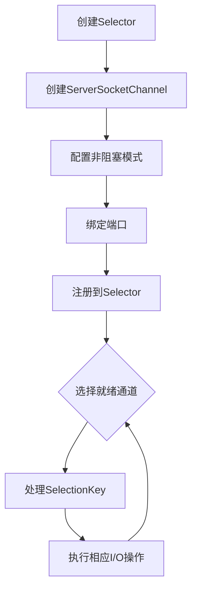

# Java NIO Selector 多路复用技术文档

## 1. 概述

### 1.1 什么是Selector
Selector（选择器）是Java NIO（New I/O）中实现多路复用的核心组件，它允许单个线程监控多个通道（Channel）的I/O事件，从而有效地管理大量并发连接。

### 1.2 与传统I/O模型的对比
| 特性 | 传统阻塞I/O | NIO Selector多路复用 |
|------|------------|---------------------|
| 线程模型 | 一个连接一个线程 | 单个线程处理多个连接 |
| 资源消耗 | 高内存和高线程开销 | 低资源消耗 |
| 可扩展性 | 连接数受线程数限制 | 支持数万并发连接 |
| 响应性 | 阻塞操作影响性能 | 非阻塞，高响应性 |

## 2. 核心组件

### 2.1 Selector
选择器对象，用于监控多个通道的事件。

### 2.2 SelectableChannel
可被选择器监控的通道，包括：
- **SocketChannel**：TCP客户端通道
- **ServerSocketChannel**：TCP服务器端通道
- **DatagramChannel**：UDP通道

### 2.3 SelectionKey
表示通道在选择器中的注册关系，包含：
- 通道（Channel）
- 选择器（Selector）
- 兴趣事件集合（Interest Set）
- 就绪事件集合（Ready Set）
- 附加对象（Attachment）

## 3. 事件类型

| 事件常量 | 值 | 描述 |
|---------|----|------|
| OP_READ | 1 | 读就绪事件 |
| OP_WRITE | 4 | 写就绪事件 |
| OP_CONNECT | 8 | 连接就绪事件 |
| OP_ACCEPT | 16 | 接受连接事件 |

## 4. 工作流程

### 4.1 基本工作流程


### 4.2 详细步骤

#### 步骤1：创建Selector
```java
Selector selector = Selector.open();
```

#### 步骤2：创建并配置通道
```java
ServerSocketChannel serverChannel = ServerSocketChannel.open();
serverChannel.configureBlocking(false); // 必须为非阻塞模式
serverChannel.socket().bind(new InetSocketAddress(port));
```

#### 步骤3：注册通道到Selector
```java
serverChannel.register(selector, SelectionKey.OP_ACCEPT);
```

#### 步骤4：选择就绪通道
```java
while (true) {
    int readyChannels = selector.select(); // 阻塞直到有事件
    // 或 selector.select(1000); // 超时1秒
    // 或 selector.selectNow(); // 非阻塞
    
    if (readyChannels == 0) continue;
    
    Set<SelectionKey> selectedKeys = selector.selectedKeys();
    Iterator<SelectionKey> keyIterator = selectedKeys.iterator();
    
    while (keyIterator.hasNext()) {
        SelectionKey key = keyIterator.next();
        
        if (key.isAcceptable()) {
            // 处理接受连接
        } else if (key.isConnectable()) {
            // 处理连接完成
        } else if (key.isReadable()) {
            // 处理读事件
        } else if (key.isWritable()) {
            // 处理写事件
        }
        
        keyIterator.remove(); // 必须手动移除
    }
}
```

## 5. 完整示例代码

### 5.1 NIO Echo服务器示例
```java
import java.io.IOException;
import java.net.InetSocketAddress;
import java.nio.ByteBuffer;
import java.nio.channels.*;
import java.util.Iterator;
import java.util.Set;

public class NioEchoServer {
    private static final int BUFFER_SIZE = 1024;
    private static final int PORT = 8888;

    public static void main(String[] args) throws IOException {
        // 创建Selector
        Selector selector = Selector.open();
        
        // 创建ServerSocketChannel
        ServerSocketChannel serverSocketChannel = ServerSocketChannel.open();
        serverSocketChannel.configureBlocking(false);
        serverSocketChannel.bind(new InetSocketAddress(PORT));
        
        // 注册到Selector，关注ACCEPT事件
        serverSocketChannel.register(selector, SelectionKey.OP_ACCEPT);
        
        System.out.println("Echo服务器启动，监听端口: " + PORT);
        
        while (true) {
            // 等待事件发生
            selector.select();
            
            Set<SelectionKey> selectedKeys = selector.selectedKeys();
            Iterator<SelectionKey> iterator = selectedKeys.iterator();
            
            while (iterator.hasNext()) {
                SelectionKey key = iterator.next();
                iterator.remove();
                
                try {
                    if (key.isAcceptable()) {
                        handleAccept(key, selector);
                    } else if (key.isReadable()) {
                        handleRead(key);
                    } else if (key.isWritable()) {
                        handleWrite(key);
                    }
                } catch (IOException e) {
                    key.cancel();
                    try {
                        key.channel().close();
                    } catch (IOException ex) {
                        // 忽略关闭异常
                    }
                }
            }
        }
    }
    
    private static void handleAccept(SelectionKey key, Selector selector) 
            throws IOException {
        ServerSocketChannel serverChannel = (ServerSocketChannel) key.channel();
        SocketChannel clientChannel = serverChannel.accept();
        clientChannel.configureBlocking(false);
        
        // 注册读事件，并附加Buffer
        clientChannel.register(selector, SelectionKey.OP_READ, 
            ByteBuffer.allocate(BUFFER_SIZE));
        
        System.out.println("客户端连接: " + 
            clientChannel.getRemoteAddress());
    }
    
    private static void handleRead(SelectionKey key) throws IOException {
        SocketChannel channel = (SocketChannel) key.channel();
        ByteBuffer buffer = (ByteBuffer) key.attachment();
        
        buffer.clear();
        int bytesRead = channel.read(buffer);
        
        if (bytesRead == -1) {
            // 客户端关闭连接
            channel.close();
            System.out.println("客户端断开连接");
            return;
        }
        
        // 切换为读模式，准备回写
        buffer.flip();
        
        // 注册写事件，准备回显数据
        key.interestOps(SelectionKey.OP_WRITE);
    }
    
    private static void handleWrite(SelectionKey key) throws IOException {
        SocketChannel channel = (SocketChannel) key.channel();
        ByteBuffer buffer = (ByteBuffer) key.attachment();
        
        // 将接收到的数据回写给客户端
        while (buffer.hasRemaining()) {
            channel.write(buffer);
        }
        
        // 重新注册读事件，等待下一次读取
        buffer.clear();
        key.interestOps(SelectionKey.OP_READ);
    }
}
```

### 5.2 NIO客户端示例
```java
import java.io.IOException;
import java.net.InetSocketAddress;
import java.nio.ByteBuffer;
import java.nio.channels.SocketChannel;

public class NioEchoClient {
    public static void main(String[] args) throws IOException {
        SocketChannel socketChannel = SocketChannel.open();
        socketChannel.configureBlocking(false);
        
        // 异步连接
        socketChannel.connect(new InetSocketAddress("localhost", 8888));
        
        // 等待连接完成
        while (!socketChannel.finishConnect()) {
            // 可以在这里做其他事情
            System.out.println("正在连接服务器...");
        }
        
        String message = "Hello, NIO Server!";
        ByteBuffer writeBuffer = ByteBuffer.wrap(message.getBytes());
        
        // 发送数据
        while (writeBuffer.hasRemaining()) {
            socketChannel.write(writeBuffer);
        }
        
        // 读取响应
        ByteBuffer readBuffer = ByteBuffer.allocate(1024);
        int bytesRead = socketChannel.read(readBuffer);
        
        if (bytesRead > 0) {
            readBuffer.flip();
            byte[] data = new byte[readBuffer.remaining()];
            readBuffer.get(data);
            System.out.println("收到服务器响应: " + new String(data));
        }
        
        socketChannel.close();
    }
}
```

## 6. 性能优化建议

### 6.1 选择策略优化
```java
// 1. 阻塞选择（默认）
selector.select();

// 2. 带超时的选择
selector.select(1000); // 超时1秒

// 3. 非阻塞选择
selector.selectNow();

// 4. 唤醒选择器
selector.wakeup();
```

### 6.2 缓冲区管理
```java
// 使用直接缓冲区提高性能（但创建成本高）
ByteBuffer directBuffer = ByteBuffer.allocateDirect(1024);

// 使用缓冲区池减少内存分配开销
class BufferPool {
    private final Queue<ByteBuffer> pool = new ConcurrentLinkedQueue<>();
    
    public ByteBuffer getBuffer(int size) {
        ByteBuffer buffer = pool.poll();
        if (buffer == null || buffer.capacity() < size) {
            return ByteBuffer.allocate(size);
        }
        buffer.clear();
        return buffer;
    }
    
    public void returnBuffer(ByteBuffer buffer) {
        pool.offer(buffer);
    }
}
```

### 6.3 线程模型设计
```java
// Reactor模式实现
public class Reactor implements Runnable {
    final Selector selector;
    final ServerSocketChannel serverSocket;
    
    public Reactor(int port) throws IOException {
        selector = Selector.open();
        serverSocket = ServerSocketChannel.open();
        serverSocket.socket().bind(new InetSocketAddress(port));
        serverSocket.configureBlocking(false);
        SelectionKey sk = serverSocket.register(selector, 
            SelectionKey.OP_ACCEPT);
        sk.attach(new Acceptor());
    }
    
    @Override
    public void run() {
        try {
            while (!Thread.interrupted()) {
                selector.select();
                Set<SelectionKey> selected = selector.selectedKeys();
                Iterator<SelectionKey> it = selected.iterator();
                while (it.hasNext()) {
                    dispatch(it.next());
                }
                selected.clear();
            }
        } catch (IOException ex) {
            ex.printStackTrace();
        }
    }
    
    void dispatch(SelectionKey k) {
        Runnable r = (Runnable) k.attachment();
        if (r != null) {
            r.run();
        }
    }
    
    class Acceptor implements Runnable {
        @Override
        public void run() {
            try {
                SocketChannel c = serverSocket.accept();
                if (c != null) {
                    new Handler(selector, c);
                }
            } catch (IOException ex) {
                ex.printStackTrace();
            }
        }
    }
}
```

## 7. 常见问题与解决方案

### 7.1 空轮询问题
**问题**：在某些操作系统上，select()可能立即返回，导致100% CPU使用率。

**解决方案**：
```java
// 1. 记录空轮询次数
int emptySelectCount = 0;
while (true) {
    int readyChannels = selector.select(500);
    if (readyChannels == 0) {
        emptySelectCount++;
        if (emptySelectCount > 10) {
            // 重建Selector
            rebuildSelector();
            emptySelectCount = 0;
        }
    } else {
        emptySelectCount = 0;
        // 处理事件
    }
}

// 2. 使用Netty的优化Selector
// Netty提供了修复此问题的NioEventLoop
```

### 7.2 事件丢失问题
**问题**：在处理事件时，如果未及时处理，可能导致事件丢失。

**解决方案**：
```java
// 确保在处理完事件后重新设置感兴趣的事件
key.interestOps(key.interestOps() | SelectionKey.OP_READ);
```

### 7.3 资源泄漏
**问题**：未正确关闭通道和选择器。

**解决方案**：
```java
// 使用try-with-resources确保资源释放
try (Selector selector = Selector.open();
     ServerSocketChannel serverChannel = ServerSocketChannel.open()) {
    // 使用资源
} catch (IOException e) {
    e.printStackTrace();
}

// 或在finally块中关闭
finally {
    if (selector != null) {
        try {
            selector.close();
        } catch (IOException e) {
            // 记录日志
        }
    }
}
```

## 8. 监控与调试

### 8.1 监控指标
```java
// 监控Selector状态
public class SelectorMonitor {
    public static void printSelectorInfo(Selector selector) {
        System.out.println("Selector信息:");
        System.out.println("是否开启: " + selector.isOpen());
        System.out.println("已注册通道数: " + selector.keys().size());
        System.out.println("就绪通道数: " + selector.selectedKeys().size());
        
        // 统计各事件类型
        int acceptCount = 0, connectCount = 0, readCount = 0, writeCount = 0;
        for (SelectionKey key : selector.selectedKeys()) {
            if (key.isAcceptable()) acceptCount++;
            if (key.isConnectable()) connectCount++;
            if (key.isReadable()) readCount++;
            if (key.isWritable()) writeCount++;
        }
        
        System.out.println("ACCEPT事件: " + acceptCount);
        System.out.println("CONNECT事件: " + connectCount);
        System.out.println("READ事件: " + readCount);
        System.out.println("WRITE事件: " + writeCount);
    }
}
```

### 8.2 性能测试
```java
// 简单的压力测试框架
public class SelectorBenchmark {
    private static final int CLIENT_COUNT = 10000;
    private static final int MESSAGE_COUNT = 100;
    
    public void testThroughput() throws Exception {
        // 启动服务器
        NioEchoServer server = new NioEchoServer();
        Thread serverThread = new Thread(() -> {
            try {
                server.start();
            } catch (IOException e) {
                e.printStackTrace();
            }
        });
        serverThread.start();
        
        // 等待服务器启动
        Thread.sleep(1000);
        
        // 创建客户端线程池
        ExecutorService executor = Executors.newFixedThreadPool(100);
        CountDownLatch latch = new CountDownLatch(CLIENT_COUNT);
        
        long startTime = System.currentTimeMillis();
        
        for (int i = 0; i < CLIENT_COUNT; i++) {
            executor.submit(() -> {
                try {
                    NioEchoClient client = new NioEchoClient();
                    for (int j = 0; j < MESSAGE_COUNT; j++) {
                        client.sendMessage("Test Message");
                    }
                } catch (Exception e) {
                    e.printStackTrace();
                } finally {
                    latch.countDown();
                }
            });
        }
        
        latch.await();
        long endTime = System.currentTimeMillis();
        
        System.out.println("总耗时: " + (endTime - startTime) + "ms");
        System.out.println("QPS: " + 
            (CLIENT_COUNT * MESSAGE_COUNT * 1000L / (endTime - startTime)));
        
        executor.shutdown();
        server.stop();
    }
}
```

## 9. 最佳实践总结

1. **合理设置缓冲区大小**：根据网络MTU（通常是1500字节）和应用需求设置缓冲区
2. **使用直接缓冲区**：对于大文件传输，使用DirectBuffer减少内存拷贝
3. **及时清理SelectionKey**：每次迭代后必须调用`iterator.remove()`
4. **合理配置兴趣事件**：避免频繁修改兴趣事件集合
5. **优雅关闭**：确保所有通道和选择器正确关闭
6. **异常处理**：妥善处理IOException，避免资源泄漏
7. **监控日志**：记录Selector状态，便于问题排查
8. **考虑使用成熟框架**：对于生产环境，考虑使用Netty等成熟框架

## 10. 相关工具和框架

### 10.1 监控工具
- **VisualVM**：JVM监控和分析
- **JConsole**：Java监控和管理控制台
- **Netty的监控组件**：提供详细的网络指标

### 10.2 相关框架
- **Netty**：基于NIO的高级网络应用框架
- **Mina**：Apache的NIO框架
- **Grizzly**：GlassFish的NIO框架

---

**文档版本**：1.0  
**最后更新**：2024年1月  
**适用版本**：JDK 1.4+  
**作者**：Java NIO技术文档团队  

*注意：本文档为技术参考文档，实际应用中请根据具体业务需求进行调整和优化。*