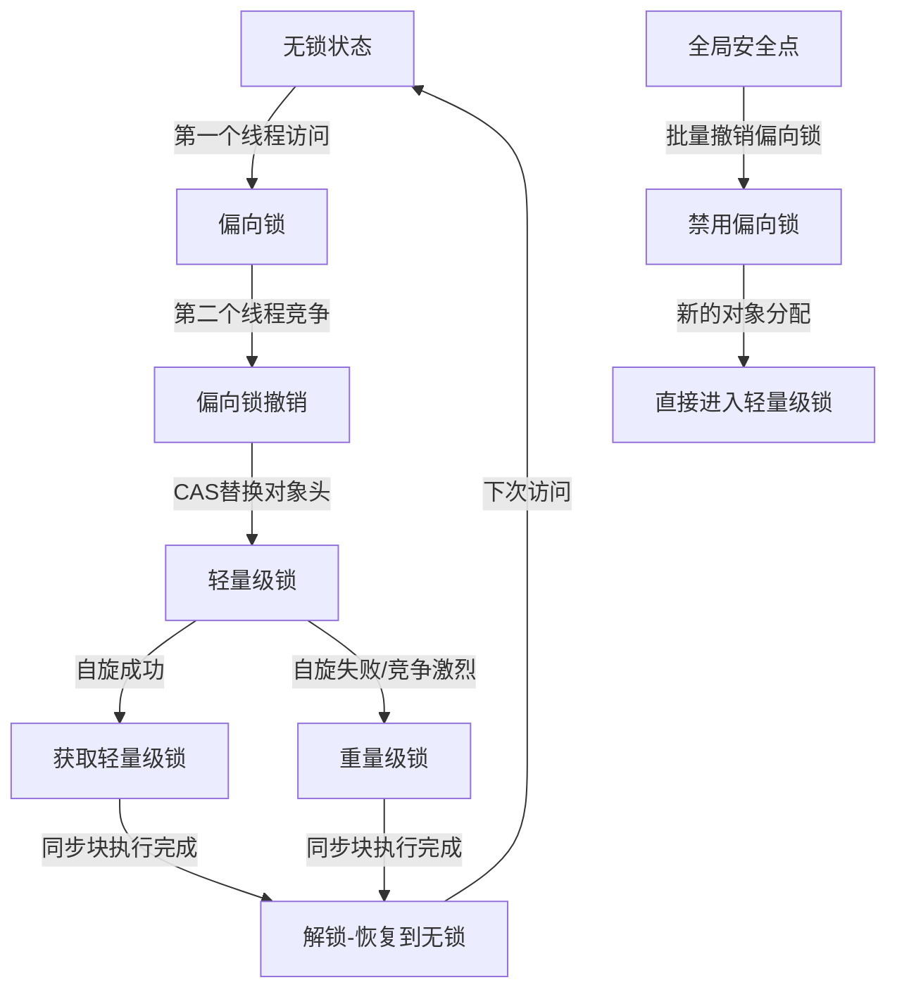

# Java锁升级机制技术文档：从偏向锁到重量级锁

## 1. 概述

Java中的synchronized关键字在早期版本中直接对应重量级锁，性能开销较大。自Java 6开始，为了减少获取锁和释放锁带来的性能消耗，引入了**锁升级机制**，根据竞争情况动态调整锁状态，实现了从无锁到偏向锁、轻量级锁再到重量级锁的平滑过渡。

## 2. 锁状态总览

Java对象头中的Mark Word存储了锁状态信息，包含以下状态：

| 锁状态 | 存储内容 | 标志位 |
|--------|----------|--------|
| 无锁 | 对象哈希码、分代年龄 | 01 |
| 偏向锁 | 线程ID、Epoch、分代年龄 | 01 |
| 轻量级锁 | 指向栈中锁记录的指针 | 00 |
| 重量级锁 | 指向互斥量（monitor）的指针 | 10 |
| GC标记 | 空（用于GC标记） | 11 |

## 3. 偏向锁 (Biased Locking)

### 3.1 设计目标
减少同一线程重复获取锁的开销，适用于**只有一个线程访问同步块**的场景。

### 3.2 工作原理
1. **初始化**：当对象第一次被线程获取时，JVM将对象头中的标志位设为"01"，同时使用CAS操作将线程ID写入对象头
2. **重入检查**：同一线程再次进入同步块时，只需检查对象头中的线程ID是否指向自己
3. **无竞争开销**：无需任何同步操作，性能接近无锁

### 3.3 关键数据结构
```java
// 简化表示的对象头结构
Object Header {
    Mark Word {
        // 偏向锁状态下的结构
        ThreadId: 54 bits,    // 持有偏向锁的线程ID
        Epoch: 2 bits,        // 偏向时间戳
        Age: 4 bits,          // 对象分代年龄
        BiasedLockFlag: 1 bit,// 偏向锁标志
        LockFlag: 2 bits      // 锁状态标志位
    }
}
```

## 4. 轻量级锁 (Lightweight Locking)

### 4.1 触发条件
当有另一个线程尝试获取已被偏向的锁时，偏向模式撤销，升级为轻量级锁。

### 4.2 实现机制
1. **锁记录创建**：线程在当前栈帧中创建Lock Record空间
2. **CAS操作**：将对象头中的Mark Word复制到Lock Record中（Displaced Mark Word）
3. **指针更新**：通过CAS将对象头的Mark Word更新为指向Lock Record的指针
4. **竞争处理**：如果CAS失败，进入**自旋锁**状态，尝试有限次数的自旋等待

### 4.3 自旋锁优化
- 适应性自旋：根据之前自旋的成功率动态调整自旋次数
- 自旋上限控制：防止过度消耗CPU（JDK 6后默认开启适应性自旋）

## 5. 重量级锁 (Heavyweight Locking)

### 5.1 升级条件
当轻量级锁竞争激烈（自旋失败）或等待时间过长时，锁升级为重量级锁。

### 5.2 底层实现
1. **Monitor对象**：每个Java对象都与一个ObjectMonitor对象关联
2. **操作系统互斥量**：底层依赖于操作系统的mutex和condition variable
3. **等待队列**：实现复杂的线程等待/通知机制

### 5.3 性能影响
- **优点**：解决激烈竞争场景下的公平性问题
- **缺点**：涉及用户态到内核态的切换，性能开销大

## 6. 锁升级完整流程



### 6.1 详细升级路径
1. **初始状态**：对象创建后处于无锁状态
2. **偏向锁启用**：第一个线程访问同步块，启用偏向模式
3. **偏向锁撤销**：
   - 第二个线程尝试获取锁
   - 暂停持有偏向锁的线程（到达安全点）
   - 检查原线程是否存活或仍在同步块中
4. **轻量级锁竞争**：
   - 各线程在各自栈帧中创建Lock Record
   - 通过CAS竞争指向对象头的指针
5. **重量级锁转换**：
   - 自旋达到阈值（默认10次）
   - 向操作系统申请互斥量
   - 未获取锁的线程进入阻塞队列

## 7. 锁降级机制

### 7.1 基本概念
锁降级指重量级锁降级为轻量级锁或偏向锁，但Java中**锁降级极少发生**，主要因为：
- 重量级锁的竞争状态通常持续存在
- 降级带来的收益小于开销

### 7.2 特殊情况
在GC的STW阶段，JVM可能会执行锁降级，以避免在GC过程中持有重量级锁。

## 8. 相关JVM参数

| 参数 | 默认值 | 说明 |
|------|--------|------|
| `-XX:+UseBiasedLocking` | JDK 15前true | 是否启用偏向锁 |
| `-XX:BiasedLockingStartupDelay` | 4000ms | 偏向锁启动延迟 |
| `-XX:+UseSpinning` | true | 启用自旋锁 |
| `-XX:PreBlockSpin` | 10 | 自旋次数阈值 |
| `-XX:+UseHeavyMonitors` | false | 是否直接使用重量级锁 |

## 9. 最佳实践与注意事项

### 9.1 适用场景分析
- **偏向锁**：单线程重复访问的场景
- **轻量级锁**：低竞争、同步块执行快的场景
- **重量级锁**：高并发、长时间持有的场景

### 9.2 性能调优建议
1. **避免过度同步**：减小同步块范围
2. **减少锁竞争**：使用读写锁、分段锁等替代方案
3. **监控锁状态**：使用JVM工具分析锁竞争情况
4. **谨慎使用偏向锁**：在明确单线程访问的场景下启用

### 9.3 JDK 15+的变化
自JDK 15起，偏向锁默认被禁用且逐步废弃，主要因为：
1. 维护偏向锁的开销增加
2. 现代应用通常存在多线程竞争
3. 偏向锁的撤销成本较高

## 10. 监控与诊断

### 10.1 常用工具
- **JConsole/VisualVM**：查看线程阻塞情况
- **JStack**：分析线程栈和锁状态
- **Java Mission Control**：详细的锁分析

### 10.2 关键指标
```java
// 通过JMX监控锁信息
import java.lang.management.*;
import java.util.concurrent.locks.*;

ThreadMXBean threadBean = ManagementFactory.getThreadMXBean();
long[] threadIds = threadBean.findDeadlockedThreads();

// 监控锁竞争情况
synchronized(lockObject) {
    // 同步代码块
    // 竞争激烈时会触发锁升级
}
```

## 11. 总结

Java锁升级机制是一个精妙的性能优化设计：
1. **分层设计**：根据竞争强度提供不同粒度的锁实现
2. **平滑过渡**：减少线程状态切换的开销
3. **自适应调整**：根据运行时情况动态选择最佳锁策略

理解这一机制对于编写高性能并发程序、诊断锁竞争问题具有重要意义。随着JDK版本演进，锁优化策略也在不断调整，开发者应关注最新的JVM特性和最佳实践。

---

**文档版本**：1.0  
**适用JDK版本**：JDK 6+  
**最后更新**：2024年