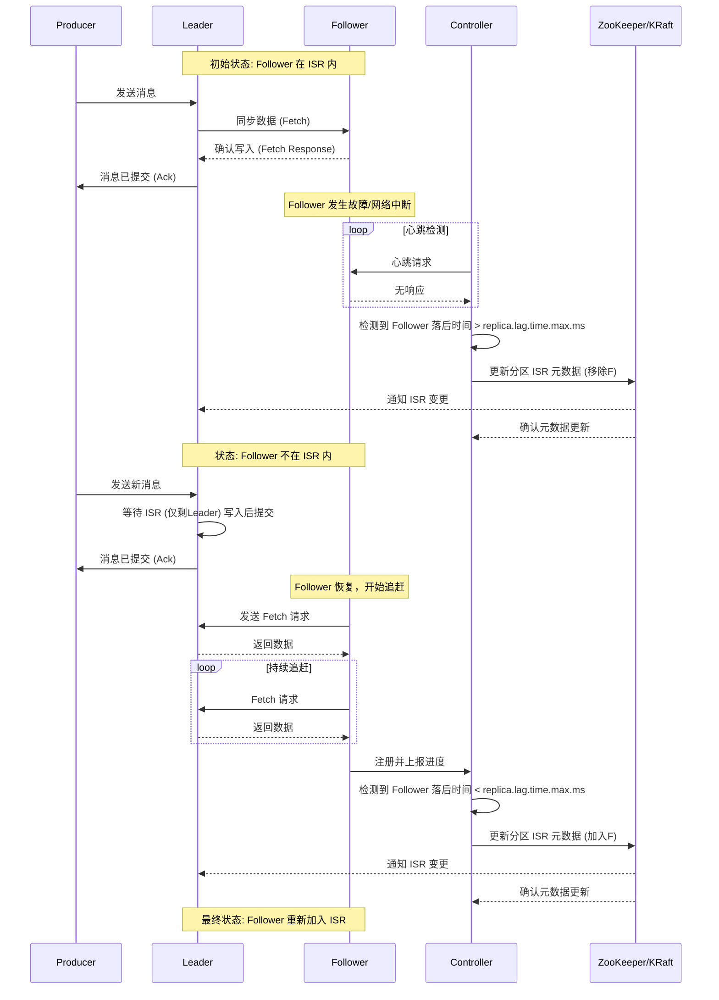

好的，遵照您的要求，为您生成一份关于 Kafka ISR 动态进出机制的技术文档。

---

# **Kafka ISR (In-Sync Replicas) 动态进出机制技术文档**

## **文档修订记录**

| 版本 | 日期 | 作者 | 修订说明 |
| :--- | :--- | :--- | :--- |
| V1.0 | 2023-10-27 | 文档工程师 | 初始版本创建 |
| V1.1 | 2024-05-17 | 文档工程师 | 优化流程图，补充常见问题解答 |

---

## **1. 概述与核心目标**

Kafka 采用分布式、多副本的架构来保证数据的**高可用性**和**持久性**。每个主题分区都有多个副本，这些副本分散在不同的 Broker 上。然而，在保证数据一致性和可用性之间需要精细的平衡。

**ISR 机制的核心目标**正是在此：
*   **一致性保障**：确保在容忍一定故障的前提下，客户端写入和读取的数据是一致的。
*   **高可用性与性能**：避免因单个副本短暂落后或故障，导致整个分区不可用，从而在保证数据安全的同时维持良好的写入吞吐量。
*   **动态自愈**：允许副本在故障恢复或网络延迟降低后，能够自动重新加入同步集合，使系统具备弹性。

## **2. ISR 核心概念解析**

### **2.1 ISR 定义**
**ISR (In-Sync Replicas)**，即“同步副本集”，是指一个分区所有副本的子集。ISR 中的副本需要满足一个关键条件：**与分区的 Leader 副本保持“足够同步”的状态**。

### **2.2 角色划分**
*   **Leader 副本**：每个分区有且仅有一个 Leader，负责处理该分区所有的客户端读写请求。
*   **Follower 副本**：分区的其他副本，其唯一任务就是从 Leader 副本异步地拉取数据，保持与 Leader 的数据同步。Follower 不直接服务客户端请求。
*   **ISR 成员**：Leader 本身 + 所有“同步中”的 Follower。

### **2.3 核心数据同步流程**
1.  生产者将消息发送给分区的 Leader。
2.  Leader 将消息写入其本地日志。
3.  ISR 中的所有 Follower 向 Leader 发起拉取请求，获取新消息并写入各自本地日志。
4.  一旦 **ISR 中的所有副本** 都成功写入该消息，Leader 才会认为这条消息已 **提交（Committed）**。
5.  生产者会收到消息已提交的确认（取决于 `acks` 配置，`acks=all` 时需等待此步骤）。

**关键点**：只有已提交的消息才对消费者可见。这是 Kafka 提供数据一致性的基石。

## **3. ISR 动态进出机制详解**

ISR 不是静态的，它会根据 Follower 副本的健康状况和同步进度**动态变化**。

### **3.1 进入 ISR 的条件**
一个 Follower 副本从非 ISR 状态 **加入** ISR，需满足以下条件：
1.  **副本进程存活**：与 ZooKeeper/KRaft 控制器保持会话心跳。
2.  **追赶上 Leader 的末端偏移量**：这是核心条件。具体指 Follower 的 **高水位线（High Watermark, HW）** 与 Leader 的 HW 之间的差距，必须小于等于 `replica.lag.time.max.ms` 时间内能够追上的量。在最新版本中，主要通过 **落后时间** 来判断。
    *   Follower 会定期向 Leader 发送获取偏移量的请求。
    *   Leader 计算该 Follower 的 HW 与自身 HW 的差距，并转换为 **落后时间（Lag Time）**。
    *   如果该落后时间持续低于 `replica.lag.time.max.ms`（默认 30秒），则该 Follower 被认为是“同步的”，控制器会将其加入 ISR。

### **3.2 被移出 ISR 的条件**
一个 Follower 副本从 ISR 中被 **移除**，可能由于以下原因：
1.  **同步落后**（最常见）：Follower 的落后时间持续超过 `replica.lag.time.max.ms`。原因可能是：
    *   Follower 所在 Broker IO 性能瓶颈。
    *   网络延迟或波动。
    *   Follower 进程 GC 暂停时间过长。
2.  **副本故障**：Follower 进程崩溃、宕机或与集群失去网络连接（会话超时）。
3.  **主动关闭**：Broker 正常关闭时，其上所有副本会先被移出 ISR。

**控制器角色**：ISR 的变更由 **Kafka 控制器**（通过 ZooKeeper 或 KRaft 共识机制选举产生）负责决策和元数据更新。

### **3.3 状态转换流程**

以下时序图展示了一个 Follower 副本因故障被移出 ISR，恢复后又重新加入的典型流程：

## **4. 关键配置参数**

| 参数 | 默认值 | 作用 | 影响 |
| :--- | :--- | :--- | :--- |
| `replica.lag.time.max.ms` | 30000 (30s) | Follower 被判定为“不同步”前，允许落后 Leader 的最大时间。 | **调优核心**。值调小可提高一致性灵敏度，但可能因网络抖动导致副本频繁进出ISR；值调大可容忍更长延迟，但故障恢复时数据丢失风险窗口增大。 |
| `min.insync.replicas` | 1 | 生产者请求成功 (`acks=all`) 所必须的最小 ISR 数量。 | 定义写入可用性的底线。例如，分区副本数=3， 设置`min.insync.replicas=2`，则即使一个副本故障，写入仍可继续；如果 ISR 数量降至1，则写入会被阻塞。 |
| `unclean.leader.election.enable` | false | 是否允许从非 ISR 副本中选举新的 Leader。 | `false`（推荐）：保证数据一致性，但若所有 ISR 副本宕机，分区将不可用。`true`：提高可用性，但可能造成数据丢失（非 ISR 副本可能缺少最新数据）。 |

## **5. 影响与最佳实践**

### **5.1 对生产与消费的影响**
*   **写入可用性**：当 ISR 大小小于 `min.insync.replicas` 时，对于 `acks=all` 的写入请求会被阻塞，直到 ISR 恢复。
*   **数据持久性**：只有 ISR 中的副本才有资格被选举为新的 Leader。这确保了故障转移后，新 Leader 拥有所有已提交的数据。
*   **吞吐量与延迟**：ISR 大小影响写入延迟（需要等待的副本数）和系统整体吞吐量。

### **5.2 监控指标**
*   **`IsrShrinksPerSec` / `IsrExpandsPerSec`**：ISR 收缩（副本被移除）和扩张（副本被加入）的速率。频繁变动可能指示网络或磁盘问题。
*   **分区 ISR 数量**：通过 `kafka-topics --describe` 或 JMX 监控每个分区的 ISR 大小，应接近配置的副本因子数。
*   **副本落后消息数/时间**：监控各 Follower 与 Leader 的差距。

### **5.3 最佳实践建议**
1.  **合理设置副本因子**：生产环境通常设置为 `3`，以容忍一个 Broker 故障而不丢失数据。
2.  **配置 `min.insync.replicas`**：通常设置为 `副本因子 - 1`。对于 3 副本，设置为 `2`。这能在一致性、可用性和性能间取得良好平衡。
3.  **谨慎调整 `replica.lag.time.max.ms`**：默认 30s 适用于大多数场景。在跨数据中心部署或已知高延迟环境中，可适当调大。
4.  **保持 `unclean.leader.election.enable=false`**：除非可用性优先级绝对高于数据一致性，否则应禁用。
5.  **均衡分区分布**：避免所有分区的 Leader 或大量副本集中在少数几个 Broker 上，以防热点问题。

## **6. 扩展思考与故障排查**

### **6.1 ISR 与其他容错机制对比**
*   **与简单的主从复制对比**：ISR 提供了更细粒度的“同步”定义和动态调整能力。
*   **与 Quorum 机制对比**：Kafka 的 ISR 本质上是一种动态的 Quorum 机制，其法定人数（`min.insync.replicas`）是可配置的，且成员（ISR）是动态变化的。

### **6.2 常见问题场景**
*   **场景：ISR 频繁波动**
    *   **排查**：检查网络延迟和带宽、Broker 磁盘 I/O 负载、GC 日志。
    *   **行动**：可能需调大 `replica.lag.time.max.ms`，或解决底层基础设施问题。
*   **场景：生产者写入报错 `NOT_ENOUGH_REPLICAS`**
    *   **排查**：检查分区 ISR 数量是否小于 `min.insync.replicas`。
    *   **行动**：检查相关 Follower 副本状态，等待其恢复或进行 Broker 重启/替换。
*   **场景：分区无 Leader (`-1`)，导致不可用**
    *   **排查**：检查 ISR 是否为空（例如所有副本均落后被踢出）。
    *   **行动**：优先尝试恢复一个 ISR 副本（如重启），如果紧急且允许数据丢失，可考虑临时启用 `unclean.leader.election.enable`。

## **7. 附录**

### **7.1 相关源码解析（简略）**
ISR 管理逻辑主要位于：
*   **控制器模块** (`kafka.controller.KafkaController`): 维护分区状态机，处理副本失效和恢复事件，决定 ISR 变更。
*   **副本管理器** (`kafka.cluster.ReplicaManager`): 每个 Broker 上管理本地副本，跟踪本地副本的同步状态（如 LEO， HW），响应控制器的元数据更新。
*   **`ReplicaFetcherThread`**：Follower 端用于从 Leader 拉取数据的线程，其性能直接影响同步状态。

### **7.2 参考资料**
1.  [Apache Kafka 官方文档 - 设计](https://kafka.apache.org/documentation/#design)
2.  [KIP-392: Allow consumers to fetch from closest replica](https://cwiki.apache.org/confluence/display/KAFKA/KIP-392%3A+Allow+consumers+to+fetch+from+closest+replica) (涉及副本选择)
3.  Jun Rao, “Kafka: a Distributed Messaging System for Log Processing”, 2011.

---
**文档结束**