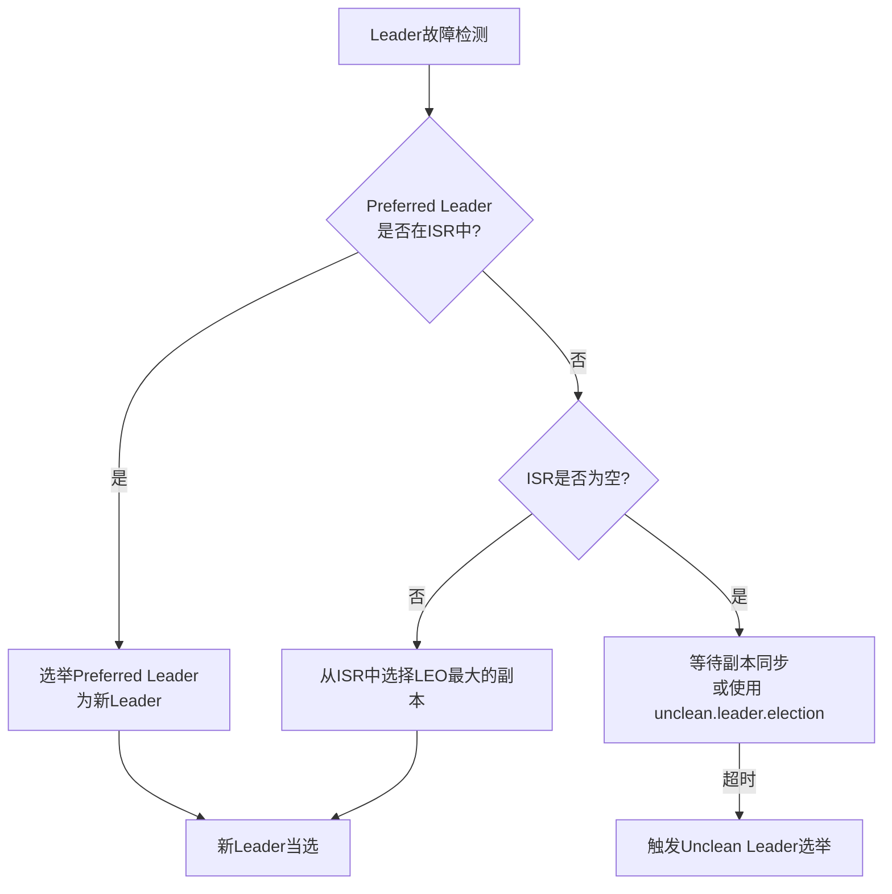

# Kafka Leader选举机制详解：基于ISR的优先副本选举

## 1. 概述

### 1.1 Kafka副本架构
Apache Kafka作为分布式消息系统，通过副本机制保证数据的高可用性和容错性。每个分区（Partition）有多个副本（Replica），这些副本分布在不同的Broker上，形成以下角色结构：

- **Leader副本**：负责处理该分区的所有读写请求
- **Follower副本**：从Leader异步复制数据，作为热备份
- **ISR（In-Sync Replica）**：与Leader保持同步的副本集合
- **AR（Assigned Replicas）**：分配给该分区的所有副本集合
- **OSR（Out-of-Sync Replica）**：落后于Leader的副本集合

### 1.2 Leader选举的重要性
Leader选举是Kafka实现高可用的核心机制，确保：
- 在Leader故障时快速恢复服务
- 保持数据一致性
- 实现负载均衡

## 2. ISR机制详解

### 2.1 ISR的维护条件
副本要保持在ISR中必须满足以下条件：

```properties
# 相关配置参数
replica.lag.time.max.ms=30000  # 副本最大滞后时间（默认30秒）
replica.lag.max.messages=4000   # 废弃参数（0.9.x后不再使用）

# 实际判断逻辑
1. 副本最后拉取消息的时间间隔 < replica.lag.time.max.ms
2. 副本的LEO（Log End Offset）与Leader的LEO差距在合理范围内
```

### 2.2 ISR的动态调整
```java
// ISR动态调整的伪代码逻辑
class ReplicaManager {
    void maybeShrinkIsr() {
        // 定期检查副本同步状态
        for (replica in replicas) {
            if (replica.lastCaughtUpTimeMs < currentTime - replica.lag.time.max.ms) {
                removeFromISR(replica);  // 从ISR移除
            }
        }
    }
    
    void maybeExpandIsr() {
        // 当落后副本追上时重新加入ISR
        for (replica in OSR) {
            if (replica.logEndOffset >= leader.logEndOffset - allowedLag) {
                addToISR(replica);
            }
        }
    }
}
```

## 3. Leader选举触发条件

### 3.1 自动触发场景
1. **Broker宕机或重启**
2. **Leader副本故障**
3. **分区重新平衡**
4. **ISR列表变更**

### 3.2 手动触发方式
```bash
# 使用kafka-topics.sh触发Leader选举
bin/kafka-topics.sh --bootstrap-server localhost:9092 \
    --topic test-topic \
    --partition 0 \
    --leader-election

# 优先副本选举（让Preferred Leader重新成为Leader）
bin/kafka-leader-election.sh --bootstrap-server localhost:9092 \
    --election-type PREFERRED \
    --all-topic-partitions
```

## 4. 优先副本选举机制

### 4.1 优先副本（Preferred Leader）概念
- **定义**：分区副本列表中第一个副本
- **设计目的**：实现初始负载均衡
- **选举优先级**：优先从ISR中选择Preferred Leader作为新Leader

### 4.2 选举算法流程
```
选举算法流程：
1. 检查当前Leader是否存活
   ↓
2. 获取分区当前的ISR列表
   ↓
3. 检查Preferred Leader是否在ISR中
   ↓
4. 如果Preferred Leader在ISR中且不是当前Leader
   ↓
5. 触发选举，将Preferred Leader选为新Leader
   ↓
6. 如果Preferred Leader不在ISR中
   ↓
7. 从ISR中选择LEO最大的副本作为新Leader
```

### 4.3 选举流程图


## 5. 配置参数详解

### 5.1 核心配置参数
```properties
# server.properties 中的关键配置

# 1. Leader选举相关
unclean.leader.election.enable=false  # 是否允许从非ISR中选举Leader（默认false）
controller.quorum.election.timeout.ms=10000  # 控制器选举超时时间
controller.quorum.fetch.timeout.ms=2000      # 控制器同步超时

# 2. ISR管理相关
replica.lag.time.max.ms=30000         # 副本最大滞后时间
min.insync.replicas=2                 # 最小同步副本数（影响可用性）
replica.fetch.wait.max.ms=500         # Follower拉取等待时间

# 3. 选举优化相关
leader.imbalance.check.interval.seconds=300  # 负载均衡检查间隔
leader.imbalance.per.broker.percentage=10    # Broker负载不平衡阈值
```

### 5.2 配置建议
1. **生产环境**：`unclean.leader.election.enable=false`（保证数据一致性）
2. **关键业务**：`min.insync.replicas=2`（至少保证一个副本同步）
3. **网络环境差**：适当增大`replica.lag.time.max.ms`

## 6. 选举过程源码解析

### 6.1 选举入口（KafkaController）
```scala
// KafkaController.scala 中的选举逻辑
class KafkaController {
  def onLeaderFailure(partition: TopicPartition) {
    // 1. 从ZK获取当前ISR
    val isr = zkClient.getInSyncReplicas(partition)
    
    // 2. 检查优先副本
    val preferredReplica = assignedReplicas.head
    
    // 3. 选举逻辑
    val newLeader = if (isr.contains(preferredReplica)) {
      preferredReplica
    } else if (config.uncleanLeaderElectionEnable && isr.isEmpty) {
      // 如果允许unclean选举且ISR为空
      selectOldestReplica(assignedReplicas)
    } else {
      // 从ISR中选择
      selectReplicaWithMaxLogEndOffset(isr)
    }
    
    // 4. 更新Leader和ISR
    updateLeaderAndIsr(partition, newLeader, isr)
  }
}
```

### 6.2 选举状态机
```
选举状态转移：
OFFLINE → OnlinePartitionLeader选举
    ↓
PENDING → 等待选举完成
    ↓
ONLINE → 选举成功，分区可用
```

## 7. 故障场景与处理

### 7.1 常见故障场景
| 场景 | 现象 | 处理策略 |
|------|------|----------|
| Leader宕机 | 客户端读写失败 | 自动触发ISR内选举 |
| 网络分区 | ISR副本数不足 | 等待恢复或unclean选举 |
| 全部副本故障 | 分区不可用 | 等待副本恢复 |

### 7.2 监控指标
```bash
# 关键监控指标
kafka.server:type=ReplicaManager,name=LeaderCount        # Leader数量
kafka.server:type=ReplicaManager,name=PartitionCount      # 分区数量
kafka.controller:type=ControllerStats,name=LeaderElection # 选举次数
kafka.cluster:type=Partition,name=UnderReplicatedPartitions # 欠副本分区数
```

## 8. 最佳实践

### 8.1 生产环境配置建议
1. **副本配置**：
   - 设置`replication.factor=3`（至少3个副本）
   - 关键topic设置`min.insync.replicas=2`

2. **监控告警**：
   ```yaml
   # 告警规则示例
   alerts:
     - alert: UnderReplicatedPartitions
       expr: kafka_cluster_partition_under_replicated > 0
       for: 5m
       
     - alert: NoActiveController
       expr: kafka_controller_active_controller_count < 1
       for: 1m
   ```

### 8.2 性能优化
1. **选举性能**：
   - 调整`controller.quorum.election.timeout.ms`（避免频繁选举）
   - 优化网络配置，减少副本同步延迟

2. **数据一致性保障**：
   ```java
   // 生产者配置
   properties.put("acks", "all");  // 需要所有ISR确认
   properties.put("enable.idempotence", true);  // 启用幂等性
   ```

## 9. 常见问题与解决方案

### Q1: 选举时间过长怎么办？
**原因**：
- 网络延迟高
- 副本同步慢
- Controller负载高

**解决方案**：
1. 检查网络状况
2. 调整`replica.lag.time.max.ms`
3. 监控Controller节点负载

### Q2: 出现Unclean Leader选举的风险
**风险**：数据丢失

**预防措施**：
1. 保持`unclean.leader.election.enable=false`
2. 确保足够的副本数
3. 加强监控告警

## 10. 总结

Kafka基于ISR的优先副本选举机制，通过精心设计的算法在数据一致性和可用性之间取得了良好平衡。理解这一机制对于：

1. **架构设计**：合理规划副本分布和Broker配置
2. **故障处理**：快速定位和解决Leader相关问题
3. **性能优化**：调整参数以获得最佳性能

在实际运维中，建议结合监控系统，密切关注Leader选举频率、ISR变化等指标，确保集群稳定运行。

---

## 附录

### A. 相关工具命令
```bash
# 查看分区详情（包含Leader和ISR信息）
bin/kafka-topics.sh --describe --bootstrap-server localhost:9092

# 手动触发优先副本选举
bin/kafka-leader-election.sh --election-type preferred

# 监控Controller状态
bin/kafka-configs.sh --describe --entity-type brokers --bootstrap-server localhost:9092
```

### B. 参考文献
1. [Kafka官方文档 - 副本与ISR](https://kafka.apache.org/documentation/#replication)
2. [KIP-177: Improve handling of unclean leader election](https://cwiki.apache.org/confluence/display/KAFKA/KIP-177)
3. [《Kafka权威指南》](https://www.oreilly.com/library/view/kafka-the-definitive/9781491936153/)