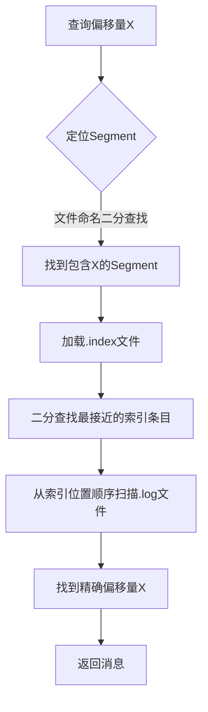
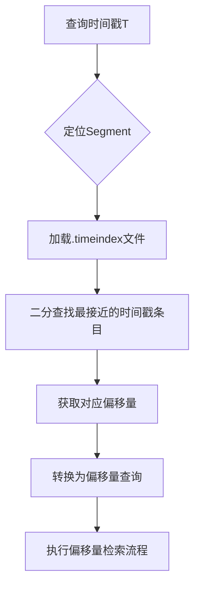

# Kafka日志分段(LogSegment)与索引机制详解

## 1. 概述

Kafka作为高性能的分布式消息系统，其存储层的核心设计之一是**日志分段(LogSegment)机制**。每个Kafka主题分区由一个或多个日志分段组成，这种设计不仅提高了读写效率，还简化了日志管理和清理操作。与之配套的**索引文件(.index/.timeindex)** 则提供了高效的消息定位能力。

## 2. 日志分段(LogSegment)

### 2.1 基本概念

**LogSegment**是Kafka物理存储的最小单元，每个Segment包含以下文件：

```
# 典型Segment文件结构
00000000000000000000.log      # 数据文件（消息实际存储位置）
00000000000000000000.index    # 位移索引文件
00000000000000000000.timeindex # 时间戳索引文件
00000000000000000000.snapshot # 生产者状态快照（如有）
00000000000000000000.txnindex # 事务索引（如有）
```

### 2.2 设计原理

#### 2.2.1 分段策略
- **大小触发**：默认配置`log.segment.bytes=1GB`，达到此大小后创建新Segment
- **时间触发**：基于`log.roll.ms`或`log.roll.hours`（默认7天）
- **位移索引触发**：基于索引文件大小限制

#### 2.2.2 文件命名规则
- 使用Segment起始偏移量（20位数字）作为文件名前缀
- 这种命名方式便于通过偏移量快速定位对应的Segment文件

## 3. 索引文件机制

### 3.1 位移索引(.index)

#### 3.1.1 存储结构
位移索引采用**稀疏索引(Sparse Index)**设计，并非为每条消息建立索引，而是按一定间隔采样：

```
# 索引条目结构（8字节固定长度）
+----------------+----------------+
| 相对偏移量(4B) | 物理位置(4B)  |
+----------------+----------------+
```

**示例索引内容**：
```
# 文件: 00000000000000000000.index
offset: 0, position: 0
offset: 100, position: 10240
offset: 200, position: 20480
...
```

#### 3.1.2 索引参数
- `index.interval.bytes`：默认4KB，每写入4KB数据创建一个索引条目
- 优点：大幅减少索引文件大小，同时保持较好的查询效率

### 3.2 时间戳索引(.timeindex)

#### 3.2.1 存储结构
时间戳索引用于支持按时间戳查询消息：

```
# 时间戳索引条目结构（12字节）
+---------------------+----------------+
| 时间戳(8B)         | 相对偏移量(4B)|
+---------------------+----------------+
```

#### 3.2.2 索引更新
- 写入时间戳：消息批次的第一条消息时间戳
- 索引间隔：与位移索引类似，采用稀疏索引策略

## 4. 索引检索流程

### 4.1 基于偏移量的检索



**关键步骤详解**：
1. **Segment定位**：通过文件名二分查找定位目标Segment
2. **索引查找**：在.index文件中二分查找小于等于目标偏移量的最大索引条目
3. **顺序扫描**：从索引指向的物理位置开始，顺序扫描.log文件找到精确偏移量

### 4.2 基于时间戳的检索



## 5. 索引文件管理

### 5.1 索引重建
- 当索引文件损坏或丢失时，Kafka可以根据.log文件重建索引
- 重建过程会扫描.log文件，按配置间隔重新创建索引条目

### 5.2 索引清理
- 与日志清理策略配合，删除过期Segment时会一并删除对应的索引文件
- 支持基于时间、大小、偏移量的多种清理策略

## 6. 性能优化特性

### 6.1 内存映射(Memory Mapped Files)
- 索引文件使用内存映射技术，将文件直接映射到用户空间
- 减少用户态与内核态之间的数据拷贝
- 依赖操作系统的页缓存管理

### 6.2 零拷贝(Zero Copy)
- 数据检索时，利用操作系统零拷贝技术直接从页缓存发送到网络
- 避免数据在内存中的多次复制

### 6.3 文件预分配
- 创建索引文件时预分配固定大小空间（默认10MB）
- 减少文件扩展时的磁盘碎片和性能开销

## 7. 配置参数详解

### 7.1 核心配置

| 参数 | 默认值 | 说明 |
|------|--------|------|
| `log.segment.bytes` | 1GB | Segment文件最大大小 |
| `log.roll.hours` | 168 | Segment滚动时间（7天） |
| `log.index.size.max.bytes` | 10MB | 索引文件最大大小 |
| `log.index.interval.bytes` | 4096 | 索引条目间隔 |
| `log.flush.interval.messages` | Long.Max | 刷盘消息数阈值 |
| `log.flush.interval.ms` | 无 | 刷盘时间间隔 |

### 7.2 调优建议
1. **小消息场景**：适当减小`log.index.interval.bytes`提高检索精度
2. **大消息场景**：增大`log.index.interval.bytes`减少索引大小
3. **高吞吐场景**：增大`log.segment.bytes`减少Segment切换开销

## 8. 实际应用注意事项

### 8.1 监控指标
- 索引文件大小与增长速率
- 索引命中率与查询延迟
- Segment切换频率

### 8.2 故障处理
1. **索引损坏**：删除损坏索引文件，重启时自动重建
2. **磁盘空间不足**：监控索引文件与数据文件比例
3. **查询性能下降**：检查索引稀疏度是否合适

### 8.3 最佳实践
1. 根据消息大小调整索引间隔
2. 定期监控Segment文件数量
3. 使用合适的时间戳策略（CreateTime/LogAppendTime）

## 9. 总结

Kafka的LogSegment与索引机制通过精巧的设计平衡了存储效率与查询性能：

1. **分段管理**：支持高效的日志清理和并行处理
2. **稀疏索引**：在存储成本和查询性能间取得平衡
3. **多维度检索**：支持偏移量和时间戳两种查询方式
4. **性能优化**：结合内存映射和零拷贝技术提供高吞吐

这种设计使得Kafka能够支撑海量消息的持久化存储和高效检索，是其高性能特性的重要基础。在实际使用中，理解这些机制有助于更好地配置和优化Kafka集群，满足不同的业务需求。