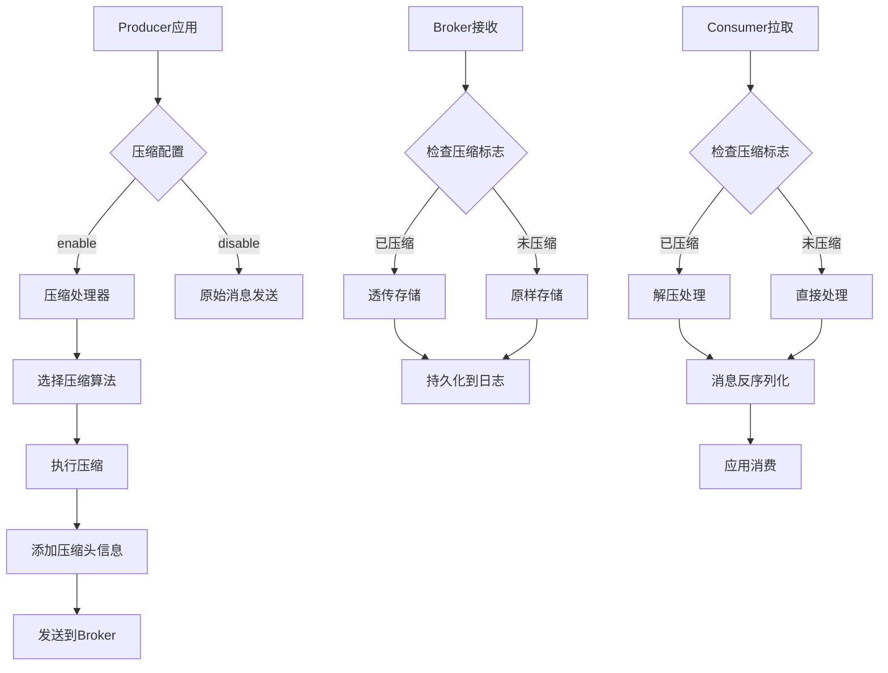

# Kafka消息压缩端对端技术文档

## 摘要

本文档详细阐述Apache Kafka消息压缩的端到端实现机制，涵盖Producer端压缩、Broker端透传和Consumer端解压三个核心环节。通过深入分析压缩算法选择、配置参数和性能影响，为系统设计和优化提供技术指导。

---

## 1. 概述

### 1.1 背景
Kafka作为高性能分布式消息系统，在处理海量数据时面临网络带宽和存储成本挑战。消息压缩通过减少数据传输量和存储占用，有效提升吞吐量并降低基础设施成本。

### 1.2 压缩的价值
- **网络优化**：减少Producer到Broker、Broker间复制、Broker到Consumer的网络传输量
- **存储优化**：降低Broker磁盘空间占用，提高I/O效率
- **成本降低**：减少云环境下的网络流量费用和存储费用

---

## 2. 端到端压缩架构



---

## 3. Producer端压缩

### 3.1 压缩触发机制

#### 3.1.1 批量压缩
```properties
# Producer配置示例
compression.type=gzip
linger.ms=20
batch.size=16384
```

- **触发条件**：消息积累达到`batch.size`或等待时间达到`linger.ms`
- **压缩单元**：以批次(batch)为单位进行压缩，而非单条消息
- **批次重组**：相同分区的消息组成批次后统一压缩

#### 3.1.2 压缩算法选择

| 算法 | 压缩率 | CPU消耗 | 吞吐量影响 | 适用场景 |
|------|--------|---------|------------|----------|
| none | 无 | 无 | 无 | 低吞吐、CPU敏感 |
| gzip | 高 | 高 | 中等 | 高压缩率需求 |
| lz4 | 中等 | 低 | 低 | 平衡性能与压缩率 |
| snappy | 中等 | 低 | 低 | 低延迟场景 |
| zstd | 最高 | 中等 | 中等 | Kafka 2.1+，最佳平衡 |

### 3.2 压缩实现细节

#### 3.2.1 压缩消息格式
```
+----------------+----------------+----------------+----------------+
| 魔数(0-1)      | 属性(2)        | 时间戳(3-10)   | 批次偏移(11-14)|
+----------------+----------------+----------------+----------------+
| 分区Leader纪元 | 压缩算法标志   | 最后偏移量     | 压缩消息计数   |
+----------------+----------------+----------------+----------------+
| 记录集(压缩数据)                                                  |
+-------------------------------------------------------------------+
```

#### 3.2.2 关键配置参数
```java
Properties props = new Properties();
props.put("compression.type", "snappy");  // 压缩算法
props.put("batch.size", 16384);           // 批次大小阈值
props.put("linger.ms", 5);                // 批次等待时间
props.put("buffer.memory", 33554432);     // 压缩缓冲区大小
```

---

## 4. Broker端透传机制

### 4.1 接收与验证

#### 4.1.1 压缩标志检查
Broker通过消息批次头部的`attributes`字段识别压缩状态：
- `attributes & 0x07 = 0`：无压缩
- `attributes & 0x07 = 1`：gzip压缩
- `attributes & 0x07 = 2`：snappy压缩
- `attributes & 0x07 = 3`：lz4压缩
- `attributes & 0x07 = 4`：zstd压缩

#### 4.1.2 完整性校验
- CRC32校验：验证压缩数据的完整性
- 批次大小验证：确保符合`message.max.bytes`配置限制

### 4.2 存储优化策略

#### 4.2.1 零拷贝优化
Broker直接存储压缩批次，避免解压-再压缩开销：
```java
// Broker存储伪代码示例
if (isCompressedBatch(messageBatch)) {
    // 直接写入压缩数据到日志段
    logSegment.append(messageBatch.getRawBytes());
} else {
    // 非压缩数据正常处理
    logSegment.append(compressIfNeeded(messageBatch));
}
```

#### 4.2.2 页面缓存友好性
- 压缩数据减少磁盘I/O次数
- 提高页面缓存命中率
- 降低Broker内存压力

### 4.3 复制与同步

#### 4.3.1 跨Broker透传
在ISR（In-Sync Replicas）复制过程中，压缩批次保持原样传输：
```
Producer → Leader Broker → Follower Broker
   ↓            ↓               ↓
压缩批次 → 透传存储 → 透传复制
```

#### 4.3.2 配置注意事项
```properties
# Broker端相关配置
message.max.bytes=1048588
replica.fetch.max.bytes=1048576
log.segment.bytes=1073741824
```

---

## 5. Consumer端解压

### 5.1 解压触发时机

#### 5.1.1 拉取识别
Consumer通过FetchResponse识别压缩标志：
```java
// Consumer解压逻辑示例
for (RecordBatch batch : fetchResponse.recordBatches()) {
    if (batch.isCompressed()) {
        // 执行解压
        List<Record> records = decompressBatch(batch);
        processRecords(records);
    } else {
        // 直接处理
        processRecords(batch.records());
    }
}
```

#### 5.1.2 内存管理
- 解压缓冲区配置：`fetch.max.bytes`控制最大解压内存
- 批量解压优化：减少内存碎片和GC压力

### 5.2 解压性能优化

#### 5.2.1 懒解压策略
```java
// 懒加载解压实现
public class LazyDecompressionRecordBatch {
    private byte[] compressedData;
    private List<Record> decompressedRecords;
    
    public List<Record> records() {
        if (decompressedRecords == null) {
            decompressedRecords = decompress(compressedData);
        }
        return decompressedRecords;
    }
}
```

#### 5.2.2 解压线程池
- 专用解压线程避免阻塞网络线程
- 并行解压提升吞吐量
- 可配置的线程池大小

### 5.3 异常处理机制

#### 5.3.1 解压失败处理
- CRC校验失败：触发重试机制
- 算法不匹配：抛出`InvalidRecordException`
- 内存不足：调整`fetch.max.bytes`配置

#### 5.3.2 向后兼容性
- 支持旧版本压缩格式
- 渐进式算法升级策略

---

## 6. 性能调优指南

### 6.1 压缩算法选择矩阵

| 场景特征 | 推荐算法 | 配置参数建议 |
|----------|----------|--------------|
| CPU资源充足，追求高压缩率 | zstd/gzip | `batch.size=32768`, `linger.ms=50` |
| 低延迟优先，CPU敏感 | lz4/snappy | `batch.size=8192`, `linger.ms=0` |
| 混合负载，平衡需求 | lz4 | `batch.size=16384`, `linger.ms=10` |
| 兼容旧版本Kafka | snappy | `batch.size=16384`, `linger.ms=20` |

### 6.2 监控指标

#### 6.2.1 关键指标
```prometheus
# Producer端指标
kafka_producer_compression_ratio{client_id,algorithm}
kafka_producer_batch_size_avg
kafka_producer_record_queue_time_avg

# Broker端指标
kafka_server_broker_topic_bytes_in{compressed="true"}
kafka_log_log_size{compression_rate}

# Consumer端指标
kafka_consumer_decompress_time_max
kafka_consumer_fetch_size_avg
```

#### 6.2.2 告警阈值
- 压缩率低于1.2：考虑关闭压缩
- 解压时间大于50ms：检查CPU负载
- 批次大小持续不达标：调整`linger.ms`

### 6.3 配置最佳实践

#### 6.3.1 Producer配置模板
```properties
# 高吞吐场景
compression.type=zstd
batch.size=65536
linger.ms=100
max.in.flight.requests.per.connection=5

# 低延迟场景
compression.type=lz4
batch.size=4096
linger.ms=0
max.in.flight.requests.per.connection=1
```

#### 6.3.2 Consumer配置优化
```properties
# 高性能消费
fetch.min.bytes=1
fetch.max.wait.ms=500
fetch.max.bytes=52428800
max.partition.fetch.bytes=1048576
```

---

## 7. 常见问题与解决方案

### 7.1 性能反优化场景

#### 问题1：小消息压缩反而降低吞吐
**现象**：压缩后吞吐量下降，CPU使用率上升
**原因**：消息体积太小，压缩开销大于收益
**解决方案**：
- 增大`batch.size`，让更多消息一起压缩
- 对小于阈值（如100字节）的消息禁用压缩
- 使用更轻量的压缩算法（lz4替代gzip）

#### 问题2：Consumer解压成为瓶颈
**现象**：Consumer CPU使用率高，消费延迟增加
**原因**：解压线程不足或算法过于复杂
**解决方案**：
- 增加Consumer实例数
- 配置`fetch.max.bytes`限制单次解压数据量
- 使用异步解压模式

### 7.2 兼容性问题

#### 跨版本压缩支持
- Kafka 0.10.x+：支持gzip、snappy、lz4
- Kafka 2.1.x+：增加zstd支持
- 降级策略：新旧Cluster间使用最低公共算法

---

## 8. 未来演进方向

### 8.1 智能压缩
- 基于消息内容的动态算法选择
- 机器学习预测最佳压缩参数
- 实时压缩策略调整

### 8.2 硬件加速
- GPU辅助压缩/解压
- 专用压缩硬件支持
- RDMA网络下的零拷贝优化

### 8.3 新算法集成
- Brotli算法集成
- 基于字典的压缩优化
- 分层压缩策略

---

## 9. 总结

Kafka消息压缩的端到端实现是一个综合考虑吞吐量、延迟和资源消耗的复杂系统。通过合理配置Producer压缩参数、利用Broker透传机制和优化Consumer解压策略，可以在不同业务场景下实现最佳的性能平衡。

**核心建议**：
1. **测试驱动**：在生产环境规模下测试不同压缩配置
2. **监控先行**：建立完整的压缩性能监控体系
3. **渐进优化**：从小规模开始，逐步调整压缩策略
4. **全链路视角**：考虑Producer、Broker、Consumer的协同影响

---

## 附录

### A. 压缩算法性能基准测试数据
（实际数据需根据具体环境和版本测试）

### B. 相关配置参数速查表

### C. 故障排查流程图

---
*文档版本：1.1*
*最后更新：2024年*  
*适用Kafka版本：2.0+*