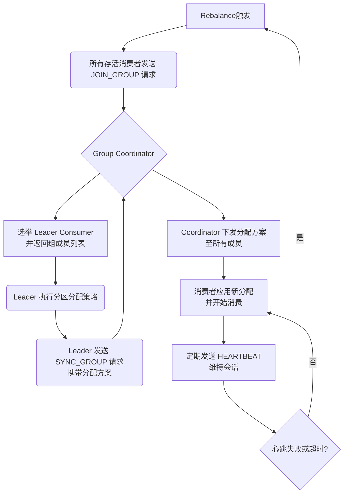

好的，遵照您的指示，我将为您生成一份关于 **Kafka消费者组Rebalance触发条件与流程** 的技术文档。本文将系统性地阐述其核心概念、触发条件、详细流程，并补充相关优化实践。

---

# **Kafka消费者组Rebalance：触发条件与流程详解**

## **1. 核心概念**

在深入分析之前，需要明确两个核心概念：
*   **消费者组 (Consumer Group)**： 由多个消费者实例 (`Consumer`) 组成，共同消费一个或多个主题 (`Topic`) 的所有分区 (`Partition`)。组内每个分区在同一时刻只能被一个消费者实例消费，从而实现消息的并行处理与负载均衡。
*   **Rebalance (再均衡)**： 指在消费者组成员发生增减、订阅主题或主题分区数量发生变化时，Kafka 集群**重新分配**消费者组内所有消费者与主题分区订阅关系的过程。其目标是确保分区分配的均衡性和消费的**正确性**（每个分区只被一个消费者消费）。

Rebalance 是 Kafka 实现高可用性和伸缩性的关键机制，但也是一个 **“Stop-The-World”** 事件，在此期间整个消费者组会暂停消费，影响吞吐量和延迟。

## **2. Rebalance 的触发条件**

任何导致消费者组成员元数据或订阅元数据发生变化的操作，都可能触发 Rebalance。主要条件如下：

### **2.1. 组成员变化**
*   **新成员加入**： 一个新的消费者实例以**相同组ID**启动并尝试加入组。这是最常见的扩容场景。
*   **成员主动离开**： 消费者实例正常关闭 (`consumer.close()`)，会发送 `LeaveGroup` 请求，通知协调者其离组。
*   **成员故障或崩溃**：
    *   消费者进程异常终止。
    *   网络分区导致消费者实例与集群断开连接，**超过会话超时时间 (`session.timeout.ms`)** 未能发送心跳。协调者会将其标记为死亡。
    *   消费者处理消息时间过长，**超过最大轮询间隔 (`max.poll.interval.ms`)** 未能调用 `poll()` 方法，会被协调者认为已失败。

### **2.2. 订阅的Topic元数据变化**
*   **订阅主题的分区数增加**： 当管理员增加某个被消费者组订阅的主题的分区数量时，新分区需要被分配给现有的消费者。
*   **订阅模式 (`Pattern`) 匹配到新主题**： 当使用正则表达式订阅时，如果创建了匹配该模式的新主题，会触发 Rebalance 来分配新主题的分区。

### **2.3. 协调者变更**
*   消费者组的协调者 (`GroupCoordinator`) 所在的 Broker 宕机，组需要重新连接到新的协调者，并可能触发 Rebalance。

### **2.4. 手动触发**
*   调用 Kafka Consumer API 的 `unsubscribe()` 方法。
*   在较新版本的客户端中，可通过特定的管理 API 发起主动 Rebalance。

---

## **3. Rebalance 核心流程解析**

整个 Rebalance 过程由 **Group Coordinator** (组协调者，运行在某个 Broker 上) 主导。主要协议为 **Group Management Protocol**。其核心流程可以分为三个阶段：

### **3.1. 阶段一：发现协调者与加入组 (JOIN_GROUP)**
1.  **发现协调者**： 消费者客户端启动时，会向任一 Broker 发送 `FindCoordinator` 请求，找到其消费者组对应的 Group Coordinator。
2.  **发送加入组请求**： 触发条件发生时，协调者会要求组内所有存活的消费者重新加入。每个消费者向协调者发送 **`JoinGroup`** 请求。
3.  **选择领导者消费者**： 协调者收集所有成员的 `JoinGroup` 请求后，会从第一个成功加入的成员中选择一个作为 **Leader Consumer**，其余为 **Follower Consumer**。领导者的选举是随机的，但与组成员ID的顺序有关。
4.  **返回加入结果**： 协调者将 **Leader ID** 和完整的 **组成员信息** 封装在 `JoinGroupResponse` 中返回给每个消费者。此时，所有成员都知道组内有哪些同伴。

### **3.2. 阶段二：领导者执行分区分配 (SYNC_GROUP)**
1.  **领导者计算分配方案**： **仅由领导者消费者**执行。它根据 `JoinGroupResponse` 中的组成员信息，调用**分区分配策略**（如 RangeAssignor, RoundRobinAssignor, StickyAssignor 或自定义策略），计算出一个分区分配给所有成员的具体方案。
2.  **发送同步请求**：
    *   **领导者**： 将计算好的分配方案 (`assignment`) 通过 **`SyncGroup`** 请求发送给协调者。
    *   **追随者**： 发送一个内容为空的 `SyncGroup` 请求。
3.  **下发分配方案**： 协调者收到领导者的分配方案后，将其作为 `SyncGroupResponse` 的一部分，**下发（同步）给组内的每一个消费者**。至此，所有消费者都明确了自己应该消费哪些分区。

### **3.3. 阶段三：稳定状态与心跳维持**
1.  **应用新分配**： 每个消费者收到分配方案后，会释放不再属于它的分区的所有权，并开始拉取新分配到的分区的消息。
2.  **发送心跳**： 消费者在后台定期向协调者发送 **`Heartbeat`** 请求，以表明自己存活。心跳必须在 `session.timeout.ms` 和 `max.poll.interval.ms` 内成功发送，否则会被判定为死亡，从而触发新一轮 Rebalance。

---

## **4. 流程示意图**

## **5. Rebalance 的影响与优化实践**

### **5.1. 主要影响**
*   **消费停顿**： Rebalance 期间，整个消费者组无法消费消息。
*   **重复消费**： 如果 Rebalance 发生在消息处理之后、提交偏移量之前，新分配到该分区的消费者会从上次提交的偏移量开始消费，导致消息被重复处理。
*   **资源消耗**： 频繁的 Rebalance 会加剧集群网络和 CPU 的负担。

### **5.2. 优化建议**
*   **合理配置关键参数**：
    *   **`session.timeout.ms`**： 适当调大（默认45秒），容忍网络短暂波动，但会延长故障检测时间。
    *   **`max.poll.interval.ms`**： 根据业务逻辑处理的最长时间来设置，避免因处理太慢被误踢。
    *   **`heartbeat.interval.ms`**： 建议设置为 `session.timeout.ms` 的 1/3 以下，确保在会话超时前能有多次心跳机会。
*   **避免“原地重启”风暴**： 批量重启消费者时，使用分批次、滚动重启，避免所有成员同时离组又同时加入。
*   **使用静态成员资格**： 为消费者设置 `group.instance.id`，使其成为**静态成员**。在短暂故障（如重启）时，协调者会为其保留分区，避免触发 Rebalance。
*   **使用增量 Cooperative Rebalance**：
    *   **协议选择**： 使用 `partition.assignment.strategy` 为 `CooperativeStickyAssignor`，并配合 `EAGER` 协议（Kafka 2.4+）。
    *   **优势**： 相比早期的 `EAGER` 协议（全部放弃，重新分配），Cooperative Rebalance 允许消费者分多轮渐进式地放弃部分分区，减少全局停顿时间。
*   **确保消息处理耗时可控**： 将消息处理与 `poll()` 循环解耦，使用多线程处理，确保能及时调用下一次 `poll()`。

## **6. 总结**

Kafka 消费者组的 Rebalance 机制是保障分布式消费系统健壮性和扩展性的基石。理解其触发条件（成员变化、元数据变化）和三个阶段流程（JOIN, SYNC, HEARTBEAT），对于诊断消费组问题、设计稳定的消费程序至关重要。通过合理配置参数、采用静态成员、升级到 Cooperative Rebalance 协议等优化手段，可以显著降低 Rebalance 的频率和影响，从而构建高性能、高可用的 Kafka 消费端应用。