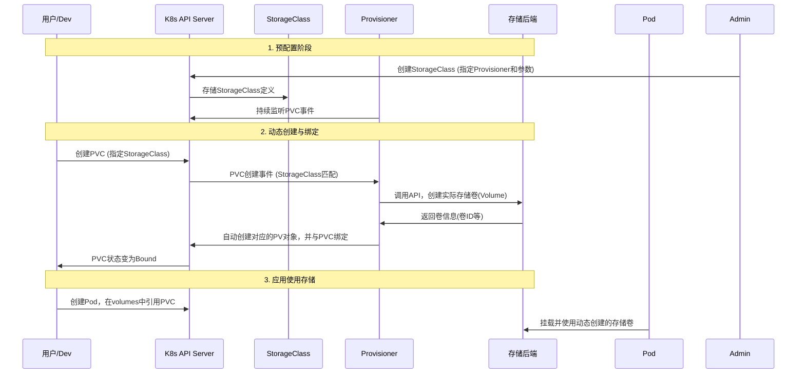

好的，这是一份关于 Kubernetes PVC 动态供应（StorageClass Provisioner）的技术文档，内容结构清晰，涵盖了核心概念、工作原理、配置示例和最佳实践。

---

## **Kubernetes PVC 动态供应技术文档**
**主题：StorageClass 与 Provisioner 详解**
**版本：** 1.0
**最后更新：** 2023年10月27日

---

### **1. 概述与背景**

在 Kubernetes 中，**持久化存储**是运行有状态应用（如数据库、消息队列）的基石。持久卷（Persistent Volume, PV）是集群中的存储资源，而持久卷声明（Persistent Volume Claim, PVC）是用户对存储资源的请求。

最初的 PV 管理方式为**静态供应**：管理员需要手动预先创建一系列 PV，然后用户通过 PVC 来申请和绑定。这种方式存在以下弊端：
*   **运维负担重**：管理员需提前感知存储需求。
*   **资源利用不灵活**：容易造成存储资源浪费或不足。
*   **与云环境脱节**：无法利用云平台“按需创建”存储资源的特性。

**动态供应**应运而生，它允许用户按需自动创建存储资源，无需管理员干预。其核心组件就是 **StorageClass** 和 **Provisioner**。

### **2. 核心概念**

#### **2.1 StorageClass**
*   **定义**：StorageClass 是描述**存储类型**的 Kubernetes 资源对象。它为管理员提供了一种描述他们提供的存储的“类”的方法。
*   **作用**：
    1.  **抽象存储后端**：定义提供存储的供应商（如 AWS EBS, GCE PD, Ceph RBD， NFS Server 等）。
    2.  **参数化存储**：允许为动态供应的 PV 指定参数，如磁盘类型（`gp2`, `io1`）、性能等级、文件系统、副本策略等。
    3.  **绑定 Provisioner**：指定用于创建 PV 的卷插件（Provisioner）。

#### **2.2 Provisioner**
*   **定义**：Provisioner 是一个遵循 Kubernetes `PV` 控制器调用规范的**控制器**。它的核心职责是监听符合特定 StorageClass 的 PVC 的创建请求，并自动在相应的存储后端创建存储卷，随后在 Kubernetes 集群中创建对应的 PV 对象。
*   **类型**：
    1.  **内置 Provisioner**：Kubernetes 原生支持部分云厂商的 Provisioner（如 `kubernetes.io/aws-ebs`, `kubernetes.io/gce-pd`）。其名称带有 `kubernetes.io/` 前缀。
    2.  **外部 Provisioner**：由第三方存储供应商或社区开发，需独立部署。例如：
        *   **CSI 驱动**：这是当前的标准和主流方式。如 `csi.vsphere.vmware.com`, `rook-ceph.rbd.csi.ceph.com`， `nfs.csi.k8s.io`。
        *   旧式的 `external-storage` 仓库中的 Provisioner（如 NFS）。

### **3. 动态供应工作流程**

下图展示了从创建 PVC 到 Pod 使用存储的完整流程：



**流程步骤详解：**

1.  **集群管理员** 预先创建 StorageClass，定义好 Provisioner 和存储参数。
2.  **用户** 创建 PVC，并在 `spec.storageClassName` 字段中指定上述 StorageClass 的名称。
3.  Kubernetes 的 **PV 控制器** 发现这个新的 PVC，并识别出它请求的是动态供应。
4.  PV 控制器调用与该 StorageClass 关联的 **Provisioner**。
5.  **Provisioner** 接收到请求，根据 StorageClass 中定义的参数，通过自身的接口（如云 API、CSI 调用）**在外部存储系统上创建实际的存储卷**。
6.  Provisioner 在存储卷创建成功后，**在 Kubernetes 集群中自动创建一个 PV 对象**，该 PV 的规格精确对应后端创建的存储卷。
7.  PV 控制器将新创建的 **PV 与 PVC 进行绑定**。此时 PVC 状态变为 `Bound`。
8.  用户创建 Pod，并在卷声明中引用该 PVC。调度器将 Pod 调度到节点后，**kubelet 会同 CSI 驱动（或内置驱动）将存储卷挂载到容器指定路径**。

### **4. 配置与示例**

#### **4.1 定义 StorageClass (以 AWS EBS gp3 为例)**
```yaml
apiVersion: storage.k8s.io/v1
kind: StorageClass
metadata:
  name: fast-ebs-gp3
provisioner: ebs.csi.aws.com # 使用 AWS EBS CSI 驱动
parameters:
  type: gp3
  iops: "3000"
  throughput: "125"
  encrypted: "true" # 启用加密
  fsType: ext4
reclaimPolicy: Delete
allowVolumeExpansion: true # 允许卷扩容
volumeBindingMode: WaitForFirstConsumer # 延迟绑定
```

*   **`reclaimPolicy`**： 删除 PVC 后，PV 及后端存储卷的处理策略。
    *   `Retain`：保留（手动清理）。`Delete`：自动删除（默认值）。`Recycle`（已废弃）。
*   **`volumeBindingMode`**：
    *   `Immediate`：创建 PVC 后立即绑定并供应 PV。
    *   **`WaitForFirstConsumer`**：**推荐**。延迟绑定，直到使用该 PVC 的 Pod 被调度时，才在 Pod 所在节点对应的可用区创建 PV，避免跨AZ调度问题。

#### **4.2 用户创建 PVC**
```yaml
apiVersion: v1
kind: PersistentVolumeClaim
metadata:
  name: my-app-data-pvc
spec:
  accessModes:
    - ReadWriteOnce
  storageClassName: fast-ebs-gp3 # 关键：指向定义的StorageClass
  resources:
    requests:
      storage: 100Gi
```

#### **4.3 在 Pod 中使用**
```yaml
apiVersion: v1
kind: Pod
metadata:
  name: my-app
spec:
  containers:
  - name: app
    image: my-app:latest
    volumeMounts:
    - mountPath: "/var/data"
      name: storage
  volumes:
  - name: storage
    persistentVolumeClaim:
      claimName: my-app-data-pvc # 引用上面创建的PVC
```

### **5. 最佳实践与注意事项**

1.  **优先使用 CSI 驱动**：CSI 是容器存储的现代标准，提供了更强大、更统一的功能（如卷快照、克隆、扩容）。
2.  **使用 `WaitForFirstConsumer`**：对于有拓扑限制的存储（如云盘受限于可用区），强烈建议使用此模式，确保存储卷创建在 Pod 可用的区域。
3.  **合理设置 `reclaimPolicy`**：
    *   生产环境关键数据，考虑设为 `Retain`，避免误删 PVC 导致数据丢失。删除后需要手动清理 PV 和外部存储。
    *   非持久化测试数据可设为 `Delete` 以自动清理。
4.  **规划 StorageClass 命名**：名称应具有描述性，如 `gold-csi-ssd`, `silver-nfs-slow`，便于团队理解。
5.  **启用卷扩容**：在 StorageClass 中设置 `allowVolumeExpansion: true`，为未来在线扩容提供可能。
6.  **设置默认 StorageClass**：可以为集群设置一个默认的 StorageClass，这样用户创建 PVC 时若不指定，则会自动使用默认类。
    ```bash
    kubectl patch storageclass <your-class-name> -p '{"metadata": {"annotations":{"storageclass.kubernetes.io/is-default-class":"true"}}}'
    ```
7.  **监控与审计**：动态供应会频繁创建/删除资源，需监控存储后端（如云厂商）的 API 调用次数、存储使用量和成本。

### **6. 故障排查思路**

1.  **PVC 始终处于 `Pending` 状态**：
    *   检查 StorageClass 名称是否拼写正确。
    *   检查 Provisioner 控制器（Pod/Deployment）是否正常运行：`kubectl get pods -n <provisioner-namespace>`。
    *   查看 PVC 事件：`kubectl describe pvc <pvc-name>`。
    *   查看 Provisioner 控制器的日志。
2.  **Pod 启动失败，提示挂载卷失败**：
    *   检查 PVC 是否已绑定（`Bound`）。
    *   确认节点是否安装了必要的 CSI 驱动或客户端工具。
    *   检查存储后端的权限和配额（如 AWS IAM 角色、存储空间不足）。

### **7. 总结**

Kubernetes PVC 动态供应通过 **StorageClass** 和 **Provisioner** 的协同工作，实现了存储资源的**自动化、按需供给**，极大简化了存储管理和运维工作。它是运行有状态工作负载的**推荐存储管理模式**。管理员应熟悉其原理，并根据实际存储后端（云平台或自有存储）选择合适的 Provisioner（尤其是 CSI 驱动）并进行合理配置。

---