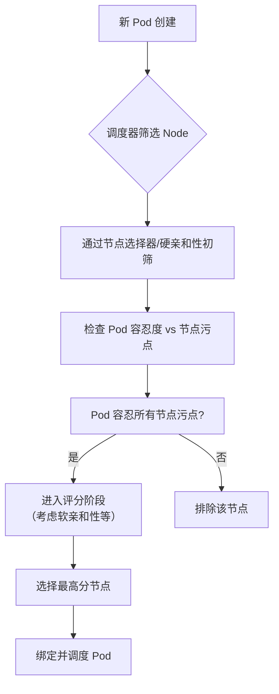

好的，遵照您的要求，我将为您生成一份关于 Kubernetes 节点亲和性与污点容忍的详细技术文档。

---

# **Kubernetes调度进阶：节点亲和性与污点容忍详解**

## **1. 概述**

Kubernetes 调度器 (`kube-scheduler`) 负责将新创建的 Pod 分配到合适的 Node 上运行。其默认调度策略基于资源请求和可用性。然而，在实际生产环境中，我们常常需要更精细的控制，例如：

*   **将特定的 Pod 部署到具有特定硬件（如 SSD、GPU）或特定区域（如可用区）的节点上。**
*   **避免将某些 Pod 部署到特定节点上（如预留给特殊任务的节点）。**
*   **允许特定类型的 Pod 调度到已被“污染”的节点上。**

为了满足这些需求，Kubernetes 提供了两类主要的、相互补充的调度机制：

1.  **节点亲和性 (Node Affinity)**：定义 Pod **倾向于** 调度到哪些节点。这是一种“吸引”规则，优先级较高。
2.  **污点和容忍度 (Taint and Toleration)**：定义 Pod **可以容忍** 哪些节点。这是一种“排斥”规则，优先级较低，用于“保护”节点。

## **2. 节点亲和性 (Node Affinity)**

节点亲和性允许你根据节点的标签来约束 Pod 可以调度到哪些节点。它是早期 `nodeSelector` 功能的超集，提供了更丰富的表达语言（`requiredDuringSchedulingIgnoredDuringExecution` 和 `preferredDuringSchedulingIgnoredDuringExecution`）。

### **2.1 核心概念**

*   **节点标签 (Node Label)**： 由管理员或云提供商附加到节点上的键值对，用于标识节点的特性，如 `disktype=ssd`、`zone=us-east-1a`、`gpu=true`。
*   **亲和性规则类型**：
    *   `requiredDuringSchedulingIgnoredDuringExecution`： **硬亲和**。调度时**必须**满足该条件，否则 Pod 处于 Pending 状态。`IgnoredDuringExecution` 表示 Pod 运行后，即使节点标签改变，也不会驱逐 Pod。
    *   `preferredDuringSchedulingIgnoredDuringExecution`： **软亲和**。调度时**优先**考虑满足该条件，但即使不满足也会进行调度。可以设置权重（`weight`，范围 1-100）来区分多个偏好的优先级。

### **2.2 语法示例**

```yaml
apiVersion: v1
kind: Pod
metadata:
  name: nginx-with-affinity
spec:
  affinity:
    nodeAffinity:
      # 硬亲和：必须调度到带有 gpu=true 标签的节点
      requiredDuringSchedulingIgnoredDuringExecution:
        nodeSelectorTerms:
        - matchExpressions:
          - key: gpu
            operator: In
            values:
            - "true"
      # 软亲和：尽可能调度到区域 zoneA 或 zoneB
      preferredDuringSchedulingIgnoredDuringExecution:
      - weight: 60
        preference:
          matchExpressions:
          - key: zone
            operator: In
            values:
            - "zoneA"
            - "zoneB"
      - weight: 30
        preference:
          matchExpressions:
          - key: rack
            operator: In
            values:
            - "rack-1"
  containers:
  - name: nginx
    image: nginx
```

**操作符 (`operator`)**：
*   `In`， `NotIn`： 标签值在/不在某个集合中。
*   `Exists`， `DoesNotExist`： 标签键存在/不存在（无需指定 `values`）。
*   `Gt`， `Lt`： 标签值大于/小于某个值（值需为整数）。

## **3. 污点与容忍度 (Taint and Toleration)**

污点和容忍度共同作用，确保 Pod **不被**调度到不合适的节点上，或避免在节点上放置任何 Pod。

### **3.1 核心概念**

*   **污点 (Taint)**： 应用于**节点**上的一个属性。它会“排斥”所有不能“容忍”该污点的 Pod。
*   **容忍度 (Toleration)**： 应用于 **Pod** 上的一个属性。它允许（但不强制）Pod 调度到具有匹配污点的节点上。
*   **污点效果 (`effect`)**： 定义不能容忍此污点的 Pod 会有什么后果。
    *   `NoSchedule`： 新 Pod 不能被调度到此节点（已运行的 Pod 不受影响）。
    *   `PreferNoSchedule`： 调度器尽量避免将 Pod 调度到此节点。
    *   `NoExecute`： **新 Pod 不能调度，且已在该节点上运行但不能容忍此污点的 Pod 将被驱逐**（可以设置 `tolerationSeconds` 定义驱逐宽限期）。

### **3.2 管理污点**

```bash
# 为节点 node1 添加一个污点
kubectl taint nodes node1 key1=value1:NoSchedule

# 查看节点污点
kubectl describe node node1 | grep Taints

# 移除污点（在 key 后加一个减号）
kubectl taint nodes node1 key1=value1:NoSchedule-
```

### **3.3 定义容忍度**

Pod 通过 `spec.tolerations` 字段声明其容忍度。

```yaml
apiVersion: v1
kind: Pod
metadata:
  name: nginx-with-toleration
spec:
  tolerations:
  # 容忍 key 为 "key1"，value 为 "value1"，effect 为 "NoSchedule" 的污点
  - key: "key1"
    operator: "Equal"
    value: "value1"
    effect: "NoSchedule"
  # 容忍 key 为 "key2" 的所有 effect 的污点（忽略 value）
  - key: "key2"
    operator: "Exists"
  # 容忍 key 为 "node.kubernetes.io/unreachable" 的污点，容忍 300 秒后驱逐
  - key: "node.kubernetes.io/unreachable"
    operator: "Exists"
    effect: "NoExecute"
    tolerationSeconds: 300
  containers:
  - name: nginx
    image: nginx
```

**系统内置污点**：
Kubernetes 核心组件会自动为节点添加内置污点，方便系统 Pod 管理。
*   `node.kubernetes.io/not-ready`： 节点未就绪。
*   `node.kubernetes.io/unreachable`： 节点控制器无法访问节点。
*   `node.kubernetes.io/disk-pressure`， `memory-pressure`， `pid-pressure`： 节点有资源压力。
*   `node.kubernetes.io/unschedulable`： 节点不可调度。

## **4. 对比与协作**

| 特性 | 节点亲和性 (Node Affinity) | 污点与容忍度 (Taint & Toleration) |
| :--- | :--- | :--- |
| **作用对象** | Pod（定义其偏好的节点） | 节点（排斥 Pod）和 Pod（声明容忍） |
| **主要目的** | **吸引** Pod 到特定节点 | **排斥/保护**节点，**选择性允许** Pod |
| **约束方向** | Pod -> 节点 | 节点 -> Pod |
| **强制力** | 硬亲和 (`required...`) / 软亲和 (`preferred...`) | `NoSchedule`（硬排斥）/ `PreferNoSchedule`（软排斥）/ `NoExecute`（驱逐） |
| **典型场景** | 基于节点特性（硬件、区域）调度 | 专用节点、节点维护、节点故障处理、守护进程调度 |

### **4.1 协同工作流程**

一个典型的调度决策流程如下：


**协作示例**：你可以创建一个只有 “GPU 专用” 的节点池。实现方法是：
1.  给这些节点打上标签 `hardware-type=gpu`。
2.  给这些节点加上污点 `dedicated=gpu:NoSchedule`。
3.  在需要 GPU 的 Pod 上同时配置：
    *   **节点亲和性**：`requiredDuringScheduling...` 匹配 `hardware-type=gpu`。
    *   **容忍度**：容忍 `dedicated=gpu:NoSchedule`。

这样，只有声明了 GPU 需求的 Pod 才能被调度到这些节点上，而其他 Pod 则完全被排斥。

## **5. 实战配置模式**

1.  **专用节点**：
    ```bash
    kubectl taint nodes <node-name> dedicated=special-user:NoSchedule
    ```
    然后在相应用户的 Pod 上添加对应的容忍度。

2.  **基于节点状态的驱逐控制**：
    ```yaml
    tolerations:
    - key: "node.kubernetes.io/unreachable"
      operator: "Exists"
      effect: "NoExecute"
      tolerationSeconds: 600  # 节点失联后，允许 Pod 继续运行10分钟
    ```

3.  **DaemonSet 的必备容忍度**：
    系统级的 DaemonSet（如网络插件、监控代理）通常需要容忍所有内置污点，以确保在每个节点上都运行一个副本。
    ```yaml
    tolerations:
    - key: node-role.kubernetes.io/control-plane
      operator: Exists
      effect: NoSchedule
    - key: node-role.kubernetes.io/master
      operator: Exists
      effect: NoSchedule
    - key: node.kubernetes.io/unreachable
      operator: Exists
      effect: NoExecute
      tolerationSeconds: 300
    ```

## **6. 总结**

*   **节点亲和性**是一种**主动性**的、以 **Pod 为中心** 的调度策略，用于将 Pod **吸引**到满足特定条件的节点。
*   **污点和容忍度**是一种**防御性**的、以 **节点为中心** 的调度策略，用于**保护节点不被不合适 Pod 调度**，并通过容忍度机制为特定 Pod 开“后门”。
*   ‍**二者结合使用**是实现复杂、精细化、高可靠集群调度的关键。通过合理设置节点的标签、污点，以及在 Pod 上配置亲和性和容忍度，可以高效地管理不同类型的计算负载，优化资源利用，并保障关键应用的稳定运行。