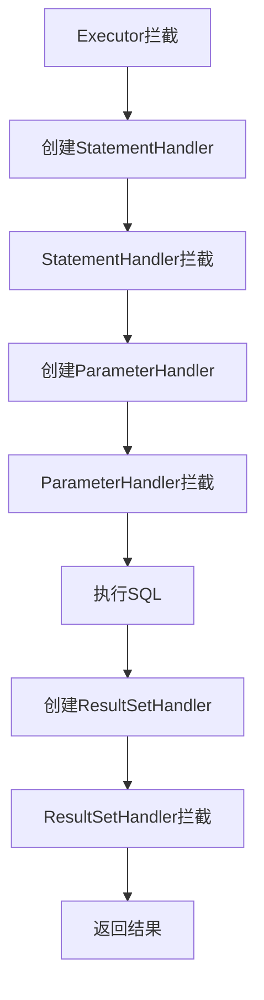

# MyBatis插件拦截器四大对象技术文档

## 1. 概述

MyBatis插件（拦截器）是基于Java动态代理和责任链模式实现的扩展机制，允许开发者在MyBatis执行SQL语句的特定时机插入自定义逻辑。该机制主要围绕四大核心组件进行拦截，形成了MyBatis执行过程的关键扩展点。

## 2. 插件核心原理

### 2.1 实现机制
- **动态代理**：通过`Plugin`类创建代理对象
- **责任链模式**：多个拦截器形成拦截链
- **注解驱动**：使用`@Intercepts`和`@Signature`注解配置拦截目标
- **配置加载**：通过`mybatis-config.xml`配置文件注册插件

### 2.2 核心接口
```java
public interface Interceptor {
    Object intercept(Invocation invocation) throws Throwable;
    Object plugin(Object target);
    void setProperties(Properties properties);
}
```

## 3. 四大拦截对象详解

### 3.1 Executor - 执行器

#### 作用范围
- MyBatis核心执行器，负责SQL语句的整个执行流程
- 调度StatementHandler、ParameterHandler、ResultSetHandler

#### 拦截方法
```java
// 核心拦截点
update(MappedStatement ms, Object parameter)  // 执行更新操作
query(MappedStatement ms, Object parameter, 
      RowBounds rowBounds, ResultHandler resultHandler,
      CacheKey cacheKey, BoundSql boundSql)    // 执行查询操作
query(MappedStatement ms, Object parameter,
      RowBounds rowBounds, ResultHandler resultHandler)  // 执行查询操作
queryCursor(MappedStatement ms, Object parameter,
            RowBounds rowBounds)              // 执行游标查询
flushStatements()                             // 批量提交
commit(boolean required)                      // 提交事务
rollback(boolean required)                    // 回滚事务
getTransaction()                              // 获取事务
close(boolean forceRollback)                  // 关闭执行器
```

#### 典型应用场景
- SQL执行时间监控
- 分页插件实现
- 读写分离路由
- 批量操作优化
- 二级缓存控制

#### 示例配置
```java
@Intercepts({
    @Signature(
        type = Executor.class,
        method = "query",
        args = {MappedStatement.class, Object.class, 
                RowBounds.class, ResultHandler.class}
    )
})
```

### 3.2 StatementHandler - 语句处理器

#### 作用范围
- 负责创建Statement对象
- 处理SQL语句的预编译和参数设置
- 与JDBC Statement直接交互

#### 拦截方法
```java
// 核心拦截点
prepare(Connection connection, Integer transactionTimeout)  // 创建Statement
parameterize(Statement statement)                           // 设置参数
batch(Statement statement)                                  // 批量执行
update(Statement statement)                                 // 执行更新
query(Statement statement, ResultHandler resultHandler)     // 执行查询
queryCursor(Statement statement)                            // 执行游标查询
getBoundSql()                                               // 获取BoundSql
getParameterHandler()                                       // 获取参数处理器
```

#### 典型应用场景
- SQL语句改写（分页、字段加密）
- 性能监控（SQL执行时间）
- SQL注入检查
- 动态表名替换
- SQL美化打印

#### 示例配置
```java
@Intercepts({
    @Signature(
        type = StatementHandler.class,
        method = "prepare",
        args = {Connection.class, Integer.class}
    )
})
```

### 3.3 ParameterHandler - 参数处理器

#### 作用范围
- 负责将Java对象转换为JDBC参数
- 处理`#{}`和`${}`参数替换

#### 拦截方法
```java
// 核心拦截点
getParameterObject()                 // 获取参数对象
setParameters(PreparedStatement ps)  // 设置参数到PreparedStatement
```

#### 典型应用场景
- 参数加密/解密
- 敏感数据脱敏
- 参数校验
- 默认值设置
- 类型转换增强

#### 示例配置
```java
@Intercepts({
    @Signature(
        type = ParameterHandler.class,
        method = "setParameters",
        args = {PreparedStatement.class}
    )
})
```

### 3.4 ResultSetHandler - 结果集处理器

#### 作用范围
- 负责将JDBC ResultSet结果集转换为Java对象
- 处理结果集映射（ResultMap）

#### 拦截方法
```java
// 核心拦截点
handleResultSets(Statement stmt)                     // 处理结果集
handleOutputParameters(CallableStatement cs)         // 处理存储过程输出参数
handleCursorResultSets(Statement stmt)               // 处理游标结果集
```

#### 典型应用场景
- 结果集数据脱敏
- 数据字典转换
- 空值处理
- 结果集字段过滤
- 数据加密/解密
- 自定义类型处理

#### 示例配置
```java
@Intercepts({
    @Signature(
        type = ResultSetHandler.class,
        method = "handleResultSets",
        args = {Statement.class}
    )
})
```

## 4. 执行流程与拦截时机

### 4.1 完整执行流程
```
Executor.query()
    │
    ├── StatementHandler.prepare()
    │       │
    │       └── ParameterHandler.setParameters()
    │
    └── StatementHandler.query()
            │
            └── ResultSetHandler.handleResultSets()
```

### 4.2 拦截时机图示


## 5. 插件开发实践

### 5.1 完整插件示例
```java
@Intercepts({
    @Signature(
        type = Executor.class,
        method = "query",
        args = {MappedStatement.class, Object.class, 
                RowBounds.class, ResultHandler.class}
    ),
    @Signature(
        type = Executor.class,
        method = "update",
        args = {MappedStatement.class, Object.class}
    )
})
public class PerformanceInterceptor implements Interceptor {
    
    private static final Logger LOGGER = LoggerFactory.getLogger(PerformanceInterceptor.class);
    
    @Override
    public Object intercept(Invocation invocation) throws Throwable {
        long startTime = System.currentTimeMillis();
        String methodName = invocation.getMethod().getName();
        Object result = null;
        
        try {
            result = invocation.proceed();
        } finally {
            long endTime = System.currentTimeMillis();
            long cost = endTime - startTime;
            
            MappedStatement mappedStatement = (MappedStatement) invocation.getArgs()[0];
            String sqlId = mappedStatement.getId();
            
            LOGGER.info("SQL执行统计 - ID: {}, 方法: {}, 耗时: {}ms", 
                       sqlId, methodName, cost);
            
            // 慢SQL报警
            if (cost > 1000) {
                LOGGER.warn("慢SQL警告 - ID: {}, 耗时: {}ms", sqlId, cost);
            }
        }
        
        return result;
    }
    
    @Override
    public Object plugin(Object target) {
        return Plugin.wrap(target, this);
    }
    
    @Override
    public void setProperties(Properties properties) {
        // 接收配置文件中的参数
    }
}
```

### 5.2 配置文件注册
```xml
<plugins>
    <plugin interceptor="com.example.PerformanceInterceptor">
        <property name="slowSqlThreshold" value="1000"/>
        <property name="logLevel" value="INFO"/>
    </plugin>
</plugins>
```

## 6. 最佳实践与注意事项

### 6.1 最佳实践
1. **明确拦截目标**：精确指定拦截的方法和参数类型
2. **性能考虑**：避免在拦截器中执行耗时操作
3. **异常处理**：妥善处理异常，避免影响主流程
4. **线程安全**：确保插件实现是线程安全的
5. **配置化**：通过Properties支持配置参数

### 6.2 注意事项
1. **执行顺序**：多个插件按配置顺序执行
2. **参数修改**：谨慎修改拦截方法的参数
3. **代理嵌套**：注意多层代理可能导致的方法调用
4. **资源释放**：确保及时释放资源，防止内存泄漏
5. **兼容性**：考虑MyBatis版本兼容性

### 6.3 常见问题
1. **插件不生效**
   - 检查`@Signature`配置是否准确
   - 验证配置文件中的插件声明
   - 确认插件类是否被正确加载

2. **性能影响**
   - 避免在拦截器中执行复杂逻辑
   - 考虑使用缓存减少重复计算
   - 合理设置日志级别

## 7. 总结

MyBatis插件机制通过四大核心对象的拦截提供了强大的扩展能力。理解每个对象的职责和拦截时机是开发高效、稳定插件的基础。在实际开发中，应根据具体需求选择合适的拦截点，遵循最佳实践，确保插件的稳定性和性能。

| 拦截对象 | 核心职责 | 典型应用 | 推荐度 |
|---------|---------|---------|--------|
| Executor | 总体执行控制 | 分页、监控、缓存 | ★★★★★ |
| StatementHandler | SQL语句处理 | SQL改写、性能监控 | ★★★★☆ |
| ParameterHandler | 参数处理 | 加密、校验、转换 | ★★★☆☆ |
| ResultSetHandler | 结果集处理 | 数据脱敏、格式转换 | ★★★★☆ |

通过合理使用插件机制，可以在不修改MyBatis源码的情况下，实现丰富的自定义功能，满足各种复杂的业务需求。