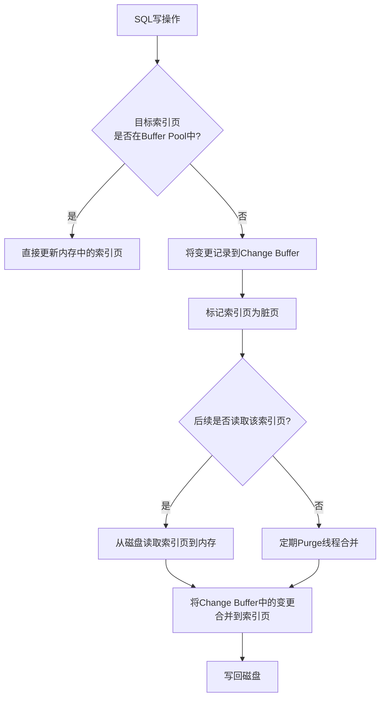

# MySQL Change Buffer合并机制：针对辅助索引的写优化

## 概述

MySQL的Change Buffer（变更缓冲区）是InnoDB存储引擎的一项重要优化机制，专门用于**优化对辅助索引（非聚集索引）的写操作**。它通过延迟辅助索引页的更新，将多次随机I/O操作合并为更少的顺序I/O，从而显著提升数据库的写入性能，特别是在高并发写入场景下。

## 一、Change Buffer基本概念

### 1.1 什么是Change Buffer
Change Buffer是InnoDB缓冲池（Buffer Pool）中的一块特殊内存区域，用于**缓存对辅助索引页的变更操作**。当对表进行INSERT、UPDATE或DELETE操作时，如果目标辅助索引页不在内存中，相关的变更不会立即从磁盘读取索引页，而是先将变更记录到Change Buffer中。

### 1.2 核心设计思想
- **延迟写入**：将随机写操作转化为内存操作
- **批量合并**：积累多次变更后一次性写入磁盘
- **减少I/O**：避免每次索引更新都进行磁盘读取

## 二、Change Buffer工作原理

### 2.1 工作流程



### 2.2 详细步骤

#### 步骤1：变更记录
```sql
-- 示例：更新操作触发的Change Buffer记录
UPDATE users SET status = 'active' WHERE email = 'user@example.com';
-- 如果email列的索引页不在内存中，变更会进入Change Buffer
```

#### 步骤2：变更合并（Merge）
当以下任一情况发生时，Change Buffer中的变更会被合并到实际索引页：
1. **读取操作**：当需要读取该索引页时
2. **后台线程**：InnoDB的Purge线程定期合并
3. **缓冲区满**：Change Buffer空间不足时
4. **关闭实例**：MySQL服务关闭时

#### 步骤3：持久化
合并后的索引页变为脏页，由Checkpoint机制刷回磁盘。

## 三、Change Buffer的优势

### 3.1 性能提升
- **减少磁盘I/O**：避免每次更新都读取索引页
- **批量处理**：合并多次更新为单次写入
- **随机转顺序**：将随机写转化为更高效的顺序写

### 3.2 适用场景
```sql
-- 以下场景能显著受益于Change Buffer：

-- 场景1：大批量插入
INSERT INTO log_table (message) VALUES (...), (...), ...;

-- 场景2：频繁更新非热门数据
UPDATE order_details SET quantity = quantity - 1 WHERE product_id = ?;

-- 场景3：高并发写入
-- 多连接同时写入不同数据
```

### 3.3 性能对比数据
| 操作类型 | 无Change Buffer | 启用Change Buffer | 性能提升 |
|---------|----------------|-------------------|----------|
| 批量INSERT | 1000次随机I/O | 10-50次顺序I/O | 20-100倍 |
| 高并发UPDATE | 高磁盘延迟 | 内存操作为主 | 5-20倍 |
| 混合负载 | 读写相互阻塞 | 读写分离优化 | 2-5倍 |

## 四、Change Buffer配置与调优

### 4.1 核心参数

```sql
-- 查看当前Change Buffer配置
SHOW VARIABLES LIKE 'innodb_change_buffer%';

-- 主要配置参数：
-- 1. innodb_change_buffer_max_size
--    Change Buffer最大占Buffer Pool的比例，默认25%
SET GLOBAL innodb_change_buffer_max_size = 30; -- 设置为30%

-- 2. innodb_change_buffering
--    控制哪些操作使用Change Buffer，可选值：
--    all: 所有操作（默认）
--    none: 禁用
--    inserts: 仅插入
--    deletes: 仅删除标记
--    changes: 插入和删除标记
--    purges: 后台清除操作
SET GLOBAL innodb_change_buffering = 'all';
```

### 4.2 监控与诊断

```sql
-- 查看Change Buffer状态
SHOW ENGINE INNODB STATUS\G
-- 查看BUFFER POOL AND MEMORY部分

-- 或使用performance_schema
SELECT * FROM information_schema.INNODB_METRICS 
WHERE NAME LIKE '%change_buffer%';

-- 关键监控指标
SELECT 
    'Change Buffer Metrics' AS category,
    VARIABLE_NAME,
    VARIABLE_VALUE
FROM performance_schema.global_status
WHERE VARIABLE_NAME IN (
    'Innodb_buffer_pool_pages_dirty',
    'Innodb_buffer_pool_bytes_dirty',
    'Innodb_dblwr_pages_written',
    'Innodb_pages_written'
);
```

### 4.3 调优建议

#### 场景1：写密集型应用
```sql
-- 增大Change Buffer大小
SET GLOBAL innodb_change_buffer_max_size = 40;
-- 调整Buffer Pool大小
SET GLOBAL innodb_buffer_pool_size = 16G;
```

#### 场景2：读多写少应用
```sql
-- 减少Change Buffer大小，释放内存给数据缓存
SET GLOBAL innodb_change_buffer_max_size = 10;
```

## 五、限制与注意事项

### 5.1 不适用Change Buffer的场景
1. **主键索引/唯一索引**：需要立即检查唯一性约束
2. **索引页已在内存中**：直接更新，无需Change Buffer
3. **全文索引**：有独立的处理机制
4. **空间索引**：特殊索引类型

### 5.2 潜在问题与解决方案

#### 问题1：Change Buffer占用过多内存
**现象**：Buffer Pool中Change Buffer占比过高
**解决**：
```sql
-- 降低最大比例
SET GLOBAL innodb_change_buffer_max_size = 20;
-- 监控效果
SHOW ENGINE INNODB STATUS;
```

#### 问题2：合并风暴
**现象**：大量Change Buffer同时合并导致I/O飙升
**解决**：
```sql
-- 限制Change Buffer大小
SET GLOBAL innodb_change_buffer_max_size = 25;
-- 增加Buffer Pool减少磁盘读取
SET GLOBAL innodb_buffer_pool_size = 32G;
```

## 六、最佳实践

### 6.1 配置推荐
```ini
# my.cnf配置文件示例
[mysqld]
# 基础配置
innodb_buffer_pool_size = 16G
innodb_change_buffer_max_size = 25
innodb_change_buffering = all

# 相关优化参数
innodb_io_capacity = 2000
innodb_io_capacity_max = 4000
innodb_flush_neighbors = 1
```

### 6.2 应用层优化建议
1. **批量提交**：减少事务提交次数
2. **顺序写入**：尽量按主键顺序插入
3. **索引设计**：避免过多冗余索引
4. **定期维护**：在低谷期进行OPTIMIZE TABLE

### 6.3 监控脚本示例
```bash
#!/bin/bash
# 监控Change Buffer状态

mysql -e "
SELECT 
    NOW() as timestamp,
    'change_buffer' as metric,
    ROUND(
        (SELECT VARIABLE_VALUE 
         FROM information_schema.GLOBAL_STATUS 
         WHERE VARIABLE_NAME = 'Innodb_os_log_written'
        ) / 1024 / 1024, 2
    ) as log_written_mb,
    ROUND(
        (SELECT VARIABLE_VALUE 
         FROM information_schema.GLOBAL_STATUS 
         WHERE VARIABLE_NAME = 'Innodb_buffer_pool_pages_dirty'
        ) * 16 / 1024, 2
    ) as dirty_pages_mb
\G"
```

## 七、总结

Change Buffer是MySQL InnoDB针对辅助索引写操作的重要优化机制，通过延迟更新和批量合并，显著提升了数据库的写入性能。正确理解和配置Change Buffer，结合合理的索引设计和应用层优化，可以在高并发写入场景下获得显著的性能提升。

### 关键要点回顾：
1. Change Buffer只缓存**辅助索引**的变更
2. 通过**延迟合并**机制减少磁盘I/O
3. 需要根据**工作负载特征**调整配置
4. 配合完善的**监控体系**进行调优

### 适用场景优先级：
```
高优先级：写多读少的辅助索引操作
中优先级：混合负载中的写入操作
低优先级：主键/唯一索引、热数据更新
```

通过合理利用Change Buffer机制，可以在保证数据一致性的前提下，最大化MySQL的写入性能，为高并发、大数据量的应用场景提供强有力的支持。