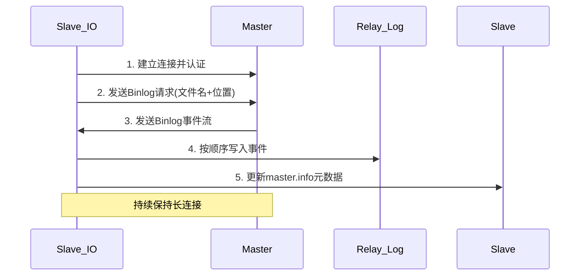
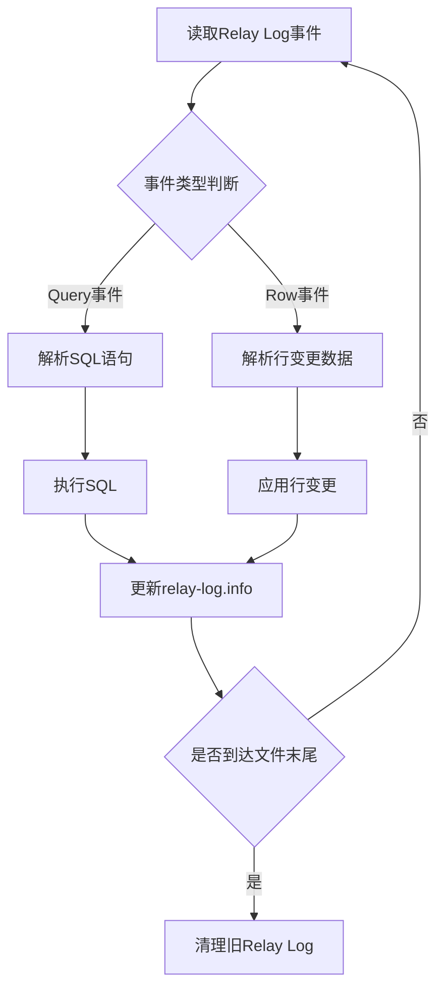
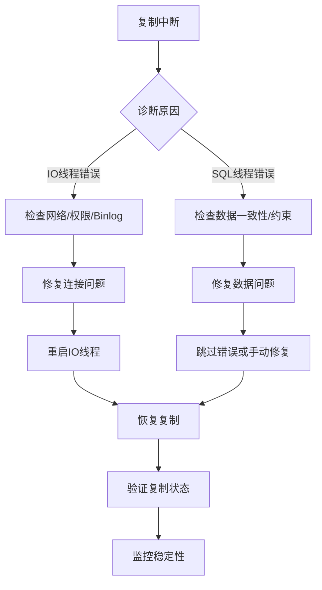

# MySQL主从复制Binlog同步机制详解
## 技术文档

---

## 1. 概述

MySQL主从复制（Master-Slave Replication）是一种基于二进制日志（Binary Log）的数据同步机制，通过将主库的数据变更异步复制到从库，实现数据冗余、读写分离、负载均衡和高可用性。本文档详细解析复制过程中的两个核心线程——IO线程和SQL线程的工作机制。

---

## 2. 主从复制架构

### 2.1 核心组件
```
主库(Master)：
├── Binlog Dump Thread (主库专用)
├── Binary Log (二进制日志文件)
└── 数据变更操作

从库(Slave)：
├── IO Thread (复制接收线程)
├── SQL Thread (复制执行线程)
├── Relay Log (中继日志)
└── 数据应用
```

### 2.2 复制流程概览
```
主库数据变更 → 写入Binary Log → IO线程读取 → 传输到从库 → 写入Relay Log → SQL线程读取 → 应用到从库
```

---

## 3. Binlog二进制日志

### 3.1 Binlog格式
```sql
-- 查看当前Binlog格式
SHOW VARIABLES LIKE 'binlog_format';

-- 三种格式对比
+------------------+---------------------+------------------------+
| 格式类型         | 描述                | 优缺点                 |
+------------------+---------------------+------------------------+
| STATEMENT (SBR)  | 记录SQL语句         | 日志量小，但不确定性大 |
| ROW (RBR)        | 记录行数据变化      | 精确但日志量大         |
| MIXED            | 混合模式            | 平衡策略               |
+------------------+---------------------+------------------------+
```

### 3.2 Binlog文件管理
```sql
-- 查看Binlog状态
SHOW MASTER STATUS;
SHOW BINARY LOGS;

-- 输出示例
+------------------+----------+--------------+------------------+
| File             | Position | Binlog_Do_DB | Binlog_Ignore_DB |
+------------------+----------+--------------+------------------+
| mysql-bin.000003 | 107      |              |                  |
+------------------+----------+--------------+------------------+
```

---

## 4. IO线程详解

### 4.1 功能职责
- **连接主库**：使用复制用户建立到主库的连接
- **请求Binlog**：向主库发送`COM_BINLOG_DUMP`命令请求日志
- **接收日志**：持续接收主库发送的Binlog事件
- **写入Relay Log**：将接收的日志写入从库的中继日志文件

### 4.2 工作流程


### 4.3 状态监控
```sql
-- 查看IO线程状态
SHOW SLAVE STATUS\G
-- 关键字段：
-- Slave_IO_Running: Yes/No (线程运行状态)
-- Master_Log_File: 当前读取的主库Binlog文件
-- Read_Master_Log_Pos: 已读取的位置
-- Relay_Log_File: 正在写入的Relay Log文件
-- Relay_Log_Pos: Relay Log写入位置
-- Last_IO_Error: 最后IO错误信息
```

### 4.4 常见问题处理
```sql
-- IO线程停止的常见原因及处理
-- 1. 网络连接问题
STOP SLAVE IO_THREAD;
START SLAVE IO_THREAD;

-- 2. 主库Binlog被清理
-- 需要重新设置复制起点
CHANGE MASTER TO
    MASTER_LOG_FILE='新的binlog文件',
    MASTER_LOG_POS=新的位置;

-- 3. 认证失败
-- 检查复制用户权限
GRANT REPLICATION SLAVE ON *.* TO 'repl'@'%' IDENTIFIED BY 'password';
```

---

## 5. SQL线程详解

### 5.1 功能职责
- **读取Relay Log**：从中继日志读取Binlog事件
- **解析执行**：解析事件内容并执行对应的SQL或行变更
- **协调延迟**：控制复制延迟，避免资源争用
- **更新状态**：记录已应用的复制位置

### 5.2 工作流程


### 5.3 并行复制机制
```sql
-- MySQL 5.6+ 支持基于库的并行复制
SHOW VARIABLES LIKE 'slave_parallel_workers';
SET GLOBAL slave_parallel_workers = 4;

-- MySQL 5.7+ 支持LOGICAL_CLOCK并行复制
SHOW VARIABLES LIKE 'slave_parallel_type';
SET GLOBAL slave_parallel_type = 'LOGICAL_CLOCK';

-- MySQL 8.0 WRITESET并行复制
SET GLOBAL slave_parallel_type = 'LOGICAL_CLOCK';
SET GLOBAL slave_preserve_commit_order = ON;
```

### 5.4 状态监控
```sql
-- 查看SQL线程状态
SHOW SLAVE STATUS\G
-- 关键字段：
-- Slave_SQL_Running: Yes/No
-- Relay_Master_Log_File: 对应主库Binlog文件
-- Exec_Master_Log_Pos: 已执行的位置
-- Seconds_Behind_Master: 复制延迟秒数
-- Last_SQL_Error: 最后SQL错误信息

-- 查看复制延迟详情
SELECT 
    SERVICE_STATE AS `线程状态`,
    THREAD_ID AS `线程ID`,
    LAST_ERROR_NUMBER AS `错误码`,
    LAST_ERROR_MESSAGE AS `错误信息`,
    LAST_ERROR_TIMESTAMP AS `错误时间`
FROM performance_schema.replication_applier_status_by_worker;
```

### 5.5 常见问题处理
```sql
-- 1. 主键冲突/数据不一致
-- 跳过指定数量的事件
STOP SLAVE;
SET GLOBAL sql_slave_skip_counter = 1;
START SLAVE;

-- 2. 复制延迟过大
-- 优化方案：
-- a) 启用并行复制
SET GLOBAL slave_parallel_workers = 8;

-- b) 调整relay log设置
SET GLOBAL relay_log_recovery = ON;
SET GLOBAL sync_relay_log = 1000;

-- c) 优化从库硬件配置

-- 3. SQL线程错误停止
-- 查看具体错误
SHOW SLAVE STATUS\G

-- 常用恢复步骤
STOP SLAVE;
-- 手动修复数据不一致
START SLAVE SQL_THREAD;
```

---

## 6. 线程协同与故障恢复

### 6.1 线程协调机制
```sql
-- 查看线程协同状态
SELECT 
    'IO_THREAD' AS Thread,
    PROCESSLIST_STATE AS State
FROM performance_schema.threads 
WHERE NAME LIKE '%slave_io%'
UNION ALL
SELECT 
    'SQL_THREAD' AS Thread,
    PROCESSLIST_STATE AS State
FROM performance_schema.threads 
WHERE NAME LIKE '%slave_sql%';

-- 监控复制延迟
SELECT 
    TIMEDIFF(NOW(), 
        STR_TO_DATE(
            SUBSTRING_INDEX(
                SUBSTRING_INDEX(
                    SHOW_SLAVE_STATUS, 
                    'Master_Log_File:', 
                    -1
                ), 
                ';', 
                1
            ), 
            '%Y-%m-%d %H:%i:%s'
        )
    ) AS Replication_Delay
FROM information_schema.processlist 
WHERE COMMAND = 'Binlog Dump';
```

### 6.2 故障恢复流程


### 6.3 自动故障恢复配置
```ini
# my.cnf 配置示例
[mysqld]
# 自动重新连接
master-retry-count = 86400
master-connect-retry = 60

# 复制安全设置
relay-log-recovery = ON
relay-log-purge = ON

# 从库只读
read-only = ON
super-read-only = ON
```

---

## 7. 性能优化建议

### 7.1 IO线程优化
```sql
-- 1. 调整网络参数
SET GLOBAL slave_net_timeout = 60;  -- 默认3600秒

-- 2. 批量写入Relay Log
SET GLOBAL sync_relay_log = 1000;
SET GLOBAL sync_master_info = 1000;

-- 3. 压缩传输（MySQL 8.0+）
CHANGE MASTER TO 
    MASTER_COMPRESSION_ALGORITHS='zlib',
    MASTER_ZSTD_COMPRESSION_LEVEL=3;
```

### 7.2 SQL线程优化
```sql
-- 1. 启用并行复制
SET GLOBAL slave_parallel_workers = 8;
SET GLOBAL slave_parallel_type = 'LOGICAL_CLOCK';

-- 2. 调整事务大小
SET GLOBAL slave_transaction_retries = 10;
SET GLOBAL slave_checkpoint_period = 300;

-- 3. 优化从库配置
-- 增大缓冲池
SET GLOBAL innodb_buffer_pool_size = 8G;

-- 禁用不必要的从库约束
SET GLOBAL foreign_key_checks = 0;
SET GLOBAL unique_checks = 0;
```

### 7.3 监控脚本示例
```bash
#!/bin/bash
# 复制状态监控脚本

MYSQL_CMD="mysql -u monitor -p'password'"

check_replication_status() {
    $MYSQL_CMD -e "SHOW SLAVE STATUS\G" | grep -E \
        "Slave_IO_Running|Slave_SQL_Running|Seconds_Behind_Master|Last_IO_Error|Last_SQL_Error"
}

# 定期检查
while true; do
    echo "=== $(date) ==="
    check_replication_status
    sleep 60
done
```

---

## 8. 最佳实践

### 8.1 部署建议
1. **版本一致性**：主从MySQL版本尽量保持一致
2. **网络配置**：主从间网络延迟应低于1ms，带宽充足
3. **硬件规划**：从库配置不低于主库，特别是磁盘IO性能
4. **监控体系**：建立完整的复制监控和告警机制

### 8.2 运维实践
1. **定期检查**：每日检查复制状态和延迟
2. **备份策略**：从库备份避免影响主库性能
3. **故障演练**：定期进行主从切换演练
4. **文档维护**：保持复制拓扑图的更新

### 8.3 安全建议
1. **权限最小化**：复制用户仅需REPLICATION SLAVE权限
2. **网络隔离**：复制流量走专用网络
3. **加密传输**：启用SSL加密复制连接
4. **审计日志**：记录复制相关操作

---

## 9. 总结

MySQL主从复制通过IO线程和SQL线程的协同工作，实现了高效可靠的数据同步。理解这两个线程的工作原理、监控方法和优化策略，对于构建稳定的复制环境至关重要。随着MySQL版本的演进，复制机制也在不断优化（如并行复制、组复制等），建议根据业务需求选择合适的复制方案。

---

## 附录

### A. 常用命令速查
```sql
-- 启动/停止复制
START SLAVE;
STOP SLAVE;

-- 启动/停止指定线程
START SLAVE IO_THREAD;
STOP SLAVE SQL_THREAD;

-- 重置复制
RESET SLAVE ALL;

-- 查看复制拓扑
SELECT * FROM mysql.slave_master_info;
SELECT * FROM mysql.slave_relay_log_info;
```

### B. 参考文档
1. MySQL官方文档：Replication Implementation
2. MySQL High Availability Solutions
3. MySQL Troubleshooting Replication Problems

---

**文档版本**：1.0  
**最后更新**：2024年1月  
**适用版本**：MySQL 5.7+  
**维护团队**：数据库运维组