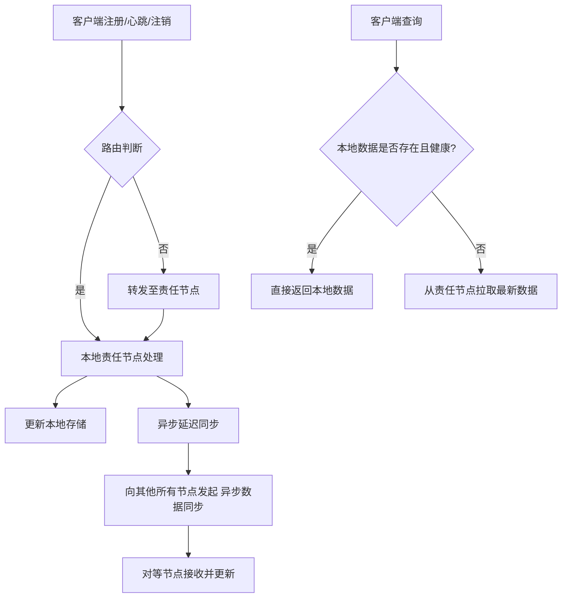

好的，这是一份详细的技术文档，主题为 **《Nacos集群Distro协议(AP临时实例同步)》**。

---

# **Nacos集群Distro协议技术文档：AP临时实例同步详解**

| **版本** | **修订日期** | **修订内容** | **作者** |
| :--- | :--- | :--- | :--- |
| V1.0 | 2023-10-27 | 初始版本，涵盖核心概念、流程与原理 | AI Assistant |

## **1. 文档概述**

### **1.1 文档目的**
本文档旨在深入解析阿里巴巴开源的微服务配置与注册中心 **Nacos** 在集群模式下，用于**临时实例**数据同步的 **Distro 协议** 的设计原理、工作流程、关键特性及配置要点。本文档面向系统架构师、后端开发工程师以及对分布式系统数据一致性感兴趣的读者。

### **1.2 核心概念**
*   **Nacos**: 一个动态服务发现、配置管理和服务管理平台。
*   **临时实例**: 客户端（服务实例）通过心跳（默认5秒）向注册中心保活。如果注册中心在指定时间（默认15秒）内未收到心跳，则认为该实例不健康；超过更长时间（默认30秒）未收到心跳，则会自动删除该实例。其生命周期由客户端心跳维持。
*   **持久实例**: 实例信息被持久化到Nacos的存储层（如MySQL），即使实例下线，其信息也不会被自动删除，需要手动注销。
*   **AP模式**: 在CAP定理中，优先保证**可用性（Availability）** 和**分区容错性（Partition Tolerance）**，在数据一致性上采用最终一致性模型。这是处理服务发现场景的常见选择。
*   **Distro协议**: Nacos为**临时实例**的AP数据同步而自研的一种最终一致性、去中心化的数据复制协议。

## **2. 背景与需求**

在微服务架构中，服务注册与发现是核心组件。对于注册中心，服务实例的**健康状态**需要被快速、准确地感知并同步到整个集群。特别是对于临时实例，其上下线频繁，对同步的**实时性、可用性**要求极高，而对**强一致性**的要求相对宽松（允许秒级的延迟感知）。

Nacos设计了两种数据处理模式来应对不同场景：
*   **CP模式 (Raft协议)**: 用于**配置管理**和**持久实例**，优先保证数据强一致性。
*   **AP模式 (Distro协议)**: 用于**临时实例**，优先保证高可用性和分区容错性。

**为什么临时实例选用AP模式？**
在发生网络分区时，如果坚持CP，可能导致整个注册中心在分区期间不可用，这会阻止剩余健康节点上的服务正常注册和发现，引发更大范围的故障。而AP模式允许每个分区继续独立运行，服务间调用可能拿到不是最新的实例列表，但系统整体仍可用，这通常比完全不可用更能容忍。

## **3. Distro协议核心设计**

Distro协议的设计哲学是 **“人人为我，我为人人”** 和 **“分层管理”**。

### **3.1 核心原则**
1.  **去中心化**: Distro集群中的每个节点都是对等的（Peer to Peer），没有传统意义上的Master/Slave角色。每个节点都负责全量数据的一个子集。
2.  **最终一致性**: 不保证数据的实时强一致，但保证在一定延迟（通常在秒级）后，所有健康节点的数据将达到一致状态。
3.  **分片负责制 (Data Sharding)**: 整个集群的临时实例数据被逻辑分片。每个Nacos节点被预先分配一个或多个数据分片，成为这些分片的 **“责任节点”**。一个数据分片在同一时刻只有一个责任节点。

### **3.2 数据分片机制**
*   **分片键**: 通常使用 **`Service Name` + `Cluster Name`** 的组合作为分片键。
*   **分片算法**: 采用**一致性哈希**或改进的哈希取模算法，将分片键映射到具体的Nacos节点上。
*   **责任节点**: 对于某个服务（如 `userservice@DEFAULT`）的临时实例，其所有写操作（注册、心跳、注销）必须被发送到其对应的**责任节点**上处理。该节点是这份数据的唯一“源头”。

## **4. 数据同步流程详解**

以下流程图概括了Distro协议的核心数据流：



### **4.1. 写操作流程（注册、心跳、注销）**
1.  **客户端请求**: 客户端向**任意一个**Nacos节点发起写请求。
2.  **请求路由**:
    *   该节点收到请求后，根据分片键计算责任节点。
    *   如果**自己就是责任节点**，则直接进行第3步。
    *   如果**自己不是责任节点**，则将请求**HTTP重定向或代理转发**到计算出的责任节点。客户端后续会直接与责任节点通信。
3.  **责任节点处理**:
    *   责任节点在本地内存中执行数据写入/更新操作。
    *   操作成功后，**立即响应客户端**，告知操作成功。此时数据仅在责任节点生效。
4.  **异步数据同步**:
    *   责任节点在处理完写操作后，**不会立即同步**给其他节点。
    *   它会启动一个**延迟任务**（例如延迟500ms），将此次变更的数据（一个`Data`对象）打包，通过**批量、异步**的方式，主动推送给集群中**除自己外**的所有其他对等节点。
    *   接收节点验证数据摘要后，更新自己的本地存储。

### **4.2. 读操作流程（服务发现）**
1.  **客户端查询**: 客户端向**任意一个**Nacos节点发起查询请求（获取服务实例列表）。
2.  **本地响应**: 节点直接查询自己的本地存储，并返回结果。
    *   **优点**: 极快，没有跨节点通信开销，保证了高可用性。
    *   **潜在问题**: 可能返回**过时数据**（Stale Data）。例如，一个新实例在责任节点注册，但尚未同步到当前查询节点。这就是**最终一致性**的体现。
3.  **健康检查补偿**: 为了防止返回过多不健康实例，每个节点都会独立对本地实例执行心跳检查。如果某个实例超时，该节点会将其标记为不健康或删除，即使它可能在责任节点上还是健康的。这保证了读操作的“最终正确性”。

### **4.3. 集群节点间的健康检查与数据校验**
1.  **双向心跳**: 每个Distro节点会定期向其他所有节点发送心跳，用于检测节点存活状态。
2.  **数据校验与全量同步**:
    *   当有新节点加入集群，或某个节点重启后重新加入时，它会与其他节点进行**数据校验**。
    *   节点间会交换数据的**校验和（Checksum）**。
    *   如果发现数据不一致，会触发**全量数据拉取**，从数据“更全”的节点同步全量数据，以快速达到一致状态。

## **5. 集群部署与关键配置**

### **5.1 集群搭建**
在 `conf/cluster.conf` 文件中列出所有集群节点的IP:Port。
```properties
# cluster.conf 示例
192.168.1.101:8848
192.168.1.102:8848
192.168.1.103:8848
```

### **5.2 关键配置项**
在 `application.properties` 中：
```properties
# Distro协议相关
# 数据同步延迟时间，单位毫秒
nacos.naming.distro.task.delay=500
# 数据同步批处理大小
nacos.naming.distro.batch.sync.key.count=1000
# 数据同步任务执行周期，单位毫秒
nacos.naming.distro.sync.retry.delay=5000

# 临时实例健康检查
# 实例心跳间隔，单位秒
nacos.naming.health-check.heartbeat-interval=5
# 实例健康检查超时时间，单位秒
nacos.naming.health-check.heartbeat-timeout=15
# 实例自动删除时间，单位秒
nacos.naming.health-check.delete-timeout=30
```

## **6. 总结：Distro协议的优缺点**

### **6.1 优势**
*   **高可用性**: 读操作全本地化，写操作有明确路由，无中心瓶颈。单节点故障不影响整体服务发现功能。
*   **低延迟**: 客户端读写都能得到快速响应，特别适合高并发、低延迟的服务发现场景。
*   **分区容错性 (AP)**: 在网络分区时，各分区仍能独立提供服务，符合服务发现场景的容灾需求。
*   **简单高效**: 协议设计相对简单，避免了Raft等强一致性协议复杂的选举和日志复制开销。

### **6.2 局限性与注意事项**
*   **数据最终一致性**: 在同步延迟窗口期内，不同节点可能看到不同的实例列表。应用需要具备一定的容错能力（如重试、负载均衡到健康实例）。
*   **写操作放大**: 一次客户端写操作，会触发责任节点向所有其他节点同步，网络流量为 `O(N)`。在大规模集群中，这可能成为瓶颈。Nacos通过批量、延迟同步来缓解。
*   **脑裂问题下的数据冲突**: 在极端网络分区（脑裂）情况下，两个分区可能各自接收了同一个服务的不同实例注册，且无法同步。当网络恢复时，需要基于时间戳或版本号进行冲突合并，Distro协议的冲突解决机制相对简单。
*   **适用场景特定**: 专为临时实例设计，不适用于要求强一致性的配置数据或持久实例数据。

---
**结论**：Nacos的Distro协议是一种为服务发现场景量身定制的、优秀的AP型数据同步协议。它通过在可用性、一致性和性能之间做出精妙的权衡，满足了微服务架构中对临时实例状态管理的高可用、低延迟的核心诉求。理解其原理对于正确部署、运维Nacos集群以及排查相关问题至关重要。