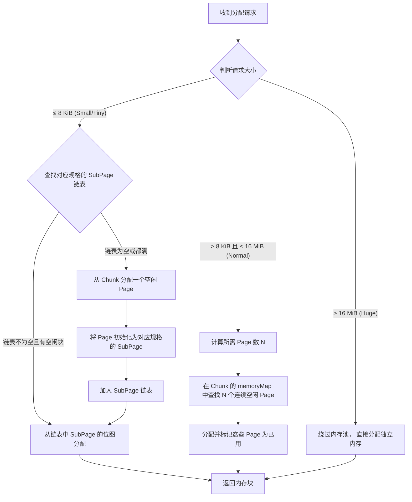

好的，遵照您的要求，我为您生成一份关于 Netty `PooledByteBufAllocator` 及其核心组件 `Chunk`、`Page`、`SubPage` 的技术文档。

---

# **Netty 内存池技术详解：PooledByteBufAllocator 与 Chunk/Page/SubPage**

## **1. 文档简介**

本文档旨在深入剖析 Netty 高性能内存分配的核心机制——`PooledByteBufAllocator`，并详细解释其底层管理单元 `Chunk`、`Page` 和 `SubPage` 的设计原理、协作关系及其对性能产生的关键影响。通过理解这套分层管理模型，开发者可以更好地优化 Netty 应用，规避内存相关问题。

## **2. 核心设计目标**

Netty 内存池的设计主要为了解决以下两个核心问题：
1.  **减少内存碎片**：通过规范化、分层化的内存块管理，减少因频繁分配和释放不同大小对象而产生的堆外或堆内内存碎片。
2.  **降低分配/回收开销**：通过复用已申请的内存块，避免频繁的底层系统调用（如 `malloc/free` 或 `ByteBuffer.allocateDirect`），从而大幅提升性能，降低 GC 压力。

## **3. 总体架构概览**

`PooledByteBufAllocator` 是 Netty 默认的、也是推荐使用的内存分配器。它采用了一种**分层化、区域化**的内存管理策略，其核心思想可以类比为 **“图书馆管理系统”**：
- **整个图书馆** 对应 **`PooledByteBufAllocator`**。
- **一个巨型书库** 对应 **`Chunk`**。
- **书库中的一个标准书架** 对应 **`Page`**。
- **书架上的一个格子** 对应 **`SubPage`**。

当申请内存时，分配器会根据请求的大小，决定从哪个层级的“容器”中进行分配。

## **4. 核心组件详解**

### **4.1 Chunk (块)**
*   **概念**：`Chunk` 是 Netty 内存池中最大的一块连续内存单元。默认大小为 **16 MiB**。
*   **物理结构**：一个 `Chunk` 本质上是一个 `byte[]`（堆内存）或 `DirectByteBuffer`（直接内存）。它是向操作系统或 JVM 堆申请内存的基本单位。
*   **逻辑结构**：每个 `Chunk` 被逻辑上等分为 **2048 个 `Page`**。因此，默认情况下每个 `Page` 的大小为 `16 MiB / 2048 = 8 KiB`。
*   **管理职责**：`Chunk` 使用一个 `long[]` 类型的**位图（`memoryMap`）** 来管理其内部所有 `Page` 的分配状态。通过位运算可以高效地查找和标记空闲/已用的 `Page`。

**图示：Chunk 结构**
```
+-------------------------------------------------------------------+
|                            Chunk (16 MiB)                         |
|-------------------------------------------------------------------|
| Page0 (8 KiB) | Page1 (8 KiB) | Page2 (8 KiB) | ... | Page2047   |
+-------------------------------------------------------------------+
```

### **4.2 Page (页)**
*   **概念**：`Page` 是 `Chunk` 内部的标准分配单元，大小固定为 **8 KiB**。
*   **分配场景**：当申请的内存大小 **大于 8 KiB（`chunkSize/2048`）但小于或等于 16 MiB（`chunkSize`）** 时，分配器会从某个 `Chunk` 中分配一个或多个**连续的 `Page`** 给请求方。
    *   `申请大小 <= 8 KiB`：由 `SubPage` 处理。
    *   `8 KiB < 申请大小 <= 16 MiB`：计算需要多少个 `Page`（`n`），并查找 `Chunk` 中连续的 `n` 个空闲 `Page` 进行分配。
*   **分配算法**：`Chunk` 使用基于**完全二叉树**的伙伴算法（简化版）来管理和查找连续空闲 `Page`。`memoryMap` 数组就是这棵树的表示，每个节点记录了其管理区域的使用情况，使得查找和合并操作非常高效（O(logN)）。

### **4.3 SubPage (子页)**
*   **概念**：`SubPage` 是 `Page` 的进一步细分，用于处理**小内存**（通常指 `<= 8 KiB`）的高效分配，是解决内存碎片问题的关键。
*   **创建**：当一个 `Page` 被首次用于分配小对象时，它会被初始化为一个或多个 `SubPage`。一个 `Page`（8 KiB）可以根据请求的 `elemSize` 被划分为多个等大的块。
    *   例如：请求大小为 256 Bytes，则一个 `Page` 可以划分为 `8 KiB / 256 B = 32` 个块。这个 `Page` 就成为了一个管理 256 Bytes 块的 `SubPage`。
*   **管理机制**：
    *   **双向链表**：Netty 为每个规格（`elemSize`）的 `SubPage` 维护了一个链表（`tinySubpagePools`, `smallSubpagePools`）。分配时，首先尝试从链表中获取一个已有且未满的 `SubPage`。
    *   **位图管理**：每个 `SubPage` 使用一个 `long` 或 `bitmap` 来管理其内部众多小块的分配状态。每一个 bit 代表一个小块是否已被分配。这使得管理开销极低。

**图示：SubPage 内部管理**
```
一个 Page (8 KiB) 被划分为 32 个元素 (每个 256 Bytes)
+-------------------------------------------------------------------+
| elem0 | elem1 | elem2 | ... | elem31                             |
+-------------------------------------------------------------------+
位图 bitmap (一个 long 类型，假设有64位，这里用32位示意):
bitmap = 0b00000000_00000000_00000000_00000101 (表示 elem0 和 elem2 已被分配)
```

## **5. 分配流程与规格分类**

### **5.1 内存规格 (Size Classes)**
Netty 将小内存请求分为两类进行优化管理：
1.  **Tiny**：`0 B < size < 512 B`。以 16 Bytes 对齐，有 `16, 32, 48, ..., 496` 共 31 种规格。
2.  **Small**：`512 B <= size <= 8 KiB (PageSize)`。以 2 的幂次对齐（类似 `Arena` 设计），有 `512, 1024, 2048, 4096, 8192` 共 5 种规格。
3.  **Normal**：`8 KiB < size <= 16 MiB (ChunkSize)`。按 `Page` 的整数倍进行分配。
4.  **Huge**：`size > 16 MiB`。不经过内存池，直接分配独立的大内存块。

### **5.2 分配决策流程图**



## **6. 关键优势与注意事项**

### **优势**
1.  **高性能**：通过多级缓存（线程本地缓存 -> `Arena` 级缓存 -> `Chunk` 级分配）和高效位图算法，极大提升了并发分配效率。
2.  **低碎片**：`SubPage` 机制有效减少了小对象分配产生的内部碎片；`Chunk` 内伙伴算法减少了外部碎片。
3.  **可预测性**：由于内存是从预分配的大块中划分，内存使用和增长模式更加可控，避免了因系统内存分配不稳定导致的性能波动。

### **注意事项**
1.  **内存占用**：内存池会预先持有一些 `Chunk`，即使应用实际使用量不高，也可能占用较多内存。可通过系统属性（如 `-Dio.netty.allocator.pageSize`）进行调优。
2.  **泄漏检测**：必须与 Netty 提供的 `ResourceLeakDetector` 结合使用，因为池化内存的释放是归还到池中，传统的 GC 日志难以发现泄漏。
3.  **线程本地缓存**：每个线程的本地缓存（`ThreadCache`）虽然提升了性能，但在高并发、长连接场景下，可能导致内存长时间不释放。需要监控或适当调整缓存参数。

## **7. 总结**

Netty 的 `PooledByteBufAllocator` 通过 `Chunk`、`Page`、`SubPage` 三层精妙的分级管理结构，结合**规格化分类**和**位图索引**，构建了一个高效、低碎片的内存管理系统。它完美平衡了**分配速度**和**内存利用率**，是 Netty 能够支撑百万级连接和高吞吐量网络通信的基石之一。深入理解其原理，有助于开发者在进行高性能网络编程时做出更合理的设计和调优决策。