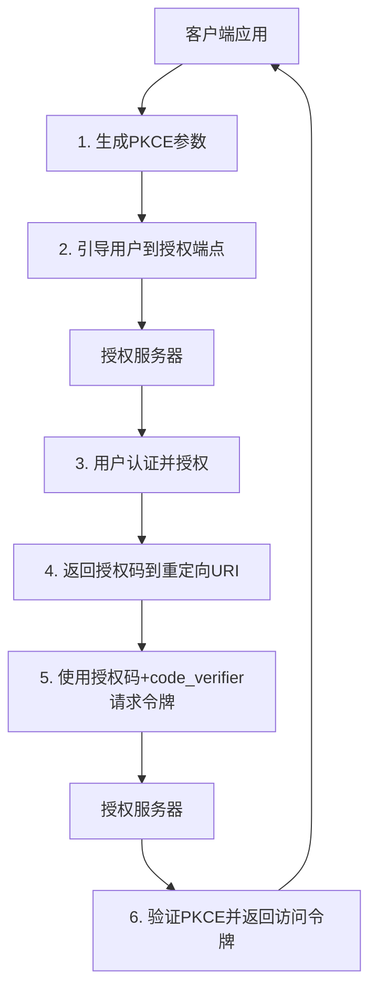

# OAuth 2.0授权码模式（PKCE增强）技术文档

## 1. 概述

### 1.1 文档目的
本文档详细阐述OAuth 2.0授权码模式结合PKCE（Proof Key for Code Exchange）扩展的安全实现机制，旨在为开发人员提供清晰的技术指导和安全实践。

### 1.2 适用范围
- 原生移动应用程序
- 单页应用程序（SPA）
- 桌面应用程序
- 任何无法安全存储客户端密钥的公共客户端

## 2. 核心概念

### 2.1 标准授权码模式的局限性
传统授权码模式依赖客户端密钥进行身份验证，但在以下场景中存在安全隐患：
- 移动应用：客户端密钥可能被反编译获取
- SPA应用：客户端密钥暴露在前端代码中
- 恶意应用：可能截获授权码进行重放攻击

### 2.2 PKCE的核心机制
PKCE通过引入动态生成的密码学凭证，解决了授权码可能被截获的问题：
- **code_verifier**：客户端生成的随机字符串
- **code_challenge**：code_verifier的加密变换结果
- **code_challenge_method**：加密方法（通常为S256）

## 3. 完整工作流程

### 3.1 流程概览


### 3.2 详细步骤

#### 步骤1：客户端生成PKCE参数
```javascript
// 生成code_verifier（43-128字符）
const generateCodeVerifier = () => {
    const array = new Uint32Array(32);
    crypto.getRandomValues(array);
    return base64urlEncode(array);
};

// 生成code_challenge（使用S256方法）
const generateCodeChallenge = (verifier) => {
    const encoder = new TextEncoder();
    const data = encoder.encode(verifier);
    return crypto.subtle.digest('SHA-256', data)
        .then(hash => base64urlEncode(new Uint8Array(hash)));
};

// Base64URL编码函数
const base64urlEncode = (buffer) => {
    return btoa(String.fromCharCode(...new Uint8Array(buffer)))
        .replace(/=/g, '')
        .replace(/\+/g, '-')
        .replace(/\//g, '_');
};
```

#### 步骤2：发起授权请求
```
GET /authorize?
  response_type=code
  &client_id=CLIENT_ID
  &redirect_uri=https://app.example.com/callback
  &scope=read write
  &state=xyz123
  &code_challenge=CODE_CHALLENGE
  &code_challenge_method=S256
```

**参数说明：**
- `code_challenge`: 步骤1生成的challenge值
- `code_challenge_method`: 固定为"S256"
- `state`: 防止CSRF攻击的随机值

#### 步骤3：用户授权
用户完成身份验证并授权后，授权服务器返回：
```
HTTP/1.1 302 Found
Location: https://app.example.com/callback?
  code=AUTHORIZATION_CODE
  &state=xyz123
```

#### 步骤4：交换访问令牌
```javascript
POST /token HTTP/1.1
Host: auth.server.com
Content-Type: application/x-www-form-urlencoded

grant_type=authorization_code
&code=AUTHORIZATION_CODE
&redirect_uri=https://app.example.com/callback
&client_id=CLIENT_ID
&code_verifier=CODE_VERIFIER
```

#### 步骤5：令牌响应
```json
{
  "access_token": "eyJhbGciOiJIUzI1NiIs...",
  "token_type": "Bearer",
  "expires_in": 3600,
  "refresh_token": "tGzv3JOkF0XG5Qx2TlKWIA",
  "scope": "read write"
}
```

## 4. 安全机制详解

### 4.1 防止授权码截获攻击
```
攻击者截获场景对比：

传统模式：
1. 攻击者截获授权码
2. 攻击者直接使用授权码获取令牌 ❌

PKCE模式：
1. 攻击者截获授权码
2. 攻击者缺少code_verifier
3. 令牌请求失败 ✅
```

### 4.2 密码学保证
- **单向性**：SHA-256的不可逆特性确保无法从challenge推导出verifier
- **随机性**：code_verifier的高熵值防止暴力破解
- **时效性**：授权码和verifier的短期有效性

## 5. 实现要求

### 5.1 客户端要求
1. **存储安全**：在本地安全存储code_verifier（推荐使用安全存储API）
2. **传输安全**：必须使用HTTPS
3. **随机性保证**：code_verifier必须包含高熵随机值

### 5.2 服务器端要求
```python
class PKCEValidator:
    def validate_code_verifier(self, code_verifier, stored_challenge):
        # 重新计算challenge
        calculated_challenge = self.calculate_challenge(code_verifier)
        
        # 恒定时间比较防止时序攻击
        return self.constant_time_compare(
            calculated_challenge, 
            stored_challenge
        )
    
    def calculate_challenge(self, verifier):
        import hashlib
        import base64
        
        digest = hashlib.sha256(verifier.encode()).digest()
        return base64.urlsafe_b64encode(digest).decode().rstrip('=')
    
    def constant_time_compare(self, val1, val2):
        # 实现恒定时间字符串比较
        pass
```

## 6. 最佳实践

### 6.1 参数配置建议
```yaml
# PKCE配置最佳值
pkce_config:
  code_verifier:
    length: 43-128  # RFC推荐
    charset: "A-Za-z0-9-._~"  # URL安全字符
  code_challenge:
    method: S256  # 强制使用S256，避免plain
  expiration:
    auth_code: 600  # 授权码10分钟有效期
    verifier: 600   # verifier相同有效期
```

### 6.2 安全增强措施
1. **绑定验证**：将PKCE参数与用户会话绑定
2. **速率限制**：对令牌端点实施请求限制
3. **监控告警**：记录失败的PKCE验证尝试

### 6.3 错误处理
```json
{
  "error": "invalid_grant",
  "error_description": "Invalid code verifier"
}
```
常见错误码：
- `invalid_request`: PKCE参数缺失或格式错误
- `invalid_grant`: code_verifier验证失败
- `unsupported_code_challenge_method`: 不支持的challenge方法

## 7. 兼容性考虑

### 7.1 向后兼容
- PKCE是OAuth 2.0的扩展，不影响传统授权码流程
- 可通过`code_challenge`参数的有无判断是否启用PKCE

### 7.2 多平台支持
```javascript
// 检测平台并选择适当的存储方案
const PKCEStorage = {
  getStorage() {
    if (window.cordova) {
      return cordova.plugins.SecureStorage;
    } else if (window.ReactNative) {
      return require('react-native-keychain');
    } else {
      return window.sessionStorage; // 仅限SPA
    }
  }
};
```

## 8. 测试用例

### 8.1 单元测试要点
```javascript
describe('PKCE Flow', () => {
  it('应生成有效的code_verifier', () => {
    const verifier = generateCodeVerifier();
    expect(verifier).to.match(/^[A-Za-z0-9\-._~]{43,128}$/);
  });
  
  it('code_challenge应正确计算', async () => {
    const verifier = "test_verifier";
    const challenge = await generateCodeChallenge(verifier);
    // 验证challenge正确性
  });
  
  it('应拒绝过期的PKCE参数', () => {
    // 测试时效性验证
  });
});
```

## 9. 附录

### 9.1 相关RFC文档
- [RFC 6749: OAuth 2.0框架](https://tools.ietf.org/html/rfc6749)
- [RFC 7636: PKCE扩展](https://tools.ietf.org/html/rfc7636)
- [RFC 8252: OAuth 2.0用于原生应用](https://tools.ietf.org/html/rfc8252)

### 9.2 安全考虑清单
- [ ] 始终使用S256方法，避免plain方法
- [ ] 验证重定向URI的完整匹配
- [ ] 实现CSRF保护（state参数）
- [ ] 使用HTTPS传输所有请求
- [ ] 定期轮换客户端密钥（如使用）

### 9.3 性能优化建议
1. **缓存策略**：缓存code_challenge验证结果
2. **并行处理**：授权码验证与PKCE验证并行执行
3. **连接复用**：保持到授权服务器的持久连接

---

**文档版本**：1.0  
**最后更新**：2024年  
**作者**：技术架构团队  
**审批状态**：已审核 ✅

*注意：实际实施时应根据具体业务需求和安全要求进行调整。建议定期进行安全审计和渗透测试。*