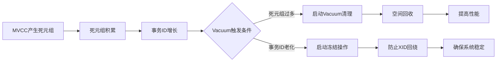

# PostgreSQL MVCC 与 Vacuum 机制技术文档

## 1. 引言

### 1.1 文档目的
本文档旨在深入解析PostgreSQL中多版本并发控制（MVCC）和Vacuum机制的工作原理、交互关系及最佳实践，为数据库管理员和开发人员提供全面的技术参考。

### 1.2 适用对象
- PostgreSQL数据库管理员
- 数据库开发工程师
- 系统架构师
- 对数据库内部机制感兴趣的技术人员

## 2. MVCC（多版本并发控制）机制

### 2.1 MVCC基本概念

#### 2.1.1 什么是MVCC
MVCC是一种并发控制方法，允许读操作不阻塞写操作，写操作不阻塞读操作，通过维护数据的多个版本实现高并发访问。

#### 2.1.2 MVCC的优势
- 提高并发性能
- 避免读写锁冲突
- 提供一致性视图

### 2.2 PostgreSQL中的MVCC实现

#### 2.2.1 系统列
```sql
-- 每个表都有以下隐藏系统列
xmin：插入该行版本的事务ID
xmax：删除/更新该行版本的事务ID（初始为0）
ctid：行版本在表中的物理位置
cmin/cmax：命令标识符（已弃用，事务内使用）
```

#### 2.2.2 行版本（Tuple）结构
```
+-------------------+-------------------+-------------------+
| 行头信息          | 用户数据          | 可选：TOAST指针   |
| (23字节)          |                   |                   |
+-------------------+-------------------+-------------------+
包含：xmin, xmax, ctid, 可见性标志等
```

### 2.3 事务可见性判断

#### 2.3.1 事务ID（XID）管理
- 事务ID为32位无符号整数
- 每20亿事务循环一次
- 使用模运算处理事务ID比较

#### 2.3.2 可见性规则
```python
# 简化的可见性判断逻辑
def is_tuple_visible(tuple_xmin, tuple_xmax, current_xid, snapshot):
    # 规则1：创建事务必须已提交且对当前事务可见
    if not is_xid_visible(tuple_xmin, snapshot):
        return False
    
    # 规则2：行未被删除，或删除事务对当前事务不可见
    if tuple_xmax != 0 and is_xid_visible(tuple_xmax, snapshot):
        return False
    
    # 规则3：行未被同一事务中更早的命令删除
    if in_same_transaction_and_earlier_command():
        return False
    
    return True
```

#### 2.3.3 快照（Snapshot）
```c
typedef struct SnapshotData
{
    TransactionId xmin;      /* 所有XID < xmin的事务可见 */
    TransactionId xmax;      /* 所有XID >= xmax的事务不可见 */
    TransactionId *xip;      /* 进行中的事务列表 */
    uint32 xcnt;            /* 进行中事务数量 */
    /* ... 其他字段 ... */
} SnapshotData;
```

### 2.4 MVCC与隔离级别

#### 2.4.1 支持的隔离级别
1. **读已提交（Read Committed）** - 默认级别
   - 每个语句看到的是语句开始时已提交的数据
2. **可重复读（Repeatable Read）**
   - 整个事务看到的是事务开始时已提交的数据
3. **可序列化（Serializable）**
   - 真正的串行执行

#### 2.4.2 隔离级别实现差异
```sql
-- 示例：不同隔离级别的行为差异
-- 会话A
BEGIN TRANSACTION ISOLATION LEVEL REPEATABLE READ;
SELECT * FROM accounts WHERE id = 1;  -- 返回余额1000

-- 会话B（同时执行）
UPDATE accounts SET balance = 800 WHERE id = 1;
COMMIT;

-- 会话A再次查询
SELECT * FROM accounts WHERE id = 1;  -- 仍返回1000（可重复读）
```

## 3. Vacuum机制

### 3.1 Vacuum的必要性

#### 3.1.1 死元组（Dead Tuple）问题
```sql
-- 更新操作产生死元组
UPDATE users SET status = 'inactive' WHERE id = 1;
-- 原行变为死元组，新行占用额外空间
```

#### 3.1.2 事务ID回绕问题
- 事务ID耗尽导致数据库宕机
- 需要定期冻结（freeze）旧事务ID

### 3.2 Vacuum类型

#### 3.2.1 标准Vacuum
```sql
-- 手动执行标准Vacuum
VACUUM [VERBOSE] [ANALYZE] table_name;

-- 参数说明：
-- VERBOSE：显示详细处理信息
-- ANALYZE：同时更新统计信息
```

#### 3.2.2 Vacuum Full
```sql
-- 完全重建表，需要排它锁
VACUUM FULL table_name;
```

**对比表：标准Vacuum vs Vacuum Full**
| 特性 | 标准Vacuum | Vacuum Full |
|------|------------|-------------|
| 锁级别 | 共享锁 | 排它锁 |
| 空间回收 | 标记可用，不归还OS | 归还OS |
| 执行时间 | 快 | 慢（重建表） |
| 对业务影响 | 小 | 大 |

#### 3.2.3 Autovacuum
```ini
# postgresql.conf 相关配置
autovacuum = on                    # 启用自动清理
autovacuum_vacuum_threshold = 50   # 触发清理的死元组最小数量
autovacuum_analyze_threshold = 50  # 触发分析的阈值
autovacuum_vacuum_scale_factor = 0.2  # 清理触发系数（表大小的百分比）
autovacuum_analyze_scale_factor = 0.1 # 分析触发系数
autovacuum_max_workers = 3         # 最大工作进程数
```

### 3.3 Vacuum工作原理

#### 3.3.1 清理过程
```python
def vacuum_process(table):
    # 1. 扫描堆表，识别死元组
    dead_tuples = scan_for_dead_tuples(table)
    
    # 2. 清理死元组
    for tuple in dead_tuples:
        # 标记空间为可用
        mark_space_reusable(tuple)
        
        # 如果是堆表最末尾的元组，可截断空间
        if is_end_of_table(tuple):
            truncate_table_space()
    
    # 3. 更新可见性映射（VM）
    update_visibility_map(table)
    
    # 4. 冻结旧事务ID
    freeze_old_xids(table)
    
    # 5. 更新统计信息
    update_statistics(table)
```

#### 3.3.2 可见性映射（Visibility Map）
- 加速Vacuum过程
- 标记全可见页面（无需扫描）
- 加速仅索引扫描

### 3.4 Vacuum监控与调优

#### 3.4.1 监控查询
```sql
-- 查看死元组统计
SELECT 
    schemaname,
    relname,
    n_live_tup,
    n_dead_tup,
    round(n_dead_tup::numeric / (n_live_tup + n_dead_tup) * 100, 2) as dead_ratio,
    last_autovacuum,
    last_autoanalyze
FROM pg_stat_user_tables
WHERE n_live_tup > 0
ORDER BY dead_ratio DESC;

-- 查看事务ID使用情况
SELECT 
    datname,
    age(datfrozenxid) as frozen_age,
    current_setting('autovacuum_freeze_max_age') as max_age
FROM pg_database
ORDER BY frozen_age DESC;

-- 查看Vacuum进度
SELECT 
    pid,
    datname,
    relid::regclass as table_name,
    phase,
    heap_blks_total,
    heap_blks_scanned,
    round(heap_blks_scanned::numeric / heap_blks_total * 100, 2) as progress_percent
FROM pg_stat_progress_vacuum;
```

#### 3.4.2 调优建议
```ini
# 针对写密集型负载的调优
autovacuum_vacuum_cost_limit = 1000  # 默认200，可适当提高
autovacuum_vacuum_cost_delay = 10ms  # 默认20ms，可适当降低

# 针对大表的调优
autovacuum_vacuum_scale_factor = 0.05  # 降低触发系数
autovacuum_vacuum_threshold = 1000     # 提高阈值

# 针对事务ID回绕的紧急调优
vacuum_freeze_table_age = 120000000    # 降低冻结阈值
vacuum_freeze_min_age = 50000000       # 调整最小冻结年龄
```

## 4. MVCC与Vacuum的交互

### 4.1 相互依赖关系


### 4.2 性能影响分析

#### 4.2.1 未及时Vacuum的影响
1. **空间膨胀**
   - 表文件不断增大
   - 索引膨胀
   - 磁盘空间浪费

2. **性能下降**
   - 查询需要扫描更多数据页
   - 缓存效率降低
   - 索引扫描变慢

3. **事务ID回绕风险**
   - 强制进入只读模式
   - 需要紧急维护

#### 4.2.2 过度Vacuum的影响
1. **I/O压力**
   - 频繁磁盘操作
   - 影响正常业务I/O

2. **CPU资源消耗**
   - 连续占用CPU
   - 影响查询性能

3. **锁竞争**
   - 表级锁影响DDL操作
   - 行级锁影响并发更新

## 5. 最佳实践

### 5.1 配置建议

#### 5.1.1 生产环境配置
```ini
# 推荐的生产环境配置
maintenance_work_mem = 1GB                    # Vacuum使用的内存
autovacuum_work_mem = -1                      # 使用maintenance_work_mem设置
autovacuum_max_workers = 5                    # 根据CPU核心数调整
autovacuum_naptime = 1min                     # 检查间隔
autovacuum_vacuum_threshold = 1000            # 基础阈值
autovacuum_vacuum_scale_factor = 0.05         # 相对阈值
autovacuum_freeze_max_age = 200000000         # 最大冻结年龄
vacuum_freeze_table_age = 150000000           # 表冻结年龄
```

#### 5.1.2 大规模数据库配置
```ini
# 针对TB级数据库的优化
autovacuum_max_workers = 10
maintenance_work_mem = 2GB
vacuum_cost_delay = 10ms
vacuum_cost_limit = 2000

# 分区表策略
# 对大表进行分区，每个分区独立进行Vacuum
```

### 5.2 维护策略

#### 5.2.1 日常监控
```bash
# 自动化监控脚本示例
#!/bin/bash

# 检查死元组比例
dead_ratio_threshold=20
current_dead_ratio=$(psql -U postgres -d dbname -t -c \
    "SELECT round(n_dead_tup::numeric/(n_live_tup+n_dead_tup)*100,2) \
     FROM pg_stat_user_tables WHERE relname='target_table'")

if [ $(echo "$current_dead_ratio > $dead_ratio_threshold" | bc) -eq 1 ]; then
    echo "警告：表dead_ratio超过阈值，当前值：$current_dead_ratio%"
    # 发送告警通知
fi
```

#### 5.2.2 定期维护任务
```sql
-- 每周执行：分析和统计信息更新
VACUUM ANALYZE VERBOSE;

-- 每月执行：完整维护
-- 对于关键表，安排在业务低峰期
VACUUM (VERBOSE, ANALYZE) large_table;

-- 每季度：检查并处理事务ID回绕风险
SELECT datname, age(datfrozenxid) 
FROM pg_database 
WHERE age(datfrozenxid) > 1000000000;  -- 接近危险阈值
```

### 5.3 故障处理

#### 5.3.1 常见问题解决

**问题1：Vacuum停滞不前**
```sql
-- 检查锁冲突
SELECT 
    pid,
    locktype,
    mode,
    granted,
    relation::regclass
FROM pg_locks 
WHERE relation = 'problem_table'::regclass;

-- 终止阻塞进程
SELECT pg_terminate_backend(pid) FROM pg_locks 
WHERE relation = 'problem_table'::regclass 
AND pid != pg_backend_pid();
```

**问题2：事务ID回绕紧急处理**
```sql
-- 1. 立即执行紧急Vacuum
SET vacuum_freeze_min_age = 0;
VACUUM FREEZE;

-- 2. 对于问题数据库
VACUUM FREEZE dbname;

-- 3. 如无法连接，使用单用户模式
# postgres --single -D /path/to/data dbname
# 在单用户模式下执行VACUUM
```

**问题3：Autovacuum不工作**
```sql
-- 检查配置
SELECT name, setting, source 
FROM pg_settings 
WHERE name LIKE '%autovacuum%' 
AND source != 'default';

-- 检查统计信息
SELECT schemaname, relname, 
       last_autovacuum, 
       last_autoanalyze,
       autovacuum_count,
       autoanalyze_count
FROM pg_stat_user_tables;

-- 手动触发
SELECT pg_stat_force_next_frozenxid();
```

## 6. 未来发展趋势

### 6.1 PostgreSQL改进方向
1. **并行Vacuum** - PostgreSQL 13+已支持
2. **增量排序** - 优化Vacuum过程中的排序操作
3. **更智能的Autovacuum** - 基于负载动态调整
4. **分区表优化** - 更细粒度的Vacuum控制

### 6.2 监控工具发展
- pg_stat_progress_vacuum增强
- 更详细的性能指标
- 预测性维护建议

## 7. 总结

PostgreSQL的MVCC机制通过多版本数据管理提供了卓越的并发性能，而Vacuum机制则是确保这一机制可持续运行的关键维护过程。两者紧密配合，共同构成了PostgreSQL高可用、高性能的基石。

合理配置和监控Vacuum过程，理解MVCC的工作原理，对于维护PostgreSQL数据库的长期稳定运行至关重要。随着PostgreSQL的不断发展，这些机制也在持续优化，为用户提供更好的性能和更便捷的管理体验。

---

**文档版本信息**
- 版本：1.0
- 更新日期：2024年1月
- 适用PostgreSQL版本：12+

**相关资源**
- [PostgreSQL官方文档](https://www.postgresql.org/docs/)
- [PGCon会议资料](https://www.pgcon.org/)
- [PostgreSQL Wiki](https://wiki.postgresql.org/)