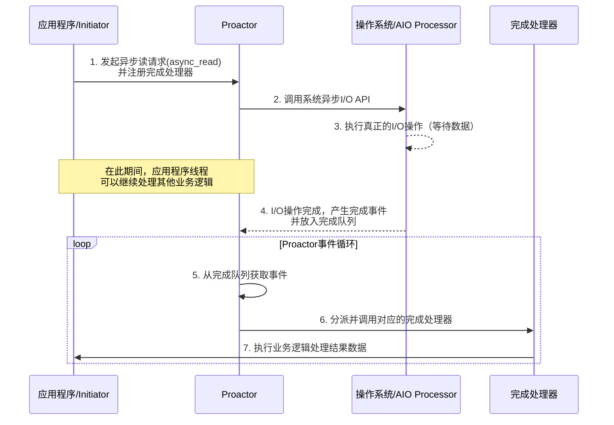

好的，遵照您的要求，以下是一份关于 **Proactor异步IO线程模型** 的详细技术文档。

---

# **Proactor 异步IO线程模型技术文档**

## **1. 概述**

Proactor（前摄器）是一种高性能的异步网络编程模型。其核心思想是 **“分离”**：将异步I/O操作的处理与应用程序线程的执行完全解耦。应用程序发起I/O操作后便立即返回，继续执行其他任务，而真正的I/O操作由操作系统（或底层框架）在后台执行。当操作完成时，操作系统会主动通知应用程序，应用程序再处理完成后的结果。

与更常见的 **Reactor（反应器）** 模型相比，Proactor 将所有I/O操作（包括读和写）都异步化，实现了更高程度的并发和更少的线程上下文切换，特别适合高吞吐量、低延迟的应用场景。

## **2. 核心组件**

一个典型的 Proactor 模式实现包含以下关键角色：

1.  **Initiator（发起者） / Application（应用程序）**： 发起异步I/O操作（如 `async_read`, `async_write`）的实体。它负责定义操作完成后的回调处理器（Completion Handler）。
2.  **Proactor（前摄器）**： 模型的核心调度器。它负责：
    *   接收应用程序发起的异步操作请求。
    *   将这些请求递交给操作系统（通过异步I/O接口，如 Windows 的 IOCP，Linux 的 `io_uring` 或 `AIO`）。
    *   运行一个事件循环（Event Loop），从操作系统获取已完成的异步I/O事件（Completion Events）。
    *   根据完成事件，分派并执行对应的回调处理器。
3.  **Asynchronous Operation Processor（异步操作处理器）**： 通常由操作系统内核实现。它真正执行异步I/O操作（如从网卡读取数据到内核缓冲区）。操作完成后，它会产生一个完成事件并放入完成队列。
4.  **Completion Handler（完成处理器） / Callback（回调）**： 由应用程序定义的、包含业务逻辑的函数或对象。当对应的异步操作完成时，由 Proactor 调用它来处理结果数据或状态。
5.  **Completion Event Queue（完成事件队列）**： 操作系统和 Proactor 之间通信的桥梁。已完成的I/O事件会被放入此队列，等待 Proactor 从中取出并分派。

## **3. 工作原理与流程**

以下序列图清晰地展示了 Proactor 模型的工作流程：

**文字流程详解：**

1.  **注册与发起**：
    *   应用程序向 `Proactor` 注册一个“完成处理器”（定义如何处理I/O结果）。
    *   应用程序调用异步操作（如 `async_read`），`Proactor` 将此请求通过系统API（如 `ReadFileEx` 或 `io_uring` 提交）传递给操作系统。

2.  **异步执行**：
    *   操作系统在后台执行实际的I/O操作（例如，从套接字读取数据到内核缓冲区）。**此时，应用程序线程不会被阻塞**，它可以立即返回去处理其他连接或计算任务。

3.  **完成通知**：
    *   当操作系统的I/O操作完成时，它会将结果、状态以及关联的上下文信息打包成一个 **完成事件**，放入一个由系统管理的 **完成队列** 中。

4.  **事件分派与回调**：
    *   `Proactor` 的核心事件循环不断检查（如 `GetQueuedCompletionStatus`）或等待系统完成队列。
    *   一旦获取到完成事件，`Proactor` 就解析事件，找出最初注册的“完成处理器”，并在其工作线程（可能是发起线程，也可能是线程池中的线程）中调用它。
    *   “完成处理器” 在其线程上下文中，安全地处理已就绪的数据（此时数据已在用户态缓冲区中，无需再执行阻塞的读取操作）。

## **4. 线程模型**

Proactor 的线程模型非常灵活，通常有以下几种模式：

*   **单线程Proactor**： 一个线程既运行 Proactor 事件循环，又执行所有完成处理器。逻辑简单，但无法充分利用多核，且处理器中的耗时计算会阻塞事件循环。
*   **多线程Proactor（领导者-追随者变体）**：
    *   一个或多个专用线程（通常是CPU核心数）运行 Proactor 事件循环，负责等待和分派完成事件。
    *   有一个共享的线程池用于执行完成处理器。当事件分派时，从线程池中选取一个空闲线程来执行回调逻辑。
    *   这是**最常用、性能最优**的模式。它实现了事件分派与业务处理的解耦，既能高效处理I/O事件，又能并行处理业务逻辑。
*   **每个Proactor一个线程**： 可以创建多个 Proactor 实例，每个实例绑定到一个独立的物理连接或一组连接，并运行在自己的线程中。适用于连接间高度独立且需要隔离的场景。

## **5. 优点与缺点**

### **优点：**
*   **极高的性能与可扩展性**： 将I/O的等待时间完全从应用程序线程中移除，使得极少数线程（甚至等于CPU核心数）就能管理海量并发连接。
*   **降低线程复杂度**： 开发者无需手动管理复杂的多线程同步来处理并发I/O，由 Proactor 框架负责调度，业务逻辑更集中在回调处理器中。
*   **天然的异步编程风格**： 与 `Future/Promise`、`async/await` 等现代异步编程范式契合度更高。

### **缺点：**
*   **实现复杂度高**： 严重依赖操作系统对异步I/O的支持，需要深入理解底层API。
*   **调试困难**： 程序执行流由回调驱动，打破了传统的顺序思维，调试和问题追踪相对困难。
*   **操作系统支持不一**： 在 Linux 上，成熟的 `AIO` 对网络I/O支持不佳，直到 `io_uring` 的出现才提供了完善的Proactor支持。而 Windows 的 `IOCP` 是经典的Proactor实现。这导致了跨平台实现的复杂性。
*   **内存管理复杂**： 异步操作中，缓冲区的生命周期管理需要格外小心，必须确保在回调处理时缓冲区依然有效。

## **6. 与 Reactor 模型的对比**

| 特性 | **Proactor** | **Reactor** |
| :--- | :--- | :--- |
| **I/O操作主体** | **操作系统** 执行I/O，应用处理结果。 | **应用程序** 在就绪事件触发后，**自己** 执行I/O操作。 |
| **关注点** | **完成事件**（操作已完成）。 | **就绪事件**（操作可进行）。 |
| **编程范式** | 异步回调 / `Future`。 | 同步非阻塞 + 事件循环。 |
| **控制流反转** | 更彻底，I/O执行和结果处理都反转给框架/OS。 | 部分反转，事件通知反转，但读/写操作仍在应用线程中。 |
| **典型实现** | Windows IOCP, Linux `io_uring`, Boost.Asio (默认模式)。 | Linux `epoll`, BSD `kqueue`, Java NIO, Netty, Redis。 |
| **性能潜力** | 理论上限更高，减少用户态-内核态切换。 | 非常高效，但受限于应用线程执行I/O的速度。 |

**简单比喻**：
*   **Reactor**： 你在餐厅点餐（发起`read`），服务员（`Reactor`）告诉你菜做好了（通知`readable`），**你自己**去厨房端菜（执行`read`系统调用）。
*   **Proactor**： 你在餐厅点餐（发起`async_read`），服务员（`Proactor`）**主动把做好的菜端到你桌上**（数据已读好），然后通知你吃（调用你的回调处理数据）。

## **7. 应用实例**

*   **Boost.Asio库**： C++ 跨平台网络库，在 Windows 上使用 IOCP 实现 Proactor，在 Linux 上可通过 `epoll` 模拟（模拟Proactor）或使用 `io_uring` 实现真正的 Proactor。
*   **Windows 网络服务**： 大量基于 `IOCP` 的高性能服务器，如 SQL Server, IIS。
*   **现代数据库与中间件**： 越来越多的数据库（如 MySQL 8.0 通过 `io_uring`）和消息队列开始采用 Proactor 模型来提升I/O性能。
*   **Nginx（部分模块）**： 虽然主要基于 Reactor，但其 `thread_pool` 机制结合 `aio` 指令，可以视为一种向 Proactor 的演进。

## **8. 总结**

Proactor 是一种先进的异步I/O模型，通过将全部I/O操作卸载给操作系统，实现了应用线程与I/O等待的完全分离，为构建超高并发的网络服务提供了强大的理论模型和实践基础。尽管其实现和调试具有挑战性，并且依赖于操作系统的底层支持，但随着像 Linux `io_uring` 这样的技术日趋成熟，Proactor 模型正成为追求极致性能的后端服务开发者的重要选择。在选择时，应综合考虑开发效率、团队熟悉度、目标平台和性能要求，在 Reactor 和 Proactor 之间做出权衡。

---