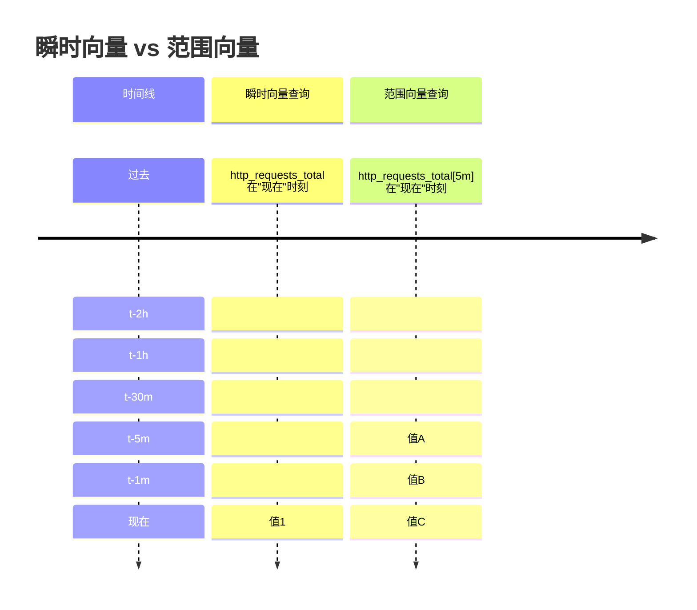

# Prometheus PromQL：范围向量与瞬时向量详解

## 1. 概述

Prometheus Query Language (PromQL) 是 Prometheus 监控系统的核心查询语言，用于选择和聚合时间序列数据。在 PromQL 中，**向量**是最基本的数据类型，主要分为**瞬时向量**和**范围向量**两种类型。理解这两种向量的区别对于编写有效的 PromQL 查询至关重要。

## 2. 核心概念对比

| 特性 | 瞬时向量 (Instant Vector) | 范围向量 (Range Vector) |
|------|--------------------------|------------------------|
| **数据点数量** | 每个时间序列包含**单个最新**样本点 | 每个时间序列包含**一段时间内**的多个样本点 |
| **查询结果** | 返回当前评估时间点的最新值 | 返回指定时间范围内的历史值序列 |
| **典型用途** | 当前状态监控、告警规则 | 计算变化率、绘制图表、分析趋势 |
| **时间选择器** | 无时间范围后缀 | 带有 `[时间范围]` 后缀（如 `[5m]`） |
| **直接可视化** | 可在图表中直接显示 | 不能直接在图表中显示，需配合函数使用 |

## 3. 瞬时向量 (Instant Vector)

### 3.1 定义
瞬时向量是**在某一特定时间点**的时间序列集合，每个时间序列只包含一个样本点（通常是该时间点之前的最新样本）。

### 3.2 语法示例
```promql
# 基本查询
http_requests_total

# 带标签过滤
http_requests_total{job="api-server", status="200"}

# 使用匹配符
http_requests_total{environment=~"staging|production"}
http_requests_total{status!~"4..|5.."}

# 空标签匹配
http_requests_total{instance=""}  # 匹配 instance 标签为空的序列
```

### 3.3 特点
- 返回**最新**的样本值
- 没有时间范围选择器
- 适用于：
  - 当前状态检查
  - 告警规则（基于当前值判断）
  - 仪表板显示最新指标

## 4. 范围向量 (Range Vector)

### 4.1 定义
范围向量是**在一段时间范围内**的时间序列集合，每个时间序列包含多个时间连续的样本点。

### 4.2 语法示例
```promql
# 最近5分钟的数据
http_requests_total[5m]

# 最近1小时，状态码为200的请求
http_requests_total{status="200"}[1h]

# 支持的时间单位
# s - 秒
# m - 分
# h - 小时
# d - 天
# w - 周
# y - 年

http_requests_total[30s]   # 最近30秒
http_requests_total[10m]   # 最近10分钟
http_requests_total[2h]    # 最近2小时
```

### 4.3 特点
- 返回**一段时间内**的多个样本值
- 必须包含时间范围选择器 `[duration]`
- **不能直接用于图表显示**，必须与函数结合使用
- 适用于：
  - 计算速率、增长率
  - 分析数据趋势
  - 聚合一段时间内的数据

## 5. 使用场景与示例

### 5.1 瞬时向量使用场景

#### 5.1.1 当前状态查询
```promql
# 查询当前所有节点的内存使用量
node_memory_MemFree_bytes

# 查询当前CPU空闲率
100 - (avg by (instance) (rate(node_cpu_seconds_total{mode="idle"}[5m])) * 100)
```

#### 5.1.2 告警规则（基于当前值）
```yaml
# alertmanager配置示例
groups:
- name: example
  rules:
  - alert: HighRequestLatency
    expr: histogram_quantile(0.95, sum(rate(http_request_duration_seconds_bucket[5m])) by (le)) > 0.5
    for: 10m
```

### 5.2 范围向量使用场景

#### 5.2.1 计算变化率
```promql
# 计算最近5分钟内HTTP请求的每秒速率
rate(http_requests_total[5m])

# 计算最近10分钟内网络接收字节的每秒速率
rate(node_network_receive_bytes_total[10m])
```

#### 5.2.2 分析数据趋势
```promql
# 计算最近1小时内CPU使用率的平均值
avg_over_time(
  (1 - avg(rate(node_cpu_seconds_total{mode="idle"}[5m])) by (instance))[1h:]
)

# 检测最近30分钟内是否有重启（计数器重置）
resets(node_boot_time_seconds[30m])
```

#### 5.2.3 聚合操作
```promql
# 统计最近1小时内每个端点的95百分位延迟
histogram_quantile(0.95, 
  sum(rate(http_request_duration_seconds_bucket[1h])) by (le, endpoint)
)
```

## 6. 关键函数与向量类型

### 6.1 需要范围向量的函数

```promql
# rate() - 计算每秒平均增长率
rate(http_requests_total[5m])

# irate() - 计算瞬时增长率（更敏感）
irate(http_requests_total[5m])

# increase() - 计算时间范围内的增长总量
increase(http_requests_total[1h])

# avg_over_time() - 计算时间范围内的平均值
avg_over_time(node_memory_usage_bytes[10m])

# 其他_over_time函数
max_over_time()     # 最大值
min_over_time()     # 最小值
sum_over_time()     # 求和
count_over_time()   # 计数
quantile_over_time() # 分位数
stddev_over_time()  # 标准差
```

### 6.2 需要瞬时向量的函数

```promql
# 聚合函数（返回瞬时向量）
sum(http_requests_total) by (job)
avg(http_requests_total) by (service)
max(http_requests_total)
min(http_requests_total)

# 数学运算
http_requests_total * 100
http_requests_total > 1000

# 标签操作
label_replace(http_requests_total, "new_label", "$1", "old_label", "(.*)")
```

## 7. 查询示例解析

### 示例1：CPU使用率监控
```promql
# 错误：直接使用范围向量（无法显示）
node_cpu_seconds_total[5m]

# 正确：使用rate()函数将范围向量转换为瞬时向量
100 - (avg by (instance) (rate(node_cpu_seconds_total{mode="idle"}[5m])) * 100)
```

### 示例2：HTTP错误率计算
```promql
# 计算5xx错误率
sum(rate(http_requests_total{status=~"5.."}[5m]))
/
sum(rate(http_requests_total[5m]))
* 100
```

### 示例3：内存使用趋势
```promql
# 最近1小时内内存使用率的平均值（每小时一个点）
avg_over_time(
  (node_memory_MemTotal_bytes - node_memory_MemFree_bytes) 
  / node_memory_MemTotal_bytes 
  * 100
  [1h]
)
```

## 8. 最佳实践与注意事项

### 8.1 范围向量选择器的最佳实践

1. **合理选择时间范围**：
   ```promql
   # 对于快速变化的指标，使用较短范围
   rate(api_calls_total[1m])
   
   # 对于缓慢变化的指标，使用较长范围以平滑波动
   rate(daily_active_users[24h])
   ```

2. **避免过大的时间范围**：
   ```promql
   # 不推荐：范围过大可能影响性能
   rate(http_requests_total[7d])
   
   # 推荐：根据实际需要选择合适范围
   rate(http_requests_total[1h])
   ```

### 8.2 常见错误与解决

1. **错误：在图表中直接使用范围向量**
   ```promql
   # 错误 - Grafana无法显示
   node_cpu_seconds_total[5m]
   
   # 正确 - 使用rate()转换
   rate(node_cpu_seconds_total[5m])
   ```

2. **错误：在告警中直接使用范围向量**
   ```promql
   # 错误 - 告警规则需要瞬时向量
   http_requests_total[5m] > 100
   
   # 正确 - 使用rate()或increase()
   rate(http_requests_total[5m]) > 10
   ```

3. **错误：混合向量类型**
   ```promql
   # 错误 - 不能将瞬时向量和范围向量直接运算
   http_requests_total + http_requests_total[5m]
   ```

## 9. 可视化理解



## 10. 总结

- **瞬时向量**：单一时间点的快照，适用于当前状态监控和告警
- **范围向量**：一段时间内的数据序列，必须与函数结合使用，适用于计算变化率和趋势分析
- 正确理解和区分这两种向量类型是编写有效 PromQL 查询的基础
- 范围向量不能直接可视化，需要通过 `rate()`, `avg_over_time()` 等函数转换为瞬时向量
- 在实际使用中，90%以上的场景都需要将范围向量转换为瞬时向量进行进一步处理

掌握瞬时向量与范围向量的区别和使用方法，将帮助您更有效地利用 Prometheus 进行系统监控和数据分析。