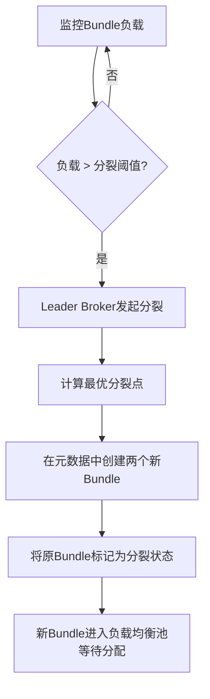
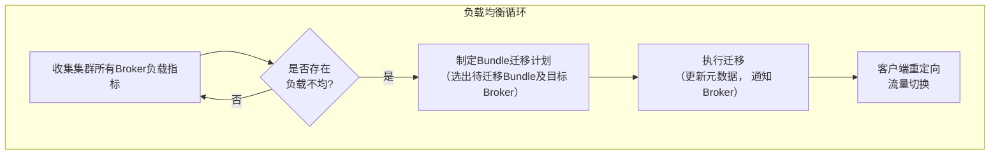

好的，遵照您的要求，我将为您生成一份关于“Pulsar Topic分区与Bundle动态负载均衡”的技术文档。这份文档将涵盖核心概念、工作原理、配置及最佳实践。

---

# **Pulsar Topic分区与Bundle动态负载均衡技术文档**

## **文档概述**

本文档旨在深入阐述Apache Pulsar消息系统中，Topic分区与Namespace Bundle的动态负载均衡机制。理解此机制对于设计高吞吐、可水平扩展、具备弹性的Pulsar集群至关重要。本文将解析其核心概念、自动运作流程、相关配置以及运维建议。

## **1. 核心概念**

### **1.1 Topic分区**
*   **定义**： Pulsar中的Topic分区实质上是将一个逻辑Topic（例如 `persistent://tenant/namespace/topic-name`）在物理上分割为多个独立的、可并行处理的子Topic（称为分区）。
*   **分区名称**： 分区被命名为 `topic-name-partition-0`， `topic-name-partition-1` 等。
*   **目的**：
    *   **提升吞吐量**： 生产者和消费者可以并发地向不同分区读写消息，突破单个Broker或Bookie的性能上限。
    *   **实现并行消费**： 支持多个消费者以共享（Key-Shared）或故障转移（Failover）订阅模式并行处理消息。
*   **管理**： 分区数量通常在创建Topic时指定（例如，通过 `--partitions` 参数），之后可以动态增加，但不支持减少。

### **1.2 Namespace Bundle**
*   **定义**： Bundle是Pulsar中**负载均衡与资源分配的最小单位**。它是一个连续的Token范围（基于64位哈希空间 `0x00000000` 到 `0xffffffff`），用于将Namespace下的所有Topic虚拟地划分为多个组。
*   **工作原理**：
    1.  系统为每个Topic名称计算一个哈希值（`hash(topic-name) % 65536`）。
    2.  根据哈希值将Topic映射到其所属的Bundle（即对应的Token范围）。
    3.  整个Bundle作为一个整体，被**分配（Assignment）** 给某个特定的Broker节点进行服务。
*   **目的**：
    *   **降低元数据开销**： 相比直接管理成千上万个独立Topic，以Bundle为粒度进行分配，极大减少了ZooKeeper或Metadata Store中的元数据量。
    *   **实现精细化负载均衡**： 负载均衡器以Bundle为单位，在Broker之间迁移，以实现集群负载的均衡。

### **1.3 Bundle 与 Topic 分区的关系**
*   **一个Bundle内包含多个Topic（及其分区）**。`persistent://tenant/namespace/topic-a-partition-0` 和 `persistent://tenant/namespace/topic-b` 可能位于同一个Bundle中。
*   **负载均衡操作作用于Bundle层级**。当负载均衡器决定迁移负载时，它移动的是整个Bundle，而不是单个Topic分区。该Bundle内的所有Topic将随之一起迁移到新的Broker。
*   **分区数量的变化不影响Bundle的划分**。增加Topic的分区数，新分区的名称会被哈希并落入现有的某个Bundle中。

## **2. 动态负载均衡机制**

Pulsar的负载均衡是一个持续运行的自动化过程，主要由两部分组成：**Bundle的自动分裂** 和 **Broker间的负载均衡**。

### **2.1 Bundle的自动分裂**
这是应对单个Bundle内Topic流量激增（热点Topic）的关键机制。

*   **触发条件**： 当监测到某个Bundle的负载（包括消息吞吐率、带宽、连接数、CPU/Memory使用率等）超过预设阈值时。
*   **分裂过程**：
    1.  **Leader Broker决策**： Pulsar集群中的Leader Broker（通过选举产生）定期检查所有Bundle的负载。
    2.  **计算分裂点**： 根据负载分布，将过载的Bundle从其Token范围中间位置分裂为两个新的、范围更小的Bundle。
    3.  **更新元数据**： 在Metadata Store中更新Namespace的Bundle列表。
    4.  **重新分配**： 新分裂出的两个Bundle会被视为新的负载单位，参与后续的负载均衡决策，可能被分配到不同的Broker上。
*   **益处**： 将热点Bundle拆分，使得其中的负载有机会被分散到多个Broker，从而解决因少数Topic流量过大导致的Broker不均问题。

### **2.2 Broker间的负载均衡**
此机制确保所有Broker节点的负载大致均衡。

*   **决策者**： 由 **Load Balancer**（运行在Leader Broker上） 驱动。
*   **负载计算**： Load Balancer 周期性地从所有Broker收集资源使用指标。
*   **均衡策略**：
    *   **阈值判断**： 设置负载阈值（如CPU、内存、网络IO、Bundle数量上限）。
    *   **Bundle卸载**： 当某个Broker的负载持续高于阈值，Load Balancer会从其管理的Bundle列表中，选择一个或多个Bundle进行“卸载”。
    *   **Bundle分配**： 被卸载的Bundle会被分配给当前负载较低的Broker。
*   **流程**： 此过程对生产者和消费者透明。在Bundle迁移期间，客户端会收到重定向指令，短暂中断后自动连接到新的Broker。

## **3. 动态扩缩容示例**

假设一个初始为3个Broker的集群，处理一个名为 `persistent://sales/eu/orders` 的Topic，该Topic最初有4个分区。

1.  **初始状态**：
    *   Namespace `sales/eu` 被划分为2个Bundle：`{0x00000000 - 0x7fffffff}`， `{0x80000000 - 0xffffffff}`。
    *   `orders` Topic的4个分区通过哈希，可能全部落在Bundle 1中。
    *   Bundle 1 被分配给 Broker-A。

2.  **流量激增（热点产生）**：
    *   `orders` Topic流量暴涨，导致Bundle 1和Broker-A负载过高。

3.  **自动分裂与均衡**：
    *   **步骤1：分裂**。Leader Broker检测到Bundle 1过载，将其分裂为 `{0x00000000 - 0x3fffffff}` 和 `{0x40000000 - 0x7fffffff}`。
    *   **步骤2：卸载**。Load Balancer发现Broker-A负载超标，决定将新Bundle `{0x40000000 - 0x7fffffff}` 从Broker-A卸载。
    *   **步骤3：分配**。Load Balancer将卸载的Bundle分配给负载较轻的Broker-B。

4.  **最终效果**：
    *   `orders` Topic的部分分区流量（落在Bundle `{0x40000000 - 0x7fffffff}` 内的那些分区）被自动、动态地迁移到了Broker-B。
    *   集群负载恢复均衡，整个过程无需人工干预或重启服务。

## **4. 关键配置参数**

以下为影响负载均衡行为的部分关键配置（位于 `broker.conf`）：

| 分类 | 参数 | 默认值 | 说明 |
| :--- | :--- | :--- | :--- |
| **Bundle 分裂** | `loadBalancerNamespaceBundleMaxTopics` | 1000 | 触发Bundle分裂的Topic数量阈值。 |
| | `loadBalancerNamespaceBundleMaxSessions` | 1000 | 触发Bundle分裂的生产者+消费者会话数阈值。 |
| | `loadBalancerNamespaceBundleMaxMsgRate` | 30000 | 触发分裂的消息速率（条/秒）阈值。 |
| | `loadBalancerNamespaceBundleMaxBandwidthMbytes` | 100 | 触发分裂的带宽（MB/秒）阈值。 |
| **负载均衡** | `loadBalancerEnabled` | `true` | 是否启用负载均衡器。 |
| | `loadBalancerSheddingEnabled` | `true` | 是否允许卸载（Shedding）Bundle。 |
| | `loadBalancerLoadSheddingStrategy` | `org.apache...OverShedder` | 负载卸载策略。 |
| | `loadBalancerBrokerOverloadedThresholdPercentage` | 85 | Broker负载超过此百分比（相对平均负载）时，被视为过载。 |
| | `loadBalancerSheddingIntervalMinutes` | 1 | 负载均衡检查间隔。 |

## **5. 最佳实践与注意事项**

1.  **合理规划Namespace和Bundle数量**：
    *   避免单个Namespace下Topic数量过多或过少。过多可能导致Bundle分裂过于频繁，过少可能导致负载不均。
    *   初始Bundle数量（`defaultNumNamespaceBundles`）应根据预期Topic数量和吞吐量合理设置。

2.  **监控与告警**：
    *   密切监控 `bundle` 级别的指标（如消息进出速率）和 `broker` 级别的指标（如CPU、内存、网络IO）。
    *   关注Bundle分裂日志，异常频繁的分裂可能预示热点问题或配置不当。

3.  **理解有状态服务的限制**：
    *   Pulsar是存算分离架构，Bundle（计算）的迁移相对轻量，因为数据存储在独立的BookKeeper集群。
    *   对于`Key_Shared`订阅，迁移Bundle时，该Bundle内消息的Key顺序在新的Broker上会继续保持。

4.  **谨慎调整配置**：
    *   默认配置适用于多数场景。调整分裂和负载阈值前，需充分了解自身业务流量模式。
    *   在生产环境修改负载均衡相关配置后，建议进行观察和测试。

5.  **扩容操作**：
    *   当集群新增Broker节点时，Load Balancer会自动将部分Bundle迁移到新节点上，实现流量的自动再平衡。这是Pulsar弹性扩展的核心体现。

---
**总结**：Pulsar通过**Namespace Bundle**这一抽象层，将细粒度的Topic分区管理与粗粒度的Broker资源调度解耦。结合**Bundle的自动分裂**与**Broker间的动态负载均衡**，实现了高度自动化、弹性的分布式消息流处理架构，能够有效应对流量波动与集群拓扑变化。