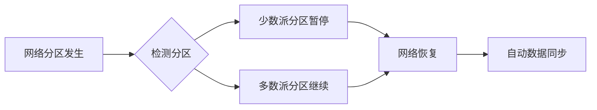

# RabbitMQ Quorum队列技术文档

## 1. 概述

### 1.1 Quorum队列简介
RabbitMQ Quorum队列是基于Raft一致性算法实现的新型队列类型，从RabbitMQ 3.8版本开始引入，旨在解决传统镜像队列在数据安全性和故障恢复方面的一些局限性。

### 1.2 设计目标
- 提供更强的数据安全性保证
- 简化队列复制配置和管理
- 改善网络分区处理能力
- 提供可预测的故障恢复行为

## 2. 核心架构

### 2.1 Raft一致性协议
Quorum队列使用Raft协议实现节点间的一致性：
- **领导者选举**：每个队列自动选举领导者节点
- **日志复制**：所有写操作通过领导者同步到追随者
- **多数派原则**：需要(N/2)+1个节点确认才能提交操作

### 2.2 队列结构
```
主节点（Leader）
    ├── 追随者1（Follower）
    ├── 追随者2（Follower）
    └── ...
```

## 3. 与传统镜像队列对比

| 特性 | Quorum队列 | 镜像队列 |
|------|-----------|----------|
| 一致性算法 | Raft协议 | 自定义复制 |
| 配置复杂度 | 低（声明时指定） | 高（需要策略配置） |
| 数据安全 | 强一致性 | 最终一致性 |
| 故障转移 | 自动选举 | 手动或自动 |
| 性能影响 | 较低延迟 | 较高延迟 |

## 4. 配置与使用

### 4.1 声明Quorum队列
```java
Map<String, Object> arguments = new HashMap<>();
arguments.put("x-queue-type", "quorum");
channel.queueDeclare("my-quorum-queue", true, false, false, arguments);
```

### 4.2 关键参数配置

```yaml
# rabbitmq.conf 配置文件
quorum_queue.initial_group_size = 3
quorum_queue.delivery_limit = 5
quorum_queue.max_in_memory_length = 1000
quorum_queue.max_in_memory_bytes = 104857600
```

### 4.3 重要参数说明

| 参数 | 默认值 | 说明 |
|------|--------|------|
| x-quorum-initial-group-size | 3 | 初始副本数量 |
| x-max-length | 无限制 | 队列最大消息数 |
| x-delivery-limit | 无限制 | 消息重投递次数限制 |
| x-max-in-memory-length | 1000 | 内存中保留的消息数 |

## 5. 故障恢复机制

### 5.1 领导者故障
1. 检测领导者不可用
2. 启动新一轮选举
3. 新领导者恢复服务
4. 数据一致性验证

### 5.2 网络分区处理


## 6. 性能优化建议

### 6.1 集群规划
- 建议使用3或5个节点（奇数个）
- 跨可用区部署以提高可用性
- 考虑网络延迟对Raft协议的影响

### 6.2 监控指标
```bash
# 查看Quorum队列状态
rabbitmq-queues quorum_status <queue_name>

# 监控关键指标
- queue_leader_location
- queue_messages_ready
- queue_messages_unacked
- queue_replication_factor
```

## 7. 最佳实践

### 7.1 适用场景
- ✅ 需要强一致性保证的消息
- ✅ 关键业务数据
- ✅ 金融交易场景
- ✅ 订单处理系统

### 7.2 不适用场景
- ❌ 极高吞吐量需求（>10万/秒）
- ❌ 临时队列
- ❌ 单节点部署

### 7.3 升级与迁移
```bash
# 从镜像队列迁移到Quorum队列
1. 创建新的Quorum队列
2. 设置双向路由
3. 逐步迁移消费者
4. 监控确保稳定
5. 下线旧队列
```

## 8. 限制与注意事项

### 8.1 已知限制
- 最大队列大小受磁盘空间限制
- 不支持Lazy模式（自动启用磁盘持久化）
- 不支持优先级队列
- 不支持TTL逐消息设置

### 8.2 监控告警
```yaml
监控要点:
  - 副本同步延迟
  - 选举频率
  - 磁盘使用率
  - 内存使用情况
  
告警阈值:
  - 副本不同步时间 > 30s
  - 选举频率 > 1次/分钟
  - 磁盘使用率 > 80%
```

## 9. 故障排查指南

### 9.1 常见问题
1. **队列不可用**
   ```bash
   # 检查队列状态
   rabbitmqctl list_queues name state
   
   # 检查节点状态
   rabbitmqctl cluster_status
   ```

2. **性能下降**
   - 检查网络延迟
   - 监控磁盘IO
   - 检查内存使用

3. **数据不一致**
   - 验证Raft日志
   - 检查副本同步状态

### 9.2 诊断命令
```bash
# 详细队列信息
rabbitmq-diagnostics quorum_queue_status

# Raft状态检查
rabbitmq-diagnostics raft_status

# 日志分析
tail -f /var/log/rabbitmq/rabbit@*.log | grep quorum
```

## 10. 版本兼容性

| RabbitMQ版本 | Quorum队列支持 |
|-------------|---------------|
| 3.8.x | 基础功能 |
| 3.9.x | 功能增强 |
| 3.10.x | 性能优化 |
| 3.11+ | 生产就绪 |

## 总结

RabbitMQ Quorum队列通过Raft一致性协议提供了更可靠、更易管理的队列复制方案。虽然在某些场景下可能牺牲部分性能，但在数据安全性和系统稳定性方面提供了显著改进。建议在关键业务场景中优先考虑使用Quorum队列，并遵循本文档的最佳实践进行配置和管理。

---

**文档版本**: 1.0  
**最后更新**: 2024年  
**适用版本**: RabbitMQ 3.8+  
**注意事项**: 生产环境部署前建议充分测试