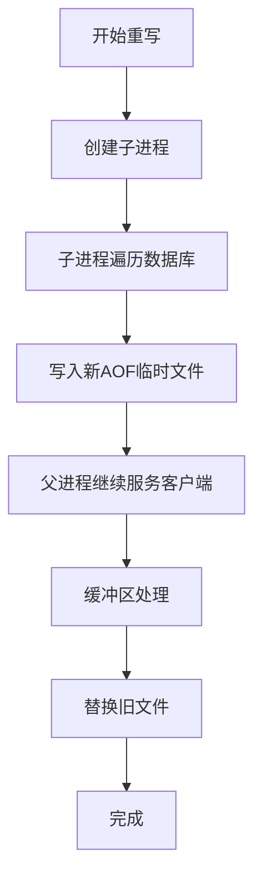

# Redis AOF重写(BGREWRITEAOF)原理详解

## 1. 背景与问题

### 1.1 AOF持久化简介
Redis提供了两种持久化方式：RDB（快照）和AOF（追加日志）。AOF（Append Only File）通过记录所有写操作命令来保证数据持久性，具有更好的数据安全性，但会带来两个主要问题：
- **文件体积膨胀**：随着时间推移，AOF文件会不断增大
- **恢复速度变慢**：重启时重放大量命令导致恢复时间延长

### 1.2 为什么要进行AOF重写
考虑以下场景：
```
set key1 value1
set key1 value2
set key1 value3
del key1
set key2 valueA
incr key2  # valueA必须是数字
```
原始的AOF文件会记录所有5条命令，但实际上只需记录最终状态的一条命令即可。

## 2. AOF重写的核心原理

### 2.1 基本思想
AOF重写并非分析原有AOF文件，而是**读取当前数据库状态**，生成一个新的、更紧凑的AOF文件。

### 2.2 重写目标
- **消除冗余命令**：只保留每个键的最终状态
- **合并多条命令**：将多条命令合并为一条（如list的RPUSH）
- **减少文件大小**：通常可减少60%-70%的空间占用

## 3. 触发机制

### 3.1 自动触发条件
```bash
# redis.conf配置示例
auto-aof-rewrite-percentage 100   # 当前AOF文件比上次重写后大小增长100%
auto-aof-rewrite-min-size 64mb    # AOF文件至少64MB才会重写
```

### 3.2 手动触发
```bash
# 同步方式（已弃用）
127.0.0.1:6379> BGREWRITEAOF

# 异步方式
127.0.0.1:6379> BGREWRITEAOF
"Background append only file rewriting started"
```

## 4. BGREWRITEAOF执行流程

### 4.1 总体流程


### 4.2 详细步骤

#### 步骤1：创建子进程
```c
// Redis源码示意
pid_t childpid = fork();
if (childpid == 0) {
    // 子进程执行重写
    rewriteAppendOnlyFile(tmpfile);
    exit(0);
} else {
    // 父进程继续处理请求
    // 建立重写缓冲区
}
```

#### 步骤2：子进程执行重写
```python
# 伪代码表示重写逻辑
def rewriteAppendOnlyFile(filename):
    # 1. 遍历所有数据库
    for db in all_databases:
        # 2. 遍历数据库所有键
        for key in db:
            # 3. 跳过过期键
            if is_expired(key): continue
            
            # 4. 根据类型生成最小命令集
            if key.type == STRING:
                write_command("SET", key, current_value)
            elif key.type == LIST:
                write_command("RPUSH", key, all_elements)
            elif key.type == HASH:
                write_command("HMSET", key, all_fields)
            # ...其他类型类似处理
```

#### 步骤3：处理重写期间的写操作
Redis使用**双缓冲区**机制保证数据一致性：
- **AOF缓冲区**：正常AOF追加的缓冲区
- **AOF重写缓冲区**：重写期间所有写命令的额外缓冲区

## 5. 内存与磁盘交互优化

### 5.1 写时复制（Copy-on-Write）
```c
// 子进程与父进程共享内存页
// 只有当父进程修改数据时，才会复制该内存页
// 这大大减少了内存开销和复制时间
```

### 5.2 缓冲区刷新策略
```bash
# 配置项
appendfsync always    # 每个命令都同步，安全但性能差
appendfsync everysec  # 每秒同步（推荐）
appendfsync no        # 由操作系统决定
```

## 6. 文件切换与数据安全

### 6.1 原子性替换
```python
# 伪代码：文件替换过程
def finish_aof_rewrite():
    # 1. 将重写缓冲区内容写入新AOF文件
    write_rewrite_buffer_to_new_file()
    
    # 2. 同步到磁盘（fsync）
    fsync(new_file)
    
    # 3. 原子性重命名
    rename(tmp_file, new_aof_file)
    
    # 4. 替换内存中的文件指针
    switch_to_new_aof_file()
```

### 6.2 故障恢复机制
如果重写过程中Redis崩溃：
1. 临时文件会被删除
2. 使用原有的完整AOF文件恢复
3. 不会丢失数据，但需要重新重写

## 7. 性能优化与注意事项

### 7.1 性能影响
- **CPU占用**：子进程进行数据遍历和写入，高峰期可能影响性能
- **内存占用**：写时复制可能导致内存峰值
- **磁盘IO**：写入新AOF文件需要大量磁盘操作

### 7.2 配置建议
```bash
# 生产环境建议配置
no-appendfsync-on-rewrite yes  # 重写期间不进行fsync
aof-rewrite-incremental-fsync yes  # 增量同步，减少阻塞
```

### 7.3 监控指标
```bash
# 通过INFO命令监控
redis-cli info persistence

# 关键指标：
aof_current_size           # 当前AOF文件大小
aof_base_size             # 上次重写时AOF大小
aof_pending_rewrite       # 是否正在重写
aof_buffer_length         # AOF缓冲区长度
aof_rewrite_buffer_length # 重写缓冲区长度
```

## 8. 特殊情况处理

### 8.1 重写失败场景
1. **磁盘空间不足**：重写终止，原有AOF不变
2. **权限问题**：检查文件权限和SELinux设置
3. **内存不足**：fork()失败，需增加overcommit_memory

### 8.2 AOF被禁用的重写
```bash
# 如果AOF被禁用，BGREWRITEAOF会：
# 1. 开启AOF功能
# 2. 执行重写
# 3. 再次关闭AOF（某些版本）
```

## 9. 与RDB的对比

| 特性 | AOF重写 | RDB生成 |
|------|---------|---------|
| 数据格式 | 命令日志 | 二进制快照 |
| 文件大小 | 相对较大 | 较小 |
| 恢复速度 | 较慢 | 较快 |
| 数据安全性 | 更高 | 较低 |
| 对性能影响 | 中等 | 较大 |

## 10. 最佳实践

1. **定时重写**：在业务低峰期手动触发重写
2. **监控告警**：设置AOF文件大小监控
3. **充足资源**：确保有足够的磁盘空间和内存
4. **备份策略**：重写前备份AOF文件
5. **测试验证**：定期测试AOF文件恢复能力

## 总结

Redis的AOF重写机制通过创建子进程、使用写时复制技术和双缓冲区机制，在不阻塞主进程服务的情况下，实现了AOF文件的压缩和优化。理解其原理有助于：
- 合理配置重写参数
- 优化Redis性能
- 确保数据安全性
- 快速排查相关问题

在实际生产环境中，建议结合监控系统和业务特点，制定合适的AOF重写策略，以平衡性能和数据安全的需求。