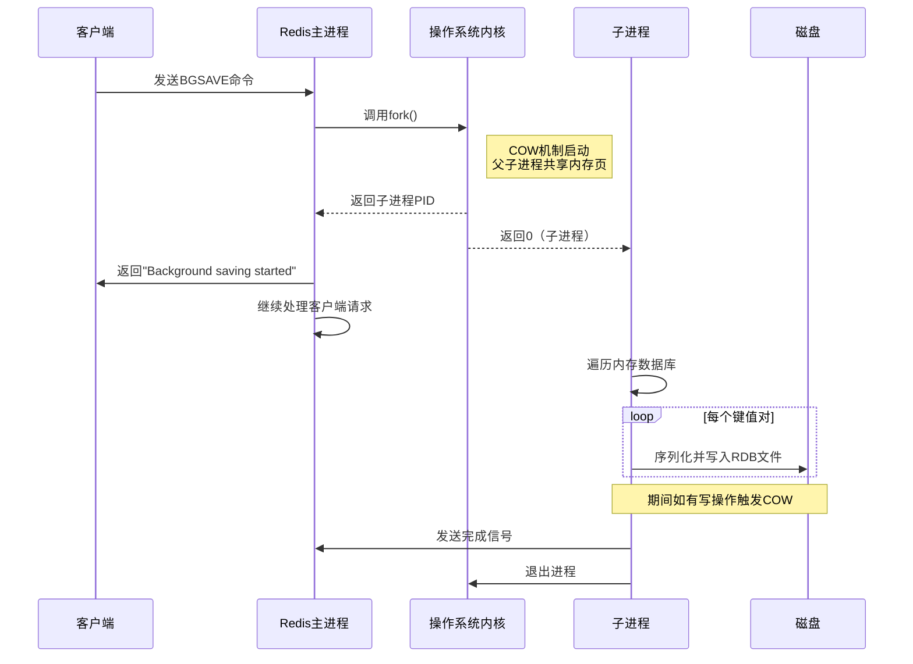

# Redis RDB bgsave 的 fork 子进程与 Copy-On-Write (COW) 机制

## 1. 概述

Redis 作为内存数据库，其性能优势主要源于数据全部存储在内存中。为了确保数据持久化，Redis 提供了两种主要的持久化机制：
- **RDB (Redis Database)**：生成某个时间点的数据快照
- **AOF (Append-Only File)**：记录所有写操作命令

其中 RDB 的 `bgsave` 命令通过 `fork()` 系统调用创建子进程来实现后台快照保存，同时利用操作系统的 **Copy-On-Write (COW)** 机制保证主进程在保存期间仍能正常处理客户端请求。

## 2. fork() 系统调用与 COW 机制

### 2.1 fork() 的基本行为
```c
pid_t fork(void);
```
- 创建调用进程（父进程）的一个副本（子进程）
- 子进程获得父进程地址空间的**副本**
- 在传统 UNIX 实现中，这涉及复制整个进程地址空间，效率低下

### 2.2 现代操作系统的 COW 优化
现代操作系统（Linux、BSD 等）对 `fork()` 进行了优化：

1. **初始状态**：子进程并不立即复制父进程的物理内存
2. **共享内存页**：父子进程共享相同的物理内存页，但这些页被标记为 **只读**
3. **延迟复制**：当任一进程尝试修改共享页时，触发缺页异常
4. **按需复制**：内核为修改进程复制该页的副本，并更新页表映射

这种机制被称为 **写时复制 (Copy-On-Write)**。

## 3. Redis RDB bgsave 的实现流程

### 3.1 bgsave 执行过程


### 3.2 详细步骤解析

#### 步骤 1: 接收命令并准备
```c
// Redis 源码示例（简化版）
void bgsaveCommand(client *c) {
    if (server.rdb_child_pid != -1) {
        addReplyError(c,"Background save already in progress");
        return;
    }
    
    if (rdbSaveBackground(server.rdb_filename) == C_OK) {
        addReplyStatus(c,"Background saving started");
    } else {
        addReplyError(c,"Background saving failed");
    }
}
```

#### 步骤 2: 创建子进程
```c
int rdbSaveBackground(char *filename) {
    pid_t childpid;
    
    if ((childpid = fork()) == 0) {
        // 子进程代码
        closeListeningSockets(0); // 关闭不必要的文件描述符
        redisSetProcTitle("redis-rdb-bgsave");
        
        // 执行实际的RDB保存
        if (rdbSave(filename) == C_OK) {
            exitFromChild(0);
        } else {
            exitFromChild(1);
        }
    } else {
        // 父进程代码
        if (childpid == -1) {
            return C_ERR; // fork失败
        }
        
        server.stat_fork_time = ustime();
        server.stat_fork_rate = (double)zmalloc_used_memory() * 1000000 / 
                               server.stat_fork_time;
        
        server.rdb_child_pid = childpid;
        server.rdb_child_type = RDB_CHILD_TYPE_DISK;
        return C_OK;
    }
}
```

#### 步骤 3: 子进程执行 RDB 持久化
子进程遍历 Redis 的所有数据库和键值对，将其序列化为紧凑的二进制格式：
```c
int rdbSave(char *filename) {
    FILE *fp;
    rio rdb;
    
    fp = fopen(filename,"w");
    if (!fp) return C_ERR;
    
    rioInitWithFile(&rdb,fp);
    
    // 写入RDB头部
    if (rdbWriteRaw(&rdb,"REDIS",5) == -1) goto werr;
    
    // 保存所有数据库
    for (int j = 0; j < server.dbnum; j++) {
        redisDb *db = server.db+j;
        dict *d = db->dict;
        
        // 写入数据库选择器
        if (rdbSaveType(&rdb,RDB_OPCODE_SELECTDB) == -1) goto werr;
        if (rdbSaveLen(&rdb,j) == -1) goto werr;
        
        // 写入字典大小
        if (rdbSaveType(&rdb,RDB_OPCODE_RESIZEDB) == -1) goto werr;
        if (rdbSaveLen(&rdb,dictSize(d)) == -1) goto werr;
        if (rdbSaveLen(&rdb,0) == -1) goto werr; // 过期字典大小
        
        // 遍历并保存每个键值对
        dictIterator *di = dictGetIterator(d);
        dictEntry *de;
        while((de = dictNext(di)) != NULL) {
            robj *key = dictGetKey(de);
            robj *val = dictGetVal(de);
            
            // 保存键值对
            if (rdbSaveKeyValuePair(&rdb,key,val,0) == -1) {
                dictReleaseIterator(di);
                goto werr;
            }
        }
        dictReleaseIterator(di);
    }
    
    // 写入结束标记
    if (rdbSaveType(&rdb,RDB_OPCODE_EOF) == -1) goto werr;
    
    fclose(fp);
    return C_OK;
    
werr:
    fclose(fp);
    return C_ERR;
}
```

## 4. COW 在 Redis 中的具体表现

### 4.1 内存使用变化
在 bgsave 期间，Redis 内存使用可能表现出以下特征：

1. **初始阶段**：父子进程共享所有内存页，RSS（常驻内存）大小几乎不变
2. **写操作发生时**：
   ```
   Before write: 父进程和子进程共享物理页
   During write: 父进程触发页错误 → 内核复制该页 → 父进程写入副本
   After write: 父进程使用新副本，子进程仍使用原始页
   ```
3. **内存增长**：增长的幅度 = 被修改的页数 × 页大小（通常 4KB）

### 4.2 监控示例
```bash
# 在bgsave期间监控Redis内存使用
$ redis-cli info memory
used_memory:1024000000
used_memory_rss:1500000000  # 可能增加
used_memory_peak:1600000000
used_memory_lua:37888
mem_fragmentation_ratio:1.46

# 查看操作系统视角的内存
$ ps -o pid,rss,comm -p $(pgrep redis-server)
PID       RSS  COMMAND
12345   1500000 redis-server  # 父进程
12346    500000 redis-rdb-bgsave # 子进程
```

## 5. 性能影响与优化策略

### 5.1 COW 对性能的影响因素

| 因素 | 影响程度 | 说明 |
|------|----------|------|
| **内存写操作频率** | 高 | 写操作越多，COW触发越频繁 |
| **内存页大小** | 中 | 通常4KB，大页（2MB）会放大影响 |
| **数据集大小** | 高 | 数据集越大，潜在需要复制的页越多 |
| **硬件性能** | 高 | 内存带宽、磁盘IO速度直接影响 |

### 5.2 潜在问题与解决方案

#### 问题 1: 内存翻倍风险
```bash
# 极端情况下，如果父进程修改了所有内存页
理论最大内存使用 = 原始内存 × 2
```

**解决方案**：
- 使用 `repl-backlog-size` 限制复制缓冲区
- 监控写QPS，在低峰期执行bgsave
- 考虑使用AOF重写替代

#### 问题 2: 长时间fork阻塞
```c
// 当内存非常大时，fork本身可能耗时
unsigned long long start = ustime();
pid_t childpid = fork();
unsigned long long end = ustime();
server.stat_fork_time = end - start; // 记录fork耗时
```

**优化策略**：
- 使用 `redis-cli --bigkeys` 识别大key
- 拆分为多个小实例（分片）
- 升级到支持 `forkless` 的Redis版本（如7.0+的Threaded I/O）

### 5.3 配置调优建议
```conf
# redis.conf 相关配置

# 1. 调整自动保存条件（减少不必要的bgsave）
save 900 1      # 15分钟内至少1个key变化
save 300 10     # 5分钟内至少10个key变化
save 60 10000   # 1分钟内至少10000个key变化

# 2. 内存优化
maxmemory 16gb           # 设置最大内存限制
maxmemory-policy allkeys-lru  # 内存满时的淘汰策略

# 3. RDB优化
rdbcompression yes       # 压缩RDB文件
rdbchecksum yes          # 校验和
stop-writes-on-bgsave-error yes  # bgsave失败时停止写入

# 4. 透明大页（Transparent Huge Pages）问题
# 在Linux上禁用THP，因为它会恶化fork性能
# 需要在系统层面设置：echo never > /sys/kernel/mm/transparent_hugepage/enabled
```

## 6. 高级主题：无磁盘持久化与 COW

Redis 支持无磁盘（diskless）RDB持久化，其COW行为有所不同：

### 6.1 无磁盘持久化流程
```c
// 子进程直接将RDB数据写入网络套接字
if (server.rdb_diskless_sync) {
    // 通过管道将RDB发送给父进程
    rioInitWithFd(&rdb, pipe_write);
} else {
    // 传统磁盘写入
    fp = fopen(filename,"w");
    rioInitWithFile(&rdb,fp);
}
```

### 6.2 COW 特性对比

| 特性 | 传统磁盘持久化 | 无磁盘持久化 |
|------|----------------|--------------|
| **I/O类型** | 磁盘写 | 网络写 |
| **COW影响** | 写磁盘期间可能触发更多COW | 网络发送期间COW较少 |
| **适用场景** | 数据备份、迁移 | 主从复制、集群同步 |
| **内存压力** | 可能较高 | 相对较低 |

## 7. 实际案例与故障排查

### 7.1 案例：内存突增问题
**现象**：bgsave期间Redis内存使用从10GB突增到18GB

**排查步骤**：
1. 检查写操作频率：`redis-cli info stats | grep instantaneous_ops_per_sec`
2. 分析bigkeys：`redis-cli --bigkeys`
3. 监控COW次数：`grep -i cow /proc/vmstat`

**解决方案**：
- 将大hash拆分为多个小hash
- 使用AOF持久化替代RDB
- 调整bgsave执行时间至业务低峰期

### 7.2 诊断工具
```bash
# 1. 监控fork性能
$ redis-cli info stats | grep fork
latest_fork_usec:356  # fork耗时（微秒）

# 2. 查看子进程状态
$ ps -ef | grep redis
redis    12345     1  0 10:00 ?  00:00:10 /usr/bin/redis-server
redis    12346 12345  0 10:05 ?  00:00:01 redis-rdb-bgsave

# 3. 分析内存页复制
$ watch -n 1 "grep -E '(pgalloc|pgfault)' /proc/vmstat"

# 4. 使用redis-rdb-tools分析RDB
$ rdb -c memory dump.rdb --bytes 1024 --largest 5
```

## 8. 总结与最佳实践

### 8.1 COW 机制的核心价值
1. **保证数据一致性**：子进程看到fork瞬间的内存快照
2. **最小化性能影响**：只复制实际修改的内存页
3. **实现后台持久化**：主进程继续提供服务

### 8.2 最佳实践清单
- ✅ 监控`latest_fork_usec`，超过1秒需要优化
- ✅ 避免在内存使用超过70%时执行bgsave
- ✅ 使用SSD磁盘减少RDB写入时间
- ✅ 定期分析RDB文件大小和结构
- ✅ 对于超大实例，考虑使用Redis Cluster分片
- ✅ 测试环境中验证bgsave对性能的影响

### 8.3 未来发展方向
1. **线程化fork**：Redis 7.0+ 的实验特性
2. **增量快照**：避免全量复制，减少COW影响
3. **持久内存（PMEM）**：结合AOF和RDB优势

通过深入理解 Redis RDB bgsave 的 fork 和 COW 机制，运维人员可以更好地规划持久化策略，平衡数据安全性与服务性能，确保 Redis 在生产环境中稳定高效运行。

## 参考文献
1. Redis 源代码 (https://github.com/redis/redis)
2. Linux 内核 Documentation/vm/transhuge.txt
3. 《Redis 设计与实现》- 黄健宏
4. Redis 官方文档：Persistence (https://redis.io/topics/persistence)