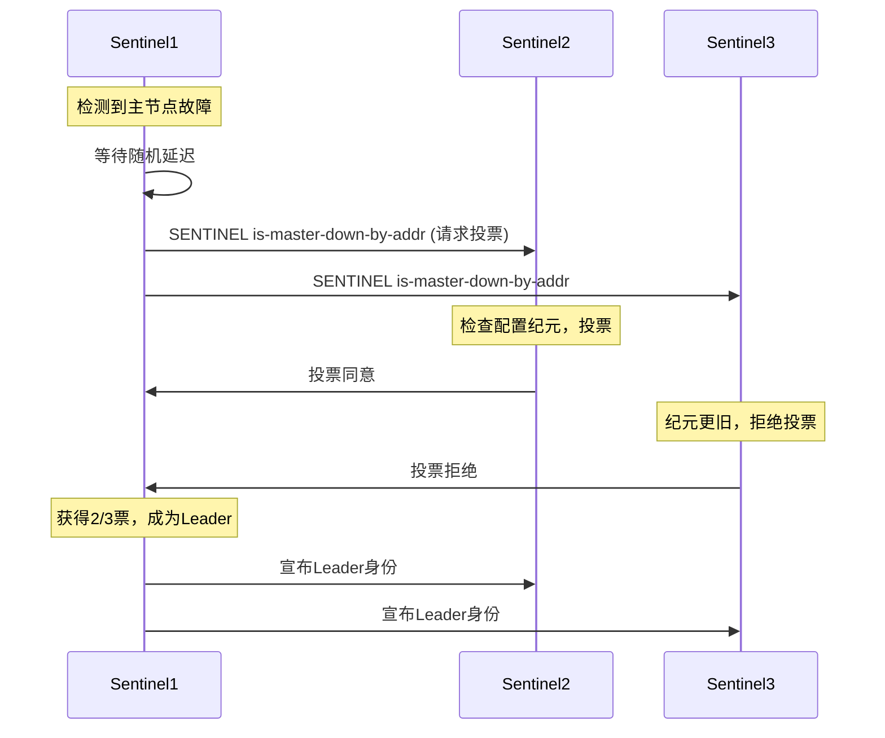

# Redis Sentinel哨兵Leader选举机制（Raft变体）

## 1. 概述

Redis Sentinel是Redis官方提供的高可用性解决方案，通过监控、自动故障转移和配置分发确保Redis服务的持续可用性。Sentinel集群采用**类Raft共识算法**的变体进行Leader选举，以协调故障转移操作并避免脑裂问题。

## 2. Raft算法核心概念

### 2.1 Raft基本元素
- **Term（任期）**：单调递增的逻辑时钟，每个选举周期对应一个任期
- **Leader（领导者）**：唯一负责协调操作和决策的节点
- **Follower（跟随者）**：被动接收Leader指令的节点
- **Candidate（候选者）**：参与Leader选举的节点状态

### 2.2 Raft选举核心规则
1. 每个Term最多选举一个Leader
2. 采用多数派投票机制（Quorum）
3. 节点只能投票给Log至少与自己一样新的候选者

## 3. Redis Sentinel的Raft变体实现

### 3.1 Sentinel节点角色
| 角色 | 职责 | 状态转换 |
|------|------|----------|
| Sentinel节点 | 监控Redis实例，参与选举 | 跟随者↔候选者↔领导者 |
| Leader Sentinel | 协调故障转移，决策主节点切换 | 选举产生，临时角色 |
| Quorum | 多数派共识，避免脑裂 | N/2 + 1个节点同意 |

### 3.2 选举触发条件
```python
# 伪代码：选举触发逻辑
def election_trigger(sentinel):
    if master_is_down(sentinel.monitored_master):
        if not election_in_progress():
            if is_first_to_detect() or election_timeout():
                become_candidate()
                start_election()
```

**触发场景：**
- 主节点被判定为客观下线（ODOWN）
- 当前无活跃的故障转移过程
- 节点在随机延迟后未收到其他节点的故障转移计划

### 3.3 选举过程详解

#### 步骤1：候选者发起投票请求
```python
class SentinelCandidate:
    def __init__(self):
        self.current_term += 1  # 递增任期
        self.voted_for = self.node_id  # 投票给自己
        self.vote_count = 1
        
    def request_votes(self):
        # 向所有其他Sentinel发送投票请求
        for sentinel in other_sentinels:
            send_vote_request(
                term=self.current_term,
                candidate_id=self.node_id,
                last_log_index=self.last_config_epoch,
                last_log_term=self.last_leader_term
            )
```

#### 步骤2：投票决策逻辑
```python
def handle_vote_request(request):
    # Raft投票约束检查
    if request.term < self.current_term:
        return VOTE_REJECTED
    
    if self.voted_for is None or self.voted_for == request.candidate_id:
        # 检查候选者的配置纪元是否足够新（类似Raft的Log比较）
        if request.last_log_index >= self.last_config_epoch:
            self.voted_for = request.candidate_id
            return VOTE_GRANTED
    
    return VOTE_REJECTED
```

#### 步骤3：选举超时与随机化
- **基础超时**：故障确认后的固定等待
- **随机偏移**：避免多个Sentinel同时发起选举
```python
election_timeout = BASE_TIMEOUT + random(0, ELECTION_RANDOM_RANGE)
```

#### 步骤4：领导者产生条件
```python
def check_election_result(self):
    total_sentinels = len(sentinel_cluster)
    quorum = total_sentinels // 2 + 1
    
    if self.vote_count >= quorum:
        self.become_leader()
        broadcast_leader_announcement()
        start_failover_procedure()
```

## 4. Sentinel选举的特殊性

### 4.1 与标准Raft的差异
| 特性 | 标准Raft | Redis Sentinel |
|------|---------|----------------|
| 持久化状态 | Log持久化 | 配置纪元持久化 |
| 选举触发 | 定期心跳超时 | 主节点故障检测 |
| 任期管理 | 严格的Term递增 | 配置纪元+运行ID组合 |
| 日志复制 | 完整的Log复制 | 仅故障转移配置分发 |

### 4.2 配置纪元（Config Epoch）
```python
# 配置纪元结构
ConfigEpoch = {
    "epoch": 123456,  # 单调递增的64位整数
    "leader_id": "sentinel-xyz",
    "voted_for": None,  # 当前任期投票给谁
    "failover_time": 1640995200
}
```

**配置纪元的作用：**
1. 故障转移操作的全局唯一标识
2. 避免多个Sentinel同时执行故障转移
3. 作为逻辑时钟解决冲突

### 4.3 故障转移竞态条件处理
```python
def handle_concurrent_failover(self, other_epoch):
    # 纪元比较：数值更大的纪元胜出
    if other_epoch > self.current_epoch:
        self.abort_failover()
        return FOLLOW_MODE
    elif other_epoch == self.current_epoch:
        # 纪元相同，比较运行ID（Run ID）
        if compare_run_ids(other_leader_id, self.node_id) < 0:
            return FOLLOW_MODE
    return CONTINUE_AS_LEADER
```

## 5. 选举流程示例

### 场景：3个Sentinel节点，主节点故障
```
时间线：
t0: Sentinel-1检测到主节点ODOWN
t1: Sentinel-1等待随机延迟（300ms）
t2: Sentinel-1成为候选者，纪元=1001，请求投票
t3: Sentinel-2接受投票（纪元>=自身纪元）
t4: Sentinel-3拒绝投票（已投票给其他候选者或纪元更旧）
t5: Sentinel-1获得2票（多数），成为Leader
t6: Sentinel-1开始执行故障转移
```

### 消息序列图


## 6. 故障处理与恢复

### 6.1 领导者失效
```python
def handle_leader_failure(self):
    # 领导者心跳超时检测
    if time_since_last_leader_ping() > LEADER_TIMEOUT:
        # 重置选举状态
        self.current_leader = None
        self.election_timer.reset()
        
        # 等待新的选举周期
        if self.detected_master_down:
            # 重新发起选举
            self.enter_candidate_state()
```

### 6.2 网络分区处理
- **少数派分区**：无法选举出Leader，故障转移暂停
- **多数派分区**：可以选举Leader，但需防止脑裂
- **分区恢复**：配置纪元同步，采用更高纪元的值

### 6.3 脑裂预防机制
```python
def prevent_split_brain(old_master):
    # 故障转移后的旧主节点恢复
    if old_master.promoted_epoch < current_config_epoch:
        # 旧主节点配置纪元落后，拒绝其写操作
        old_master.role = SLAVE
        old_master.replica_of(new_master)
```

## 7. 配置建议与最佳实践

### 7.1 Sentinel节点数量
```
推荐配置：
- 最小生产环境：3个Sentinel节点
- 容错能力：2n+1个节点可容忍n个故障
- 最大延迟：奇数节点数避免平票
```

### 7.2 关键参数调优
```redis
# sentinel.conf 配置示例
sentinel monitor mymaster 127.0.0.1 6379 2
sentinel down-after-milliseconds mymaster 30000
sentinel failover-timeout mymaster 180000
sentinel parallel-syncs mymaster 1

# 选举相关参数
# quorum: 故障判定的最少Sentinel数量
# failover-timeout: 故障转移超时时间
# parallel-syncs: 从节点并行同步数量
```

### 7.3 监控指标
```bash
# 关键监控项
redis-cli -p 26379 sentinel masters
redis-cli -p 26379 sentinel sentinels <master-name>
redis-cli -p 26379 sentinel get-master-addr-by-name <master-name>

# 重要指标：
# - sentinel_leader_epoch
# - sentinel_known_sentinels
# - sentinel_pending_commands
# - sentinel_failover_state
```

## 8. 局限性及注意事项

### 8.1 已知限制
1. **偶数节点问题**：偶数节点数可能导致选举无法达成共识
2. **时钟依赖性**：虽然没有强时钟同步要求，但时钟偏差过大会影响超时判断
3. **网络分区敏感性**：长时间网络分区可能导致服务不可用

### 8.2 与Redis Cluster的区别
| 特性 | Redis Sentinel | Redis Cluster |
|------|----------------|---------------|
| 选举范围 | Sentinel节点间 | Redis节点间 |
| 数据分片 | 不支持 | 支持 |
| 故障检测 | 基于Quorum | Gossip协议 |
| 适用场景 | 主从高可用 | 大规模分布式 |

## 9. 总结

Redis Sentinel的Leader选举机制基于Raft算法的核心思想，但针对Redis的高可用场景进行了优化和简化。通过配置纪元、随机化延迟和多数派投票，它能够在网络分区和节点故障的情况下，可靠地选出Leader来协调故障转移操作。

**核心优势：**
1. 算法简单，实现可靠
2. 避免脑裂，保证数据一致性
3. 无强外部依赖，自包含解决方案

**改进方向：**
1. 选举过程中客户端连接的平滑处理
2. 大规模部署下的选举效率优化
3. 与外部协调服务（如ZooKeeper、etcd）的集成选项

通过合理配置Sentinel集群和监控选举状态，可以构建高可用的Redis服务，满足生产环境的可靠性要求。

---

*文档版本：1.2*
*最后更新：2024年*
*参考：Redis官方文档、Raft论文、Redis源码分析*