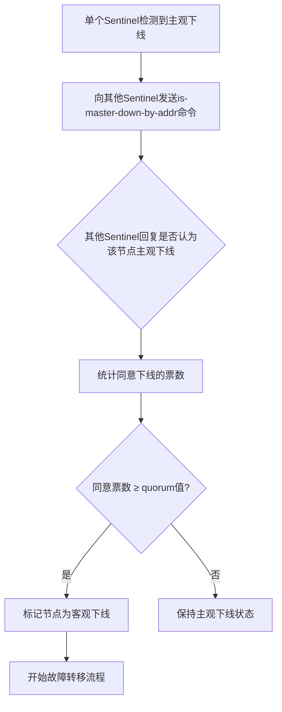

# Redis Sentinel 客观下线（多数投票）判断机制技术文档

## 1. 概述

Redis Sentinel 是 Redis 官方提供的高可用性解决方案，用于监控和管理 Redis 主从复制集群。当主节点（Master）出现故障时，Sentinel 能够自动进行故障转移，选举新的主节点，确保服务的可用性。客观下线（Objectively Down, O_DOWN）是 Sentinel 判断节点不可用的关键机制，它通过多个 Sentinel 实例的"多数投票"来避免单点误判。

## 2. 核心概念

### 2.1 主观下线（Subjectively Down, S_DOWN）
- **定义**：单个 Sentinel 实例根据自身的连接和检测结果，认为某个 Redis 节点不可用
- **触发条件**：Sentinel 向节点发送 `PING` 命令，在指定时间内未收到有效响应
- **本地决策**：仅代表该 Sentinel 的本地观点，不作为故障转移依据

### 2.2 客观下线（Objectively Down, O_DOWN）
- **定义**：多个 Sentinel 实例通过投票机制达成共识，共同认定某个节点不可用
- **触发条件**：一定数量的 Sentinel 实例（达到 quorum 值）都报告该节点主观下线
- **集群决策**：代表整个 Sentinel 集群的共识，是触发故障转移的前提条件

## 3. 客观下线判断流程

### 3.1 整体流程


### 3.2 详细步骤

#### 步骤1：主观下线检测
每个 Sentinel 实例独立执行：
1. 定期向所有监控的 Redis 节点发送 `PING` 命令
2. 如果节点在 `down-after-milliseconds` 时间内未响应或返回错误
3. 该 Sentinel 将该节点标记为**主观下线**

#### 步骤2：发起投票请求
当 Sentinel 将主节点标记为主观下线后：
1. 向其他 Sentinel 实例发送 `SENTINEL is-master-down-by-addr` 命令
2. 命令包含：目标节点的 IP、端口、当前纪元（current epoch）、Sentinel 的 runid
3. 请求其他 Sentinel 确认该节点状态

#### 步骤3：投票响应
接收投票请求的 Sentinel：
1. 检查目标节点是否在自己的主观下线列表中
2. 如果是，则同意该节点已下线
3. 回复包含：同意下线的标志、投票的 Sentinel runid（如果是选举请求）

#### 步骤4：票数统计与决策
发起投票的 Sentinel：
1. 收集所有其他 Sentinel 的回复
2. 统计同意下线的票数（包括自己的一票）
3. 判断条件：`同意票数 > 配置的quorum值`
4. 如果满足条件，将节点标记为**客观下线**

## 4. 关键配置参数

### 4.1 sentinel monitor
```bash
sentinel monitor <master-name> <ip> <port> <quorum>
```
- **quorum**：客观下线的法定人数阈值
  - 值范围：1 到 Sentinel 实例总数
  - 建议设置：`quorum = Sentinel实例总数/2 + 1`（多数原则）
  - 例如：3个 Sentinel，quorum=2；5个 Sentinel，quorum=3

### 4.2 sentinel down-after-milliseconds
```bash
sentinel down-after-milliseconds <master-name> <milliseconds>
```
- 主观下线的超时时间
- 默认值：30000毫秒（30秒）
- 该时间内未收到有效响应则标记为主观下线

### 4.3 sentinel failover-timeout
```bash
sentinel failover-timeout <master-name> <milliseconds>
```
- 故障转移的超时时间
- 默认值：180000毫秒（3分钟）
- 影响故障转移的多个阶段，包括客观下线的判断

## 5. 多数投票机制详解

### 5.1 投票算法
```
假设：
- 总 Sentinel 实例数：N
- 配置的 quorum 值：Q
- 实际同意下线的票数：A

客观下线条件：A ≥ Q 且 A > N/2
```

### 5.2 不同集群规模的配置建议

| Sentinel数量 | 推荐quorum值 | 容错能力 | 说明 |
|-------------|-------------|---------|------|
| 1 | 1 | 无容错 | 不推荐生产环境使用 |
| 3 | 2 | 可容忍1个Sentinel故障 | 最小推荐配置 |
| 5 | 3 | 可容忍2个Sentinel故障 | 推荐配置 |
| 7 | 4 | 可容忍3个Sentinel故障 | 大型集群配置 |

### 5.3 网络分区下的行为

#### 场景分析
```
场景：5个Sentinel，quorum=3，分为两个分区
分区1：3个Sentinel（包含主节点）
分区2：2个Sentinel

可能的情况：
1. 主节点实际故障：
   - 分区1：3个Sentinel都能检测到，可达到quorum，触发故障转移
   - 分区2：无法达到quorum，不触发故障转移
   
2. 主节点正常，但网络分区：
   - 分区1：主节点正常，不会标记为客观下线
   - 分区2：2个Sentinel认为主节点下线，但无法达到quorum=3
```

## 6. 示例分析

### 6.1 环境配置
```bash
# Sentinel配置示例
sentinel monitor mymaster 127.0.0.1 6379 2
sentinel down-after-milliseconds mymaster 30000
sentinel failover-timeout mymaster 180000
```

### 6.2 故障判断过程
```
时间线：
T0: Sentinel1 无法连接主节点，开始等待30秒
T30: Sentinel1 标记主节点为主观下线
T31: Sentinel1 向 Sentinel2、Sentinel3 发送投票请求
T32: Sentinel2 回复同意（它也检测到主观下线）
T33: Sentinel3 回复不同意（它仍能连接主节点）
T34: Sentinel1 统计票数：2票同意（包括自己），quorum=2
T35: 满足条件，Sentinel1 标记主节点为客观下线
```

### 6.3 日志分析
```log
# Sentinel1 的日志
1:X 30 Jan 2025 10:00:00.123 # +sdown master mymaster 127.0.0.1 6379
1:X 30 Jan 2025 10:00:01.456 # +odown master mymaster 127.0.0.1 6379 #quorum 2/2
1:X 30 Jan 2025 10:00:01.456 # +new-epoch 15
1:X 30 Jan 2025 10:00:01.456 # +try-failover master mymaster 127.0.0.1 6379
```

## 7. 最佳实践与注意事项

### 7.1 部署建议
1. **Sentinel数量**：至少部署3个实例，且部署在不同物理节点上
2. **quorum配置**：设置为 `N/2 + 1`（向上取整），确保多数原则
3. **网络考虑**：确保Sentinel实例间的网络延迟稳定
4. **时钟同步**：所有节点使用NTP服务保持时间同步

### 7.2 常见问题排查

#### 问题1：无法触发客观下线
- **可能原因**：
  - 网络分区导致无法达到quorum
  - Sentinel配置不一致
  - 防火墙阻止Sentinel间通信
- **排查步骤**：
  1. 检查各Sentinel日志
  2. 验证网络连通性
  3. 确认配置参数一致

#### 问题2：误判客观下线
- **可能原因**：
  - `down-after-milliseconds` 设置过短
  - 网络抖动或临时高负载
- **解决方案**：
  1. 适当增加 `down-after-milliseconds`
  2. 优化网络环境
  3. 监控系统负载

### 7.3 监控指标
建议监控以下关键指标：
- Sentinel 之间的通信状态
- 主观下线和客观下线的触发频率
- 故障转移的成功率
- Redis 节点的响应时间

## 8. 总结

Redis Sentinel 的客观下线机制通过分布式投票的方式，有效避免了单点误判问题，为 Redis 高可用提供了可靠的故障检测基础。正确理解和配置 quorum 参数是保证系统稳定性的关键。在实际生产环境中，需要根据集群规模、网络条件和容错需求，合理设置 Sentinel 数量和 quorum 值，并在部署后进行充分测试。

## 附录：相关命令参考

| 命令 | 说明 |
|------|------|
| `SENTINEL masters` | 查看所有监控的主节点 |
| `SENTINEL sentinels <master-name>` | 查看监控同一主节点的其他Sentinel |
| `SENTINEL get-master-addr-by-name <master-name>` | 获取主节点地址 |
| `SENTINEL failover <master-name>` | 手动触发故障转移 |
| `SENTINEL ckquorum <master-name>` | 检查quorum配置是否满足 |

---

**文档版本**：1.0  
**最后更新**：2025年1月30日  
**适用范围**：Redis 2.8+，Sentinel 2.8+