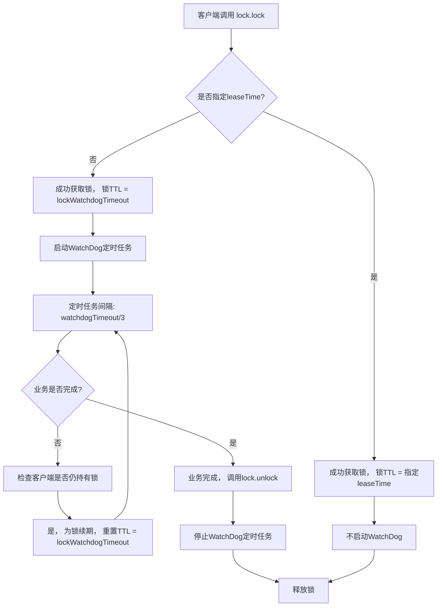

好的，遵照您的要求，以下是一份关于 **Redisson分布式锁（WatchDog自动续期）** 的技术文档。

---

# Redisson分布式锁技术文档：WatchDog自动续期机制

## 1. 概述

在分布式系统中，确保多个服务实例或进程间对共享资源访问的互斥性是核心需求。Redisson是一个基于Redis的Java驻内存数据网格客户端，它提供了一系列分布式的、线程安全的Java对象，其中 **可重入分布式锁（`RLock`）** 是其最核心的组件之一。

Redisson的分布式锁不仅实现了基本的加锁、解锁逻辑，还引入了 **WatchDog（看门狗）** 机制来解决业务逻辑执行时间超过锁超时时间（`leaseTime`）而导致的锁被意外释放的问题，从而保证了锁的可靠性与业务的安全性。

## 2. WatchDog机制解决的问题

### 2.1 典型问题场景
1.  **场景**： 客户端A获取锁，并设置了30秒的锁超时时间（避免因客户端崩溃导致死锁）。
2.  **问题**： 客户端A的业务逻辑执行了40秒。
3.  **后果**： 在第30秒时，Redis中的锁因过期而被自动释放。此时，客户端B成功获取了同一把锁。从第31秒到第40秒，**客户端A和客户端B同时持有同一把锁**，破坏了互斥性，可能导致数据不一致。
4.  **根源**： 锁的持有时间（业务执行时间）无法准确预估。

### 2.2 WatchDog的解决方案
WatchDog通过在**未显式指定锁超时时间**的情况下，后台启动一个定时任务，周期性（默认间隔`lockWatchdogTimeout / 3`）地检查客户端是否仍持有锁。如果是，则自动延长锁在Redis中的生存时间（默认为`lockWatchdogTimeout`， 默认30秒）。这相当于将锁的有效期从固定的`leaseTime`变为由业务执行时间动态决定（只要客户端存活且未主动释放）。

## 3. 核心工作机制

### 3.1 触发条件
**WatchDog仅在未通过API显式指定`leaseTime`（锁租约时间）时才会启动。**
```java
// 方式一：启动WatchDog (未指定leaseTime)
RLock lock = redisson.getLock("myLock");
lock.lock(); // WatchDog 生效

// 方式二：不启动WatchDog (指定leaseTime)
lock.lock(10, TimeUnit.SECONDS); // 10秒后自动释放，无WatchDog
```

### 3.2 工作流程


### 3.3 关键配置参数
*   **`lockWatchdogTimeout`**： 看门狗超时时间，单位毫秒。
    *   **默认值**： `30000L` (30秒)。
    *   **作用**：
        1.  作为未指定`leaseTime`时，锁的初始TTL。
        2.  作为每次续期时重置的TTL值。
        3.  WatchDog检查间隔为该值的1/3（即默认每10秒检查一次）。
    *   **修改方式**：
        ```java
        Config config = new Config();
        config.setLockWatchdogTimeout(60000L); // 设置为60秒
        RedissonClient redisson = Redisson.create(config);
        ```

## 4. 使用示例与代码分析

### 4.1 基础使用
```java
public void safeBusinessOperation() {
    String lockKey = "resource:lock:001";
    RLock lock = redissonClient.getLock(lockKey);
    
    try {
        // 1. 获取锁（WatchDog自动生效）
        lock.lock();
        
        // 2. 执行核心业务逻辑（执行时间可能很长，也可能很短）
        doSomeLongTimeBusiness();
        
    } finally {
        // 3. 无论如何，最后都尝试释放锁
        // unlock()调用会先停止当前锁对应的WatchDog线程
        if (lock.isLocked() && lock.isHeldByCurrentThread()) {
            lock.unlock();
        }
    }
}
```

### 4.2 源码关键逻辑浅析
在`RedissonLock.lock()`->`tryAcquireAsync()`的调用链中，当未传入`leaseTime`时，会使用`internalLockLeaseTime`（即`lockWatchdogTimeout`）作为TTL。

WatchDog任务的核心逻辑在`RedissonLock.renewExpiration()`方法中：
```java
// 简化后的续期逻辑
private void renewExpiration() {
    // ...
    Timeout task = commandExecutor.getConnectionManager().newTimeout(new TimerTask() {
        @Override
        public void run(Timeout timeout) throws Exception {
            // 1. 检查当前线程是否还持有锁（通过ThreadId）
            Future<Boolean> future = commandExecutor.evalWriteAsync(...,
                "if (redis.call('hexists', KEYS[1], ARGV[2]) == 1) then " +
                    "redis.call('pexpire', KEYS[1], ARGV[1]); " + // 2. 如果持有，则执行续期命令
                    "return 1; " +
                "end; " +
                "return 0;");
            
            future.onComplete((res, e) -> {
                if (e != null) {
                    // 异常处理，停止续期
                    return;
                }
                if (res) {
                    // 3. 续期成功，递归调用，安排下一次检查
                    renewExpiration();
                }
            });
        }
    }, lockWatchdogTimeout / 3, TimeUnit.MILLISECONDS); // 延迟执行时间
    // ...
}
```

## 5. 注意事项与最佳实践

### 5.1 使用注意事项
1.  **明确是否需要WatchDog**：
    *   如果业务执行时间**相对稳定且可预估**，建议使用`lock.lock(leaseTime, unit)`，性能更优。
    *   如果业务执行时间**不可预估或可能很长**，应依赖WatchDog机制。
2.  **锁释放与异常处理**：
    *   **必须在`finally`块中释放锁**，确保锁不会因异常而永远持有（WatchDog会持续续期）。
    *   释放前建议通过`isHeldByCurrentThread()`检查，避免非持有线程误释放。
3.  **`lockWatchdogTimeout`设置**：
    *   该值应大于业务逻辑的**平均执行时间**，避免不必要的频繁续期。
    *   网络环境较差时，可适当调大，给续期命令更多缓冲时间。
4.  **连接丢失**：
    *   如果Redisson客户端与Redis服务器之间的连接长时间断开，WatchDog将无法续期。锁最终会因TTL到期而释放，这是符合设计预期的安全行为。

### 5.2 最佳实践
- **锁命名**： 使用具有业务含义的唯一键，例如`"order:pay:{orderId}"`。
- **避免嵌套与死锁**： Redisson的`RLock`是可重入的，但要确保获取与释放的次数匹配。
- **监控**： 监控Redis中带有`redisson_lock`前缀的Key，观察其TTL变化，可以了解WatchDog的工作状态。
- **测试**： 在测试环境中模拟长时任务，验证WatchDog是否能正确续期，以及客户端崩溃后锁是否能自动释放。

## 6. 总结

Redisson的WatchDog机制通过一个后台守护线程，优雅地解决了分布式锁在长任务执行中可能因超时而过早释放的难题。它将开发人员从精确预估锁超时时间的负担中解放出来，大大提升了分布式锁的健壮性和易用性。

其核心要义在于：**当你不给锁一个确定的租约时间（`leaseTime`）时，Redisson便承诺“只要你的客户端还活着且持有锁，我就会在后台默默为你守护，直到你主动放手”。**

---
**文档版本**： 1.0  
**适用Redisson版本**： 3.x 及以上