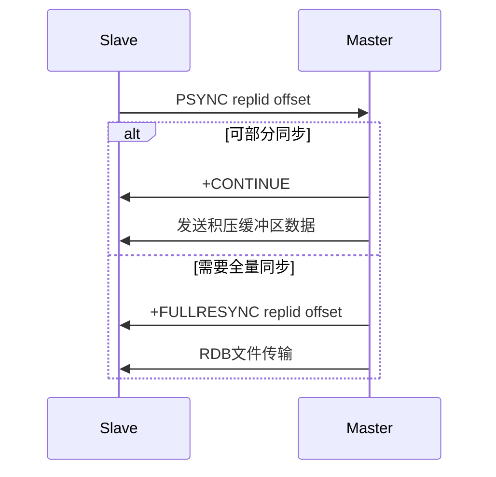

# Redis主从复制PSYNC2增量同步技术文档

## 1. 概述
Redis主从复制中的PSYNC2是Redis 4.0引入的改进版部分重同步协议，用于优化主从节点断开重连后的数据同步效率，减少全量同步的开销。

## 2. PSYNC2核心机制

### 2.1 复制偏移量管理
```
主节点：维护复制流中的字节偏移量
从节点：记录最后处理的复制偏移量
断开重连时，从节点上报偏移量，主节点判断是否可增量同步
```

### 2.2 复制积压缓冲区（Replication Backlog）
```python
# 配置示例（redis.conf）
repl-backlog-size 1mb      # 积压缓冲区大小
repl-backlog-ttl 3600      # 缓冲区保留时间（秒）

# 工作原理
1. 主节点将写命令写入积压缓冲区
2. 同时将命令发送给从节点
3. 缓冲区环形覆盖，保存最近写入的命令
```

### 2.3 复制ID机制
```
PSYNC2引入两套复制ID：
- main_replid：主节点当前复制流ID
- replid2：上一个主节点的复制ID

当主节点提升或故障转移时，复制ID会更新
从节点同时记录两套ID和对应偏移量
```

## 3. PSYNC2同步流程

### 3.1 连接建立阶段
```
从节点 -> 主节点：PSYNC <replid> <offset>
主节点检查：
  1. 如果replid与main_replid匹配
  2. 且offset在积压缓冲区内
  则触发部分重同步
```

### 3.2 增量同步过程


## 4. 配置优化建议

### 4.1 积压缓冲区配置
```bash
# 生产环境推荐配置
repl-backlog-size 512mb    # 根据网络延迟和写入量调整
repl-backlog-ttl 7200      # 延长TTL避免频繁全量同步

# 监控指标
redis-cli info replication | grep backlog
# repl_backlog_active:1
# repl_backlog_size:1048576
# repl_backlog_first_byte_offset:1
# repl_backlog_histlen:1048576
```

### 4.2 网络与超时设置
```
repl-timeout 60           # 复制超时时间
repl-ping-slave-period 10 # 心跳检测间隔
client-output-buffer-limit slave 256mb 64mb 60
```

## 5. 故障场景处理

### 5.1 网络闪断恢复
```
场景：短时间网络中断（< backlog TTL）
处理：自动使用PSYNC2增量同步
条件：从节点offset仍在backlog范围内
```

### 5.2 主节点重启
```
场景：主节点重启但数据未丢失
处理：
  1. 主节点启动后恢复原有replid
  2. 从节点可使用历史replid尝试PSYNC
  3. 如果offset有效则增量同步
```

### 5.3 主节点切换
```
场景：故障转移后新主节点
处理：
  1. 新主生成新replid
  2. 从节点需全量同步
  3. PSYNC2保存旧replid用于后续链式复制
```

## 6. 监控与诊断

### 6.1 关键指标监控
```bash
# 查看复制状态
redis-cli info replication

# 重点关注：
master_replid          # 当前主节点复制ID
master_repl_offset     # 主节点复制偏移量
slave_repl_offset      # 从节点复制偏移量
repl_backlog_active    # 积压缓冲区状态
```

### 6.2 日志分析
```
# Redis日志中的PSYNC2相关记录
[时间戳] * Slave请求PSYNC
[时间戳] * 部分重同步成功
[时间戳] * 全量同步开始
```

## 7. 性能优化实践

### 7.1 内存优化
```
# 避免积压缓冲区过大消耗内存
# 计算公式：
建议大小 = (网络延迟 + 从节点处理延迟) × 写入速率 × 安全系数(2-3)
```

### 7.2 写入优化
```
# 大value拆分
# 管道化写入
# 避免单次写入过大导致缓冲区快速覆盖
```

## 8. 限制与注意事项

### 8.1 PSYNC2限制
```
1. 从节点断开时间过长，offset超出backlog范围
2. 主节点内存不足，backlog被覆盖
3. 复制ID不匹配（如主节点数据重置）
```

### 8.2 版本兼容性
```
PSYNC2要求：Redis 4.0+
老版本从节点连接新主节点：降级为SYNC
链式复制中所有节点需支持PSYNC2
```

## 9. 总结

PSYNC2通过改进复制ID管理和积压缓冲区机制，显著提升了Redis主从复制在故障恢复时的效率。合理配置`repl-backlog-size`和监控复制偏移量差异，可以最大限度利用增量同步优势，降低全量同步对系统性能的影响。

在实际部署中，建议：
1. 根据业务写入模式调整积压缓冲区大小
2. 监控复制延迟和缓冲区使用情况
3. 保持Redis版本在4.0以上以获得完整功能支持
4. 在网络不稳定环境中适当增加缓冲区TTL