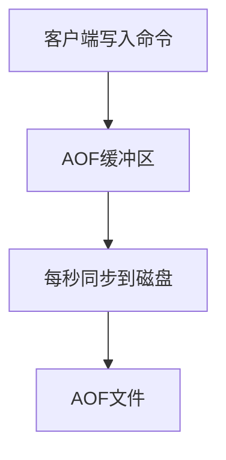
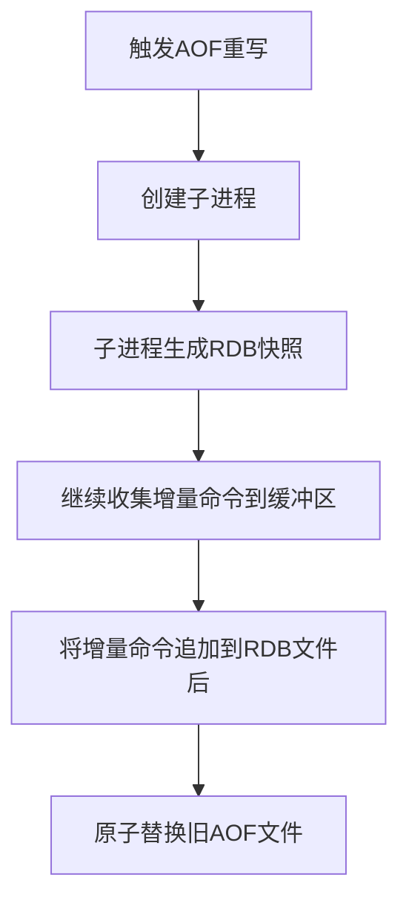

# Redis混合持久化（RDB+AOF结合）技术文档

## 1. 概述

Redis混合持久化是Redis 4.0版本引入的特性，它结合了RDB（Redis Database）和AOF（Append-Only File）两种持久化方式的优势，在保证数据安全性的同时，兼顾了性能和数据恢复速度。

## 2. 背景与问题

### 2.1 RDB持久化
- **优势**：紧凑的二进制格式、恢复速度快、适合备份
- **劣势**：可能丢失最后一次快照后的所有数据

### 2.2 AOF持久化
- **优势**：数据安全性高，可配置不同fsync策略
- **劣势**：文件体积较大、恢复速度较慢、重写时可能占用较多资源

## 3. 混合持久化原理

### 3.1 工作机制
混合持久化的核心思想是：
- 使用RDB格式存储基础数据集
- 使用AOF格式记录RDB之后的增量修改操作
- 两种格式合并存储在同一个文件中

### 3.2 文件格式
```
[REDIS RDB头部][RDB数据][AOF增量命令]
```

## 4. 配置方式

### 4.1 开启混合持久化
```bash
# redis.conf 配置文件

# 开启AOF持久化
appendonly yes

# 启用混合持久化（Redis 4.0+）
aof-use-rdb-preamble yes

# AOF重写策略配置
auto-aof-rewrite-percentage 100
auto-aof-rewrite-min-size 64mb
```

### 4.2 配置说明
| 配置项 | 默认值 | 说明 |
|--------|--------|------|
| `appendonly` | `no` | 是否开启AOF持久化 |
| `aof-use-rdb-preamble` | `yes` (Redis 4.0+) | 是否开启混合持久化 |
| `appendfilename` | `appendonly.aof` | AOF文件名 |
| `appendfsync` | `everysec` | 同步策略：always/everysec/no |

## 5. 工作流程

### 5.1 正常写入流程


### 5.2 AOF重写流程


## 6. 数据恢复过程

### 6.1 恢复流程
1. Redis启动时检查AOF文件
2. 识别RDB头部并加载基础数据集
3. 继续执行RDB后的AOF增量命令
4. 完成数据恢复

### 6.2 恢复示例
```bash
# Redis启动日志示例
[32298] 01 Jan 00:00:00.000 * DB loaded from append only file: 0.000 seconds
[32298] 01 Jan 00:00:00.000 * Reading RDB preamble from AOF file...
[32298] 01 Jan 00:00:00.500 * Loading RDB produced by version 6.2.5
[32298] 01 Jan 00:00:01.000 * RDB preamble read, loading the rest of the AOF...
[32298] 01 Jan 00:00:02.000 * AOF loaded, 1000000 keys loaded
```

## 7. 性能分析

### 7.1 优势
1. **恢复速度快**：相比纯AOF，恢复时间大幅缩短
2. **文件体积小**：相比纯AOF，文件体积更小
3. **数据安全**：相比纯RDB，数据丢失风险降低
4. **兼容性好**：文件格式向后兼容

### 7.2 劣势
1. **AOF重写时仍可能阻塞**：RDB快照生成期间可能影响性能
2. **复杂度增加**：需要同时理解两种持久化机制

## 8. 监控与维护

### 8.1 监控指标
```bash
# 查看持久化相关信息
redis-cli info persistence

# 关键指标
rdb_last_bgsave_status:ok
aof_enabled:1
aof_rewrite_in_progress:0
aof_last_rewrite_time_sec:1
aof_current_size:10485760
aof_base_size:1048576
```

### 8.2 维护命令
```bash
# 手动触发AOF重写（生成混合格式）
redis-cli bgrewriteaof

# 检查AOF文件完整性
redis-cli --pipe < /path/to/appendonly.aof

# 修复损坏的AOF文件
redis-check-aof --fix appendonly.aof
```

## 9. 最佳实践

### 9.1 配置建议
```bash
# 推荐配置
appendonly yes
aof-use-rdb-preamble yes
appendfsync everysec
no-appendfsync-on-rewrite yes
auto-aof-rewrite-percentage 100
auto-aof-rewrite-min-size 64mb
aof-load-truncated yes
```

### 9.2 备份策略
1. **定期备份AOF文件**
2. **监控磁盘空间**
3. **在不同物理位置保留备份**
4. **测试恢复流程**

### 9.3 故障处理
1. **文件损坏**：使用redis-check-aof修复
2. **磁盘空间不足**：监控告警，及时扩容
3. **恢复失败**：回退到最近的备份

## 10. 注意事项

1. **版本兼容性**：混合持久化需要Redis 4.0+版本
2. **内存需求**：AOF重写期间需要足够内存
3. **性能影响**：在极端写入场景下可能影响性能
4. **监控告警**：必须建立完整的监控体系

## 11. 测试验证

### 11.1 测试脚本示例
```python
#!/usr/bin/env python3
import redis
import time

def test_mixed_persistence():
    r = redis.Redis(host='localhost', port=6379)
    
    # 写入测试数据
    for i in range(10000):
        r.set(f'key_{i}', f'value_{i}')
    
    # 模拟重启
    print("数据写入完成，模拟Redis重启...")
    
    # 实际测试中需要重启Redis服务
    # 然后验证数据是否完整恢复
    
if __name__ == '__main__':
    test_mixed_persistence()
```

## 12. 总结

Redis混合持久化通过结合RDB和AOF的优势，提供了：
- 更快的重启恢复速度
- 更高的数据安全性
- 相对较小的持久化文件
- 良好的兼容性和可维护性

对于大多数生产环境，推荐使用混合持久化作为默认配置，但需要根据具体业务场景进行调优和测试。

---

**文档版本**: 1.0  
**最后更新**: 2024年1月  
**适用版本**: Redis 4.0+  
**作者**: Redis技术团队