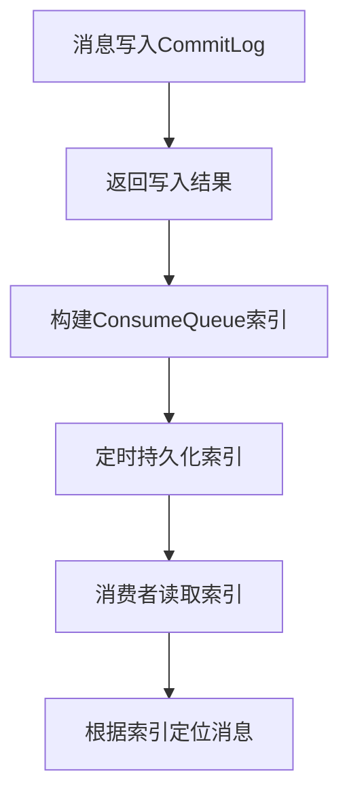

# RocketMQ CommitLog顺序写与ConsumeQueue索引机制

## 1. 概述

RocketMQ作为一款高性能、高可用的分布式消息中间件，其存储引擎的设计采用了"CommitLog顺序写 + ConsumeQueue二级索引"的独特架构。这种设计巧妙地平衡了写入性能与读取效率，是RocketMQ高性能的关键所在。

## 2. 核心设计思想

### 2.1 设计目标
- **最大化写入性能**：利用磁盘顺序写特性，实现高吞吐量写入
- **高效消息检索**：支持多消费者、多队列的并发读取
- **数据一致性**：保证消息不丢失、不重复
- **空间利用率**：减少存储冗余，提高磁盘使用效率

### 2.2 架构对比
| 传统消息队列 | RocketMQ |
|-------------|----------|
| 每个主题/队列独立存储文件 | 所有消息统一存储到CommitLog |
| 写入分散，随机I/O多 | 写入集中，纯顺序I/O |
| 消费位点管理复杂 | 消费位点与存储解耦 |

## 3. CommitLog顺序写机制

### 3.1 CommitLog结构
```
CommitLog文件结构：
- 文件命名：00000000000000000000（20位数字，表示起始偏移量）
- 文件大小：默认1GB（可配置）
- 存储内容：所有主题的所有消息原始数据
- 存储格式：定长头部 + 变长消息体
```

### 3.2 写入流程
```java
// 伪代码示例：CommitLog顺序写入
public class CommitLog {
    // 当前写入的MappedFile
    private MappedFile mappedFile;
    
    public PutMessageResult putMessage(MessageExtBrokerInner message) {
        // 1. 获取当前可写的MappedFile
        MappedFile currentFile = getLastMappedFile();
        
        // 2. 追加消息（确保线程安全）
        AppendMessageResult result = currentFile.appendMessage(message);
        
        // 3. 同步刷盘或异步刷盘
        if (FlushDiskType.SYNC_FLUSH == flushDiskType) {
            flush();
        }
        
        return new PutMessageResult(PutMessageStatus.PUT_OK, result);
    }
    
    // 顺序写入的核心：总是追加到文件末尾
    private MappedFile getLastMappedFile() {
        if (currentFile.isFull()) {
            // 创建新的1GB文件继续写入
            return createNewMappedFile();
        }
        return currentFile;
    }
}
```

### 3.3 顺序写优势
1. **磁盘I/O优化**：现代机械磁盘顺序写速度可达400-600MB/s，远超随机写
2. **减少磁盘寻道时间**：磁头无需频繁移动
3. **预读优化**：操作系统和磁盘控制器可有效预读连续数据
4. **简化并发控制**：写锁竞争小，大部分时间在无锁状态

### 3.4 刷盘策略
| 策略类型 | 配置 | 数据安全性 | 性能影响 |
|---------|------|-----------|----------|
| 同步刷盘 | flushDiskType=SYNC_FLUSH | 高，每次写入都落盘 | 性能较低，延迟较高 |
| 异步刷盘 | flushDiskType=ASYNC_FLUSH | 中，定期刷盘 | 性能高，延迟低 |
| 异步提交 | transStorePoolEnable=true | 较低，先写入堆外内存 | 性能最高，风险最大 |

## 4. ConsumeQueue索引机制

### 4.1 ConsumeQueue设计原理
```
ConsumeQueue文件结构：
- 路径：$ {storeRoot}/consumequeue/{topic}/{queueId}/{fileName}
- 文件大小：约5.72MB（30万条索引）
- 条目大小：20字节固定
- 存储格式：8字节(CommitLog偏移量) + 4字节(消息大小) + 8字节(消息Tag哈希码)
```

### 4.2 索引条目解析
```java
// ConsumeQueue条目结构
public class ConsumeQueueItem {
    private long commitLogOffset;  // CommitLog中的偏移量（8字节）
    private int msgSize;           // 消息大小（4字节）
    private long tagsCode;         // 消息过滤标签（8字节）
    
    // 计算物理位置
    public long getPhysicalOffset() {
        return commitLogOffset * OS_PAGE_SIZE;
    }
}
```

### 4.3 索引构建流程


### 4.4 索引更新策略
1. **实时构建**：消息写入CommitLog后立即构建索引
2. **批量持久化**：索引先写入内存，定时刷盘（默认500ms）
3. **懒加载**：消费者首次访问时加载对应ConsumeQueue文件
4. **缓存优化**：热数据索引缓存在PageCache中

## 5. 协同工作机制

### 5.1 写入过程
```java
// 写入过程的协同工作
public class DefaultMessageStore {
    
    public PutMessageResult putMessage(MessageExtBrokerInner msg) {
        // 1. 写入CommitLog（顺序写）
        AppendMessageResult commitLogResult = commitLog.putMessage(msg);
        
        // 2. 异步构建ConsumeQueue索引
        DispatchRequest dispatchRequest = new DispatchRequest(
            msg.getTopic(),
            msg.getQueueId(),
            commitLogResult.getWroteOffset(),
            msg.getBody().length,
            tagsCode
        );
        
        // 分发到各个ConsumeQueue
        this.reputMessageService.putRequest(dispatchRequest);
        
        return putMessageResult;
    }
}
```

### 5.2 读取过程
```java
// 消费者读取消息流程
public class DefaultMQPushConsumerImpl {
    
    public PullResult pullMessage(PullRequest request) {
        // 1. 根据主题和队列ID找到ConsumeQueue
        ConsumeQueue consumeQueue = findConsumeQueue(request.getTopic(), 
                                                     request.getQueueId());
        
        // 2. 根据消费位点读取索引
        SelectMappedBufferResult bufferResult = 
            consumeQueue.getIndexBuffer(request.getCommitOffset());
        
        // 3. 解析索引，获取CommitLog位置
        List<ConsumeQueueItem> items = parseIndexBuffer(bufferResult);
        
        // 4. 从CommitLog读取消息内容
        List<MessageExt> messages = new ArrayList<>();
        for (ConsumeQueueItem item : items) {
            MessageExt msg = commitLog.getMessage(item.getCommitLogOffset(), 
                                                  item.getMsgSize());
            messages.add(msg);
        }
        
        return new PullResult(PullStatus.FOUND, messages);
    }
}
```

## 6. 性能优化分析

### 6.1 写入性能优化
| 优化措施 | 效果 | 实现方式 |
|---------|------|----------|
| 顺序写 | 提高磁盘吞吐量5-10倍 | 所有消息写入同一文件 |
| 内存映射文件 | 减少用户态到内核态拷贝 | 使用MappedByteBuffer |
| 批量刷盘 | 减少I/O次数 | 定时或定量批量刷盘 |
| 写入缓冲区 | 平滑写入峰值 | 使用堆外内存池 |

### 6.2 读取性能优化
| 优化措施 | 效果 | 实现方式 |
|---------|------|----------|
| 二级索引 | 快速定位消息 | ConsumeQueue小文件索引 |
| 零拷贝 | 减少数据拷贝 | sendfile或mmap技术 |
| 页缓存 | 提高读取速度 | 依赖操作系统PageCache |
| 预读取 | 减少磁盘I/O | 批量读取相邻消息 |

### 6.3 空间利用率优化
1. **分离存储**：消息体与索引分离，小索引可完全缓存
2. **定期清理**：根据保留策略删除过期文件
3. **文件复用**：使用固定大小文件，避免碎片化

## 7. 容错与恢复机制

### 7.1 数据一致性保证
```java
// 恢复流程确保数据一致性
public class DefaultMessageStore {
    
    public void recover() {
        // 1. 恢复CommitLog
        commitLog.recover();
        
        // 2. 恢复ConsumeQueue（根据CommitLog重建）
        for (ConsumeQueue cq : consumeQueueTable.values()) {
            cq.recover();
            
            // 检查并修正不一致的索引
            correctConsumeQueueMinOffset(cq);
        }
        
        // 3. 恢复索引文件
        indexService.load(lastExitOK);
    }
}
```

### 7.2 故障恢复策略
1. **正常关闭**：保存刷盘点，下次启动快速恢复
2. **异常崩溃**：从最后刷盘点开始恢复，重建ConsumeQueue
3. **磁盘损坏**：支持从Slave同步恢复
4. **索引损坏**：根据CommitLog重新生成索引

## 8. 参数调优建议

### 8.1 关键配置参数
```properties
# CommitLog相关配置
mapedFileSizeCommitLog=1073741824  # CommitLog文件大小，默认1GB
flushCommitLogTimed=500            # 异步刷盘间隔，默认500ms
flushCommitLogLeastPages=4         # 最少脏页数触发刷盘

# ConsumeQueue相关配置
mappedFileSizeConsumeQueue=6000000 # ConsumeQueue文件大小，约5.72MB
flushIntervalConsumeQueue=1000     # ConsumeQueue刷盘间隔
maxTransferBytesOnMessageInMemory=262144  # 内存中最大传输字节

# 刷盘配置
flushDiskType=ASYNC_FLUSH          # 刷盘方式：SYNC_FLUSH或ASYNC_FLUSH
transientStorePoolEnable=false     # 是否启用堆外内存缓冲池
```

### 8.2 性能调优指南
1. **高吞吐场景**：启用异步刷盘+堆外内存缓冲池
2. **数据安全场景**：使用同步刷盘，适当增加flushCommitLogLeastPages
3. **混合负载场景**：根据业务特点调整文件大小和刷盘策略
4. **SSD环境**：可适当减小文件大小，增加并发度

## 9. 局限性及应对方案

### 9.1 设计局限性
1. **随机读放大**：消费者分散可能导致CommitLog随机读
2. **索引重建耗时**：异常恢复时重建ConsumeQueue较慢
3. **内存占用**：大量主题/队列时ConsumeQueue内存占用较高

### 9.2 优化方案
1. **消费者分组**：相同主题消费者尽量分组，提高缓存命中率
2. **预热机制**：预先加载热数据到PageCache
3. **索引压缩**：对冷数据索引进行压缩存储
4. **分级存储**：热数据SSD，冷数据HDD

## 10. 总结

RocketMQ的"CommitLog顺序写 + ConsumeQueue索引"架构是一种经典的权衡设计：

1. **写入性能优先**：通过CommitLog顺序写最大化磁盘I/O效率
2. **读取灵活适配**：通过ConsumeQueue支持多消费者并发读取
3. **空间效率高**：消息体只存储一份，索引轻量级
4. **扩展性强**：存储与消费逻辑解耦，易于扩展

这种设计使得RocketMQ能够在大规模消息场景下，既保持高吞吐量的写入性能，又支持高效的随机读取，成为企业级消息中间件的优秀选择。在实际应用中，需要根据具体业务场景调整相关参数，以达到最佳的性能表现。