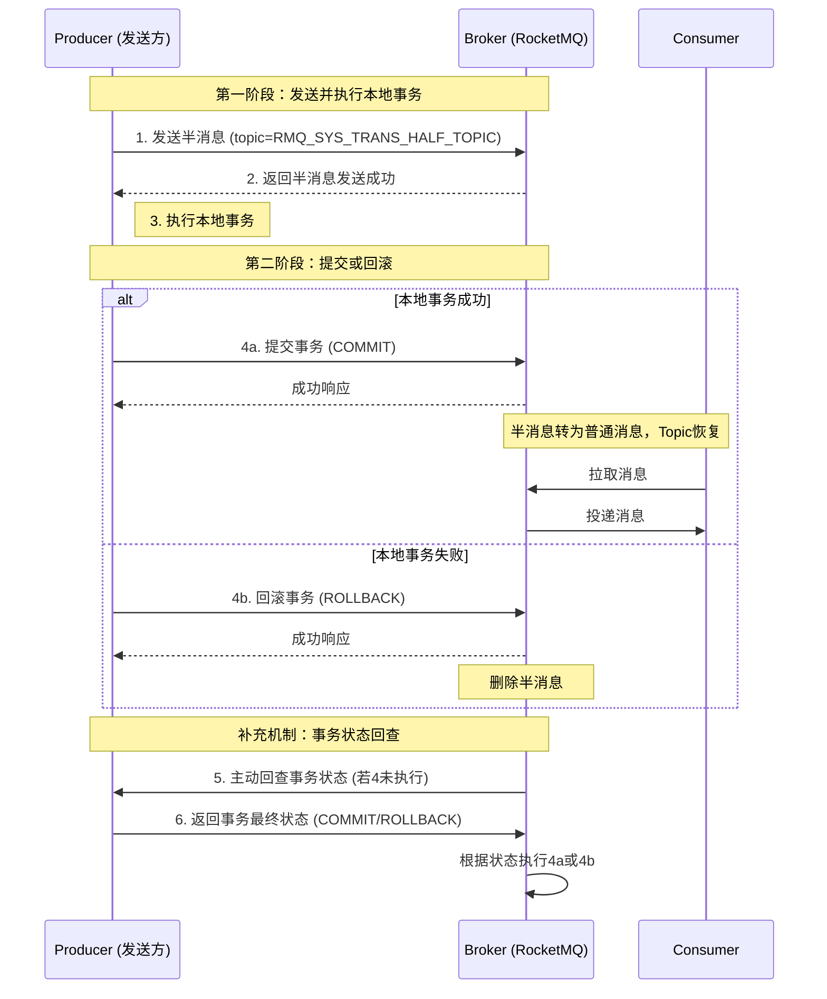

好的，这是一份关于 **RocketMQ 事务消息半消息机制** 的技术文档。

---

# **RocketMQ 事务消息（半消息）机制技术文档**

## **1. 文档概述**

### 1.1 目的
本文档旨在详细阐述 Apache RocketMQ 中**事务消息**的核心机制——**半消息机制**，包括其设计背景、工作原理、核心流程、关键特性以及使用中的注意事项，为开发者和架构师在分布式事务场景中正确使用 RocketMQ 提供技术指导。

### 1.2 目标读者
*   后端开发工程师
*   系统架构师
*   对分布式消息中间件和分布式事务感兴趣的技术人员

### 1.3 核心概念
*   **事务消息**：指应用本地事务与消息发送行为绑定在一起的消息，确保二者最终一致性。
*   **半消息**：指**对消费者不可见**的预发送消息，是 RocketMQ 实现事务消息的核心媒介。
*   **事务回查**：RocketMQ 服务端主动向发送方查询本地事务最终状态的机制。

## **2. 背景与挑战**

在典型的分布式系统中，经常需要保证应用本地数据库操作与消息发送的一致性。例如，在电商下单场景中，创建订单（写库）和发送扣减库存消息必须同时成功或失败。

简单的先执行本地事务再发送消息，或先发送消息再执行本地事务，都会因网络、服务崩溃等因素导致不一致状态（如库事务成功但消息未发出，造成业务遗漏）。RocketMQ 的事务消息机制正是为了解决此类问题而设计。

## **3. 半消息机制核心设计**

事务消息的核心设计是将消息的发送拆分为两个阶段，并引入**事务回查**机制来确保最终一致性。

### 3.1 消息状态定义
在事务消息的生命周期中，消息在 Broker 上存在三种状态：
1.  **`TransactionStatus.Unknown`**： 事务未决状态，对应半消息。消费者无法消费。
2.  **`TransactionStatus.CommitTransaction`**： 提交事务，半消息转变为普通消息，可供消费者消费。
3.  **`TransactionStatus.RollbackTransaction`**： 回滚事务，半消息将被删除，永不投递。

### 3.2 两阶段提交流程
整个机制模仿了分布式事务中的两阶段提交（2PC）。

**第一阶段：发送与执行**
1.  Producer 向 Broker 发送一条 **“半消息”**。
    *   此时消息的主题（Topic）会被替换为 `RMQ_SYS_TRANS_HALF_TOPIC`，因此**消费者无法感知和消费此消息**。
2.  Broker 持久化半消息成功，并响应 Producer。
3.  Producer 收到响应后，**开始执行本地事务**，并记录事务执行结果。

**第二阶段：提交或回滚**
4.  Producer 根据本地事务执行结果，向 Broker 发送一个 **`Commit`** 或 **`Rollback`** 指令。
    *   **`Commit`**： Broker 将半消息从 `RMQ_SYS_TRANS_HALF_TOPIC` 恢复到原始的目标 Topic。消息随即对消费者可见，可被正常消费。
    *   **`Rollback`**： Broker 直接删除半消息，永不投递。

### 3.3 事务状态回查机制
这是确保机制健壮性的关键。如果 Producer 在执行完本地事务后，由于应用重启、网络中断等原因，未能向 Broker 发送第二阶段的 Commit/Rollback 指令，消息将永远处于“半消息”状态。

为解决此问题，RocketMQ 引入了 **`事务状态回查`**：
1.  Broker 会定期（可配置）扫描滞留在 `RMQ_SYS_TRANS_HALF_TOPIC` 中的半消息。
2.  对于超过一定时间的半消息，Broker 会向消息所属的 Producer 发起**回查请求**。
3.  Producer 收到回查请求后，必须调用一个**用户实现的回调接口**，检查该消息对应的本地事务的最终状态。
4.  Producer 将检查结果（Commit 或 Rollback）返回给 Broker。
5.  Broker 根据返回的结果，完成第二阶段的操作（提交或回滚）。

**关键实现**：Producer 在发送半消息时需要实现 `TransactionListener` 接口：
*   `executeLocalTransaction`： 用于在第一阶段发送成功后执行本地事务，并返回本地事务状态。
*   `checkLocalTransaction`： 用于在 Broker 发起事务回查时，检查本地事务状态。

## **4. 关键特性与优势**

*   **最终一致性**：不强求实时一致，但保证经过有限次重试和回查后，数据库与消息状态最终一致。
*   **异步化**：将两阶段提交中耗时的本地事务与消息发送解耦并异步执行，提升了整体效率。
*   **高可用**：依赖于 RocketMQ 自身的高可用架构（主从、Dledger），消息可靠性高。
*   **对消费者透明**：消费者以普通消息的方式消费已提交的事务消息，无需感知复杂的事务过程。

## **5. 使用约束与注意事项**

1.  **消息去重**：事务消息的 `MessageId` 在事务过程中可能发生变化。业务层面应使用业务唯一键（如订单号）配合 `KEY` 属性进行幂等处理。
2.  **回查次数限制**：默认回查最多15次，超过后消息将被强制丢弃（取决于Broker配置）。业务侧的回查逻辑必须是**幂等**的。
3.  **事务时效性**：从半消息发送到最终提交存在延迟，不适合对实时性要求极高的场景。
4.  **本地事务状态可查**：`checkLocalTransaction` 方法的实现必须能通过消息中的关键信息（如业务ID）准确查询到本地事务的**最终结果**，不能依赖未持久化的内存状态。
5.  **资源锁定周期**：本地事务应避免长时间持有数据库锁等资源，应在方法内尽快完成，否则会因回查导致资源长时间锁定。

## **6. 典型应用场景**

*   **电商订单与物流**：下单成功（写库）后，可靠地发送消息通知物流系统。
*   **支付与账务**：支付核心系统处理完资金扣减后，可靠通知各业务账务系统入账。
*   **用户注册与初始化**：用户中心完成注册后，可靠通知积分、优惠券等系统进行新用户初始化。

## **7. 常见问题**

**Q1: 半消息存储在哪儿？会丢失吗？**
A1: 半消息持久化在 Broker 的 `RMQ_SYS_TRANS_HALF_TOPIC` 这个内部 Topic 中，其存储机制与普通消息相同（同步刷盘/异步刷盘），具备同等级别的可靠性。

**Q2: 如果一直收不到回查结果怎么办？**
A2: Broker 有最大回查次数配置。超过阈值后，默认会**提交**消息（`transactionTimeout` 配置），这是基于“大部分事务最终成功”的假设，业务侧仍需消费幂等。

**Q3: 和普通消息相比，性能开销如何？**
A3: 由于需要两次与 Broker 的交互（发送半消息、提交/回滚）以及潜在的回查，性能开销高于普通消息。需根据业务对一致性和性能的要求进行权衡。

## **8. 总结**

RocketMQ 的事务消息（半消息）机制，通过巧妙的**两阶段提交**和**定时回查**相结合，在确保消息可靠性的前提下，提供了高效的分布式事务最终一致性解决方案。它并非严格的 ACID 事务，但在金融、电商等众多互联网业务场景中，是平衡性能与一致性的优秀实践。正确理解和使用该机制，关键在于设计好幂等的本地事务和可靠的事务状态回查逻辑。

---