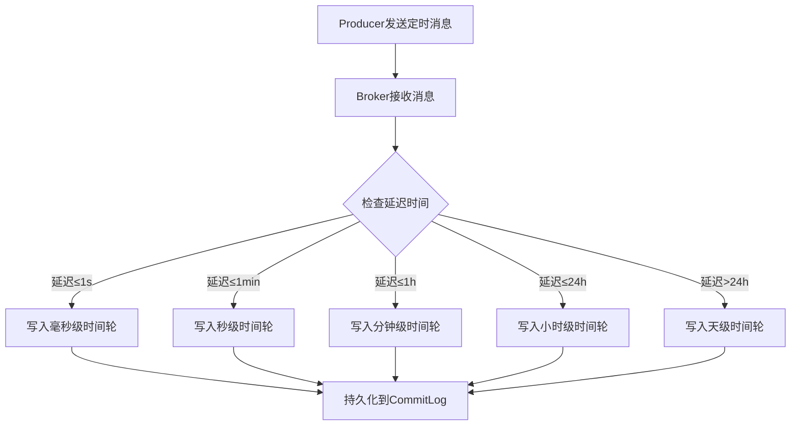

# RocketMQ定时消息时间轮实现技术文档

## 1. 概述

### 1.1 定时消息简介
定时消息是RocketMQ提供的一种高级消息类型，允许生产者在发送消息时指定一个未来的投递时间。消费者只能在指定的时间点或之后才能接收到该消息，适用于需要延迟处理的业务场景，如订单超时取消、定时提醒、异步任务调度等。

### 1.2 时间轮算法简介
时间轮（Time Wheel）是一种高效管理定时任务的算法，通过类似时钟的循环数组结构，将定时任务分配到不同的时间槽中。RocketMQ采用多级时间轮实现毫秒级精度的定时消息管理。

## 2. 系统架构设计

### 2.1 整体架构
```
┌─────────────────────────────────────────────┐
│                Producer                     │
└─────────────────┬───────────────────────────┘
                  │ 发送定时消息
                  ▼
┌─────────────────────────────────────────────┐
│                 Broker                      │
├─────────────────────────────────────────────┤
│ 定时消息接收 → 时间轮存储 → 延迟投递 → CommitLog │
└─────────────────┬───────────────────────────┘
                  │ 到达投递时间
                  ▼
┌─────────────────────────────────────────────┐
│                Consumer                     │
└─────────────────────────────────────────────┘
```

### 2.2 核心组件
- **ScheduleMessageService**: 定时消息调度服务
- **TimerWheel**: 时间轮核心实现
- **DelayLevel**: 延迟级别管理
- **CommitLog**: 消息持久化存储

## 3. 时间轮实现原理

### 3.1 多级时间轮设计
RocketMQ采用分层时间轮实现，支持不同精度的延迟需求：

```
┌─────────────────────────────────────────────┐
│           毫秒级时间轮 (0-999ms)              │
├─────────────────────────────────────────────┤
│           秒级时间轮 (1-59s)                 │
├─────────────────────────────────────────────┤
│           分钟级时间轮 (1-59min)             │
├─────────────────────────────────────────────┤
│           小时级时间轮 (1-23h)               │
├─────────────────────────────────────────────┤
│           天级时间轮 (1-30天)                │
└─────────────────────────────────────────────┘
```

### 3.2 时间轮数据结构
```java
public class TimerWheel {
    // 时间槽数组
    private TimeSlot[] timeSlots;
    
    // 当前指针位置
    private long currentTime;
    
    // 时间槽大小（毫秒）
    private long tickDuration;
    
    // 时间槽数量
    private int wheelSize;
    
    // 上级时间轮
    private TimerWheel higherLevelWheel;
}
```

### 3.3 时间槽设计
```java
public class TimeSlot {
    // 时间槽起始时间
    private long startTime;
    
    // 该时间槽内的定时消息
    private ConcurrentSkipListSet<TimerMessage> messages;
    
    // 锁对象
    private final Object lock = new Object();
}
```

## 4. 关键实现细节

### 4.1 定时消息写入流程


### 4.2 时间轮推进机制
```java
public class ScheduleMessageService extends ServiceThread {
    // 时间轮推进间隔（默认100ms）
    private static final long SCAN_PERIOD = 100;
    
    @Override
    public void run() {
        while (!this.isStopped()) {
            try {
                // 等待一个扫描周期
                this.waitForRunning(SCAN_PERIOD);
                
                // 推进时间轮
                advanceTimerWheel();
                
                // 处理到期消息
                deliverExpiredMessages();
                
            } catch (Exception e) {
                log.error("ScheduleMessageService error", e);
            }
        }
    }
}
```

### 4.3 延迟级别配置
RocketMQ预定义了18个延迟级别，每个级别对应特定的延迟时间：

| 延迟级别 | 延迟时间 | 延迟级别 | 延迟时间 |
|---------|---------|---------|---------|
| 1       | 1s      | 10      | 6min    |
| 2       | 5s      | 11      | 7min    |
| 3       | 10s     | 12      | 8min    |
| 4       | 30s     | 13      | 9min    |
| 5       | 1min    | 14      | 10min   |
| 6       | 2min    | 15      | 20min   |
| 7       | 3min    | 16      | 30min   |
| 8       | 4min    | 17      | 1h      |
| 9       | 5min    | 18      | 2h      |

### 4.4 定时消息投递流程
```java
public class DeliverTimerMessageService {
    
    public void deliverExpiredMessages() {
        // 1. 获取当前时间槽的到期消息
        List<TimerMessage> expiredMessages = timerWheel.getExpiredMessages();
        
        // 2. 将消息写入真实Topic
        for (TimerMessage msg : expiredMessages) {
            // 恢复原始消息
            MessageExtBrokerInner innerMsg = recoverMessage(msg);
            
            // 设置投递时间
            innerMsg.setStoreTimestamp(System.currentTimeMillis());
            
            // 写入CommitLog
            brokerController.getMessageStore().putMessage(innerMsg);
        }
        
        // 3. 更新消费进度
        updateConsumeOffset();
    }
}
```

## 5. 核心算法实现

### 5.1 时间轮算法
```java
public class TimerWheelAlgorithm {
    
    /**
     * 计算消息应该放置的时间槽
     */
    public int calculateSlot(long delayTime, long currentTime) {
        // 计算目标时间
        long targetTime = currentTime + delayTime;
        
        // 计算时间槽索引
        long totalTicks = targetTime / tickDuration;
        int slotIndex = (int) (totalTicks % wheelSize);
        
        // 计算圈数
        long rounds = totalTicks / wheelSize;
        
        return slotIndex;
    }
    
    /**
     * 时间轮推进
     */
    public void advance() {
        // 移动指针
        currentTime += tickDuration;
        
        // 处理当前时间槽的到期消息
        TimeSlot currentSlot = timeSlots[currentSlotIndex];
        processSlot(currentSlot);
        
        // 推进到下一个时间槽
        currentSlotIndex = (currentSlotIndex + 1) % wheelSize;
        
        // 检查是否需要推进上级时间轮
        if (currentSlotIndex == 0 && higherLevelWheel != null) {
            higherLevelWheel.advance();
        }
    }
}
```

### 5.2 消息降级机制
当定时消息的延迟时间超过最大时间轮范围时，采用降级策略：
1. 将消息持久化到磁盘
2. 记录投递时间
3. 启动后台扫描线程定期检查
4. 到达投递时间时重新加入时间轮

## 6. 性能优化策略

### 6.1 内存优化
- **时间槽复用**: 循环使用时间槽，避免频繁创建销毁
- **消息批处理**: 批量处理同一时间槽的消息，减少系统调用
- **内存池**: 使用对象池管理频繁创建的对象

### 6.2 锁优化
- **分段锁**: 对不同时间槽使用不同的锁，减少锁竞争
- **无锁队列**: 使用ConcurrentSkipListSet存储消息
- **乐观锁**: 在可能的情况下使用CAS操作

### 6.3 I/O优化
- **顺序写入**: 定时消息在CommitLog中顺序存储
- **批量刷盘**: 合并多次写操作，减少磁盘I/O
- **异步操作**: 非关键路径采用异步处理

## 7. 容错与可靠性

### 7.1 数据持久化
- **WAL日志**: 所有定时消息操作记录预写日志
- **Checkpoint**: 定期保存时间轮状态
- **恢复机制**: Broker重启时从CommitLog恢复定时消息

### 7.2 故障处理
```java
public class TimerWheelRecovery {
    
    public void recoverFromFailure() {
        // 1. 从CommitLog读取所有定时消息
        List<MessageExt> timerMessages = loadTimerMessages();
        
        // 2. 重新计算投递时间
        for (MessageExt msg : timerMessages) {
            long deliverTime = calculateDeliverTime(msg);
            
            // 3. 重新加入时间轮
            if (deliverTime > System.currentTimeMillis()) {
                timerWheel.addMessage(msg, deliverTime);
            } else {
                // 立即投递已到期的消息
                deliverImmediately(msg);
            }
        }
    }
}
```

### 7.3 监控与告警
- **时间轮状态监控**: 监控各层级时间轮的负载情况
- **消息堆积告警**: 检测定时消息处理延迟
- **资源使用监控**: CPU、内存、磁盘使用率监控

## 8. 配置参数

### 8.1 Broker端配置
```properties
# 定时消息服务开关
messageDelayLevel=true

# 最大延迟时间（默认30天）
maxDelayTime=2592000000

# 时间轮扫描间隔（默认100ms）
timerWheelScanPeriod=100

# 各层级时间轮配置
millisWheel.size=1000
secondWheel.size=60
minuteWheel.size=60
hourWheel.size=24
dayWheel.size=30
```

### 8.2 客户端配置
```java
Message msg = new Message("TopicTest", "TagA", "Hello RocketMQ".getBytes());

// 设置延迟级别（对应预定义的延迟时间）
msg.setDelayTimeLevel(3);  // 10秒后投递

// 或设置精确的延迟时间（毫秒）
msg.setStartDeliverTime(System.currentTimeMillis() + 10000);
```

## 9. 使用示例

### 9.1 生产者示例
```java
public class TimerMessageProducer {
    public static void main(String[] args) throws Exception {
        DefaultMQProducer producer = new DefaultMQProducer("ProducerGroup");
        producer.start();
        
        Message msg = new Message("TimerTopic", "TagA", 
            "This is a timer message".getBytes());
        
        // 方法1：使用延迟级别
        msg.setDelayTimeLevel(4);  // 30秒后投递
        
        // 方法2：使用精确时间戳
        // msg.setStartDeliverTime(System.currentTimeMillis() + 30000);
        
        SendResult result = producer.send(msg);
        System.out.println("Send result: " + result);
        
        producer.shutdown();
    }
}
```

### 9.2 消费者示例
```java
public class TimerMessageConsumer {
    public static void main(String[] args) throws Exception {
        DefaultMQPushConsumer consumer = new DefaultMQPushConsumer("ConsumerGroup");
        consumer.subscribe("TimerTopic", "*");
        
        consumer.registerMessageListener(new MessageListenerConcurrently() {
            @Override
            public ConsumeConcurrentlyStatus consumeMessage(
                List<MessageExt> messages,
                ConsumeConcurrentlyContext context) {
                
                for (MessageExt msg : messages) {
                    System.out.printf("Received message at %s: %s%n",
                        new Date(), new String(msg.getBody()));
                    
                    // 检查是否为定时消息
                    long storeTimestamp = msg.getStoreTimestamp();
                    long bornTimestamp = msg.getBornTimestamp();
                    long delay = storeTimestamp - bornTimestamp;
                    
                    System.out.printf("Message delayed for %d ms%n", delay);
                }
                return ConsumeConcurrentlyStatus.CONSUME_SUCCESS;
            }
        });
        
        consumer.start();
    }
}
```

## 10. 注意事项与限制

### 10.1 使用限制
1. **最大延迟时间**: 默认30天，可通过配置调整
2. **精度限制**: 最低精度为1秒，毫秒级时间轮仅用于内部调度
3. **消息大小**: 定时消息与普通消息大小限制相同（默认4MB）
4. **Topic限制**: 定时消息使用特殊的内部Topic（SCHEDULE_TOPIC_XXXX）

### 10.2 性能考虑
1. **内存占用**: 大量长时间延迟消息会占用较多内存
2. **扫描开销**: 时间轮推进会产生固定的CPU开销
3. **持久化成本**: 所有定时消息都需要持久化存储

### 10.3 最佳实践
1. 对于短延迟（<1分钟）消息，优先使用RocketMQ内置延迟级别
2. 对于长延迟消息，建议结合外部调度系统使用
3. 监控定时消息的堆积情况，及时调整资源
4. 在生产环境充分测试不同延迟级别的性能表现

## 11. 总结

RocketMQ的定时消息时间轮实现通过多层时间轮的设计，在保证精度的同时支持大时间跨度的延迟消息。该实现具有以下特点：

1. **高性能**: 基于时间轮算法，时间复杂度O(1)
2. **高可靠**: 完整的持久化和恢复机制
3. **易扩展**: 支持通过增加时间轮层级扩展延迟范围
4. **配置灵活**: 支持多种延迟级别和精确时间戳

这种实现方式使得RocketMQ能够高效处理大规模的定时消息场景，为分布式系统中的延迟任务提供了可靠的解决方案。