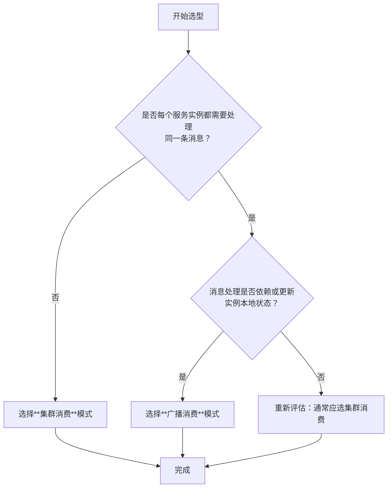

好的，这是一份关于 RocketMQ 广播消费与集群消费的技术文档。文档按照标准结构撰写，涵盖了定义、原理、对比、选型、配置和最佳实践。

---

# **RocketMQ 消费模式详解：广播消费与集群消费**

| 版本 | 日期 | 修改人 | 说明 |
| :--- | :--- | :--- | :--- |
| V1.0 | 2023-10-27 | 智能文档助手 | 初始版本 |

---

## **目录**
1. [概述](#概述)
2. [核心概念](#核心概念)
3. [集群消费模式详解](#集群消费模式详解)
4. [广播消费模式详解](#广播消费模式详解)
5. [模式对比与选型指南](#模式对比与选型指南)
6. [配置与代码示例](#配置与代码示例)
7. [注意事项与最佳实践](#注意事项与最佳实践)
8. [总结](#总结)

---

## **1. 概述** <a name="概述"></a>

Apache RocketMQ 作为一款高性能、高可用的分布式消息中间件，其消费者（Consumer）支持两种不同的消息投递模式：**集群消费（Clustering）** 和 **广播消费（Broadcasting）**。这两种模式决定了同一条消息如何被同一个消费者组（Consumer Group）内的多个消费者实例消费，是设计分布式系统消息处理逻辑时的关键决策点。

本文档将深入剖析这两种模式的原理、差异、适用场景，并提供配置指导。

## **2. 核心概念** <a name="核心概念"></a>

- **消费者组（Consumer Group）**： 由多个消费者实例（Consumer Instance）组成，这些实例共同消费一个或多个主题（Topic）的消息，实现负载均衡和高可用。
- **消息队列（MessageQueue）**： Topic 的分区单位。一个 Topic 下包含一个或多个 MessageQueue，消息存储和负载均衡的基本单元。
- **消费位点（Consumer Offset）**： 消费者在每个 MessageQueue 上的消费进度。RocketMQ 会持久化此位点，保证消费的连续性。

## **3. 集群消费模式详解** <a name="集群消费模式详解"></a>

**定义**： 在集群消费模式下，**同一个消费者组（Consumer Group）内的所有消费者实例，按照一定的负载均衡策略，共同消费订阅的 Topic 下的所有消息。同一条消息只会被组内的一个消费者实例消费一次。**

**工作原理**：
1. **消息分配**： RocketMQ 的Broker会为每个消费者组维护一套消费位点。集群模式下，同一个消费者组内的多个消费者实例，通过队列负载均衡机制（如平均分配、机房优先等策略）来分配该Topic下的各个MessageQueue。
2. **消费过程**： 每个MessageQueue在同一时刻只被组内的一个消费者实例连接和消费。例如，一个Topic有4个队列(Q0, Q1, Q2, Q3)，一个包含2个实例(C1, C2)的消费者组，可能分配为：C1消费Q0和Q1，C2消费Q2和Q3。
3. **位点管理**： 消费进度（Consumer Offset）以**消费者组**为单位存储在Broker端。这意味着组内所有实例共享一套进度。如果C1消费了Q0的一条消息，则该组对Q0的消费位点前进，C1宕机后，接替消费Q0的C2（或其他实例）会从新的位点开始消费，避免重复。

**特点**：
- **负载均衡**： 消息被组内多个实例分摊，实现横向扩展，提升整体消费吞吐量。
- **消息去重**： 一条消息在组内全局只消费一次，是**默认**且最常用的模式。
- **动态伸缩**： 增加或减少消费者实例，消息队列会被自动重新分配，实现弹性伸缩。

**适用场景**：
- 无状态服务，处理逻辑相同，只需要保证消息被处理一次即可。
- 例如：订单创建后的积分计算、短信通知、数据清洗等。

## **4. 广播消费模式详解** <a name="广播消费模式详解"></a>

**定义**： 在广播消费模式下，**同一个消费者组内的每一个消费者实例，都会接收到订阅的 Topic 下的全部消息，并各自进行消费。同一条消息会被组内的每个消费者实例消费一次。**

**工作原理**：
1. **消息分发**： Broker会将发送到Topic的每一条消息，推送给订阅了该Topic的**每一个消费者实例**。每个实例都独立地获取全量消息流。
2. **消费过程**： 每个消费者实例都独立消费所有队列的所有消息。彼此之间没有负载均衡，也没有队列分配关系。
3. **位点管理**： 消费进度（Consumer Offset）以**消费者实例**为单位存储在**本地**（默认路径为 `~/.rocketmq_offsets`）。这意味着每个实例管理自己的消费进度，互不干扰。实例重启后从本地记录的位点开始消费。

**特点**：
- **全量广播**： 每个实例获取完整消息集。
- **进度独立**： 实例间消费进度无关联，一个实例失败不影响其他实例。
- **无负载均衡**： 每个实例的处理压力相同，无法通过增加实例来分摊单一主题的消息负载。

**适用场景**：
- 需要做本地缓存或本地数据同步的服务，每个实例都需要更新自己的状态。
- 例如：配置信息/路由规则的动态下发、本地缓存（如商品信息）的刷新、日志数据的全量收集等。

## **5. 模式对比与选型指南** <a name="模式对比与选型指南"></a>

| 特性维度 | **集群消费 (Clustering)** | **广播消费 (Broadcasting)** |
| :--- | :--- | :--- |
| **消息分发** | 一条消息被组内**一个**实例消费 | 一条消息被组内**所有**实例消费 |
| **消费位点** | 以**消费者组**为单位，存储在Broker | 以**消费者实例**为单位，存储在客户端本地 |
| **负载均衡** | 支持，队列在组内实例间分配 | 不支持，每个实例消费全量数据 |
| **横向扩展** | 可通过增加实例提升消费能力 | 增加实例不提升单Topic处理能力，且会增大Broker推送压力 |
| **消费进度一致性** | 组内全局一致 | 各实例间独立，进度可能不一致 |
| **典型应用场景** | 业务处理（计算、通知）、流水线作业 | 缓存刷新、配置同步、日志广播 |
| **配置方式** | `consumer.setMessageModel(MessageModel.CLUSTERING)` （默认） | `consumer.setMessageModel(MessageModel.BROADCASTING)` |

**选型决策树**：


## **6. 配置与代码示例** <a name="配置与代码示例"></a>

以下以 Java 客户端为例展示两种模式的配置差异。

**1. 集群消费（默认）**
```java
DefaultMQPushConsumer consumer = new DefaultMQPushConsumer("please_rename_unique_group_name_4_cluster");
consumer.setNamesrvAddr("127.0.0.1:9876");
// 明确设置为集群模式（默认值，可省略）
consumer.setMessageModel(MessageModel.CLUSTERING);
consumer.subscribe("TestTopic", "*");

consumer.registerMessageListener((MessageListenerConcurrently) (msgs, context) -> {
    for (MessageExt msg : msgs) {
        System.out.printf("集群消费 - 线程%s 收到消息: %s %n", Thread.currentThread().getName(), new String(msg.getBody()));
    }
    return ConsumeConcurrentlyStatus.CONSUME_SUCCESS;
});
consumer.start();
```

**2. 广播消费**
```java
DefaultMQPushConsumer consumer = new DefaultMQPushConsumer("please_rename_unique_group_name_4_broadcast");
consumer.setNamesrvAddr("127.0.0.1:9876");
// 关键：设置为广播模式
consumer.setMessageModel(MessageModel.BROADCASTING);
consumer.subscribe("TestTopic", "*");

consumer.registerMessageListener((MessageListenerConcurrently) (msgs, context) -> {
    for (MessageExt msg : msgs) {
        System.out.printf("广播消费 - 实例=%s, 线程%s 收到消息: %s %n",
            consumer.getInstanceName(),
            Thread.currentThread().getName(),
            new String(msg.getBody()));
    }
    return ConsumeConcurrentlyStatus.CONSUME_SUCCESS;
});
consumer.start();
```

## **7. 注意事项与最佳实践** <a name="注意事项与最佳实践"></a>

### **集群消费注意事项**
- **重复消费**： 在网络分区、客户端重启等极端情况下，仍可能出现重复消费，业务逻辑需保证**幂等性**。
- **消费堆积**： 如果某队列消费过慢，会导致该队列消息堆积。需监控消费延迟，并考虑调整队列数或提升消费者处理能力。

### **广播消费注意事项**
1. **消费进度管理**： 位点在客户端本地，需确保磁盘可靠，避免因位点丢失导致大量重复消费。生产环境建议定期备份。
2. **资源消耗**： Broker需要向组内每个实例推送全量消息，网络带宽和Broker负载会随消费者实例数线性增长。**务必谨慎评估消费者组规模**。
3. **消息堆积风险**： 如果单个消费者实例消费能力不足，会导致该实例本地队列堆积，且无法通过增加实例分担。需确保每个实例都有足够的处理能力。
4. **慎用重置位点命令**： 运维工具 `mqadmin resetOffsetByTime` 对广播模式**无效**，因为位点不在Broker。

### **最佳实践**
- **默认首选集群模式**： 除非有明确的全量广播需求，否则都应使用集群模式以获得更好的扩展性和可控性。
- **广播模式下的容错**： 为广播消费者设计健壮的重试和本地位点恢复机制。
- **监控与告警**：
    - 集群模式：重点监控 `消费者组-队列` 维度的消费延迟（`consumer lag`）。
    - 广播模式：需要监控**每一个消费者实例**的消费延迟和本地存储状态。
- **主题规划**： 可将需要广播的消息（如配置更新）与普通业务消息（如订单事件）拆分到不同的Topic，分别采用不同的消费模式。

## **8. 总结** <a name="总结"></a>

RocketMQ 的集群消费和广播消费是两种互补的消息投递语义，服务于不同的分布式系统架构需求。
- **集群消费**以实现**水平扩展**和**负载均衡**为目标，是构建可伸缩、高吞吐量消息处理系统的基石。
- **广播消费**以实现**状态同步**和**全量通知**为目标，适用于需要更新所有服务实例本地状态的场景。

正确理解和选择消费模式，是保证 RocketMQ 在微服务、事件驱动架构中稳定高效运行的关键。建议在设计之初，根据业务语义和系统需求审慎决策。

---