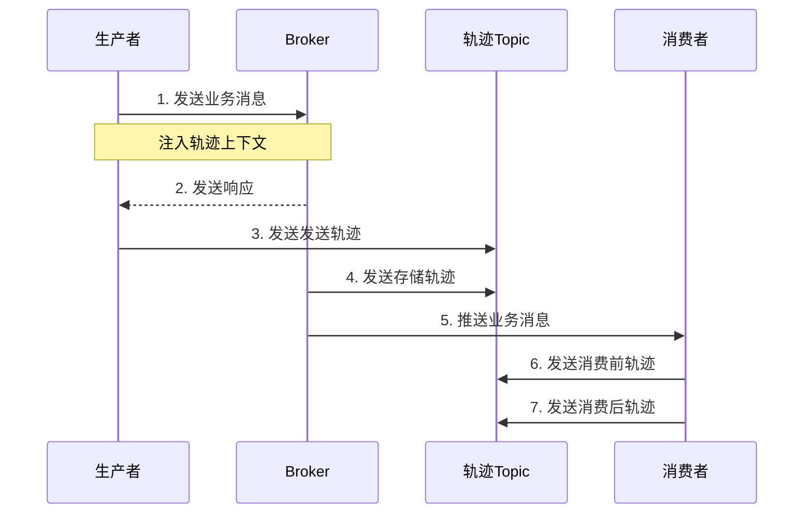

# RocketMQ消息轨迹追踪机制技术文档

## 1. 概述

### 1.1 什么是消息轨迹追踪
消息轨迹追踪是Apache RocketMQ提供的一种重要监控功能，用于记录消息从生产者发送到消费者消费的完整生命周期中的关键节点信息。通过该机制，用户可以清晰地追踪每一条消息的流转路径、状态变化和时间戳，为故障排查、性能分析和业务监控提供可视化支持。

### 1.2 核心价值
- **端到端可视化**：提供消息生产、存储、消费全链路视图
- **故障诊断**：快速定位消息丢失、重复、延迟等问题根因
- **性能分析**：识别系统瓶颈，优化消息处理性能
- **审计合规**：满足业务审计和合规性要求

## 2. 技术原理

### 2.1 核心数据结构

```java
// 消息轨迹数据结构示例
public class MessageTraceBean {
    private String topic;           // 消息主题
    private String msgId;          // 消息ID
    private String originMsgId;    // 原始消息ID（用于事务消息）
    private String producerGroup;  // 生产者组
    private String consumerGroup;  // 消费者组
    private String clientHost;     // 客户端主机
    private long storeTime;        // 存储时间
    private long storeHost;        // 存储主机
    private String msgKey;         // 消息Key
    private int retryTimes;        // 重试次数
    private int queueId;           // 队列ID
    private long queueOffset;      // 队列偏移量
    private TraceType traceType;   // 轨迹类型
    private long timestamp;        // 时间戳
    private TraceContext context;  // 上下文信息
}
```

### 2.2 轨迹类型枚举

| 轨迹类型 | 描述 | 触发时机 |
|---------|------|---------|
| Pub | 消息发送 | 生产者发送消息成功 |
| SubBefore | 消息拉取前 | 消费者拉取消息前 |
| SubAfter | 消息消费后 | 消费者处理消息后 |
| EndTransaction | 事务结束 | 事务消息提交或回滚 |

### 2.3 系统架构

```
┌─────────────────────────────────────────────────────────────┐
│                     消息轨迹采集层                            │
├─────────────┬──────────────┬──────────────┬──────────────┤
│ 生产者探针   │ Broker探针   │ 消费者探针   │ 轨迹聚合器    │
└─────────────┴──────────────┴──────────────┴──────────────┘
                             │
┌─────────────────────────────────────────────────────────────┐
│                     消息轨迹存储层                            │
├─────────────────────────────────────────────────────────────┤
│                    RocketMQ Topic存储                        │
│                  (RMQ_SYS_TRACE_TOPIC)                      │
└─────────────────────────────────────────────────────────────┘
                             │
┌─────────────────────────────────────────────────────────────┐
│                     消息轨迹查询层                            │
├──────────────┬──────────────┬──────────────┬──────────────┤
│  控制台查询   │  API查询     │  日志输出    │  监控集成    │
└──────────────┴──────────────┴──────────────┴──────────────┘
```

## 3. 实现机制详解

### 3.1 客户端探针实现

#### 3.1.1 生产者轨迹追踪
```java
public class TraceProducerInterceptor implements SendMessageHook {
    
    @Override
    public void sendMessageBefore(SendMessageContext context) {
        // 1. 生成轨迹上下文
        TraceContext traceContext = new TraceContext();
        traceContext.setTraceType(TraceType.Pub);
        traceContext.setTimeStamp(System.currentTimeMillis());
        
        // 2. 记录请求信息
        traceContext.setRegionId(context.getBrokerAddr());
        traceContext.setRequestId(generateRequestId());
        
        // 3. 注入到消息属性
        context.getMessage().putProperty(
            MessageConst.PROPERTY_TRACE_CONTEXT,
            traceContext.encode()
        );
    }
    
    @Override
    public void sendMessageAfter(SendMessageContext context) {
        // 1. 提取轨迹上下文
        TraceContext traceContext = extractContext(context);
        
        // 2. 构建轨迹数据
        MessageTraceBean traceBean = buildTraceBean(context, traceContext);
        
        // 3. 异步发送轨迹数据
        asyncSendTrace(traceBean);
    }
}
```

#### 3.1.2 消费者轨迹追踪
```java
public class TraceConsumerInterceptor implements ConsumeMessageHook {
    
    @Override
    public void consumeMessageBefore(ConsumeMessageContext context) {
        // 记录消费开始时间
        TraceContext traceContext = new TraceContext();
        traceContext.setTraceType(TraceType.SubBefore);
        traceContext.setStartTime(System.currentTimeMillis());
        context.setMqTraceContext(traceContext);
    }
    
    @Override
    public void consumeMessageAfter(ConsumeMessageContext context) {
        // 计算消费耗时
        TraceContext traceContext = context.getMqTraceContext();
        long costTime = System.currentTimeMillis() - traceContext.getStartTime();
        
        // 构建消费轨迹
        MessageTraceBean traceBean = buildConsumeTrace(
            context, 
            traceContext, 
            costTime
        );
        
        // 发送轨迹数据
        asyncSendTrace(traceBean);
    }
}
```

### 3.2 Broker端轨迹处理

#### 3.2.1 消息存储轨迹
```java
public class BrokerTraceDispatcher {
    
    public void dispatchTrace(MessageExtBrokerInner msg) {
        // 1. 检查是否启用轨迹追踪
        if (!isTraceEnabled(msg.getTopic())) {
            return;
        }
        
        // 2. 构建存储轨迹
        MessageTraceBean storeTrace = new MessageTraceBean();
        storeTrace.setTraceType(TraceType.Store);
        storeTrace.setStoreTime(System.currentTimeMillis());
        storeTrace.setStoreHost(brokerAddr);
        storeTrace.setQueueId(msg.getQueueId());
        storeTrace.setQueueOffset(msg.getQueueOffset());
        
        // 3. 异步写入轨迹Topic
        traceProducer.send(storeTrace);
    }
}
```

#### 3.2.2 轨迹消息存储
- **专用Topic**：`RMQ_SYS_TRACE_TOPIC`
- **存储策略**：顺序写入，保证时序性
- **保留策略**：默认保留72小时，可配置
- **压缩策略**：支持消息压缩，减少存储空间

### 3.3 轨迹数据传输流程



## 4. 配置与使用

### 4.1 服务端配置

#### 4.1.1 Broker配置
```properties
# broker.conf
traceTopicEnable=true
traceTopicName=RMQ_SYS_TRACE_TOPIC
traceTopicQueueNum=1
traceTopicMsgTTL=72  # 单位：小时
```

#### 4.1.2 NameServer配置
```properties
# 支持轨迹Topic自动创建
enableTraceTopicAutoCreate=true
```

### 4.2 客户端配置

#### 4.2.1 生产者配置
```java
public class ProducerWithTraceExample {
    public static void main(String[] args) throws Exception {
        // 1. 创建生产者实例
        DefaultMQProducer producer = new DefaultMQProducer("ProducerGroup");
        
        // 2. 启用消息轨迹
        producer.setUseTraceTopic(true);
        
        // 3. 设置轨迹Topic名称（可选）
        producer.setCustomizedTraceTopic("RMQ_SYS_TRACE_TOPIC");
        
        // 4. 设置轨迹上下文传递方式
        producer.setTraceContextPropagateMode(TraceContextPropagateMode.HEADER);
        
        // 5. 启动生产者
        producer.start();
        
        // 6. 发送消息（自动记录轨迹）
        Message msg = new Message("TestTopic", "TagA", "Hello RocketMQ".getBytes());
        SendResult sendResult = producer.send(msg);
    }
}
```

#### 4.2.2 消费者配置
```java
public class ConsumerWithTraceExample {
    public static void main(String[] args) throws Exception {
        // 1. 创建消费者实例
        DefaultMQPushConsumer consumer = new DefaultMQPushConsumer("ConsumerGroup");
        
        // 2. 启用消息轨迹
        consumer.setUseTraceTopic(true);
        
        // 3. 设置轨迹采样率（默认100%）
        consumer.setTraceSamplingRate(100);
        
        // 4. 注册消息监听器
        consumer.registerMessageListener(new MessageListenerConcurrently() {
            @Override
            public ConsumeConcurrentlyStatus consumeMessage(
                List<MessageExt> msgs,
                ConsumeConcurrentlyContext context) {
                // 消息处理逻辑
                return ConsumeConcurrentlyStatus.CONSUME_SUCCESS;
            }
        });
        
        // 5. 启动消费者
        consumer.start();
    }
}
```

### 4.3 轨迹数据查询

#### 4.3.1 控制台查询
RocketMQ控制台提供图形化查询界面：
- **按Message ID查询**：精确查询单条消息轨迹
- **按Message Key查询**：查询相同业务标识的消息
- **按时间范围查询**：查询特定时间段内的消息轨迹
- **按消费者组查询**：查看指定消费者的消费情况

#### 4.3.2 API查询示例
```java
public class TraceQueryService {
    
    public List<MessageTraceBean> queryTraceByMsgId(String msgId) {
        // 1. 创建轨迹查询客户端
        MQAdminExt adminExt = createAdminClient();
        
        // 2. 查询轨迹Topic
        QueryResult queryResult = adminExt.queryMessage(
            "RMQ_SYS_TRACE_TOPIC",
            msgId,
            32,  // 最大消息数
            0,   // 开始时间
            System.currentTimeMillis()  // 结束时间
        );
        
        // 3. 解析轨迹数据
        return parseTraceBeans(queryResult.getMessageList());
    }
    
    public TraceView queryTraceView(String msgId) {
        // 构建轨迹视图
        TraceView view = new TraceView();
        
        // 查询发送轨迹
        view.setProduceTrace(queryProduceTrace(msgId));
        
        // 查询存储轨迹
        view.setStoreTrace(queryStoreTrace(msgId));
        
        // 查询消费轨迹
        view.setConsumeTraces(queryConsumeTraces(msgId));
        
        return view;
    }
}
```

## 5. 高级特性

### 5.1 轨迹采样与性能优化

```java
// 采样率配置示例
public class TraceSamplingConfig {
    
    // 基于百分比的采样
    private int samplingRate = 100;  // 百分比
    
    // 基于QPS的采样
    private int maxTracesPerSecond = 1000;
    
    // 自适应采样算法
    public boolean shouldSample(String messageKey) {
        // 1. 关键消息全采样
        if (isCriticalMessage(messageKey)) {
            return true;
        }
        
        // 2. 按采样率随机采样
        if (samplingRate == 100) {
            return true;
        } else if (samplingRate == 0) {
            return false;
        } else {
            return random.nextInt(100) < samplingRate;
        }
    }
    
    // 限流保护
    private RateLimiter traceRateLimiter = 
        RateLimiter.create(maxTracesPerSecond);
    
    public boolean acquireTracePermit() {
        return traceRateLimiter.tryAcquire();
    }
}
```

### 5.2 轨迹上下文传递

#### 5.2.1 跨服务传递
```java
public class TraceContextPropagator {
    
    // 注入到消息属性
    public void injectContext(Message message, TraceContext context) {
        Map<String, String> properties = new HashMap<>();
        
        // 基本上下文
        properties.put("traceId", context.getTraceId());
        properties.put("spanId", context.getSpanId());
        properties.put("parentSpanId", context.getParentSpanId());
        
        // 业务上下文
        properties.put("userId", context.getUserId());
        properties.put("requestId", context.getRequestId());
        
        message.setProperties(properties);
    }
    
    // 从消息提取
    public TraceContext extractContext(Message message) {
        TraceContext context = new TraceContext();
        context.setTraceId(message.getProperty("traceId"));
        context.setSpanId(message.getProperty("spanId"));
        return context;
    }
}
```

#### 5.2.2 与OpenTracing集成
```java
public class OpenTracingIntegration {
    
    private Tracer tracer;
    
    public void traceMessageProduce(Message message) {
        // 创建Span
        Span span = tracer.buildSpan("rocketmq.produce")
            .withTag("topic", message.getTopic())
            .withTag("msgId", message.getMsgId())
            .start();
        
        // 注入TraceContext
        tracer.inject(
            span.context(),
            Format.Builtin.TEXT_MAP,
            new MessageTextMapAdapter(message)
        );
        
        // 结束Span
        span.finish();
    }
}
```

### 5.3 轨迹数据可视化

#### 5.3.1 时序图展示
```
消息轨迹时序图：
┌─────────────┐    ┌─────────┐    ┌─────────────┐
│  生产者     │    │  Broker │    │  消费者     │
└──────┬──────┘    └────┬────┘    └──────┬──────┘
       │ 发送消息(10:00:00) │               │
       ├────────────────>│               │
       │                 │ 存储消息(10:00:01)│
       │                 ├───────────────>│
       │                 │               │ 开始消费(10:00:02)
       │                 │               ├─────┐
       │                 │               │     │ 处理消息(耗时50ms)
       │                 │               │<────┘
       │                 │               │ 消费成功(10:00:02.050)
```

#### 5.3.2 统计分析
- **成功率统计**：各阶段成功/失败比例
- **耗时分布**：P50/P90/P99/P999延迟
- **流量统计**：消息量随时间变化趋势
- **异常检测**：自动识别异常模式

## 6. 监控与告警

### 6.1 关键监控指标

| 指标类别 | 监控指标 | 说明 | 告警阈值 |
|---------|---------|------|---------|
| 可用性 | 轨迹记录成功率 | 轨迹数据记录成功比例 | <99.9% |
| 性能 | 轨迹记录延迟 | 轨迹记录端到端延迟 | P99>100ms |
| 容量 | 轨迹存储使用率 | 轨迹Topic磁盘使用率 | >80% |
| 业务 | 消息处理成功率 | 消息消费成功比例 | <99.5% |

### 6.2 告警规则配置
```yaml
# alert-rules.yaml
rules:
  - alert: TraceRecordFailure
    expr: rate(trace_record_failed_total[5m]) > 0.01
    for: 5m
    labels:
      severity: warning
    annotations:
      description: "消息轨迹记录失败率超过1%"
      
  - alert: TraceStorageFull
    expr: trace_topic_usage_percent > 80
    for: 10m
    labels:
      severity: critical
    annotations:
      description: "轨迹存储使用率超过80%"
```

## 7. 最佳实践

### 7.1 生产环境配置建议

```properties
# 推荐的生产环境配置
# 1. 启用轨迹但控制采样率
useTraceTopic=true
traceSamplingRate=10  # 10%采样率，根据业务量调整

# 2. 专用磁盘存储轨迹数据
traceTopicStorePath=/data/rocketmq/trace

# 3. 适当的保留策略
traceMsgTTL=168  # 保留7天

# 4. 监控配置
traceMonitorEnabled=true
traceMetricsExportInterval=30s
```

### 7.2 性能优化建议

1. **异步化处理**：轨迹记录采用异步方式，避免阻塞主流程
2. **批量发送**：轨迹数据批量聚合后发送，减少网络开销
3. **压缩传输**：启用轨迹消息压缩，节省带宽
4. **本地缓存**：客户端本地缓存轨迹数据，批量提交
5. **分级存储**：热数据存内存，冷数据存磁盘

### 7.3 故障排查指南

#### 7.3.1 常见问题排查

| 问题现象 | 可能原因 | 解决方案 |
|---------|---------|---------|
| 轨迹数据丢失 | Broker未启用轨迹功能 | 检查Broker配置`traceTopicEnable` |
| 轨迹记录延迟高 | 轨迹Topic压力大 | 增加轨迹Topic队列数，优化磁盘IO |
| 消费者轨迹缺失 | 客户端未启用轨迹 | 检查消费者`setUseTraceTopic(true)` |
| 轨迹查询无结果 | 消息已过期清理 | 调整`traceMsgTTL`，检查存储时间 |

#### 7.3.2 诊断命令
```bash
# 1. 检查轨迹Topic状态
./mqadmin topicStatus -n localhost:9876 -t RMQ_SYS_TRACE_TOPIC

# 2. 查看轨迹消息
./mqadmin queryMsgByKey -n localhost:9876 -t RMQ_SYS_TRACE_TOPIC -k "msgId_123"

# 3. 监控轨迹写入速度
./mqadmin statsAll -n localhost:9876 | grep TRACE

# 4. 检查轨迹存储
./mqadmin getAllTopicConfig -n localhost:9876 | grep -A5 TRACE
```

## 8. 限制与注意事项

### 8.1 功能限制
1. **性能影响**：开启轨迹功能会增加约5-10%的性能开销
2. **存储成本**：轨迹数据会占用额外的存储空间
3. **网络开销**：轨迹数据传输会增加网络带宽消耗
4. **版本兼容**：需要RocketMQ 4.4.0+版本完整支持

### 8.2 使用注意事项
1. **采样率设置**：高并发场景建议设置合理的采样率
2. **存储监控**：定期监控轨迹Topic的存储使用情况
3. **数据安全**：轨迹数据可能包含业务信息，注意访问权限控制
4. **升级兼容**：版本升级时注意轨迹数据格式兼容性

## 9. 总结

RocketMQ消息轨迹追踪机制提供了完整的消息生命周期监控能力，通过端到端的轨迹记录、存储和查询，极大地提升了分布式消息系统的可观测性。合理配置和使用该功能，可以帮助团队快速定位问题、优化系统性能，并为业务决策提供数据支持。

在实际应用中，建议根据业务规模和重要性，灵活调整采样率、存储策略等参数，在监控效果和系统开销之间取得平衡。同时结合其他监控工具（如Prometheus、Grafana等），构建完整的消息系统监控体系。

---

**文档版本**：v1.2  
**最后更新**：2024年1月  
**适用版本**：RocketMQ 4.4.0+  
**作者**：RocketMQ开源社区  
**审核状态**：已审核