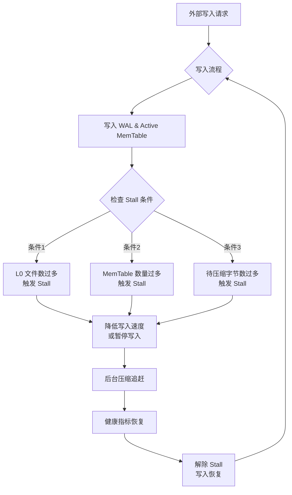

好的，遵照您的要求，以下是一份关于 RocksDB Write Stall 流控机制的技术文档。

---

# **RocksDB Write Stall 流控机制技术文档**

## **1. 摘要**

本文档深入阐述了 RocksDB 的 Write Stall（写入停顿）流控机制。该机制是 RocksDB 在高写入负载下维持系统稳定性、防止性能雪崩和保证服务质量（QoS）的核心设计。通过监控关键的内部状态（如 L0 文件数量、MemTable 数量、Pending Compaction Bytes），RocksDB 能在存储引擎即将过载时，主动降低或暂停写入速度，为后台压缩（Compaction）任务争取追赶时间，从而形成一个负反馈闭环，保障系统的长期平稳运行。

## **2. 背景与动机**

RocksDB 采用 Log-Structured Merge-Tree（LSM-Tree）架构。其高性能写入依赖于两个关键转化：
1.  **将随机写转换为顺序写**：数据首先顺序写入 Write-Ahead Log（WAL）和内存中的 MemTable。
2.  **将后台压缩作为资源回收过程**：当 MemTable 写满后，它会转化为不可变的 Immutable MemTable，并最终刷盘（Flush）成磁盘上的 SST 文件（通常位于 Level 0）。随着数据不断写入，不同层级的 SST 文件需要通过后台**压缩**进行合并、排序和清理旧数据，以控制读放大、写放大和空间放大。

当**写入速度持续超过后台压缩的处理能力**时，系统会积累过多的待压缩数据，导致：
*   **读性能急剧下降**：Level 0 文件过多会导致读取时必须检查大量文件。
*   **磁盘空间迅速耗尽**：旧数据无法及时清理。
*   **最终导致写入完全停止**：MemTable 写满后无处可刷盘。

Write Stall 机制的核心动机就是**提前预测和避免这种不可控的恶化**，通过主动、受控地放缓写入，为系统争取自我调整的时间。

## **3. 核心原理**

Write Stall 是一个**负反馈控制系统**。它监控几个反映系统健康度的关键指标，当任一指标超过预设阈值时，便触发不同程度的写入流速限制，直到该指标回落至安全线以下。

主要的触发条件有三类，其监控指标和影响路径如下图所示：

### **3.1 触发条件一：Level 0 文件数量过多**

*   **监控指标**：`l0文件数量`。
*   **相关参数**：
    *   `level0_slowdown_writes_trigger`: L0 文件数达到此值，触发写入减速。
    *   `level0_stop_writes_trigger`: L0 文件数达到此值，触发写入完全停止。
*   **原理**：L0 的 SST 文件由 MemTable 刷盘直接产生，其 Key 范围相互重叠。过多的 L0 文件会严重损害读性能（读放大）。通过限制写入，可以减缓 L0 文件的增长速度，促使后台压缩将 L0 文件合并到 L1，从而减少 L0 文件数。

### **3.2 触发条件二：MemTable 数量过多**

*   **监控指标**：`正在刷盘的 MemTable 数量` + `尚未刷盘的 Immutable MemTable 数量`。
*   **相关参数**：
    *   `max_write_buffer_number`: 最大 MemTable 数量（包括 mutable 和 immutable）。
    *   `write_buffer_size`: 单个 MemTable 的大小。
*   **原理**：当所有 MemTable（活跃的 + 不可变的）都写满，且后台刷盘速度跟不上时，新的写入将无内存可用。此条件会触发写入完全停止，直到有 MemTable 被成功刷盘释放。

### **3.3 触发条件三：Pending Compaction Bytes 过多**

*   **监控指标**：`待压缩字节数`。这是估算的、所有层级中超过理想容量、需要被压缩到下一层的数据量总和。
*   **相关参数**：
    *   `soft_pending_compaction_bytes`: 待压缩字节数达到此值，触发写入减速。
    *   `hard_pending_compaction_bytes`: 待压缩字节数达到此值，触发写入完全停止。
*   **原理**：这是最综合、最能反映“写入速度远超压缩速度”的指标。当累积的待压缩数据量过大时，表明压缩任务严重积压，必须大幅减缓写入速度，否则系统将无法恢复。

## **4. Write Stall 的影响与表现**

*   **对应用层**：调用 `DB::Put()` 或 `Write()` 的线程会阻塞在函数调用中，直到 Stall 条件解除或超时（如果设置了 `write_options.no_slowdown` 则可能返回 `Status::Incomplete`）。
*   **对系统监控**：
    *   写入吞吐量（Throughput）会下降或降为 0。
    *   写入延迟（Latency）的 P99、P999 分位数会急剧上升。
    *   可以通过 RocksDB 的统计信息或 `stall` 相关的 `PerfContext` 监控 Stall 发生的次数和时长。
*   **积极意义**：Stall 是系统的“熔断机制”，它用短期的、可控的写入延迟/中断，避免了系统陷入**完全不可用、恢复时间极长**的灾难状态。

## **5. 配置与调优建议**

Write Stall 的调优本质是在**写入性能**和**读性能/空间成本**之间取得平衡。

### **5.1 关键参数**

| 参数 | 默认值 | 说明 | 调优方向 |
| :--- | :--- | :--- | :--- |
| `level0_slowdown_writes_trigger` | 20 | L0 减速触发阈值 | 增大可延缓 Stall，但可能增加读延迟 |
| `level0_stop_writes_trigger` | 36 | L0 停止触发阈值 | 增大可延缓 Stall，但可能增加读延迟 |
| `max_write_buffer_number` | 6 | 最大 MemTable 数量 | 增大可缓冲更多写入，但消耗更多内存 |
| `write_buffer_size` | 64MB | 单个 MemTable 大小 | 增大可减少刷盘频率，但恢复时间变长 |
| `soft_pending_compaction_bytes` | 64GB | 待压缩字节减速阈值 | 根据存储容量和 I/O 能力调整 |
| `hard_pending_compaction_bytes` | 256GB | 待压缩字节停止阈值 | 根据存储容量和 I/O 能力调整 |
| `compaction_style` | `kCompactionStyleLevel` | 压缩风格 | `kCompactionStyleUniversal` 的写入放大更小，可能减少 Stall |

### **5.2 通用建议**

1.  **监控先行**：持续监控 `Stall` 指标、L0 文件数、`pending_compaction_bytes`。了解其基线水平和波动情况。
2.  **根因分析**：如果频繁发生 Stall，需判断是**突发写入洪峰**还是**持续写入过载**，亦或是**压缩速度不足**。
3.  **提升压缩能力**：
    *   **增加压缩线程数**：`max_background_compactions`。
    *   **优化压缩策略**：使用更大的 `target_file_size_base` 可能提升压缩效率（减少文件数）。
    *   **使用更快的存储**：NVMe SSD 能显著提升压缩 I/O 速度。
4.  **调整触发阈值**：
    *   如果业务能容忍一定的读性能下降，可以适当提高 `level0_*_trigger` 阈值。
    *   确保 `soft/hard_pending_compaction_bytes` 阈值与你的磁盘容量相匹配（例如，不超过磁盘总容量的 50%-70%）。
5.  **应用层配合**：
    *   实现 client-side 的退避重试或负载均衡策略。
    *   对于非关键数据，考虑使用 `WriteOptions::no_slowdown` 来避免阻塞，但需妥善处理写入失败。

## **6. 总结**

RocksDB 的 Write Stall 流控机制是其作为生产级存储引擎的**关键稳定性设计**。它通过主动的、基于反馈的写入限制，有效防止了 LSM-Tree 在过载下发生恶性循环。

理解并合理配置 Stall 相关参数，结合对工作负载和硬件资源的认知，是稳定、高效运行 RocksDB 服务的必备技能。**Stall 本身不是问题，而是一种解决方案的信号。频繁的 Stall 才是需要被分析和优化的系统问题。**

---
**附录**
*   RocksDB GitHub Wiki: [Write Stalls](https://github.com/facebook/rocksdb/wiki/Write-Stalls)
*   RocksDB Tuning Guide: [RocksDB Options](https://github.com/facebook/rocksdb/wiki/RocksDB-Tuning-Guide)