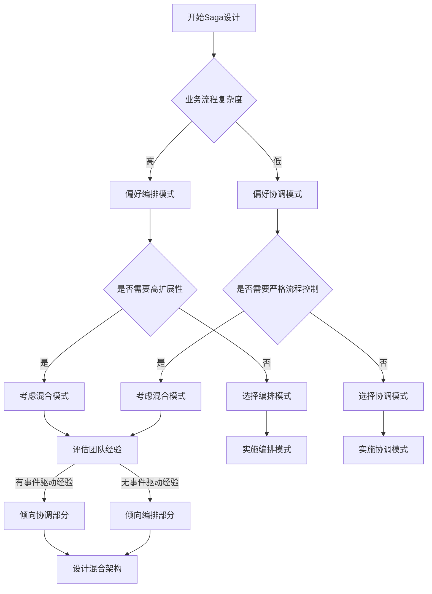

# Saga编排(Orchestration)与协调(Choreography)对比技术文档

## 1. 概述

### 1.1 Saga模式简介
Saga是一种用于管理分布式事务的模式，它将长事务分解为一系列可以独立提交或回滚的本地事务，通过补偿机制保证最终一致性。Saga模式主要解决传统ACID事务在分布式系统中难以实现的问题。

### 1.2 两种实现模式
在Saga模式中，有两种主要的实现方式：
- **编排(Orchestration)**：通过中央协调器控制事务流程
- **协调(Choreography)**：通过事件驱动的方式协调各服务

## 2. Saga编排模式(Orchestration)

### 2.1 核心概念
```
[协调器] → [服务A] → [服务B] → [服务C]
     ↑          ↑          ↑          ↑
     └──控制流──┴──控制流──┴──控制流──┘
```

### 2.2 架构特点
- **中央协调器**：专门的服务负责协调所有参与服务的执行顺序
- **命令式控制**：协调器直接调用各服务的API
- **集中式状态管理**：协调器维护整个事务的状态

### 2.3 工作流程示例
```json
{
  "saga_id": "12345",
  "current_step": "reserve_hotel",
  "status": "in_progress",
  "compensation_steps": [
    {"service": "flight", "action": "cancel", "data": {...}},
    {"service": "hotel", "action": "cancel", "data": {...}}
  ]
}
```

### 2.4 代码示例（伪代码）
```python
class TravelBookingSagaOrchestrator:
    def execute(self, booking_data):
        try:
            # 步骤1: 预订航班
            flight_booking = self.flight_service.reserve(booking_data.flight)
            
            # 步骤2: 预订酒店
            hotel_booking = self.hotel_service.reserve(booking_data.hotel)
            
            # 步骤3: 预订租车
            car_booking = self.car_service.reserve(booking_data.car)
            
            return {"status": "success", "bookings": {...}}
            
        except Exception as e:
            # 执行补偿操作
            self.compensate([
                (self.car_service.cancel, car_booking.id),
                (self.hotel_service.cancel, hotel_booking.id),
                (self.flight_service.cancel, flight_booking.id)
            ])
            raise
```

### 2.5 优点
- **流程控制集中**：易于理解和调试
- **事务状态明确**：协调器掌握全局状态
- **简化服务设计**：参与服务只需关注业务逻辑
- **易于监控**：所有执行路径在协调器中可见
- **支持复杂流程**：可轻松实现条件分支、并行执行等

### 2.6 缺点
- **单点故障风险**：协调器成为系统瓶颈
- **服务耦合增加**：服务需要了解协调器的API
- **性能开销**：额外的网络调用和序列化/反序列化
- **扩展性限制**：协调器可能成为性能瓶颈

## 3. Saga协调模式(Choreography)

### 3.1 核心概念
```
[服务A] → [事件A完成] → [服务B] → [事件B完成] → [服务C]
    ↑                                                      ↑
    └─────────────── 事件总线/消息队列 ────────────────┘
```

### 3.2 架构特点
- **去中心化**：没有中央协调器
- **事件驱动**：服务通过发布/订阅事件进行通信
- **分布式状态管理**：每个服务管理自己的状态

### 3.3 工作流程示例
```yaml
事件序列:
1. BookingRequested → 航班服务预订 → FlightReserved
2. FlightReserved → 酒店服务预订 → HotelReserved  
3. HotelReserved → 租车服务预订 → CarReserved
4. CarReserved → BookingCompleted

补偿事件:
- BookingFailed → 触发所有补偿操作
- FlightCancelled → 取消酒店和租车
- HotelCancelled → 取消租车
```

### 3.4 代码示例（伪代码）
```python
# 航班服务
class FlightService:
    def on_booking_requested(self, event):
        try:
            booking = self.reserve_flight(event.data)
            self.event_bus.publish("FlightReserved", {
                "booking_id": event.booking_id,
                "flight_info": booking
            })
        except:
            self.event_bus.publish("BookingFailed", {
                "booking_id": event.booking_id,
                "reason": "flight_unavailable"
            })

# 酒店服务
class HotelService:
    def on_flight_reserved(self, event):
        try:
            booking = self.reserve_hotel(event.data)
            self.event_bus.publish("HotelReserved", {
                "booking_id": event.booking_id,
                "hotel_info": booking
            })
        except:
            self.event_bus.publish("FlightCancelled", {
                "booking_id": event.booking_id
            })
```

### 3.5 优点
- **松耦合**：服务间无直接依赖
- **高可用性**：无单点故障
- **可扩展性**：易于添加新服务
- **灵活性**：服务可以独立演进
- **事件溯源友好**：天然支持事件溯源模式

### 3.6 缺点
- **流程难以追踪**：分布式调试复杂
- **事件循环风险**：可能产生无限循环
- **复杂度高**：需要设计健壮的事件契约
- **最终一致性延迟**：依赖于事件传播时间
- **测试困难**：需要模拟完整的事件链

## 4. 详细对比

### 4.1 架构对比

| 维度 | 编排(Orchestration) | 协调(Choreography) |
|------|-------------------|-------------------|
| **控制方式** | 集中式控制 | 分布式控制 |
| **通信模式** | 同步/异步调用 | 异步事件 |
| **耦合度** | 协调器与各服务耦合 | 服务间松耦合 |
| **状态管理** | 集中式状态 | 分布式状态 |
| **复杂度分布** | 集中在协调器 | 分散在各服务 |

### 4.2 事务管理对比

| 方面 | 编排模式 | 协调模式 |
|------|---------|---------|
| **补偿触发** | 协调器统一触发 | 各服务自行触发 |
| **补偿顺序** | 明确控制（LIFO） | 可能乱序 |
| **状态一致性** | 强一致性视图 | 最终一致性视图 |
| **回滚复杂度** | 相对简单 | 可能复杂 |
| **监控难度** | 容易监控 | 需要分布式追踪 |

### 4.3 性能对比

| 指标 | 编排模式 | 协调模式 |
|------|---------|---------|
| **响应时间** | 可能较长（协调器瓶颈） | 更快（并行处理） |
| **吞吐量** | 受协调器限制 | 更高（无瓶颈） |
| **资源利用率** | 协调器可能过载 | 均衡分布 |
| **网络开销** | N+1次调用（N个服务） | N次事件发布 |
| **可扩展性** | 垂直扩展协调器 | 水平扩展服务 |

## 5. 选型建议

### 5.1 选择编排模式的情况
✅ **推荐场景：**
- 业务流程复杂，有多个条件分支
- 需要严格的执行顺序控制
- 团队缺乏事件驱动架构经验
- 需要详细的执行日志和审计追踪
- 系统规模相对较小（<20个微服务）

📋 **适用业务场景：**
- 电商订单处理
- 银行转账流程
- 保险理赔处理
- 供应链管理

### 5.2 选择协调模式的情况
✅ **推荐场景：**
- 系统规模大，需要高度可扩展
- 团队熟悉事件驱动架构
- 服务需要高度自治和独立部署
- 业务逻辑相对简单直接
- 需要高可用性和容错性

📋 **适用业务场景：**
- 实时数据处理管道
- 物联网设备管理
- 社交媒体feed流
- 实时推荐系统

### 5.3 混合模式
在实际应用中，可以考虑混合使用两种模式：

```yaml
混合架构示例:
- 上层业务流程: 使用编排模式（如订单创建）
- 子流程或通知: 使用协调模式（如库存更新、邮件通知）
- 异步任务: 使用协调模式（如报表生成）
- 核心交易: 使用编排模式（如支付处理）
```

## 6. 实践建议

### 6.1 实施编排模式的最佳实践
1. **设计协调器**
   - 使用状态机定义流程
   - 实现幂等性操作
   - 添加超时和重试机制

2. **服务设计**
   - 为每个操作提供补偿接口
   - 确保操作和补偿的幂等性
   - 实现健康检查接口

3. **监控和运维**
   - 记录详细的执行日志
   - 实现Saga状态查询接口
   - 设置告警机制

### 6.2 实施协调模式的最佳实践
1. **事件设计**
   - 定义清晰的事件契约
   - 使用版本化的事件模式
   - 包含必要的关联ID

2. **错误处理**
   - 实现死信队列
   - 设计补偿事件链
   - 添加事件追溯机制

3. **监控和调试**
   - 实现分布式追踪
   - 监控事件延迟
   - 建立事件可视化工具

### 6.3 通用建议
1. **无论选择哪种模式：**
   - 确保所有操作都是幂等的
   - 实现完善的日志记录
   - 设计清晰的API/事件契约
   - 考虑网络分区和故障恢复

2. **测试策略：**
   - 单元测试业务逻辑
   - 集成测试Saga流程
   - 混沌测试故障场景

## 7. 工具和框架

### 7.1 编排模式工具
- **Camunda**: 开源工作流引擎
- **Netflix Conductor**: 微服务编排引擎
- **Temporal**: 工作流编排平台
- **AWS Step Functions**: 无服务器工作流服务
- **Zeebe**: 云原生工作流引擎

### 7.2 协调模式工具
- **Apache Kafka**: 分布式事件流平台
- **RabbitMQ**: 消息代理
- **AWS EventBridge**: 无服务器事件总线
- **NATS**: 高性能消息系统
- **Apache Pulsar**: 云原生消息系统

### 7.3 通用Saga框架
- **Eventuate Tram**: 基于事件的Saga框架
- **Axon Framework**: CQRS和Saga实现
- **MicroProfile LRA**: 长期运行动作规范

## 8. 总结

Saga编排和协调模式各有优劣，选择哪种模式取决于具体的业务需求、团队技能和系统约束：

- **编排模式**更适合需要严格控制和可视化的复杂业务流程
- **协调模式**更适合需要高扩展性和松耦合的大规模分布式系统

在实际应用中，许多成功的系统采用混合策略，在系统不同部分使用不同模式。关键是在设计初期充分考虑事务边界、错误处理策略和可观察性需求，以确保系统的一致性和可靠性。

## 附录：决策流程图



---

*文档版本：1.0*
*最后更新：2024年*
*适用读者：架构师、开发工程师、技术负责人*