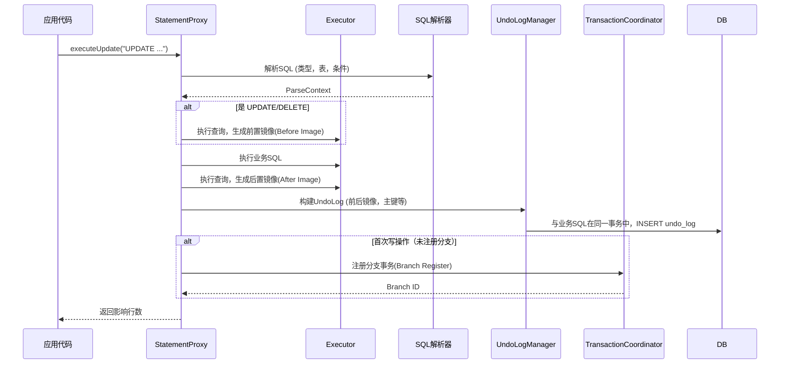

好的，遵照您的要求，以下是一份关于 **Seata RM（资源管理器）数据源代理原理** 的详细技术文档。

---

# Seata RM 数据源代理原理技术文档

## 1. 文档概述

### 1.1 目的
本文档旨在深入解析分布式事务框架 Seata 中，**资源管理器（Resource Manager， RM）** 的核心组件——**数据源代理（DataSource Proxy）** 的工作原理。通过理解其代理机制、SQL 拦截、分支事务注册及 undo_log 管理，读者将能掌握 Seata 在 AT（Auto Transaction）模式下保证数据一致性的底层逻辑。

### 1.2 目标读者
- 分布式系统架构师
- 后端开发工程师
- 对 Seata 或分布式事务实现原理有兴趣的技术人员

### 1.3 核心概念
- **TC (Transaction Coordinator)**： 事务协调器，维护全局事务和分支事务的状态，驱动全局提交或回滚。
- **RM (Resource Manager)**： 资源管理器，管理分支事务处理的资源（此处主要指数据库），向 TC 注册分支事务、报告状态，并驱动分支事务的提交和回滚。
- **DataSource Proxy**： Seata RM 对应用原始数据源的一层包装，是拦截和增强 SQL 执行的关键。

---

## 2. 背景与要解决的问题

在分布式事务场景下，一个业务操作可能涉及多个独立的微服务和数据库。为了保证全局数据一致性，Seata 的 AT 模式需要在**不侵入业务代码**的前提下，实现对业务 SQL 的“无感”增强，使其具备以下能力：
1.  **自动拦截**： 识别出需要纳入全局事务管理的 SQL（增删改）。
2.  **前置镜像**： 在业务数据变更前，保存其原始状态（Before Image）。
3.  **后置镜像**： 在业务数据变更后，保存其变更后的状态（After Image）。
4.  **分支注册**： 将本地数据库操作作为一个分支事务，注册到全局事务中。
5.  **异常回滚**： 在全局事务回滚时，能自动利用保存的镜像数据恢复业务数据。

**数据源代理**正是实现上述“无感增强”的核心技术手段。

---

## 3. 核心机制详解

### 3.1 代理模型
Seata RM 采用 **JDK 动态代理** 或 **字节码增强（如CGLIB）** 技术，对应用持有的原始 `DataSource`、`Connection`、`Statement`/`PreparedStatement` 对象进行层层代理，形成一个代理链。

```
应用代码 → DataSource Proxy → Connection Proxy → Statement Proxy → 原生JDBC驱动
```

这个代理链在 JDBC 调用路径上建立了多个“拦截点”，使得 Seata 能在 SQL 执行的生命周期中插入自己的逻辑。

### 3.2 核心代理类与职责
| 代理类 | 代理目标 | 核心职责 |
| :--- | :--- | :--- |
| `DataSourceProxy` | 原始 `DataSource` | 1. 返回 `ConnectionProxy` 而非原始 `Connection`。<br>2. 初始化 RM 客户端，建立与 TC 的连接。 |
| `ConnectionProxy` | 原始 `Connection` | 1. 管理 `ConnectionContext`，存储当前线程的全局事务ID（XID）和分支事务ID（Branch ID）。<br>2. 在 `commit`/`rollback` 时，与 TC 交互，报告分支事务状态。<br>3. 返回 `StatementProxy` 或 `PreparedStatementProxy`。 |
| `StatementProxy` | 原始 `Statement` | 1. **核心拦截器**： 拦截 `execute`、`executeUpdate` 等方法。<br>2. **SQL解析**： 调用 SQL 解析器（如 Druid Parser）解析 SQL 类型（SELECT/INSERT/UPDATE/DELETE）、表名、条件等。<br>3. **前置/后置镜像生成**： 对于 UPDATE/DELETE，生成前置镜像；执行后生成后置镜像。<br>4. **Undo Log 写入**： 将前后镜像、业务表、主键等信息序列化，与业务SQL在**同一个本地事务**中写入 `undo_log` 表。<br>5. **分支事务注册**： 如果是该连接上的第一个写操作，向 TC 注册分支事务（将数据源作为资源，XID 等信息注册）。 |

### 3.3 关键流程剖析

#### 3.3.1 SQL 执行拦截流程



#### 3.3.2 全局提交与回滚流程

- **全局提交（Phase 2 - Commit）**：
    1.  TC 通知所有参与方的 RM 提交分支事务。
    2.  RM 收到指令后，**异步地**（或同步地，根据配置）删除对应的 `undo_log` 记录。
    3.  由于业务数据已在第一阶段提交，此时只需清理日志，速度极快。

- **全局回滚（Phase 2 - Rollback）**：
    1.  TC 通知所有参与方的 RM 回滚分支事务。
    2.  RM 根据 `XID` 和 `Branch ID` 查询本地 `undo_log` 表。
    3.  **数据校验**： 将 `undo_log` 中的后置镜像（After Image）与当前数据库中的数据进行对比。如果一致，说明期间无其他事务干扰，执行回滚。
    4.  **执行反向补偿**：
        - 如果是 `INSERT`，则根据前置镜像的主键执行 `DELETE`。
        - 如果是 `DELETE`，则根据前置镜像的数据执行 `INSERT`。
        - 如果是 `UPDATE`，则根据前置镜像的数据执行 `UPDATE`，将数据还原。
    5.  删除 `undo_log` 记录。
    6.  如果数据校验不一致（存在脏写），则需要根据配置策略（如人工干预）进行处理。

---

## 4. 关键数据结构：undo_log 表

`undo_log` 表是 AT 模式实现回滚的核心。其基本结构如下（以 MySQL 为例）：

```sql
CREATE TABLE `undo_log` (
  `id` bigint(20) NOT NULL AUTO_INCREMENT,
  `branch_id` bigint(20) NOT NULL COMMENT '分支事务ID',
  `xid` varchar(100) NOT NULL COMMENT '全局事务ID',
  `context` varchar(128) NOT NULL COMMENT '上下文信息，如序列化方式',
  `rollback_info` longblob NOT NULL COMMENT '回滚信息（序列化的前后镜像）',
  `log_status` int(11) NOT NULL COMMENT '状态，0-正常，1-已回滚',
  `log_created` datetime NOT NULL COMMENT '创建时间',
  `log_modified` datetime NOT NULL COMMENT '修改时间',
  PRIMARY KEY (`id`),
  UNIQUE KEY `ux_undo_log` (`xid`,`branch_id`)
) ENGINE=InnoDB AUTO_INCREMENT=1 DEFAULT CHARSET=utf8 COMMENT='AT模式回滚日志表';
```

- **`rollback_info`** 字段存储了经过序列化（如 Jackson、FST、Kryo）的 `SQLUndoLog` 对象，包含了前后镜像数据、表名、SQL类型等完整回滚所需信息。
- **`ux_undo_log`** 唯一索引确保了同一个全局事务的同一个分支只有一个有效的undo日志，并用于快速查找。

---

## 5. 配置与集成

### 5.1 基本配置
在 Spring Boot 应用中，引入 Seata 依赖后，通常只需以下配置即可启用数据源代理：

```yaml
seata:
  enabled: true
  application-id: your-service
  tx-service-group: default_tx_group
  service:
    vgroup-mapping:
      default_tx_group: default
  data-source-proxy-mode: AT # 指定代理模式为AT
```

同时，需要将应用中的所有数据源 bean 用 `@Primary` 标注的 `DataSourceProxy` 替换：

```java
@Configuration
public class DataSourceConfiguration {
    @Bean
    @ConfigurationProperties(prefix = "spring.datasource")
    public DataSource druidDataSource() {
        return new DruidDataSource();
    }

    @Primary
    @Bean("dataSource")
    public DataSource dataSource(DataSource druidDataSource) {
        // 创建数据源代理，这是关键步骤
        return new DataSourceProxy(druidDataSource);
    }
}
```

### 5.2 注意事项
1.  **必须使用代理后的数据源**： 确保 MyBatis、JPA 等持久层框架注入的是 `DataSourceProxy`。
2.  **`undo_log` 表**： 需要在每个参与分布式事务的业务数据库中预先创建此表。
3.  **SQL 支持限制**： AT 模式对 SQL 有一定要求，例如必须存在主键、不支持部分数据库函数等，需参考官方兼容性列表。
4.  **锁冲突**： AT 模式默认通过全局锁（在TC中维护）避免脏写，这会带来一定的性能开销和死锁风险。在高并发场景下需合理设计业务，减少全局锁持有时间。
5.  **模式选择**： Seata 也支持 MT（TCC）、Saga、XA 等模式。数据源代理是 AT 模式特有的，其他模式有各自的实现方式。

---

## 6. 总结

Seata RM 的**数据源代理机制**是其 AT 模式实现**高性能、低侵入**分布式事务的基石。通过动态代理技术无缝拦截 JDBC 操作，在业务 SQL 执行的同路径上，自动化地完成了**分支事务注册、数据快照保存（undo_log）** 等关键操作。在全局事务提交时快速清理日志，在回滚时利用快照进行智能补偿，从而在大多数场景下为用户提供了如同本地事务般的开发体验，简化了分布式事务的复杂性。

理解这一原理，有助于开发者在集成 Seata 时进行正确配置，在出现事务相关问题时进行有效排查，并根据业务特点选择最合适的事务模式。