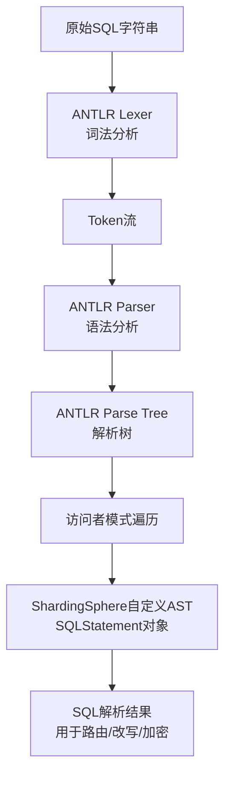

好的，这是一份关于 **ShardingSphere SQL解析引擎（ANTLR语法树）** 的技术文档。它涵盖了核心概念、工作原理、流程、优势以及应用场景。

---

## **技术文档：ShardingSphere SQL 解析引擎（基于ANTLR语法树）**

### **1. 文档概述**

#### 1.1 目的
本文档旨在详细阐述 Apache ShardingSphere 分布式数据库生态系统中，SQL解析模块的核心组件——**ANTLR语法树解析引擎** 的工作原理、技术架构、处理流程及其在分库分表、读写分离、数据加密等场景中的关键作用。目标读者为软件开发工程师、架构师以及对数据库中间件技术感兴趣的爱好者。

#### 1.2 背景
ShardingSphere 作为一个透明的数据库代理层，其核心功能之一是**SQL改写**。在执行一条用户SQL之前（如 `SELECT * FROM t_order WHERE user_id = 123`），中间件需要精确理解该SQL的语法结构：
*   识别语句类型（`SELECT`, `INSERT`, `UPDATE`, `DELETE`, `DDL`）。
*   提取表名、列名、条件表达式（`WHERE`）、分片键值等元信息。
*   判断是否有聚合函数、排序、分组等子句。

这一切都依赖于强大且精准的SQL解析引擎。ShardingSphere选择了 **ANTLR (v4)** 作为其语法解析的基础工具，构建了一套高度定制化和可扩展的SQL抽象语法树。

### **2. 核心概念**

#### 2.1 SQL解析引擎
SQL解析引擎是将用户输入的原始SQL字符串，转换为一棵结构化的、可被程序理解和操作的**抽象语法树（Abstract Syntax Tree, AST）** 的组件。它是SQL处理流程的起点。

#### 2.2 ANTLR (ANother Tool for Language Recognition)
*   **定义**：一个强大的词法分析器和语法分析器生成器。通过编写语法规则文件（`.g4`），ANTLR可以自动生成用于解析特定语言（如SQL）的代码（Java, Go等）。
*   **角色**：在ShardingSphere中，ANTLR负责**词法分析（Lexing）** 和**语法分析（Parsing）** 阶段，将SQL文本转换为**初始的Parse Tree（解析树）**。

#### 2.3 抽象语法树（AST）与解析树（Parse Tree）
*   **解析树**：由ANTLR直接生成，包含了输入字符串的所有语法细节（如每个分隔符、关键字节点），结构非常“原始”和冗余。
*   **抽象语法树（AST）**：由ShardingSphere对Parse Tree进行**遍历、裁剪和重构**后得到的精简树。它去除了不必要的语法细节（如分号、括号），保留了程序逻辑的核心结构，更适合进行语义分析和后续的改写。

**关系**：`SQL文本` -> `ANTLR` -> `Parse Tree` -> `ShardingSphere 处理` -> `自定义AST（SQLStatement）`。

### **3. 架构与工作原理**

ShardingSphere的SQL解析是一个**两阶段过程**：

#### 3.1 阶段一：ANTLR生成初始解析树
1.  **词法分析**：ANTLR `Lexer` 读取SQL字符串，将其分解为一系列有意义的**词法单元（Tokens）**，如关键字（`SELECT`, `FROM`）、标识符（表名、列名）、操作符（`=`, `>`）、字面量（`123`, `'abc'`）等。
2.  **语法分析**：ANTLR `Parser` 根据预定义的**SQL语法规则**（在`.g4`文件中），将Token流组织成一棵Parse Tree。该树严格遵循SQL的语法结构。

#### 3.2 阶段二：构建ShardingSphere自定义AST
ANTLR生成的Parse Tree并不直接使用。ShardingSphere通过**访问者模式（Visitor Pattern）** 遍历这棵树，并将其转换为内部自定义的AST表示 —— `SQLStatement` 对象体系。

1.  **SQLStatement对象**：这是AST在内存中的Java对象表示。它是一个树形结构的根，主要类型包括：
    *   `SelectStatement`
    *   `InsertStatement`
    *   `UpdateStatement`
    *   `DeleteStatement`
    *   `CreateTableStatement` 等。
2.  **关键属性**：每个`SQLStatement`对象包含了SQL的所有关键信息：
    *   `projections`：查询的列（`SelectStatement`）。
    *   `tables`：涉及的表及其别名。
    *   `where`：`WHERE`条件子树，可进一步分解为`PredicateSegment`、`ColumnSegment`、`ExpressionSegment`等。
    *   `groupBy` / `orderBy` / `limit` 等子句。
3.  **方言支持**：ShardingSphere为不同的数据库方言（MySQL, PostgreSQL, Oracle, SQLServer, openGauss等）定义了独立的ANTLR语法文件和对应的`SQLStatement`构建逻辑，实现了多数据库方言的精准解析。

### **4. 核心处理流程示例**

以MySQL方言解析 `SELECT id, name FROM t_user WHERE id = 1` 为例：

1.  **词法/语法分析**：ANTLR识别出这是一个`SELECT`语句，生成包含`SELECT`, `id`, `,`, `name`, `FROM`, `t_user`, `WHERE`, `id`, `=`, `1`等节点的Parse Tree。
2.  **构建自定义AST**：
    *   ShardingSphere的`MySQLStatementSQLVisitor`开始遍历Parse Tree。
    *   创建`SelectStatement`对象。
    *   提取`t_user`到`tables`属性。
    *   提取`id`, `name`到`projections`列表。
    *   将`WHERE id = 1`解析为一个`BinaryOperationExpression`（二元操作表达式），左值为`ColumnSegment(“id”)`，操作符为`=`，右值为`LiteralExpressionSegment(1)`，并挂载到`where`属性下。
3.  **输出**：最终得到一个结构清晰、易于编程操作的`SelectStatement`对象。后续的路由引擎可以轻松地从`tables`和`where`中提取分片键`id`的值`1`，从而决定将查询路由到哪个真实的数据节点。

### **5. 优势与特点**

1.  **高性能与高精度**：ANTLR v4 采用`Adaptive LL(*)`算法，解析效率高，且能处理绝大多数复杂SQL（包括嵌套子查询、CTE等）。
2.  **强大的多方言支持**：通过独立的语法文件，可以精细地支持各数据库特有的语法扩展（如MySQL的`LIMIT`，Oracle的`ROWNUM`），保证了跨数据库行为的正确性。
3.  **良好的可扩展性**：基于访问者模式的AST构建方式，使得添加对新SQL语法或新数据库方言的支持变得模块化和清晰。
4.  **与SQL Federation引擎集成**：此AST也是ShardingSphere“联邦查询”引擎的基础。通过对复杂查询（如跨库JOIN、子查询）的AST进行深度分析，优化器可以制定更高效的分步执行计划。

### **6. 应用场景**

1.  **分片路由**：解析`WHERE`和`INSERT VALUES`中的分片键及其值，定位目标数据源和数据表。
2.  **SQL改写**：
    *   **重写表名**：根据分片规则，将逻辑表名`t_order`改写为真实表名`t_order_0`。
    *   **补列**：在数据加密场景，查询时需将密文列`cipher_text`改写成解密函数`aes_decrypt(cipher_text, key)`。
    *   **分页修正**：将逻辑`LIMIT 0, 10`改写成各分片上的`LIMIT 0, 20`以进行内存归并排序。
3.  **权限校验**：通过解析的表、列信息，进行访问权限控制。
4.  **审计日志**：记录解析出的SQL操作类型、对象等信息。
5.  **SQL分析**：对AST进行静态分析，提供SQL性能优化建议。

### **7. 总结**

ShardingSphere 基于ANTLR的SQL解析引擎是其作为透明数据库代理层的**基石**。它将非结构化的SQL字符串，通过严谨的两阶段转换，变成了富含语义信息的、可编程操作的自定义AST（`SQLStatement`）。这棵“语法树”如同一个精密的蓝图，驱动着后续所有高级功能（路由、改写、加密、优化）的准确执行，是ShardingSphere实现“对应用透明”的分布式数据库增强能力的核心技术保障。

---
**附录：相关类与接口**
*   `org.apache.shardingsphere.sql.parser.api.SQLParserEngine`
*   `org.apache.shardingsphere.sql.parser.sql.common.statement.SQLStatement`
*   `org.apache.shardingsphere.sql.parser.sql.dialect.visitor.MySQLVisitor`
*   `SQLParser.g4` (各方言的语法规则文件)