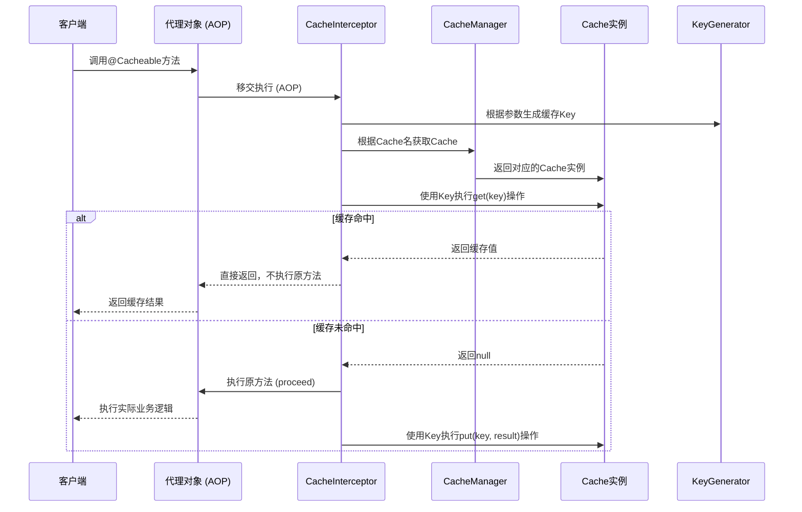

好的，遵照您的要求，这是一份关于 **Spring Cache抽象核心组件（CacheManager/CacheInterceptor/KeyGenerator）** 的详细技术文档。

---

# Spring Cache 抽象层：核心组件深度解析

## 文档摘要

本文档旨在深入解析 Spring Framework 中 Cache 抽象层的核心架构与运行机制，重点剖析三个关键组件：**CacheManager**、**CacheInterceptor** 和 **KeyGenerator**。通过理解它们的职责、交互方式及扩展点，开发者可以更有效地使用和定制 Spring Cache 以满足复杂场景需求。

## 1. 概述

Spring Cache 不是一个具体的缓存实现，而是一个**声明式、基于注解的缓存抽象层**。它通过在方法上添加注解（如 `@Cacheable`, `@CacheEvict`, `@CachePut`），利用 Spring AOP 在运行时透明地应用缓存行为，从而将业务逻辑与缓存技术解耦。

其核心价值在于：
*   **一致性**：为不同的缓存提供商（如 Caffeine, Redis, Ehcache）提供统一的编程模型。
*   **声明式**：通过注解配置，无需侵入业务代码。
*   **可扩展**：核心接口设计良好，允许深度定制。

## 2. 核心架构与组件交互

Spring Cache 的运行时行为主要由以下组件协同完成：



**核心交互流程**（以 `@Cacheable` 为例）：
1.  Spring AOP 为被 `@Cacheable` 等注解修饰的 Bean 创建代理。
2.  当代理方法被调用时，请求被路由到 `CacheInterceptor`。
3.  `CacheInterceptor` 作为核心协调者，依次调用 `KeyGenerator` 生成键，向 `CacheManager` 获取 `Cache` 实例，最后在 `Cache` 实例上执行具体的缓存操作（get/put/evict）。
4.  根据缓存命中与否，决定是否执行原始方法。

## 3. 核心组件详解

### 3.1 CacheManager

`CacheManager` 是 Spring Cache 抽象的**根接口**，它是所有缓存容器（`Cache`）的管理器。

*   **职责**：
    1.  **容器管理**：根据缓存名称（`cache name`）获取或创建对应的 `Cache` 实例。
    2.  管理应用中定义的所有 `Cache` 的生命周期（在简单实现中，生命期通常与应用一致）。
*   **关键方法**：
    ```java
    public interface CacheManager {
        // 根据名称获取对应的Cache实例，如果不存在则可能返回null或创建（取决于实现）
        @Nullable
        Cache getCache(String name);
        // 获取该管理器管理的所有缓存名称集合
        Collection<String> getCacheNames();
    }
    ```
*   **常见实现**：
    *   `ConcurrentMapCacheManager`：使用 JDK `ConcurrentHashMap` 作为存储的后备，适用于简单的单机应用。
    *   `CaffeineCacheManager`：集成高性能的 Caffeine 缓存库。
    *   `RedisCacheManager`：集成 Redis 作为分布式缓存存储。
    *   `CompositeCacheManager`：组合多个 `CacheManager`，允许同时使用多种缓存实现，按顺序查找。
*   **配置示例**：
    ```java
    @Configuration
    @EnableCaching
    public class CacheConfig {
        // 示例1: 使用 Caffeine
        @Bean
        public CacheManager cacheManager() {
            CaffeineCacheManager cacheManager = new CaffeineCacheManager();
            cacheManager.setCaffeine(Caffeine.newBuilder()
                .expireAfterWrite(10, TimeUnit.MINUTES)
                .maximumSize(100));
            return cacheManager;
        }

        // 示例2: 使用 Redis
        @Bean
        public RedisCacheManager redisCacheManager(RedisConnectionFactory factory) {
            RedisCacheConfiguration config = RedisCacheConfiguration.defaultCacheConfig()
                .entryTtl(Duration.ofHours(1))
                .serializeValuesWith(RedisSerializationContext.SerializationPair.fromSerializer(new GenericJackson2JsonRedisSerializer()));
            return RedisCacheManager.builder(factory)
                    .cacheDefaults(config)
                    .build();
        }
    }
    ```

### 3.2 CacheInterceptor

`CacheInterceptor` 是一个 Spring AOP **方法拦截器**，是整个缓存抽象逻辑的**执行引擎**。

*   **职责**：
    1.  **解析注解**：拦截被 `@Cacheable`、`@CacheEvict`、`@CachePut` 等注解修饰的方法调用。
    2.  **协调流程**：按正确顺序执行缓存操作（如先检查 `@CacheEvict`，再执行 `@Cacheable`）。
    3.  **调用链**：组织 `KeyGenerator`、`CacheResolver`（用于获取 `Cache`）、`CacheManager` 等组件完成一次完整的缓存交互。
    4.  **条件判断**：处理 `condition` 和 `unless` 表达式，决定是否应用缓存。
*   **工作核心**：其 `invoke` 方法内部调用父类 `CacheAspectSupport` 的 `execute` 方法，该方法包含了处理所有缓存注解的复杂逻辑。
*   **可扩展性**：虽然通常不直接定制 `CacheInterceptor`，但可以通过配置其依赖的组件（如 `KeyGenerator`、`CacheResolver`）来影响其行为。

### 3.3 KeyGenerator

`KeyGenerator` 是用于**生成缓存键**的策略接口。缓存键是唯一标识一个缓存条目的依据。

*   **职责**：根据被调用方法、目标对象、方法参数等元信息，生成一个唯一的、可序列化的键对象。
*   **关键方法**：
    ```java
    public interface KeyGenerator {
        Object generate(Object target, Method method, Object... params);
    }
    ```
*   **默认实现**：`SimpleKeyGenerator`
    *   如果方法没有参数，返回 `SimpleKey.EMPTY`。
    *   如果方法只有一个参数，返回该参数本身。
    *   如果方法有多个参数，返回一个包含所有参数的 `SimpleKey` 对象（其 `equals` 和 `hashCode` 基于参数内容）。
*   **自定义场景**：当默认的键生成策略不满足需求时（例如，需要忽略某些参数，或需要基于参数的某个字段生成键），需要自定义 `KeyGenerator`。
*   **配置与使用示例**：
    ```java
    @Component("myKeyGenerator")
    public class MyKeyGenerator implements KeyGenerator {
        @Override
        public Object generate(Object target, Method method, Object... params) {
            // 自定义逻辑，例如：将方法名和第一个参数的ID组合成键
            String key = method.getName() + "_" + ((User)params[0]).getId();
            return key;
        }
    }

    // 在注解中指定使用自定义的KeyGenerator
    @Service
    public class UserService {
        @Cacheable(value = "users", keyGenerator = "myKeyGenerator")
        public User getUser(User query) {
            // ...
        }
    }

    // 或者在全局配置中替换默认的KeyGenerator
    @Configuration
    @EnableCaching
    public class CacheConfig {
        @Bean
        public CacheManager cacheManager() {
            // ... 配置CacheManager
        }
        @Primary // 设置为主要的KeyGenerator
        @Bean
        public KeyGenerator myKeyGenerator() {
            return new MyKeyGenerator();
        }
    }
    ```
    > **注意**：`key` 属性和 `keyGenerator` 属性在 `@Cacheable` 等注解中互斥，只能使用其一。

## 4. 典型工作流程详解（以 @Cacheable 为例）

1.  **代理拦截**：AOP 代理拦截到对被 `@Cacheable` 注解方法的调用。
2.  **进入拦截器**：调用被移交到 `CacheInterceptor.invoke()`。
3.  **元数据收集**：拦截器获取方法、目标对象、参数等信息。
4.  **键生成**：使用指定的或默认的 `KeyGenerator`，根据方法和参数生成缓存 `key`。
5.  **获取缓存实例**：通过 `CacheManager.getCache(cacheName)` 获取操作该缓存名称的 `Cache` 对象。
6.  **缓存查找**：调用 `cache.get(key)`。如果找到，则反序列化值并直接返回（方法体不执行）。
7.  **未命中执行**：如果未找到，则通过反射调用原始方法体。
8.  **缓存存储**：使用方法返回值，调用 `cache.put(key, value)` 将其存储。
9.  **返回结果**：将结果返回给调用者。

## 5. 配置与扩展最佳实践

1.  **选择合适的 `CacheManager`**：根据应用规模（单机/分布式）、性能要求和运维能力选择，如 Caffeine（高性能本地）、Redis（分布式）。
2.  **谨慎设计缓存键**：确保 `KeyGenerator` 产生的键能唯一表征方法调用，同时避免过于复杂（影响性能）或过于简单（易冲突）。推荐对复杂对象实现 `toString()` 或自定义 `KeyGenerator`。
3.  **理解并善用 `condition` 和 `unless`**：它们是注解提供的强大功能，可用于实现基于参数的动态缓存逻辑。
4.  **考虑使用 `CompositeCacheManager`**：在多层缓存架构中非常有用（如 L1 本地缓存 + L2 Redis 缓存）。
5.  **监控与统计**：许多缓存实现（如 Caffeine、Redis）提供统计信息（命中率），应集成到监控系统中。

## 6. 总结

| 组件 | 角色 | 核心职责 | 关键扩展点 |
| :--- | :--- | :--- | :--- |
| **CacheManager** | **容器管理者** | 管理 `Cache` 实例的生命周期，提供按名获取的能力。 | 选择不同的实现以切换缓存后端。可通过 `CompositeCacheManager` 组合。 |
| **CacheInterceptor** | **执行引擎** | 解析缓存注解，协调整个缓存操作的执行流程。 | 通常通过配置其依赖的组件进行间接定制。 |
| **KeyGenerator** | **键策略** | 根据方法调用上下文生成唯一的缓存键。 | 实现自定义接口以定义复杂的键生成逻辑。 |

Spring Cache 抽象通过清晰的分层设计（`CacheManager` -> `Cache`）和面向切面的执行模型（`CacheInterceptor`），提供了强大而灵活的缓存能力。深刻理解这三个核心组件，是高效使用、问题排查和高级定制的基石。