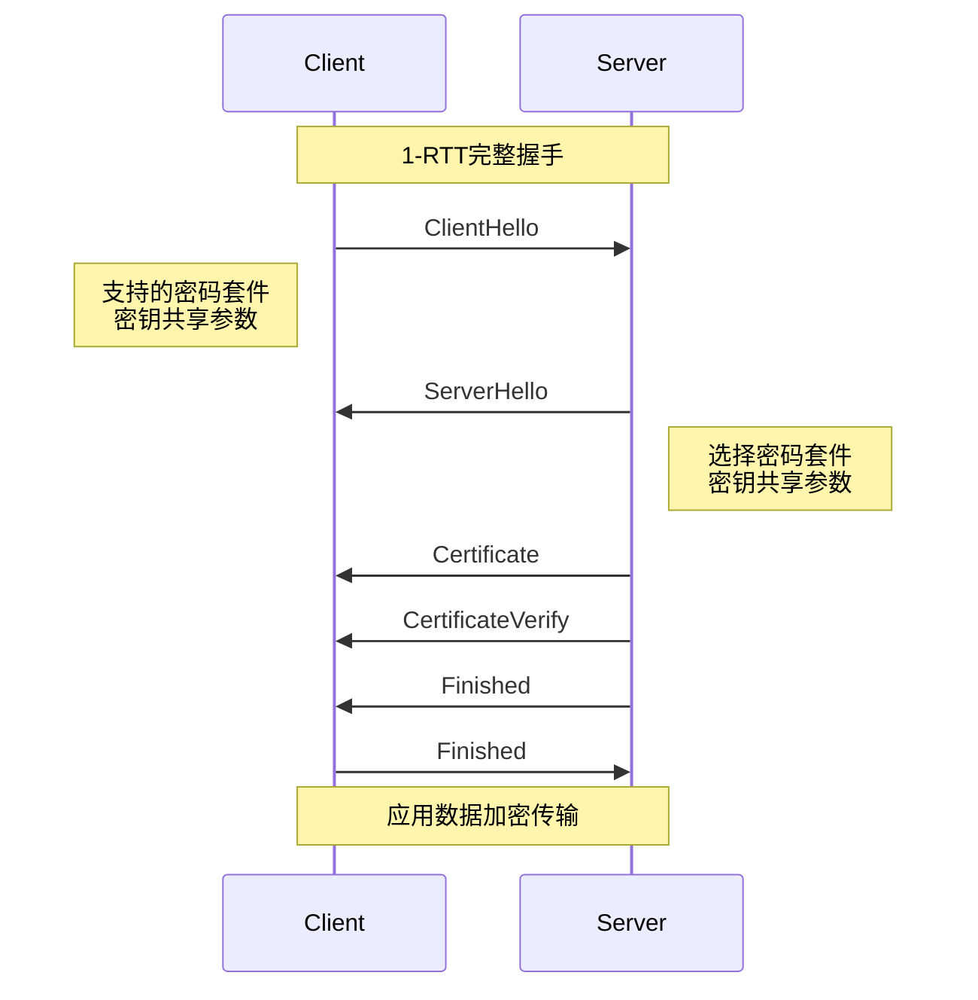
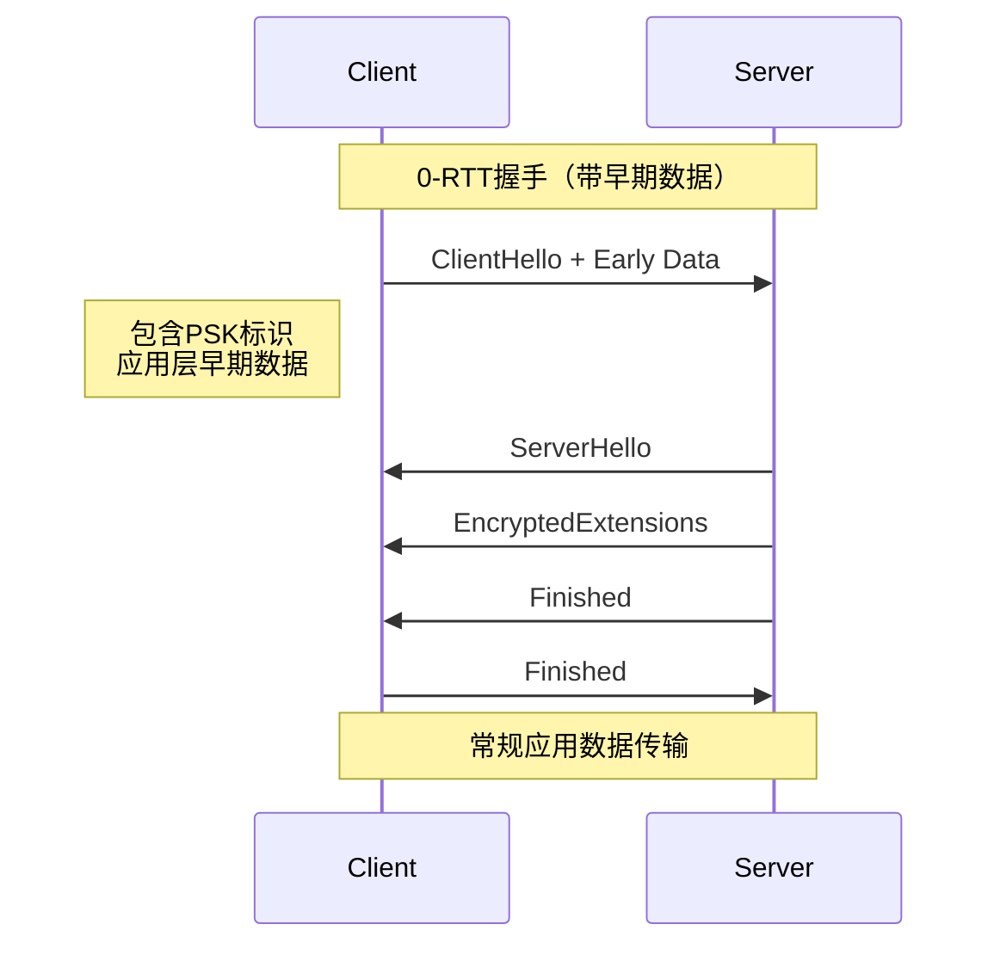

# TLS 1.3握手流程：1-RTT与0-RTT详解

## 1. 概述

传输层安全协议（TLS）1.3版本是TLS协议的最新演进，相比之前的版本，它提供了更高的安全性、更好的性能和简化的设计。TLS 1.3最显著的改进之一是握手流程的优化，包括标准化的1-RTT（单次往返时间）握手和可选的0-RTT（零往返时间）握手。

## 2. TLS 1.3握手设计原则

### 2.1 主要改进
- 移除不安全的加密算法和功能
- 简化握手流程，减少往返次数
- 增强前向安全性
- 标准化会话恢复机制

### 2.2 关键特性
- 1-RTT完整握手成为标准模式
- 0-RTT早期数据支持（可选）
- 更快的连接建立时间
- 减少延迟敏感应用的等待时间

## 3. 1-RTT握手流程

### 3.1 完整握手时序



### 3.2 详细步骤解析

#### 步骤1：ClientHello
客户端发送ClientHello消息，包含：
- 支持的TLS版本（固定为TLS 1.3）
- 随机数（ClientRandom）
- 密码套件列表（仅限TLS 1.3支持的套件）
- 密钥共享参数（KeyShareEntry）
  - 支持的椭圆曲线组
  - 客户端的公钥
- 会话ID（用于会话恢复，可选）
- 预共享密钥标识（PSK，可选）

#### 步骤2：ServerHello
服务器响应ServerHello消息，包含：
- 选择的TLS版本
- 服务器随机数（ServerRandom）
- 选择的密码套件
- 密钥共享参数
  - 选择的椭圆曲线
  - 服务器的公钥
- 预共享密钥标识（如果使用PSK）

#### 步骤3：服务器参数与认证
服务器发送以下消息：
1. **EncryptedExtensions**：扩展参数
2. **Certificate**：服务器证书链
3. **CertificateVerify**：使用私钥对握手消息签名
4. **Finished**：握手完整性验证

#### 步骤4：客户端响应
客户端发送：
1. **Finished**：握手完整性验证

#### 步骤5：密钥计算
双方基于以下参数计算主密钥：
```
Early Secret = HKDF-Extract(salt, PSK)
Handshake Secret = HKDF-Extract(Derived-Secret, (EC)DH Shared Secret)
Master Secret = HKDF-Expand-Label(Handshake Secret, "derived", "", Hash.length)
```

## 4. 0-RTT握手流程

### 4.1 早期数据传输时序



### 4.2 实现条件与机制

#### 前提条件
1. **先前连接**：客户端与服务器之间必须有过成功的TLS 1.3连接
2. **PSK协商**：先前连接中协商了预共享密钥（PSK）
3. **服务器支持**：服务器必须明确支持0-RTT
4. **应用层兼容**：应用程序必须能够处理重放攻击

#### 握手流程
1. **ClientHello with PSK和Early Data**：
   - 包含先前协商的PSK标识
   - 在"early_data"扩展中发送应用数据
   - 使用PSK派生0-RTT密钥加密早期数据

2. **服务器处理**：
   - 验证PSK有效性
   - 可选接受或拒绝早期数据
   - 如果拒绝，服务器将响应HelloRetryRequest

3. **密钥派生**：
   ```
   0-RTT Secret = HKDF-Expand-Label(Early Secret, "derived", "", Hash.length)
   0-RTT Key = HKDF-Expand-Label(0-RTT Secret, "key", "", key_length)
   ```

### 4.3 安全考虑与限制

#### 重放攻击风险
0-RTT数据容易受到重放攻击，因为：
- 攻击者可以截获并重放早期数据
- 服务器无法区分原始请求和重放请求

#### 缓解措施
1. **单次使用令牌**：应用层实现防重放机制
2. **时间窗口限制**：设置PSK有效期
3. **选择性使用**：仅对幂等操作使用0-RTT
4. **显式确认**：服务器对0-RTT数据进行确认

#### 应用层限制
- 0-RTT数据大小限制（通常为16KB）
- 仅支持特定HTTP方法（如GET、HEAD）
- 不能包含敏感操作（如支付、登录）

## 5. 1-RTT与0-RTT对比

| 特性 | 1-RTT握手 | 0-RTT握手 |
|------|-----------|-----------|
| 往返次数 | 1次完整往返 | 0次（早期数据） |
| 首次连接 | 支持 | 不支持 |
| 前向安全 | 完全支持 | 部分支持（PSK相关） |
| 重放攻击 | 不受影响 | 存在风险 |
| 延迟优化 | 标准优化 | 最大优化 |
| 适用场景 | 所有连接 | 重复连接、幂等操作 |

## 6. 实现注意事项

### 6.1 服务器配置
```nginx
# Nginx配置示例
ssl_protocols TLSv1.3;
ssl_early_data on;  # 启用0-RTT
ssl_session_tickets on;  # 启用会话票据
ssl_session_timeout 1d;  # 会话有效期
```

### 6.2 客户端实现
```python
# Python示例（使用aiohttp）
import aiohttp
import ssl

# 创建支持0-RTT的SSL上下文
ssl_context = ssl.create_default_context(ssl.Purpose.SERVER_AUTH)
ssl_context.set_ciphers('TLS13-AES-256-GCM-SHA384')
ssl_context.maximum_version = ssl.TLSVersion.TLSv1_3

# 启用会话恢复
ssl_context.session_tickets = True
```

### 6.3 监控与调试
- 使用Wireshark TLS 1.3解析器
- 检查服务器日志中的TLS握手详情
- 监控0-RTT接受/拒绝率
- 跟踪PSK使用情况和过期

## 7. 性能优化建议

### 7.1 网络优化
1. **TCP快速打开**：与TLS 0-RTT结合使用
2. **QUIC协议**：在传输层集成TLS 1.3
3. **CDN部署**：减少客户端到服务器的距离

### 7.2 会话管理
1. **合理设置PSK生命周期**：平衡安全与性能
2. **分布式会话存储**：在集群环境中共享会话状态
3. **会话恢复率监控**：优化会话超时设置

## 8. 安全最佳实践

1. **定期更新密码套件**：禁用弱密码
2. **证书管理**：使用ACME自动续期
3. **安全扫描**：定期进行TLS配置扫描
4. **协议降级防护**：防止降级攻击
5. **密钥更新**：支持TLS 1.3的密钥更新机制

## 9. 结论

TLS 1.3的1-RTT和0-RTT握手机制代表了TLS协议的重大进步。1-RTT提供了标准化的高效握手，而0-RTT为性能敏感应用提供了额外的延迟优化。在实际部署中，应根据应用场景的安全需求和性能要求，合理选择和使用这些特性。

对于大多数应用，1-RTT握手提供了良好的平衡。对于需要极致性能且能妥善处理安全风险的场景，0-RTT可以在严格的控制条件下提供显著的价值。无论选择哪种模式，都应遵循安全最佳实践，确保通信的机密性、完整性和可用性。

## 附录：TLS 1.3相关RFC

- RFC 8446: The Transport Layer Security (TLS) Protocol Version 1.3
- RFC 9000: QUIC: A UDP-Based Multiplexed and Secure Transport
- RFC 9001: Using TLS to Secure QUIC