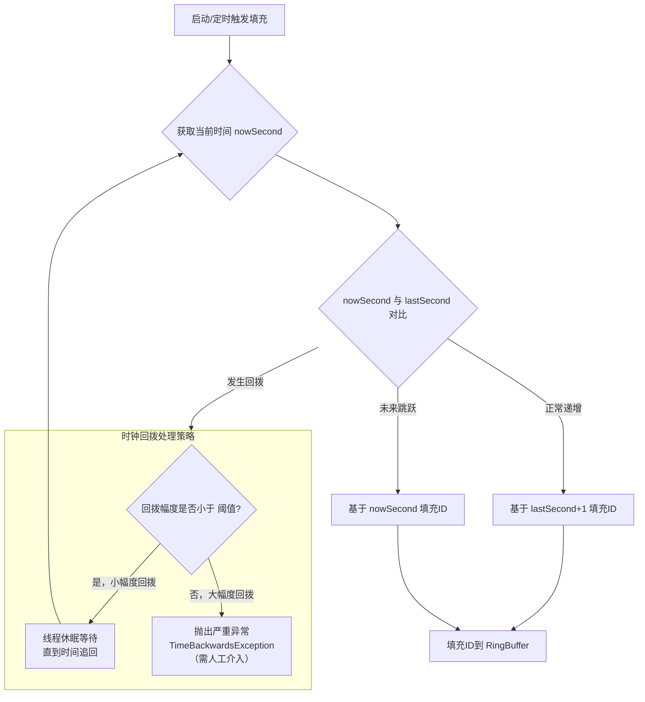

好的，遵照您的要求，为您生成一份关于“UIDGenerator（百度版）时钟回拨解决方案”的技术文档。

---

# **UIDGenerator（百度版）时钟回拨解决方案技术文档**

**文档版本：** 1.0
**最后更新日期：** 2023-10-27
**作者：** 技术架构部

---

## **1. 概述**

### **1.1 文档目的**
本文档旨在详细阐述基于百度开源项目 [UIDGenerator](https://github.com/baidu/uid-generator) 的分布式唯一ID生成服务中，针对核心挑战——**服务器时钟回拨**——所采用的解决方案。文档将深入分析问题根源、百度的设计哲学、具体实现机制以及最佳实践，为开发、运维人员提供全面的技术参考。

### **1.2 背景：什么是时钟回拨？**
在分布式系统中，每台服务器通常通过NTP（网络时间协议）与时间服务器同步，以维持时间一致性。时钟回拨是指由于NTP同步、人工调整或虚拟机快照恢复等原因，导致系统时间突然“倒退”到过去某个时刻的现象。

对于严重依赖本地系统时间递增性来保证ID全局唯一递增的雪花算法（Snowflake）及其变种，时钟回拨是致命的，它可能导致生成的ID发生冲突，破坏系统数据一致性。

### **1.3 UIDGenerator 简介**
百度UidGenerator是Java实现的，基于Snowflake算法的唯一ID生成器。它对原版Snowflake（64位）进行了改进，提供了更灵活的长度分配（例如默认的 `64位: 1(符号位) + 28(秒) + 22(工作进程) + 13(序列号)`），并**内置了应对时钟回拨的容错机制**，是其能在生产环境稳定运行的关键。

## **2. 核心解决方案：CachedUidGenerator 与 缓冲池**

UIDGenerator 提供了两种生成器：`DefaultUidGenerator` 和 `CachedUidGenerator`。后者是其解决时钟回拨问题的核心实现。

### **2.1 设计哲学：未来牵引，异步填充**
传统Snowflake算法是“实时生成，严重依赖当前秒级时间戳”。而 `CachedUidGenerator` 采用了 **“预生成” (Prefetch)** 和 **“缓冲池” (RingBuffer)** 的架构，将时间基准的依赖从“生成瞬间”提前到了“填充瞬间”。

其核心思想是：
> **利用未来时间，解决过去问题。** 在系统正常运行时，提前生成一批未来时间戳的ID，放入环形数组。当发生小幅时钟回拨时，消费的ID是之前基于“更晚”（未来）时间生成的，因此不受回拨影响。

### **2.2 关键组件与流程**

#### **2.2.1 环形缓冲池 (RingBuffer)**
*   **本质：** 一个固定大小的、循环使用的`long`类型数组。每个槽位存放一个预生成的唯一ID。
*   **指针：**
    *   `tail指针`：生产者指针，表示下一个可以填充ID的槽位。由后台线程`Schedule`异步更新。
    *   `cursor指针`：消费者指针，表示下一个可以获取ID的槽位。由业务调用 `getUID()` 时更新。
    *   基本规则：`cursor` 不能追上 `tail`（即缓冲池不能为空）。

#### **2.2.2 时钟回拨处理流程**
以下是解决方案的核心逻辑，体现在 `BufferPaddingExecutor` 和 `UidGenerator` 的代码中：



**流程详解：**

1.  **异步填充：** 独立的守护线程（或定时任务）定期检查`RingBuffer`的空余容量。当空余容量达到阈值时，触发填充操作。
2.  **时间基准判断：** 填充时，首先获取当前系统的秒级时间 `currentSecond`。
3.  **处理策略：**
    *   **情况一：时间正常前进 (`currentSecond` == `lastSecond` + 1)**
        *   逻辑：基于 `lastSecond + 1` 这一秒，生成该秒下的所有序列号ID，并存入`RingBuffer`。
        *   结果：缓冲池中的ID时间戳是连续的、递增的。
    *   **情况二：时间跳跃到未来 (`currentSecond` > `lastSecond` + 1)**
        *   逻辑：直接基于 `currentSecond` 进行填充。这会导致中间的时间戳秒数没有生成ID，但保证了ID的单调递增性，没有回拨风险。
        *   结果：ID在时间戳上不连续，但绝对递增。这是可接受的。
    *   **情况三：检测到时钟回拨 (`currentSecond` < `lastSecond`)**
        *   **第一步：检查回拨幅度。** 这是最关键的一步。配置项 `maxBackwardsSeconds`（默认值可配，例如1年）定义了容忍的最大回拨秒数。
        *   **第二步：分级处理。**
            *   **小幅度回拨（回拨秒数 < `maxBackwardsSeconds`）：**
                *   策略：**等待（Wait）。** 生成器会记录告警日志，然后让填充线程 `sleep` 等待，直到系统时间追回到最后一次填充的时间 `lastSecond`。
                *   影响：在等待期间，`RingBuffer`中已有的、基于未来时间生成的ID会被继续消费，服务**通常不会中断**。这是该方案优雅的地方。
            *   **大幅度回拨（回拨秒数 >= `maxBackwardsSeconds`）：**
                *   策略：**抛出致命异常（`TimeBackwardsException`）。**
                *   影响：ID生成服务停止。这通常意味着发生了严重的系统故障（如虚拟机回滚到很久之前），需要**人工介入排查**。
4.  **业务获取ID：** 业务线程调用 `getUID()` 时，只是从已预填充好的 `RingBuffer` 中取出一个ID。这个ID的时间戳在填充时就已确定，因此完全不受获取瞬间时钟回拨的影响。

### **2.3 优势**
*   **高吞吐量：** 预生成机制使得ID获取变为内存操作，性能极高。
*   **时钟回拨容忍：** 通过“未来时间”填充和“等待”策略，能够优雅地处理常见的小幅度时钟回拨，保障服务高可用。
*   **安全性：** 对大幅度回拨采取快速失败策略，防止数据混乱，提醒运维介入。

## **3. 配置项说明**

在 `CachedUidGenerator` 的配置中，与时钟回拨相关的关键参数如下：

```yaml
# 示例配置 (Spring Boot YAML)
uid:
  generator:
    cached:
      # RingBuffer 大小，建议为序列号上限（2^13=8192）的整倍数，如 8192 * 2
      boost-power: 3 # 对应 bufferSize = 8192 << 3 = 65536
      # 填充阈值，当剩余容量低于此比例时触发填充
      padding-factor: 50 # 默认值，代表50%
      # 定时填充的间隔（单位：秒），防止长时间无请求导致Buffer耗尽
      schedule-interval: 60
      # 允许的最大时钟回拨秒数（！！！核心配置！！！）
      max-backwards-seconds: 31536000 # 默认值，即365天
      # 工作进程ID生成方式，确保分布式唯一
      worker-id-assignment: pooled # 使用数据库分配
      epoch-str: “2023-01-01” # 起始时间戳，可自定义以使用更久
```

*   `max-backwards-seconds`：**必须根据业务系统所在环境（物理机、云服务器、容器）的时钟同步策略和稳定性来合理设置。** 设置过长可能掩盖问题，设置过短可能导致不必要的服务中断。

## **4. 最佳实践与运维建议**

1.  **生成器选择：** 生产环境**强烈推荐**使用 `CachedUidGenerator`，它不仅性能优异，且具备时钟回拨处理能力。
2.  **监控与告警：**
    *   密切监控日志中关于 `Clock moved backwards` 的 **WARN** 级别告警。这表示发生了小幅度回拨，需要关注NTP服务或宿主机时钟状态。
    *   监控 `RingBuffer` 的填充速率和剩余容量。如果填充频繁失败或缓冲池经常见底，可能预示潜在问题。
    *   为 `TimeBackwardsException` 配置**紧急告警**（如电话、短信），此类异常需要立即人工处理。
3.  **服务器时钟配置：**
    *   使用 `ntpd`（而非 `ntpdate`）进行平滑时间同步，避免步进式调整。
    *   在Linux系统上，考虑使用 `-x` 选项（`tinker panic 0`）来禁用突发时间跳变后的步进调整，让时间缓慢纠偏。
    *   在虚拟化环境（如KVM， VMware）中，确保主机时钟稳定，并谨慎使用快照恢复功能。
4.  **灾备方案：** 对于关键业务，应考虑部署多个UID生成器实例，并通过数据库分配不同的 `workerId`，实现服务冗余。当单个实例因时钟问题宕机时，可自动切换。

## **5. 总结**

百度UIDGenerator通过 `CachedUidGenerator` 的 **“预生成”** 和 **“缓冲池”** 架构，巧妙地将**时钟敏感点从ID获取时刻转移到了ID填充时刻**。结合 **“小幅度回拨等待，大幅度回拨抛异常”** 的分级策略，在保证ID全局唯一和总体递增的前提下，为常见的时钟回拨问题提供了一个**优雅、高效且安全**的解决方案。

该方案是 Snowflake 类算法在生产环境中得以广泛应用的重要实践，充分体现了在分布式系统设计中，通过架构创新解决基础设施层面不稳定性的思想。